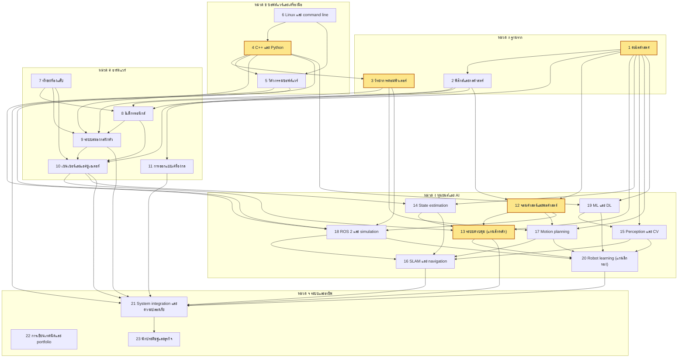

# ตอนที่ 1 จาก 11: ความเป็นไปได้ของกรอบ 5 ปี และภาพรวมหน้าเดียว

> **ข้อสรุปของตอนนี้:** ภายในวันที่ 30 กันยายน 2574 ระดับที่ไปถึงได้จริงคือ "วิศวกรอาวุโสที่ส่งมอบงานจริงในระดับสากล" (ระดับ 2 จาก 5 ระดับที่นิยามไว้ในส่วนที่ 1) ด้วยโอกาสประมาณร้อยละ 30 ถึง 45 ส่วนระดับผู้นำระดับโลกในแขนงย่อยมีโอกาสไม่เกินประมาณร้อยละ 3 และชั่วโมงเรียนเองตลอด 5 ปี (ประมาณ 2,450 ถึง 2,900 ชั่วโมง) ครอบคลุมเพียงประมาณครึ่งหนึ่งของชั่วโมงที่เป้าหมายต้องใช้ ส่วนที่เหลือต้องมาจากงานประจำที่ตรงสาย การเลือกงานแรกจึงเป็นการตัดสินใจที่มีผลต่อแผนมากที่สุด

---

## วิธีอ่านเอกสารนี้

ทุกข้อความสำคัญมีป้ายกำกับในวงเล็บ เพื่อแยกประเภทของข้อมูลออกจากกัน

| ป้ายกำกับ | ความหมาย |
|---|---|
| (ข้อเท็จจริง) | ตรวจสอบได้จากแหล่งภายนอก มีแหล่งอ้างอิงท้ายตอน |
| (อนุมาน) | ข้อสรุปที่ผมได้จากการนำข้อเท็จจริงมาคำนวณหรือเชื่อมโยงกัน ถ้าข้อเท็จจริงตั้งต้นผิด ข้อสรุปจะผิดตาม |
| (ความเห็น) | การตัดสินใจเชิงออกแบบหรือการคาดการณ์ของผม ซึ่งคนที่มีประสบการณ์คนอื่นอาจเห็นต่าง |
| ความมั่นใจสูง ปานกลาง หรือต่ำ | ระดับที่ผมคิดว่าข้อความนั้นจะถูกต้อง ระดับสูงหมายถึงผมจะประหลาดใจมากถ้าผิด ระดับต่ำหมายถึงผิดได้ง่ายและควรตรวจซ้ำ |

ข้อความในส่วนออกแบบแผนที่ไม่มีป้ายกำกับ ให้ถือว่าเป็นความเห็นเชิงออกแบบของผม ความมั่นใจปานกลาง

การนับปีของแผนในเอกสารนี้ใช้ดังนี้

| ปีของแผน | ช่วงวันที่ |
|---|---|
| ปีที่ 1 | 2 ตุลาคม 2569 ถึง 30 กันยายน 2570 |
| ปีที่ 2 | 1 ตุลาคม 2570 ถึง 30 กันยายน 2571 |
| ปีที่ 3 | 1 ตุลาคม 2571 ถึง 30 กันยายน 2572 |
| ปีที่ 4 | 1 ตุลาคม 2572 ถึง 30 กันยายน 2573 |
| ปีที่ 5 | 1 ตุลาคม 2573 ถึง 30 กันยายน 2574 |

---

# ส่วนที่ 1 ความเป็นไปได้ของกรอบ 5 ปี

## 1.1 นิยามคำว่า "เก่งระดับโลก" เป็นระดับที่วัดได้

คำว่า "เก่งระดับโลก" ใช้วางแผนไม่ได้ถ้าไม่มีเกณฑ์วัด ผมจึงแบ่งเป็น 5 ระดับ แต่ละระดับมีเกณฑ์ที่คนภายนอกตรวจสอบได้ และไม่ขึ้นกับความรู้สึกของตัวเอง (ความเห็น ความมั่นใจปานกลาง สำหรับการแบ่งระดับ ส่วนตัวอย่างผลงานในระดับ 4 และ 5 เป็นข้อเท็จจริง)

| ระดับ | ชื่อระดับ | เกณฑ์วัด | ตัวอย่างผลงานรูปธรรม 1 ชิ้น |
|---|---|---|---|
| 1 | วิศวกรหุ่นยนต์ระดับเริ่มต้นที่แข่งขันได้ในตลาดสากล | ต้องผ่านทั้ง 3 ข้อ: (ก) ได้รับข้อเสนองาน หรือผ่านถึงการสัมภาษณ์เทคนิครอบสุดท้าย จากบริษัทหุ่นยนต์ที่ส่งมอบหุ่นยนต์ให้ลูกค้าจริงอย่างน้อย 1 แห่ง (ข) มีโปรเจกต์สาธารณะอย่างน้อย 3 ชิ้นที่ทำครบตั้งแต่ฮาร์ดแวร์ถึงซอฟต์แวร์ โดยอย่างน้อย 1 ชิ้นเป็นหุ่นยนต์จริงที่ควบคุมแบบวงปิด (closed-loop control คือการควบคุมที่วัดผลลัพธ์จริงแล้วนำกลับมาแก้คำสั่งอย่างต่อเนื่อง) (ค) มี pull request (คำขอให้รวมโค้ดของเราเข้าโครงการของผู้อื่น) ที่ถูกรวมเข้าโครงการโอเพนซอร์สด้านหุ่นยนต์ที่มีผู้ใช้จริงอย่างน้อย 1 ครั้ง | หุ่นยนต์ทรงตัวสองล้อที่ออกแบบแผงวงจรพิมพ์ (PCB, printed circuit board) เอง เขียนเฟิร์มแวร์บนระบบปฏิบัติการเวลาจริง (RTOS, real-time operating system คือระบบปฏิบัติการที่รับประกันเวลาตอบสนองของงาน) ใช้ตัวควบคุมแบบ LQR (linear quadratic regulator คือตัวควบคุมที่คำนวณค่าขยายที่ดีที่สุดตามเกณฑ์ต้นทุนกำลังสอง) ที่หาสมการเองจากแบบจำลองพลศาสตร์ มีวิดีโอทดสอบการผลักรบกวน และมี repository (ที่เก็บโค้ดพร้อมประวัติการแก้ไข) ที่มีการทดสอบอัตโนมัติ |
| 2 | วิศวกรอาวุโสที่ส่งมอบงานจริง | ต้องผ่านทั้ง 3 ข้อ: (ก) เป็นเจ้าของงานตั้งแต่ออกแบบจนใช้งานจริงของระบบย่อยอย่างน้อย 1 ระบบที่ส่งถึงลูกค้าจริง ครบอย่างน้อย 1 รอบผลิตภัณฑ์ (ข) มีตำแหน่งหรือขอบเขตงานเทียบเท่าวิศวกรอาวุโส (senior engineer) ในบริษัทที่มีหุ่นยนต์ใช้งานจริง คือตัดสินใจเชิงเทคนิคของระบบย่อยได้เองและนำวิศวกร 2 ถึง 5 คนได้ (ค) มีผลงานโอเพนซอร์สที่มีนัยสำคัญถูกรวมอย่างน้อย 5 ครั้ง หรือดูแลไลบรารีของตัวเองที่มีผู้ใช้ภายนอก | ระบบควบคุมแรงของแขนกลที่ส่งมอบให้ลูกค้าอย่างน้อย 50 เครื่อง พร้อมเอกสารวิเคราะห์ความปลอดภัยและสถิติความล้มเหลวภาคสนามที่วัดได้ |
| 3 | ผู้เชี่ยวชาญที่วงการเฉพาะทางรู้จัก | ต้องผ่านอย่างน้อย 2 ใน 4 ข้อ: (ก) บทความวิชาการที่เป็นผู้เขียนหลักผ่านการพิจารณาโดยผู้ทรงคุณวุฒิ (peer review) ในเวทีชั้นนำ เช่น ICRA, IROS, RSS, CoRL, Humanoids, IEEE T-RO หรือ IEEE RA-L (ข) โครงการโอเพนซอร์สที่บริษัทหรือห้องแล็บภายนอกอย่างน้อย 3 แห่งนำไปใช้ หรือมีดาวบน GitHub อย่างน้อย 1,000 ดวง (ค) ได้รับเชิญบรรยายใน workshop ของการประชุมวิชาการหลัก (ง) มีขอบเขตงานระดับ staff engineer คือรับผิดชอบทิศทางเทคนิคข้ามหลายทีม | ไลบรารีโอเพนซอร์สสำหรับการควบคุมทั้งร่างของหุ่นยนต์ (whole-body control คือการคำนวณแรงหรือแรงบิดของทุกข้อต่อพร้อมกันเพื่อทำหลายภารกิจโดยไม่ละเมิดข้อจำกัด) ที่บริษัทหุ่นยนต์ 3 แห่งใช้งาน พร้อมบทความอธิบายใน IEEE RA-L |
| 4 | ผู้นำระดับโลกในแขนงย่อย | ต้องผ่านอย่างน้อย 1 ใน 3 ข้อ: (ก) วิธีการที่ตนสร้างกลายเป็นมาตรฐานอ้างอิง (baseline คือวิธีที่งานวิจัยอื่นต้องนำมาเปรียบเทียบ) ของแขนงย่อย หรือได้รางวัลบทความดีเด่นจากเวทีชั้นนำ (ข) เป็นผู้ก่อตั้งหรือผู้บริหารฝ่ายเทคโนโลยี (CTO) ของบริษัทหุ่นยนต์ที่มีลูกค้าจ่ายเงินจริงและได้เงินลงทุนระดับ Series A ขึ้นไป (Series A คือรอบระดมทุนจากนักลงทุนสถาบันรอบแรกหลังพิสูจน์ผลิตภัณฑ์เบื้องต้น) (ค) ได้รับเชิญเป็นผู้บรรยายหลัก (keynote) ในการประชุมวิชาการหลัก | วิธีเรียนนโยบายการควบคุมที่ห้องแล็บทั่วโลกนำไปใช้เป็น baseline ในลักษณะเดียวกับที่ Diffusion Policy ของ Cheng Chi และคณะเป็นในช่วงปี 2023 ถึง 2024 (ข้อเท็จจริง ความมั่นใจปานกลางถึงสูง) |
| 5 | ผู้กำหนดทิศทางวงการ | ผลงานหลายชิ้นต่อเนื่องหลายสิบปีที่เปลี่ยนวิธีคิดของทั้งวงการ หรือสร้างบริษัทที่นิยามหมวดผลิตภัณฑ์ใหม่ | การก่อตั้ง Boston Dynamics ของ Marc Raibert ซึ่งต่อยอดจากงานวิจัยหุ่นยนต์ขาที่ทรงตัวแบบพลวัตหลายสิบปี (ข้อเท็จจริง ความมั่นใจสูง) |

## 1.2 ภายใน 5 ปีน่าจะถึงระดับไหน

### ความน่าจะเป็นโดยประมาณ

ตัวเลขทั้งหมดในตารางนี้เป็นการคาดการณ์ของผม (ความเห็น ความมั่นใจต่ำถึงปานกลาง) เพราะไม่มีงานวิจัยที่ติดตามวิศวกรหุ่นยนต์รายบุคคลด้วยเกณฑ์แบบนี้ ผมให้ตัวเลขเพื่อใช้ตัดสินใจ ไม่ใช่เพื่อพยากรณ์อนาคตอย่างแม่นยำ

| ระดับ | โอกาสถึงภายใน 30 กันยายน 2574 | เหตุผลหลัก |
|---|---|---|
| 1 | ประมาณร้อยละ 85 ถึง 90 (และประมาณร้อยละ 55 ถึง 70 ที่จะถึงภายในวันจบการศึกษาเดือนพฤษภาคม 2571) | เกณฑ์ทุกข้อขึ้นกับงานที่ควบคุมได้ คือโปรเจกต์ การสัมภาษณ์ และการส่งโค้ดเข้าโครงการโอเพนซอร์ส ความเสี่ยงหลักคือรอบรับสมัครงานบัณฑิตใหม่ที่มีปีละครั้ง |
| 2 | ประมาณร้อยละ 30 ถึง 45 | หลังจบการศึกษามีเวลาทำงานประมาณ 3 ปี 4 เดือน การเป็นเจ้าของระบบย่อยที่ส่งถึงลูกค้าครบ 1 รอบผลิตภัณฑ์ต้องได้งานตรงสายตั้งแต่งานแรก และต้องได้รับมอบความรับผิดชอบเร็วกว่าปกติ (อนุมาน ความมั่นใจต่ำถึงปานกลาง: ในบริษัทเทคโนโลยีทั่วไป ผู้จบปริญญาตรีมักใช้เวลาหลายปีก่อนได้ขอบเขตงานระดับอาวุโส ผมยังไม่มีแหล่งข้อมูลที่ตรวจสอบได้สำหรับตัวเลขนี้) |
| 3 | ประมาณร้อยละ 8 ถึง 15 | ต้องมีผลงานที่คนนอกยอมรับ เช่น บทความในเวทีชั้นนำหรือไลบรารีที่บริษัทอื่นใช้ ซึ่งทำได้ระหว่างทำงานประจำแต่ต้องใช้เวลาเพิ่มจากงานบริษัท และการยอมรับต้องใช้เวลาตามปฏิทินหลังเผยแพร่ |
| 4 | ประมาณร้อยละ 1 ถึง 3 | ต้องมีผลงานที่เปลี่ยนวิธีทำงานของแขนงย่อย หรือบริษัทที่มีลูกค้าจริงและเงินลงทุนสถาบัน โชคและจังหวะตลาดมีผลมาก |
| 5 | ต่ำกว่าร้อยละ 0.1 | งานวิจัยเรื่องความเชี่ยวชาญพบซ้ำ ๆ ว่าระดับสูงสุดของสาขามักต้องใช้เวลาเตรียมตัวอย่างเข้มข้นประมาณ 10 ปีขึ้นไป (ข้อเท็จจริง ความมั่นใจปานกลางถึงสูง: Simon และ Chase ปี 1973 ไม่พบผู้เล่นหมากรุกระดับ grandmaster ที่ใช้เวลาเตรียมตัวน้อยกว่าประมาณ 10 ปี) และระดับนี้วัดกันที่ผลงานหลายสิบปี |

**ช่วงที่น่าจะไปถึง:** ระดับ 1 เต็มรูปแบบถึงระดับ 2 โดยค่ากลางคือ "ระดับ 2 ที่ยังไม่ครบทุกเกณฑ์" เช่น มีขอบเขตงานระดับอาวุโสแล้ว แต่ระบบย่อยที่รับผิดชอบยังส่งมอบไม่ครบ 1 รอบผลิตภัณฑ์ (ความเห็น ความมั่นใจปานกลาง)

### สมมติฐานที่ตัวเลขข้างบนต้องพึ่ง

| รหัส | สมมติฐาน | ถ้าสมมติฐานนี้ไม่จริง |
|---|---|---|
| ส1 | ทำได้ตามชั่วโมงที่วางแผนอย่างน้อยร้อยละ 75 วัดจากบันทึกเวลารายสัปดาห์ | ทุกระดับเลื่อนออกไปตามสัดส่วนชั่วโมงที่หายไป ใช้เกณฑ์ปรับแผนในส่วนที่ 8 |
| ส2 | ได้งานแรกที่ตรงสายภายในกลางปี 2571 คือบริษัทที่สร้างและส่งมอบหุ่นยนต์จริง งานเกี่ยวกับการควบคุมหรือการเรียนรู้ของหุ่นยนต์บนฮาร์ดแวร์จริง และมีวัฒนธรรมการตรวจโค้ดโดยวิศวกรที่เก่งกว่า | ชั่วโมงขาดประมาณ 1,500 ถึง 2,700 ชั่วโมง (คำนวณในข้อ 1.4) ระดับ 2 มีโอกาสลดเหลือประมาณร้อยละ 10 ถึง 20 |
| ส3 | ภาษาอังกฤษระดับอ่านเอกสารเทคนิค เขียนบทความเทคนิค และสัมภาษณ์งานได้ (จะตรวจในแขนงที่ 22 และแบบทดสอบในส่วนที่ 5) | งานในตลาดสากล บทความ และเครือข่ายออนไลน์ทั้งหมดช้าลง ต้องเพิ่มเวลาฝึกภาษาในแขนงที่ 22 |
| ส4 | ไม่มีเหตุการณ์ใหญ่ด้านสุขภาพ ครอบครัว หรือการเงินที่ทำให้หยุดเกิน 3 เดือน | เลื่อนแผนตามจำนวนเดือนที่หยุด |
| ส5 | ตลาดหุ่นยนต์ไม่เข้าสู่ภาวะถดถอยรุนแรง คือเงินลงทุนในบริษัทหุ่นยนต์ทั่วโลกไม่ลดลงต่ำกว่าระดับปี 2567 | หางานตรงสายยากขึ้น โอกาสระดับ 2 และ 4 ลดลง |
| ส6 | จบการศึกษาตามกำหนดประมาณเดือนพฤษภาคม 2571 | เส้นทางวิกฤตเลื่อนตามทั้งเส้น (ดูข้อ 2.5) |

## 1.3 สิ่งที่บีบเวลาได้ด้วยความเข้มข้น และสิ่งที่ผูกกับเวลาตามปฏิทิน

หลักการแยกคือ ถ้าผลลัพธ์ขึ้นกับจำนวนชั่วโมงที่เราลงแรงเอง สิ่งนั้นบีบได้ แต่ถ้าผลลัพธ์ขึ้นกับเวลาที่โลกภายนอกต้องใช้ หรือขึ้นกับกระบวนการทางชีววิทยาของสมอง สิ่งนั้นบีบไม่ได้ หรือบีบได้น้อยมาก

| สิ่งที่พิจารณา | บีบได้หรือไม่ | บีบได้ประมาณเท่าไร | เหตุผล |
|---|---|---|---|
| การเรียนทฤษฎี | บีบได้บางส่วน | เร็วขึ้นประมาณ 1.3 ถึง 2 เท่าเมื่อเทียบกับจังหวะรายวิชาปกติ (อนุมาน ความมั่นใจต่ำถึงปานกลาง) | ข้ามสิ่งที่รู้แล้วด้วยแบบทดสอบวัดระดับ และใช้แหล่งหลักแหล่งเดียวต่อแขนง แต่ยังถูกจำกัดด้วยเพดานการฝึกแบบตั้งใจต่อวัน (ข้อ 1.5) และความจำระยะยาวต้องอาศัยการทบทวนแบบเว้นระยะ ซึ่งต้องใช้วันตามปฏิทิน |
| การทำโปรเจกต์ | บีบได้บางส่วน | ประมาณ 1.5 ถึง 2 เท่า เมื่อใช้โปรเจกต์ที่รวมหลายแขนง | ถูกจำกัดด้วยเวลารอชิ้นส่วน การสั่งผลิต PCB และการขนส่ง ซึ่งมักใช้ประมาณ 1 ถึง 3 สัปดาห์ต่อรอบ (อนุมาน ความมั่นใจปานกลาง) และการ debug ฮาร์ดแวร์ที่คาดเวลาไม่ได้ |
| ทักษะสอบสัมภาษณ์งาน | บีบได้มาก | ฝึกเข้มข้น 8 ถึง 12 สัปดาห์ก่อนรอบสมัครงานก็พอถ้าฐานดี (ความเห็น ความมั่นใจปานกลาง) | เป็นทักษะแคบ วัดผลได้ทันที และมีแบบฝึกหัดจำนวนมาก |
| วันจบการศึกษา | บีบไม่ได้ | ไม่ได้เลย | กำหนดโดยหลักสูตรและปฏิทินมหาวิทยาลัย |
| รอบรับสมัครฝึกงานและงานบัณฑิตใหม่ | บีบไม่ได้ | ไม่ได้เลย | บริษัทส่วนใหญ่เปิดรับเป็นรอบ พลาดรอบหนึ่งอาจต้องรออีกประมาณ 1 ปี หรือรับงานที่ไม่ตรงสาย (อนุมาน ความมั่นใจปานกลาง) |
| ประสบการณ์ส่งมอบงานจริง | บีบไม่ได้ | ไม่ได้เลย | ความล้มเหลวภาคสนาม เช่น การสึกหรอ ความร้อนสะสม หรือพฤติกรรมผู้ใช้ที่ไม่คาดคิด เกิดตามเวลาใช้งานจริง และรอบผลิตภัณฑ์ฮาร์ดแวร์มักยาวหลายเดือนถึงหลายปี (อนุมาน ความมั่นใจปานกลาง) |
| ชื่อเสียง | บีบได้น้อยมาก | น้อยมาก | การอ้างอิงบทความและการยอมรับผลงานเกิดหลังเผยแพร่ 1 ถึง 3 ปี และการประชุมวิชาการหลักเปิดรับบทความปีละครั้ง (อนุมาน ความมั่นใจปานกลาง) |
| ความไว้วางใจจากเครือข่าย | บีบได้น้อย | น้อย | คนจะไว้ใจเมื่อเห็นผลงานที่สม่ำเสมอซ้ำหลายครั้งในเวลาที่ยาวพอ การเขียนเผยแพร่ต่อเนื่องช่วยได้ แต่ข้ามเวลาไม่ได้ |
| โชคและจังหวะตลาด | ควบคุมไม่ได้ | ไม่ได้ | ภาวะการลงทุน การรับคนของบริษัท และนโยบายวีซ่าเปลี่ยนตามปัจจัยภายนอก |
| การนอนและการสร้างความจำระยะยาว | บีบไม่ได้ | ไม่ได้ และการบีบให้ผลลบ | การนอนน้อยต่อเนื่องสะสมความบกพร่องทางความคิด (ข้อเท็จจริง ความมั่นใจสูง ดูข้อ 1.5.3) |
| การจดสิทธิบัตร | บีบไม่ได้ | ไม่ได้ | กระบวนการตรวจสอบของหน่วยงานรัฐใช้เวลานาน (รายละเอียดและตัวเลขจะตรวจในแขนงที่ 23) |
| การตั้งบริษัทและระดมทุน | บีบได้น้อย | น้อย | ต้องมีลูกค้าทดลองใช้ ผลการทดลอง และรอบการตัดสินใจของนักลงทุน ซึ่งเป็นเวลาของคนอื่น |

ข้อสรุปของตารางนี้ (อนุมาน ความมั่นใจปานกลาง): ความเข้มข้นที่เพิ่มขึ้นช่วยให้ "ความรู้และทักษะเชิงเทคนิค" มาเร็วขึ้นได้จริง แต่ระดับ 2 ขึ้นไปต้องการ "หลักฐานจากโลกภายนอก" เช่น ผลิตภัณฑ์ที่ส่งมอบแล้ว บทความ และการยอมรับ ซึ่งผูกกับเวลาตามปฏิทิน ดังนั้นแผน 10 ปีที่ถูกบีบเป็น 5 ปีจะได้ความรู้เชิงเทคนิคใกล้เคียงแผน 10 ปีในบางแขนง แต่จะไม่ได้หลักฐานภายนอกเท่าแผน 10 ปี

## 1.4 การคำนวณชั่วโมงรวม 5 ปี

### 1.4.1 ปฏิทินที่ใช้คำนวณ และสถานะการตรวจสอบ

ผมค้นปฏิทินการศึกษาของมหาวิทยาลัยเทคโนโลยีพระจอมเกล้าธนบุรี (มจธ.) แล้ว พบไฟล์ประกาศปฏิทินปีการศึกษา 2569 ที่ regis.kmutt.ac.th แต่เครือข่ายของสภาพแวดล้อมที่ผมใช้ทำงานบล็อกโดเมนของ มจธ. ทำให้เปิดไฟล์ต้นฉบับไม่ได้ วันที่ด้านล่างจึงมาจากข้อความในผลการค้นหาที่อ้างถึงไฟล์ปฏิทิน มจธ. และจากรูปแบบของปฏิทินปีก่อน ๆ ผมระบุสถานะของแต่ละบรรทัดไว้ชัดเจน

| ช่วง | วันที่ที่ใช้คำนวณ | ประเภทงบเวลา | สถานะการตรวจสอบ |
|---|---|---|---|
| ภาคการศึกษาที่ 1 ปีการศึกษา 2569 | เริ่ม 3 สิงหาคม 2569 สิ้นภาคประมาณ 12 ธันวาคม 2569 | เปิดเทอม | ยืนยันบางส่วน (จากผลการค้นหาที่อ้างปฏิทิน มจธ. ยังไม่ได้เปิดไฟล์ต้นฉบับ) |
| รูปแบบช่วงสอบของ มจธ. | ภาคละ 3 ช่วงสอบ ตัวอย่างภาค 1 ปีการศึกษา 2568 คือ 8 ถึง 12 กันยายน 2568, 20 ถึง 27 ตุลาคม 2568 และ 1 ถึง 12 ธันวาคม 2568 | ช่วงสอบ | ยืนยันบางส่วน (จากผลการค้นหาที่อ้างปฏิทิน มจธ. ปี 2568) |
| ช่วงสอบครั้งที่ 2 ของภาค 1 ปี 2569 | ประมาณ 19 ถึง 25 ตุลาคม 2569 (1 สัปดาห์) | ช่วงสอบ | ยังไม่ยืนยัน (ประมาณจากรูปแบบปี 2568) |
| ช่วงสอบครั้งที่ 3 ของภาค 1 ปี 2569 | ประมาณ 30 พฤศจิกายน ถึง 12 ธันวาคม 2569 (2 สัปดาห์) | ช่วงสอบ | ยังไม่ยืนยัน |
| ปิดภาคปลายปี 2569 | 13 ธันวาคม 2569 ถึง 3 มกราคม 2570 (3 สัปดาห์) | ปิดเทอม | อนุมานจากวันสิ้นภาค 1 และวันเปิดภาค 2 |
| ภาคการศึกษาที่ 2 ปีการศึกษา 2569 | เริ่ม 4 มกราคม 2570 เรียนวันสุดท้ายประมาณ 7 พฤษภาคม 2570 สิ้นภาคประมาณปลายเดือนพฤษภาคม 2570 | เปิดเทอม 17 สัปดาห์ และช่วงสอบ 4 สัปดาห์ (ประมาณกลางเดือนกุมภาพันธ์ กลางเดือนมีนาคม และกลางถึงปลายเดือนพฤษภาคม) | วันเปิดภาคยืนยันบางส่วน ช่วงสอบยังไม่ยืนยัน |
| ปิดภาคฤดูร้อน 2570 | ประมาณ 30 พฤษภาคม ถึง 1 สิงหาคม 2570 (9 สัปดาห์) | ปิดเทอม | ยังไม่ยืนยัน ถ้าลงเรียนภาคฤดูร้อนหรือฝึกงานในช่วงนี้ต้องคำนวณใหม่ |
| ปีการศึกษา 2570 ทั้งปี | ใช้รูปแบบเดียวกับปี 2569 คือ ภาค 1 ประมาณ 2 สิงหาคม ถึง 11 ธันวาคม 2570 ปิดภาค 3 สัปดาห์ และภาค 2 ประมาณ 3 มกราคม ถึง 31 พฤษภาคม 2571 | ตามประเภทของแต่ละช่วง | ยังไม่ยืนยัน (ยังค้นไม่พบประกาศปฏิทินปีการศึกษา 2570) |

**สิ่งที่ต้องทำ:** ให้เปิดไฟล์ปฏิทินทางการของ มจธ. แล้วส่งวันที่จริงของช่วงสอบทั้ง 3 ช่วงในแต่ละภาคมาให้ผม ผมจะคำนวณใหม่ ความคลาดเคลื่อนของแบบจำลองนี้ทำให้ชั่วโมงรวมช่วงเป็นนักศึกษาเปลี่ยนได้ไม่เกินประมาณ 200 ชั่วโมง (อนุมาน: ถ้าแต่ละภาคมีสัปดาห์เปิดเทอมกับสัปดาห์ปิดเทอมสลับกันได้ภาคละ 2 สัปดาห์ จำนวน 4 ภาค ความต่างของงบคือสัปดาห์ละ 25 ชั่วโมง)

### 1.4.2 ชั่วโมงเรียนเองช่วงเป็นนักศึกษา (2 ตุลาคม 2569 ถึง 31 พฤษภาคม 2571)

| ช่วง | ประเภท | จำนวนสัปดาห์ | ชั่วโมงต่อสัปดาห์ | ชั่วโมง |
|---|---|---|---|---|
| 2 ถึง 18 ตุลาคม 2569 | เปิดเทอม | 2.4 | 15 | 36 |
| ประมาณ 19 ถึง 25 ตุลาคม 2569 | ช่วงสอบ | 1 | 5 | 5 |
| ประมาณ 26 ตุลาคม ถึง 29 พฤศจิกายน 2569 | เปิดเทอม | 5 | 15 | 75 |
| ประมาณ 30 พฤศจิกายน ถึง 12 ธันวาคม 2569 | ช่วงสอบ | 2 | 5 | 10 |
| 13 ธันวาคม 2569 ถึง 3 มกราคม 2570 | ปิดเทอม | 3 | 40 | 120 |
| ภาค 2 ปีการศึกษา 2569 | เปิดเทอม | 17 | 15 | 255 |
| ภาค 2 ปีการศึกษา 2569 | ช่วงสอบ | 4 | 5 | 20 |
| ปิดภาคฤดูร้อน 2570 | ปิดเทอม | 9 | 40 | 360 |
| ภาค 1 ปีการศึกษา 2570 | เปิดเทอม | 15 | 15 | 225 |
| ภาค 1 ปีการศึกษา 2570 | ช่วงสอบ | 4 | 5 | 20 |
| ปิดภาคปลายปี 2570 | ปิดเทอม | 3 | 40 | 120 |
| ภาค 2 ปีการศึกษา 2570 | เปิดเทอม | 17 | 15 | 255 |
| ภาค 2 ปีการศึกษา 2570 | ช่วงสอบ | 4 | 5 | 20 |
| **รวมก่อนหักวันพัก** | | **86.4** | | **ประมาณ 1,520** |

จากนั้นต้องหักสองรายการ เพราะแผนที่ไม่หักจะประเมินชั่วโมงสูงเกินจริง

1. **สัปดาห์พักตามกติกาในส่วนที่ 7:** ปิดภาคปลายปีละ 1 สัปดาห์ (2 ครั้ง) และปิดภาคฤดูร้อน 2 สัปดาห์ รวม 4 สัปดาห์ของช่วงปิดเทอม คิดเป็นประมาณ 160 ชั่วโมง เหลือประมาณ 1,360 ชั่วโมง
2. **ความคลาดเคลื่อนจากชีวิตจริง** เช่น ป่วย งานกลุ่มของมหาวิทยาลัยที่หนักกว่าคาด หรือธุระครอบครัว ผมหักร้อยละ 10 (ความเห็น ความมั่นใจต่ำ เป็นค่าเผื่อที่ใช้กันทั่วไปในการวางแผนโครงการ ไม่ได้มาจากงานวิจัย) เหลือประมาณ 1,225 ชั่วโมง

**ชั่วโมงเรียนเองช่วงเป็นนักศึกษาที่ใช้วางแผน: ประมาณ 1,225 ถึง 1,360 ชั่วโมง** (อนุมาน ความมั่นใจปานกลาง)

ถ้าช่วงปิดภาคฤดูร้อน 2570 เป็นการฝึกงานประมาณ 8 สัปดาห์ ชั่วโมงเรียนเองในช่วงนั้นจะลดเหลือประมาณสัปดาห์ละ 10 ชั่วโมง ทำให้ชั่วโมงเรียนเองหายไปประมาณ 200 ชั่วโมง แต่จะได้ประสบการณ์ทำงานจริงประมาณ 320 ชั่วโมงมาแทน ผมจะวิเคราะห์ว่าคุ้มหรือไม่ในส่วนที่ 4

### 1.4.3 ชั่วโมงเรียนเองหลังเรียนจบ (1 มิถุนายน 2571 ถึง 30 กันยายน 2574)

```text
จำนวนวัน      = 1,217 วัน = 173.9 สัปดาห์
สัปดาห์ที่ฝึกได้จริง = 173.9 × (46 / 52) = 153.8 สัปดาห์   (หักวันลาพักร้อน ป่วย และช่วงงานหนักปีละประมาณ 6 สัปดาห์)
ชั่วโมงเรียนเอง   = 153.8 × 8  = 1,230 ชั่วโมง
                = 153.8 × 10 = 1,538 ชั่วโมง
```

**ชั่วโมงเรียนเองหลังจบที่ใช้วางแผน: ประมาณ 1,230 ถึง 1,540 ชั่วโมง** (อนุมาน ความมั่นใจปานกลาง) ถ้าเริ่มงานจริงเดือนกรกฎาคม 2571 แทนเดือนมิถุนายน จะมีเดือนมิถุนายนเป็นช่วงว่างที่เพิ่มได้อีกประมาณ 160 ชั่วโมง ผมไม่นับส่วนนี้เพื่อไม่ให้ประเมินสูงเกินจริง

### 1.4.4 ชั่วโมงเรียนรู้ที่ได้จากงานประจำ

งานประจำเป็นแหล่งชั่วโมงที่ใหญ่ที่สุดของแผน แต่ชั่วโมงทำงานไม่เท่ากับชั่วโมงฝึก เพราะงานส่วนใหญ่คือการทำสิ่งที่ทำได้อยู่แล้วซ้ำ ๆ งานวิจัยในข้อ 1.5.4 แสดงว่าประสบการณ์ที่นับเป็นปีแทบไม่ทำนายความสามารถ ผมจึงแปลงชั่วโมงทำงานเป็น "ชั่วโมงเรียนรู้เทียบเท่า" ด้วยตัวคูณที่ขึ้นกับประเภทงาน

```text
ชั่วโมงทำงาน = 153.8 สัปดาห์ × 40 ถึง 45 ชั่วโมง = 6,150 ถึง 6,920 ชั่วโมง

งานตรงสาย    (ตัวคูณ 0.35 ถึง 0.45) = 2,150 ถึง 3,110 ชั่วโมงเรียนรู้เทียบเท่า
งานไม่ตรงสาย (ตัวคูณ 0.05 ถึง 0.15) =   310 ถึง 1,040 ชั่วโมงเรียนรู้เทียบเท่า
```

ตัวคูณเป็นการประมาณของผม (ความเห็น ความมั่นใจต่ำ) ความหมายของตัวคูณ 0.35 คือ ในงานตรงสาย ประมาณร้อยละ 35 ของเวลาเป็นงานที่ยากกว่าระดับปัจจุบันเล็กน้อย และมีฟีดแบ็กจากคนที่เก่งกว่าหรือจากระบบจริง ส่วนงานไม่ตรงสาย เช่น งานติดตั้งและบำรุงรักษาที่ทำซ้ำรูปแบบเดิม ส่วนนี้จะเหลือเพียงร้อยละ 5 ถึง 15 ผมจะให้วิธีวัดตัวคูณจริงของงานตัวเองในส่วนที่ 8

### 1.4.5 ชั่วโมงที่เป้าหมายต้องใช้

ผมประมาณชั่วโมงของแต่ละแขนงจาก "จำนวนรายวิชาเทียบเท่า" คือ รายวิชา 3 หน่วยกิตที่เรียนอย่างจริงจังใช้เวลารวมประมาณ 120 ถึง 150 ชั่วโมง (เวลาบรรยายประมาณ 45 ชั่วโมงและเวลาศึกษาเองประมาณ 2 เท่า) บวกเวลาทำโปรเจกต์เพื่อเปลี่ยนความรู้เป็นทักษะ (อนุมาน ความมั่นใจต่ำถึงปานกลาง) ส่วนระดับเชี่ยวชาญของแกนหลัก ผมเทียบกับการเรียนเฉพาะทางระดับปริญญาโทที่มีวิทยานิพนธ์ คือประมาณ 8 ถึง 10 รายวิชาเทียบเท่ารวมกับโปรเจกต์วิจัย ตัวเลขรายแขนงอยู่ในตารางข้อ 2.2

| หมวด | แขนง | ชั่วโมงที่ต้องใช้ถึงความลึกเป้าหมาย |
|---|---|---|
| ก ฐานราก | 1 ถึง 3 | 960 |
| ข ซอฟต์แวร์และเครื่องมือ | 4 ถึง 6 | 560 |
| ค ฮาร์ดแวร์ | 7 ถึง 11 | 990 |
| ง หุ่นยนต์และ AI | 12 ถึง 20 | 3,400 |
| จ ระบบและอาชีพ | 21 ถึง 23 | 480 |
| **รวมเมื่อเรียนแยกแขนง** | | **6,390** |
| **รวมหลังหักส่วนที่ซ้อนกันจากโปรเจกต์รวมหลายแขนง (ประมาณร้อยละ 15)** | | **ประมาณ 5,430** |
| ถ้าต้องการให้แกนลึกที่สอง (robot learning) ถึงระดับเชี่ยวชาญด้วย | บวกประมาณ 900 ก่อนหักส่วนซ้อน | ประมาณ 6,200 |

ตัวเลขนี้คิดจากกรณีที่แต่ละแขนงต้องเริ่มจากหัวข้อแรก ชั่วโมงจริงจะลดลงตามผลแบบทดสอบวัดระดับในส่วนที่ 5 ซึ่งผมห้ามเดาไว้ล่วงหน้าตามกฎข้อ 3 นอกจากนี้ระดับ 2 ยังต้องการประสบการณ์ส่งมอบงานจริงอย่างน้อย 1 รอบผลิตภัณฑ์ ซึ่งเป็นเงื่อนไขตามปฏิทิน ไม่ใช่จำนวนชั่วโมง

### 1.4.6 เปรียบเทียบชั่วโมงที่มีกับชั่วโมงที่ต้องใช้

| สถานการณ์ | ชั่วโมงเรียนเอง | ชั่วโมงเรียนรู้เทียบเท่าจากงาน | รวม | เทียบกับแบบ T พื้นฐาน (5,430) | เทียบกับสองแกนลึกระดับเชี่ยวชาญ (6,200) |
|---|---|---|---|---|---|
| ก งานตรงสาย และทำตามแผนได้ดี | 2,900 | 3,110 | 6,010 | เกินประมาณ 580 | ขาดประมาณ 190 |
| ข งานตรงสาย และทำตามแผนได้ปานกลาง | 2,450 | 2,150 | 4,600 | ขาดประมาณ 830 | ขาดประมาณ 1,600 |
| ค งานไม่ตรงสาย | 2,450 ถึง 2,900 | 310 ถึง 1,040 | 2,760 ถึง 3,940 | ขาดประมาณ 1,490 ถึง 2,670 | ขาดประมาณ 2,260 ถึง 3,440 |

แหล่งชั่วโมงที่ยังไม่ได้นับ เพราะยังไม่รู้ขนาดจริง

- ชั่วโมงที่ประหยัดได้จากแบบทดสอบวัดระดับ ประมาณ 0 ถึง 800 ชั่วโมง ขึ้นกับผลสอบ
- ชั่วโมงในมหาวิทยาลัยที่ตรงกับแผน เช่น โครงงานจบที่เลือกหัวข้อให้ตรงกับโปรเจกต์ของแผน ประมาณ 0 ถึง 800 ชั่วโมง ผมไม่นับในกรณีฐาน เพราะกฎข้อ 1 ห้ามใช้ข้อมูลวิชาที่เรียนมากำหนดแผน และผมไม่รู้ว่าวิชาจะตรงกับแผนแค่ไหน

**ข้อสรุป (อนุมาน ความมั่นใจปานกลาง):**

1. ชั่วโมงเรียนเองอย่างเดียว (2,450 ถึง 2,900) ครอบคลุมประมาณร้อยละ 45 ถึง 53 ของชั่วโมงที่แบบ T พื้นฐานต้องใช้ ที่เหลือต้องมาจากงานประจำที่ตรงสาย
2. แบบ T พื้นฐาน (แกนลึกหลัก 1 แขนงถึงระดับเชี่ยวชาญ และแกนรองถึงระดับใช้คล่องระดับสูง) เป็นไปได้เฉพาะเมื่อได้งานตรงสาย และถึงตอนนั้นก็พอดีแบบไม่มีที่เหลือ
3. การให้แกนลึกทั้งสองแขนงถึงระดับเชี่ยวชาญไม่พอในทุกสถานการณ์ ยกเว้นแบบทดสอบวัดระดับและวิชาในมหาวิทยาลัยช่วยประหยัดรวมกันได้อย่างน้อยประมาณ 800 ถึง 1,600 ชั่วโมง ผมจึงกำหนดแกนที่สองเป็น "เชี่ยวชาญแบบมีเงื่อนไข" ในข้อ 2.3
4. ถ้าได้งานไม่ตรงสาย แผน 5 ปีนี้ไม่พอ ต้องเลือกระหว่างลดความลึก หรือขยายเป็น 6 ถึง 7 ปี

### 1.4.7 ถ้าชั่วโมงไม่พอ ต้องแลกอะไร (เรียงตามลำดับที่ควรทำก่อน)

| ลำดับ | สิ่งที่ทำ | ชั่วโมงที่ได้คืนหรือประหยัดได้ | สิ่งที่เสีย |
|---|---|---|---|
| 1 | ทำทุกอย่างเพื่อให้ได้งานตรงสาย ถึงแม้เงินเดือนจะต่ำกว่างานไม่ตรงสาย | ประมาณ 1,100 ถึง 2,800 | รายได้ช่วงแรกอาจต่ำกว่า |
| 2 | ให้แกนลึกที่สองหยุดที่ระดับใช้คล่องระดับสูง (กำหนดไว้แล้วในแผนพื้นฐาน) | ประมาณ 900 | ความลึกด้าน robot learning ซึ่งเป็นแขนงที่เติบโตเร็ว |
| 3 | ลดแขนง 23 (นักประดิษฐ์และธุรกิจ) ให้คงที่ระดับรู้พอใช้จนถึงปีที่ 5 | ประมาณ 70 | ความพร้อมตั้งบริษัทช้าลง |
| 4 | ลดแขนง 11 (การออกแบบเครื่องกล) เป็นรู้พอใช้ | ประมาณ 100 | ต้องพึ่งคนอื่นออกแบบชิ้นส่วนที่ซับซ้อน |
| 5 | ลดแขนง 15 (perception) เป็นรู้พอใช้ | ประมาณ 100 | สร้างระบบที่ต้องใช้ภาพเองได้น้อยลง |
| 6 | ขยายเป้าระดับเชี่ยวชาญของแกนหลักไปปีที่ 6 ถึง 7 | ไม่ประหยัด แต่ไม่ต้องลดมาตรฐาน | ช้าลง 1 ถึง 2 ปี |

สิ่งที่ห้ามนำมาแลกเด็ดขาด คือ ฐานรากคณิตศาสตร์และฟิสิกส์ ชั่วโมงนอน วันพัก และการทำงานกับฮาร์ดแวร์จริง เหตุผลอยู่ในข้อ 1.6

## 1.5 หลักฐานจากงานวิจัยเรื่องการฝึกและความเชี่ยวชาญ

### 1.5.1 การฝึกแบบตั้งใจ (deliberate practice) คืออะไร

Ericsson, Krampe และ Tesch-Römer (1993) นิยามการฝึกแบบตั้งใจว่าเป็นกิจกรรมที่ออกแบบมาเพื่อพัฒนาส่วนที่ยังทำไม่ได้โดยเฉพาะ ต้องใช้ความพยายามสูง มักไม่สนุกในตัวเอง มีฟีดแบ็กทันที และมักมีครูหรือโค้ชเป็นผู้ออกแบบ (ข้อเท็จจริง ความมั่นใจสูง) งานนั้นศึกษานักไวโอลินที่ Music Academy of West Berlin แบ่งเป็น 3 กลุ่ม และรายงานว่าเมื่ออายุ 18 ปี กลุ่มที่เก่งที่สุดสะสมชั่วโมงฝึกคนเดียวประมาณ 7,410 ชั่วโมง กลุ่มเก่งประมาณ 5,301 ชั่วโมง และกลุ่มที่จะเป็นครูดนตรีประมาณ 3,420 ชั่วโมง (ข้อเท็จจริง ความมั่นใจปานกลางถึงสูง ตัวเลขจากแหล่งทุติยภูมิที่อ้างงานต้นฉบับ)

### 1.5.2 กฎ 10,000 ชั่วโมงและข้อวิจารณ์

Malcolm Gladwell ทำให้ "กฎ 10,000 ชั่วโมง" เป็นที่รู้จักในหนังสือ Outliers (2008) โดยอ้างงานของ Ericsson (ข้อเท็จจริง ความมั่นใจสูง) ข้อวิจารณ์หลักมีดังนี้

| ข้อวิจารณ์ | แหล่ง | ผลต่อแผนนี้ |
|---|---|---|
| ตัวเลข 10,000 เป็นค่าเฉลี่ยจากการศึกษาเดียว เครื่องดนตรีเดียว เมืองเดียว มีความแปรปรวนระหว่างคนสูง และแต่ละสาขาต้องใช้ชั่วโมงต่างกัน สิ่งที่สำคัญกว่าจำนวนชั่วโมงคือชนิดของการฝึก การทำงานเดิมซ้ำ ๆ มากขึ้นไม่ได้ทำให้เก่งขึ้น | Ericsson และ Pool, หนังสือ Peak (2016) (ข้อเท็จจริง ความมั่นใจสูง) | แผนนี้ใช้ชั่วโมงเป็น "งบ" ไม่ใช่ "เป้าหมาย" และวัดความก้าวหน้าด้วยงานที่ต้องทำให้สำเร็จ |
| การวิเคราะห์อภิมาน (meta-analysis คือการรวมผลจากงานวิจัยหลายชิ้นมาวิเคราะห์ร่วมกัน) จาก 88 งานวิจัย พบว่าการฝึกแบบตั้งใจอธิบายความแปรปรวนของผลงานได้ประมาณร้อยละ 26 ในเกม ร้อยละ 21 ในดนตรี ร้อยละ 18 ในกีฬา ร้อยละ 4 ในการศึกษา และน้อยกว่าร้อยละ 1 ในงานวิชาชีพ | Macnamara, Hambrick และ Oswald (2014) Psychological Science (ข้อเท็จจริง ความมั่นใจสูง) | วิศวกรรมเป็นงานวิชาชีพ จำนวนชั่วโมงที่บันทึกได้จึงน่าจะทำนายความเก่งได้น้อย ต้องควบคุมคุณภาพของการฝึกและเลือกสภาพแวดล้อม |
| การทำซ้ำงานต้นฉบับปี 1993 ด้วยวิธีที่เข้มงวดขึ้น พบว่าผลมีขนาดเล็กกว่าเดิมมาก (อธิบายได้ประมาณร้อยละ 26 เทียบกับประมาณร้อยละ 48 ในงานเดิม) และกลุ่มที่เก่งที่สุดไม่ได้ฝึกมากกว่ากลุ่มเก่งอย่างมีนัยสำคัญ | Macnamara และ Maitra (2019) Royal Society Open Science (ข้อเท็จจริง ความมั่นใจปานกลางถึงสูง) | ชั่วโมงฝึกจำเป็นแต่ไม่พอ ความต่างระหว่างเก่งกับเก่งที่สุดมาจากปัจจัยอื่นด้วย |
| ในหมากรุกและดนตรี การฝึกแบบตั้งใจอธิบายได้ประมาณหนึ่งในสามของความแปรปรวนที่วัดได้อย่างเชื่อถือได้ | Hambrick และคณะ (2014) Intelligence (ข้อเท็จจริง ความมั่นใจสูง) | ส่วนที่เหลือมาจากปัจจัยอย่างความสามารถพื้นฐาน อายุที่เริ่ม และโอกาส |
| ผู้เล่นหมากรุกที่ถึงระดับมาสเตอร์ใช้ชั่วโมงฝึกต่างกันมาก ต่ำสุดประมาณ 3,000 ชั่วโมง ค่าเฉลี่ยของการฝึกรวมประมาณ 11,000 ชั่วโมง และบางคนใช้หลายหมื่นชั่วโมง | Gobet และ Campitelli (2007) Developmental Psychology (ข้อเท็จจริง ความมั่นใจปานกลางถึงสูง) | ไม่มีตัวเลขชั่วโมงใดรับประกันระดับ ตัวเลขในข้อ 1.4 จึงเป็นการประมาณเพื่อวางงบเท่านั้น |

ฝ่าย Ericsson โต้กลับว่างานวิเคราะห์อภิมานเหล่านั้นนับกิจกรรมที่ไม่ตรงนิยามการฝึกแบบตั้งใจอย่างเคร่งครัดรวมเข้าไปด้วย ผลจึงต่ำกว่าความจริง (Ericsson และ Harwell, 2019, Frontiers in Psychology) (ข้อเท็จจริง ความมั่นใจปานกลาง) ข้อโต้แย้งนี้มีน้ำหนัก แต่ไม่เปลี่ยนข้อสรุปที่ใช้กับแผนนี้ เพราะทั้งสองฝ่ายเห็นตรงกันว่า "การฝึกที่ออกแบบดีและมีฟีดแบ็ก" สำคัญกว่า "จำนวนชั่วโมงดิบ"

### 1.5.3 เพดานของการฝึกแบบตั้งใจต่อวัน

- Ericsson และคณะ (1993) รายงานว่านักไวโอลินกลุ่มเก่งที่สุดและกลุ่มเก่งฝึกคนเดียวประมาณวันละ 3.5 ชั่วโมง เทียบกับประมาณวันละ 1.3 ชั่วโมงในกลุ่มครูดนตรี และเสนอว่าการฝึกแบบตั้งใจทำได้ประมาณวันละ 4 ชั่วโมงก่อนที่คุณภาพจะลดลง (ข้อเท็จจริง ความมั่นใจปานกลางถึงสูง ตัวเลขจากแหล่งทุติยภูมิ) งานต้นฉบับยังรายงานว่ากลุ่มเก่งที่สุดนอนและงีบมากกว่ากลุ่มอื่น (ยังไม่ยืนยัน ผมยังไม่ได้ตรวจกับต้นฉบับโดยตรงในรอบนี้)
- Pencavel (2014) The Economic Journal ศึกษาคนงานโรงงานผลิตอาวุธในอังกฤษช่วงสงครามโลกครั้งที่ 1 พบว่าผลผลิตเพิ่มตามชั่วโมงจนถึงประมาณ 48 ถึง 49 ชั่วโมงต่อสัปดาห์ หลังจากนั้นผลผลิตต่อชั่วโมงลดลงชัดเจน และผลผลิตที่ 70 ชั่วโมงแทบไม่ต่างจากที่ 56 ชั่วโมง (ข้อเท็จจริง ความมั่นใจสูง) งานนี้เป็นงานใช้แรงกาย การนำมาใช้กับงานใช้ความคิดเป็นการอนุมาน (ความมั่นใจปานกลาง)
- Van Dongen และคณะ (2003) Sleep พบว่าการจำกัดเวลานอนไว้ที่ 6 ชั่วโมงต่อคืนเป็นเวลา 14 วัน ทำให้ความสามารถทางความคิดลดลงสะสมจนใกล้เคียงกับการอดนอนทั้งคืน 1 ถึง 2 คืน (ข้อเท็จจริง ความมั่นใจสูง)

**ผลต่อการออกแบบงบเวลา (อนุมาน ความมั่นใจปานกลาง):**

| ช่วง | งบเวลา | การฝึกแบบตั้งใจที่ทำได้จริง | ส่วนที่เหลือใช้ทำอะไร |
|---|---|---|---|
| เปิดเทอม | 15 ชั่วโมงต่อสัปดาห์ (ประมาณวันละ 2 ชั่วโมง) | ใช้เป็นการฝึกแบบตั้งใจได้เกือบทั้งหมด เพราะต่ำกว่าเพดาน | ไม่มี |
| ช่วงสอบ | 5 ชั่วโมงต่อสัปดาห์ | ทบทวนแบบเว้นระยะและงานนิสัยประจำวัน | ไม่มี |
| ปิดเทอม | 40 ชั่วโมงต่อสัปดาห์ | ไม่เกินวันละประมาณ 4 ชั่วโมง คือประมาณ 20 ถึง 24 ชั่วโมงต่อสัปดาห์ | อีกประมาณ 16 ถึง 20 ชั่วโมงใช้กับงานที่ใช้สมาธิน้อยกว่า เช่น ประกอบฮาร์ดแวร์ เขียนเอกสาร อ่านเพื่อสำรวจ และจัดระเบียบ repository |
| หลังเรียนจบ | 8 ถึง 10 ชั่วโมงต่อสัปดาห์ | ทำเป็นการฝึกแบบตั้งใจได้ทั้งหมด แต่คุณภาพหลังเลิกงานจะต่ำกว่าตอนเช้า | ควรวางช่วงยาวในวันหยุดตอนเช้า รายละเอียดในส่วนที่ 4 |

ข้อควรระวังที่สำคัญ: ช่วงเปิดเทอม 15 ชั่วโมงนี้อยู่บนภาระเรียนเต็มเวลา ภาระรวมต่อสัปดาห์จึงอาจเกิน 50 ชั่วโมง ซึ่งเป็นช่วงที่หลักฐานข้างบนชี้ว่าผลตอบแทนต่อชั่วโมงเริ่มลดลง ความเสี่ยงนี้จะถูกจัดการด้วยกติกาในส่วนที่ 7 และเกณฑ์ปรับแผนในส่วนที่ 8

### 1.5.4 ประสบการณ์ทำงานไม่ได้เท่ากับการฝึก

- Schmidt และ Hunter (1998) Psychological Bulletin รวมงานวิจัย 85 ปีเรื่องการคัดเลือกพนักงาน พบว่าจำนวนปีของประสบการณ์ทำงานทำนายผลการทำงานได้ต่ำ (ค่าสหสัมพันธ์ที่ปรับแล้วประมาณ 0.18) ขณะที่การทดสอบด้วยตัวอย่างงานจริง (work sample test) ทำนายได้ประมาณ 0.54 และความสามารถทางความคิดทั่วไปประมาณ 0.51 (ข้อเท็จจริง ความมั่นใจสูง)
- Choudhry, Fletcher และ Soumerai (2005) Annals of Internal Medicine ทบทวนงานวิจัยเรื่องประสบการณ์ของแพทย์ พบว่า 32 จาก 62 การประเมิน (ประมาณร้อยละ 52) รายงานว่าคุณภาพการรักษาลดลงเมื่อจำนวนปีที่ทำงานเพิ่มขึ้น (ข้อเท็จจริง ความมั่นใจสูง)

ผลต่อแผนนี้ (อนุมาน ความมั่นใจปานกลาง): ทุกเกณฑ์ผ่านในแผนจะใช้ "งานที่ต้องทำให้สำเร็จ" แทน "จำนวนชั่วโมงที่ใช้" และงานประจำจะนับเป็นการเรียนรู้เฉพาะส่วนที่มีความท้าทายและฟีดแบ็กเท่านั้น

### 1.5.5 ปัจจัยที่ควบคุมได้และควบคุมไม่ได้

| ระดับการควบคุม | ปัจจัย | สิ่งที่แผนทำกับปัจจัยนี้ |
|---|---|---|
| ควบคุมได้ | คุณภาพของการฝึก ความยากที่เลือก แหล่งฟีดแบ็ก การเลือกโปรเจกต์ ชั่วโมงภายในงบ การนอน การออกกำลังกาย การบันทึกและทบทวน | ออกแบบไว้ในทุกส่วนของแผน และวัดผลทุก 6 เดือน |
| ควบคุมได้บางส่วน | งานที่ได้ ที่ฝึกงานที่ได้ คนที่ยอมรีวิวงานให้ การได้รับเลือกให้ทำโปรเจกต์ที่สำคัญในบริษัท | เพิ่มโอกาสด้วยผลงานสาธารณะ การเขียน และการสมัครให้ตรงเวลา |
| ควบคุมไม่ได้ | ความสามารถทางความคิดพื้นฐานและความจำใช้งาน (working memory) ซึ่ง Hambrick และคณะ (2014) พบว่ามีผลต่อผลงาน (ข้อเท็จจริง ความมั่นใจปานกลาง) ความรู้ที่มีอยู่ ณ วันเริ่มแผน ภาวะตลาดและการลงทุน นโยบายวีซ่าและภูมิรัฐศาสตร์ ปัญหาสุขภาพที่ไม่คาดคิด จังหวะเวลาและโชค | ไม่พยายามควบคุม แต่ตั้งจุดตรวจและแผนสำรองในส่วนที่ 8 |

### 1.5.6 สรุปผลของงานวิจัยต่อการออกแบบแผน

1. ชั่วโมงเป็นงบ ไม่ใช่ตัววัดความเก่ง ความเก่งวัดด้วยงานที่ทำสำเร็จตามเกณฑ์
2. การฝึกแบบตั้งใจต่อวันมีเพดานประมาณ 4 ชั่วโมง ชั่วโมงที่เกินจากนี้ต้องเป็นงานที่ใช้สมาธิน้อยกว่า
3. ฟีดแบ็กเป็นหัวใจของการฝึกแบบตั้งใจ แผนนี้แทนครูด้วยการทดสอบอัตโนมัติ คำตอบอ้างอิง การจำลอง (simulation) และการรีวิวผ่านช่องทางเขียนออนไลน์ ซึ่งตรงกับวิธีทำงานที่ต้องการ
4. สภาพแวดล้อมการทำงานมีผลมากกว่าความพยายามส่วนตัวในช่วงหลังเรียนจบ เพราะเป็นแหล่งชั่วโมงที่ใหญ่ที่สุด

## 1.6 กลไกที่บีบเวลาได้จริง และสิ่งที่ห้ามตัดแม้จะรีบ

### กลไกที่บีบเวลาได้จริง (เรียงตามขนาดผล)

| ลำดับ | กลไก | ขนาดผลโดยประมาณ | วิธีใช้ในแผนนี้ |
|---|---|---|---|
| 1 | เลือกสภาพแวดล้อมการทำงานที่ตรงสาย มีหุ่นยนต์จริง มีวิศวกรที่เก่งกว่าคอยรีวิวงาน และให้ความรับผิดชอบเร็ว | ประมาณ 1,100 ถึง 2,800 ชั่วโมงเรียนรู้เทียบเท่า ซึ่งมากกว่าชั่วโมงเรียนเองทั้งหมดหลังเรียนจบ (อนุมาน ความมั่นใจต่ำถึงปานกลาง) | เกณฑ์เลือกงานในส่วนที่ 4 และเส้นทางวิกฤตในข้อ 2.5 |
| 2 | โปรเจกต์ที่รวมหลายแขนงในชิ้นเดียว | ประมาณร้อยละ 15 ของชั่วโมงรวม หรือประมาณ 960 ชั่วโมง (ความเห็น ความมั่นใจต่ำถึงปานกลาง) | ทุกปีมีโปรเจกต์รวมอย่างน้อย 1 ชิ้นที่ใช้ 5 แขนงขึ้นไป |
| 3 | ข้ามสิ่งที่รู้แล้วด้วยแบบทดสอบวัดระดับ | 0 ถึงประมาณ 800 ชั่วโมง ขึ้นกับผลสอบ | ส่วนที่ 5 |
| 4 | ให้งานในมหาวิทยาลัย เช่น โครงงานจบ นับซ้ำกับโปรเจกต์ของแผน ถ้าหลักสูตรอนุญาตให้เลือกหัวข้อ | 0 ถึงประมาณ 800 ชั่วโมง | เลือกหัวข้อโครงงานจบให้ตรงกับโปรเจกต์ปีที่ 2 |
| 5 | กำหนดความลึกตามแบบตัว T คือแขนงที่ไม่ใช่แกนอยู่ที่ระดับใช้คล่องหรือรู้พอใช้ | ทำให้ชั่วโมงรวมอยู่ที่ประมาณ 6,400 ชั่วโมง แทนที่จะเกินประมาณ 20,000 ชั่วโมงถ้าทุกแขนงต้องถึงระดับเชี่ยวชาญ (อนุมาน: 23 แขนง แขนงละประมาณ 900 ถึง 1,400 ชั่วโมง) | ตารางข้อ 2.2 |
| 6 | เรียนแบบทันใช้ (just-in-time) สำหรับแขนงที่ไม่ใช่แกน และเรียนล่วงหน้า (just-in-case) เฉพาะฐานราก | ลดการลืมก่อนได้ใช้ (ความเห็น ความมั่นใจปานกลาง) | ไทม์ไลน์ข้อ 2.6 วางแขนงที่ไม่ใช่แกนไว้ใกล้กับโปรเจกต์ที่ต้องใช้ |
| 7 | ใช้แหล่งเรียนหลักแหล่งเดียวต่อแขนง | ลดเวลาที่เสียไปกับการเปลี่ยนแหล่งและเรียนเนื้อหาซ้ำ (ความเห็น ความมั่นใจปานกลาง) | ส่วนที่ 3 กำหนดแหล่งหลัก 1 แหล่งและแหล่งเสริมไม่เกิน 2 แหล่ง |
| 8 | วงจรฟีดแบ็กเร็ว คือทดสอบในการจำลองก่อน มีการทดสอบอัตโนมัติ และทดสอบฮาร์ดแวร์แบบวนซ้ำ (hardware-in-the-loop คือการต่อฮาร์ดแวร์จริงเข้ากับระบบทดสอบอัตโนมัติ) | ลดเวลารอผลจากหลายวันเหลือหลายนาทีในหลายกรณี | ใช้ในทุกโปรเจกต์ |
| 9 | ฟีดแบ็กและเครือข่ายผ่านช่องทางเขียน คือส่งโค้ดเข้าโครงการโอเพนซอร์สเพื่อให้ผู้ดูแลโครงการรีวิว เขียนบทความเทคนิค และถามตอบในฟอรัม | ได้รีวิวจากวิศวกรระดับโลกโดยไม่ต้องพบตัว | แผนกำหนดผลงานเผยแพร่ขั้นต่ำต่อปีในส่วนที่ 4 |

### สิ่งที่ห้ามตัดแม้จะรีบ

| สิ่งที่ห้ามตัด | เหตุผลจากหลักการ |
|---|---|
| ฐานรากคณิตศาสตร์ คือ พีชคณิตเชิงเส้น แคลคูลัส สมการเชิงอนุพันธ์ ความน่าจะเป็น และ optimization | ทุกแขนงในหมวด ง ใช้คณิตศาสตร์เหล่านี้เป็นภาษาหลัก ถ้าข้ามไป จะเรียนแขนงที่สูงกว่าได้เพียงระดับใช้สูตรตาม ซึ่งไม่ถึงระดับสร้างใหม่ได้ |
| ฟิสิกส์และพลศาสตร์ | หุ่นยนต์ทำงานในโลกทางกายภาพ การควบคุมและการจำลองที่ไม่มีแบบจำลองทางกายภาพที่ถูกต้องจะใช้งานจริงไม่ได้ |
| การเขียนอัลกอริทึมหลักเองจากศูนย์อย่างน้อย 1 ครั้ง ก่อนใช้ไลบรารี | การเขียนเองบังคับให้เข้าใจทุกขั้น และทำให้ debug ไลบรารีได้เมื่อมันผิด |
| การทำงานกับฮาร์ดแวร์จริง | ความต่างระหว่างการจำลองกับโลกจริง (sim-to-real gap) เป็นแหล่งปัญหาหลักของงานหุ่นยนต์ ทักษะนี้ฝึกในการจำลองไม่ได้ |
| ความปลอดภัย ทั้งไฟฟ้า แบตเตอรี่ลิเธียม และหุ่นยนต์ที่เคลื่อนที่ | อุบัติเหตุครั้งเดียวอาจทำให้แผนหยุดหลายเดือนหรือถาวร |
| การนอนอย่างน้อย 7 ชั่วโมงและวันพักประจำสัปดาห์ | หลักฐานในข้อ 1.5.3 แสดงว่าการนอนน้อยสะสมความบกพร่องทางความคิด การตัดการนอนจึงไม่ได้เพิ่มชั่วโมงที่มีคุณภาพ |
| การทบทวนแบบเว้นระยะ (spaced repetition คือการทบทวนซ้ำในช่วงเวลาที่ห่างขึ้นเรื่อย ๆ เพื่อให้จำได้ระยะยาว) | ความรู้ที่ลืมไปต้องเรียนใหม่ ซึ่งเสียชั่วโมงมากกว่าการทบทวน |
| การเขียนอธิบายสิ่งที่เรียน | เป็นทั้งการตรวจว่าเข้าใจจริง และเป็นช่องทางสร้างชื่อเสียงกับรับฟีดแบ็กผ่านการเขียน |

## 1.7 สิ่งที่ทำไม่ได้ภายใน 5 ปี (บอกตรง ๆ)

1. **ระดับ 4 และระดับ 5 ทำไม่ได้ภายใน 5 ปีในความหมายของการวางแผน** โอกาสรวมไม่เกินประมาณร้อยละ 3 และส่วนใหญ่ขึ้นกับโชคและจังหวะ (ความเห็น ความมั่นใจปานกลาง)
2. **ความเชี่ยวชาญจนสร้างใหม่ได้ในทุกแขนงทำไม่ได้** ต้องใช้ชั่วโมงมากกว่างบหลายเท่า (อนุมาน ความมั่นใจสูง)
3. **ความเชี่ยวชาญระดับสร้างใหม่ได้ในสองแกนพร้อมกันทำไม่ได้ภายใต้สถานการณ์ปกติ** ทำได้เฉพาะเมื่อแบบทดสอบวัดระดับและวิชาในมหาวิทยาลัยช่วยประหยัดได้มาก (อนุมาน ความมั่นใจปานกลาง)
4. **การเรียนปริญญาเอกให้จบ และเป็นวิศวกรอาวุโสภาคอุตสาหกรรมภายใน 5 ปีเดียวกัน ทำไม่ได้** เพราะปริญญาเอกต่อจากปริญญาตรีมักใช้เวลาหลายปีเต็มเวลา ซึ่งใช้ช่วงหลังเรียนจบทั้งหมดของแผน (อนุมาน ความมั่นใจปานกลาง จะวิเคราะห์ในส่วนที่ 4)
5. **บริษัทหุ่นยนต์ที่มีลูกค้าจ่ายเงินและเติบโตแล้วภายในปี 2574 ไม่ควรเป็นเป้าหมายของแผน** สิ่งที่ทำได้คือความพร้อมในการตั้งบริษัท ได้แก่ ต้นแบบที่ทดสอบกับผู้ใช้จริง หลักฐานว่ามีคนต้องการ และทักษะการระดมทุนระดับรู้พอใช้ (ความเห็น ความมั่นใจปานกลาง)
6. **ประสบการณ์ส่งมอบผลิตภัณฑ์หลายรอบทำไม่ได้** ภายใน 3 ปี 4 เดือนหลังเรียนจบจะได้ประมาณ 1 ถึง 2 รอบเท่านั้น (อนุมาน ความมั่นใจปานกลาง)
7. **ชื่อเสียงระดับที่คนทั้งวงการรู้จักทำไม่ได้** ทำได้เพียงการเป็นที่รู้จักในแขนงย่อยแคบ ๆ ถ้าผลงานดีพอ

**สิ่งที่ทำได้จริงภายใน 5 ปี:** ระดับ 1 ที่แข็งแรงภายในวันจบการศึกษา ระดับ 2 ภายในปี 2574 (โอกาสประมาณร้อยละ 30 ถึง 45) ความเชี่ยวชาญระดับสร้างใหม่ได้ 1 แขนง (ระบบควบคุม) ถ้าได้งานตรงสาย ความรู้กว้างระดับใช้คล่องในแขนงส่วนใหญ่ และความพร้อมระดับเริ่มต้นสำหรับการตั้งบริษัท

## 1.8 ข้อโต้แย้งที่แข็งแรงที่สุดต่อส่วนที่ 1

| ข้อโต้แย้ง | คำตอบของผม | หลักฐานแบบใดที่จะทำให้ต้องเปลี่ยนแผน |
|---|---|---|
| ตัวเลขชั่วโมงที่ต้องใช้ทั้งหมดเป็นการอนุมาน ไม่มีงานวิจัยที่วัดชั่วโมงที่วิศวกรหุ่นยนต์ใช้ถึงแต่ละระดับ การคำนวณข้อ 1.4 จึงอาจผิดได้มาก | ยอมรับ ตัวเลขนี้ใช้เพื่อเห็นขนาดของช่องว่าง ไม่ใช่เพื่อพยากรณ์ | หลังทำตามแผน 6 เดือน ถ้าชั่วโมงจริงที่ใช้ต่อหัวข้อที่ผ่านเกณฑ์สูงหรือต่ำกว่าที่ประมาณเกิน 1.3 เท่าใน 3 แขนงขึ้นไป ให้คำนวณข้อ 1.4 ใหม่ทั้งหมด |
| ตัวคูณของงานตรงสาย (0.35 ถึง 0.45) อาจสูงเกินไป งานจริงอาจมีงานซ้ำมากกว่าที่คิด | เป็นไปได้ ผมจึงกำหนดให้วัดตัวคูณจริง | หลังเริ่มงาน 6 เดือน ถ้าบันทึกพบว่าเวลางานที่ท้าทายและมีฟีดแบ็กน้อยกว่าร้อยละ 25 ให้ถือว่าเป็นงานไม่ตรงสายและใช้แผนสำรองในส่วนที่ 8 |
| ความน่าจะเป็นของระดับ 2 อาจต่ำเกินไปสำหรับคนที่ทำงานในสตาร์ทอัปที่ให้ความรับผิดชอบเร็ว | เป็นไปได้ สตาร์ทอัปอาจให้เป็นเจ้าของระบบย่อยภายในปีแรก | ถ้าภายในปีที่ 3 ได้เป็นเจ้าของระบบย่อยที่ส่งถึงลูกค้าแล้ว ให้ปรับความน่าจะเป็นของระดับ 2 ขึ้น และเลื่อนเป้าระดับ 3 ให้เร็วขึ้น |
| 15 ชั่วโมงต่อสัปดาห์บนภาระเรียนเต็มเวลาอาจไม่ยั่งยืน แผนทั้งหมดจึงตั้งอยู่บนสมมติฐานที่อ่อน | เป็นความเสี่ยงจริง จึงวางกติกาพักในส่วนที่ 7 และเกณฑ์ปรับในส่วนที่ 8 | ถ้าบันทึกเวลาต่ำกว่า 10 ชั่วโมงต่อสัปดาห์ติดต่อกัน 4 สัปดาห์ในช่วงเปิดเทอม หรือพบสัญญาณหมดไฟตามส่วนที่ 7 ให้ใช้เกณฑ์ "เวลาน้อยลง" ในส่วนที่ 8 |

---

# ส่วนที่ 2 ภาพรวมหน้าเดียว

## 2.1 นิยามระดับความลึกที่ใช้ทั้งเอกสาร

| ระดับความลึก | นิยาม | ตัวอย่างการทดสอบ |
|---|---|---|
| รู้พอใช้ (working knowledge) | อธิบายแนวคิดหลักได้ถูกต้อง ใช้เครื่องมือหรือไลบรารีมาตรฐานทำงานทั่วไปได้โดยเปิดเอกสารประกอบ และรู้ว่าเมื่อไรต้องปรึกษาผู้เชี่ยวชาญ | ตอบคำถามแนวคิดถูกอย่างน้อยร้อยละ 70 และทำตัวอย่างมาตรฐานให้ทำงานได้ |
| ใช้คล่อง (fluent) | ทำงานจริงได้เองโดยไม่มีคนช่วย เขียนอัลกอริทึมมาตรฐานของแขนงได้เองจากศูนย์ debug ปัญหาที่ไม่เคยเห็นได้ในเวลาที่สมเหตุสมผล และอธิบายข้อดีข้อเสียของทางเลือกได้ | ทำโปรเจกต์ที่ไม่เคยทำให้เสร็จตามสเปกภายในเวลาที่กำหนด โดยใช้ความรู้ของแขนงนั้นเป็นหลัก |
| เชี่ยวชาญจนสร้างใหม่ได้ (expert, generative) | สร้างวิธีใหม่หรือดัดแปลงวิธีเดิมให้ใช้กับปัญหาที่ยังไม่มีคำตอบ อธิบายข้อจำกัดเชิงทฤษฎี วินิจฉัยความล้มเหลวที่คนส่วนใหญ่วินิจฉัยไม่ได้ และมีผลงานที่ผู้เชี่ยวชาญภายนอกยอมรับ | บทความที่ผ่าน peer review ไลบรารีที่คนอื่นนำไปใช้ หรือระบบที่ส่งมอบแล้วทำงานได้ตามสเปกในภาคสนาม |

## 2.2 ตารางรวมทุกแขนง

สัดส่วนเวลาคิดจากชั่วโมงที่ต้องใช้ถึงความลึกเป้าหมายของแต่ละแขนง หารด้วยชั่วโมงรวม 6,390 ชั่วโมง ซึ่งรวมทั้งชั่วโมงเรียนเองและชั่วโมงเรียนรู้จากงาน

| แขนง | ความลึกเป้าหมายภายใน 5 ปี | ชั่วโมงที่ต้องใช้ (ประมาณ) | สัดส่วนเวลา | แหล่งชั่วโมงหลัก | ปีที่เริ่ม | ปีที่ต้องถึงเป้า |
|---|---|---|---|---|---|---|
| **หมวด ก ฐานราก** | | | | | | |
| 1 คณิตศาสตร์ | ใช้คล่อง | 500 | ร้อยละ 8 | เรียนเอง | ปีที่ 1 | หัวข้อแกนปีที่ 2 ส่วน Lie group ปีที่ 3 |
| 2 ฟิสิกส์และกลศาสตร์ | ใช้คล่อง | 160 | ร้อยละ 3 | เรียนเอง | ปีที่ 1 | ปีที่ 2 |
| 3 วิทยาการคอมพิวเตอร์ | ใช้คล่อง | 300 | ร้อยละ 5 | เรียนเอง | ปีที่ 1 | โครงสร้างข้อมูลและอัลกอริทึมระดับพร้อมสัมภาษณ์ปลายปีที่ 1 ส่วนที่เหลือปีที่ 2 |
| **หมวด ข ซอฟต์แวร์และเครื่องมือ** | | | | | | |
| 4 C++ และ Python ระดับวิชาชีพ | ใช้คล่อง | 350 | ร้อยละ 6 | เรียนเอง แล้วต่อด้วยงาน | ปีที่ 1 | ปีที่ 2 |
| 5 วิศวกรรมซอฟต์แวร์ | ใช้คล่อง | 150 | ร้อยละ 2 | เรียนเอง แล้วต่อด้วยงาน | ปีที่ 1 | ปีที่ 2 |
| 6 Linux และ command line | ใช้คล่อง | 60 | ร้อยละ 1 | เรียนเอง | ปีที่ 1 | ปีที่ 1 |
| **หมวด ค ฮาร์ดแวร์** | | | | | | |
| 7 ทักษะห้องแล็บ | ใช้คล่อง | 60 | ร้อยละ 1 | เรียนเอง | ปีที่ 1 | ปีที่ 1 |
| 8 อิเล็กทรอนิกส์ | ใช้คล่อง | 250 | ร้อยละ 4 | เรียนเอง | ปีที่ 1 | ปีที่ 3 |
| 9 ระบบสมองกลฝังตัว | ใช้คล่อง | 280 | ร้อยละ 4 | เรียนเอง แล้วต่อด้วยงาน | ปีที่ 1 | ปีที่ 3 |
| 10 เซนเซอร์และแอคชูเอเตอร์ | ใช้คล่อง | 180 | ร้อยละ 3 | เรียนเอง | ปีที่ 1 | ปีที่ 3 |
| 11 การออกแบบเครื่องกล | ใช้คล่องระดับทำต้นแบบ และรู้พอใช้ระดับการผลิตจำนวนมาก | 220 | ร้อยละ 3 | เรียนเอง | ปีที่ 1 | ปีที่ 3 |
| **หมวด ง หุ่นยนต์และ AI** | | | | | | |
| 12 จลนศาสตร์และพลศาสตร์ | ใช้คล่อง (แล้วลึกต่อภายในแขนง 13) | 220 | ร้อยละ 3 | เรียนเอง | ปีที่ 1 | ปีที่ 2 |
| 13 ระบบควบคุม | **เชี่ยวชาญจนสร้างใหม่ได้ (แกนลึกหลัก)** | 1,400 | ร้อยละ 22 | เรียนเองช่วงเป็นนักศึกษา แล้วงานเป็นหลักหลังจบ | ปีที่ 1 | ใช้คล่องปีที่ 2 และเชี่ยวชาญปีที่ 5 |
| 14 State estimation | ใช้คล่อง | 180 | ร้อยละ 3 | เรียนเอง | ปีที่ 1 (ไตรมาส 4) | ปีที่ 3 |
| 15 Perception และ computer vision | ใช้คล่อง | 220 | ร้อยละ 3 | เรียนเอง | ปีที่ 2 | ปีที่ 3 |
| 16 SLAM และ navigation | รู้พอใช้ | 100 | ร้อยละ 2 | เรียนเอง | ปีที่ 3 | ปีที่ 3 |
| 17 Motion planning | ใช้คล่อง | 180 | ร้อยละ 3 | เรียนเอง | ปีที่ 2 | ปีที่ 3 |
| 18 ROS 2 และ simulation | ใช้คล่อง | 200 | ร้อยละ 3 | เรียนเอง แล้วต่อด้วยงาน | ปีที่ 1 (ไตรมาส 4) | ปีที่ 2 |
| 19 Machine learning และ deep learning | ใช้คล่อง | 350 | ร้อยละ 5 | เรียนเอง | ปีที่ 1 (ไตรมาส 4) | ปีที่ 3 |
| 20 Robot learning | **ใช้คล่องระดับสูง และเชี่ยวชาญแบบมีเงื่อนไข (แกนลึกรอง)** | 550 (และอีกประมาณ 900 ถ้าจะถึงระดับเชี่ยวชาญ) | ร้อยละ 9 | เรียนเองและงาน | ปีที่ 2 | ใช้คล่องระดับสูงปีที่ 4 และเชี่ยวชาญปีที่ 5 เฉพาะเมื่อผ่านเงื่อนไขในข้อ 2.3 |
| **หมวด จ ระบบและอาชีพ** | | | | | | |
| 21 System integration ความน่าเชื่อถือ และความปลอดภัย | ใช้คล่อง | 180 (ไม่รวมชั่วโมงที่ได้ในโปรเจกต์และงาน) | ร้อยละ 3 | งานเป็นหลัก | ปีที่ 1 (ผ่านโปรเจกต์) | ปีที่ 4 |
| 22 การเขียนเทคนิค การนำเสนอ และ portfolio | ใช้คล่อง | 150 (ไม่รวมการเขียนที่ทำในทุกแขนง) | ร้อยละ 2 | เรียนเองต่อเนื่อง | ปีที่ 1 | ปีที่ 2 แล้วรักษาระดับ |
| 23 ทักษะนักประดิษฐ์และธุรกิจ | รู้พอใช้ปีที่ 3 และใช้คล่องปีที่ 5 | 150 | ร้อยละ 2 | เรียนเอง | ปีที่ 2 | ปีที่ 5 |
| **รวม** | | **6,390** | **ร้อยละ 100** | | | |

คำอธิบายเพิ่มเติม: สัดส่วนของแขนง 13 สูงกว่าแขนงอื่นเพราะเป็นแกนลึกหลักตามหลักแบบตัว T แต่ชั่วโมงส่วนใหญ่ของแขนง 13 ช่วงปีที่ 3 ถึง 5 มาจากงานประจำ ไม่ได้มาจากชั่วโมงเรียนเอง การแบ่งชั่วโมงเรียนเองรายปีจะอยู่ในส่วนที่ 4

## 2.3 โปรไฟล์แบบตัว T

### การตัดสินใจ

- **แกนลึกหลัก: แขนง 13 ระบบควบคุม** ถึงระดับเชี่ยวชาญจนสร้างใหม่ได้ภายในปีที่ 5 ครอบคลุมการควบคุมแบบเหมาะที่สุด การควบคุมแบบทำนายล่วงหน้า (MPC, model predictive control คือการคำนวณคำสั่งที่ดีที่สุดในอนาคตช่วงสั้น ๆ ซ้ำทุกรอบเวลา) การควบคุมไม่เชิงเส้น และการควบคุมทั้งร่างบนหุ่นยนต์จริง
- **แกนลึกรอง: แขนง 20 robot learning** ถึงระดับใช้คล่องระดับสูงภายในปีที่ 4 และถึงระดับเชี่ยวชาญภายในปีที่ 5 เฉพาะเมื่อผ่านเงื่อนไขข้างล่าง ครอบคลุม imitation learning (การเรียนนโยบายจากการสาธิตของมนุษย์) reinforcement learning (การเรียนจากการลองผิดลองถูกโดยมีรางวัลเป็นสัญญาณ) การถ่ายโอนจากการจำลองสู่โลกจริง (sim-to-real) และการปรับแต่ง foundation model (แบบจำลองขนาดใหญ่ที่ฝึกจากข้อมูลจำนวนมากแล้วนำไปปรับใช้กับงานเฉพาะ) เช่น vision-language-action model (VLA คือแบบจำลองที่รับภาพและคำสั่งภาษาแล้วส่งออกคำสั่งการเคลื่อนที่)
- **แกนนอน:** แขนงที่เหลือ 21 แขนง อยู่ที่ระดับใช้คล่องหรือรู้พอใช้ตามตาราง 2.2

### เหตุผลจากทิศทางวงการ

| ข้อมูล | ประเภท |
|---|---|
| Figure AI บริษัทหุ่นยนต์ฮิวแมนนอยด์ระดมทุน Series C ได้มากกว่า 1 พันล้านดอลลาร์ ที่มูลค่าบริษัทประมาณ 39,000 ล้านดอลลาร์ ในเดือนกันยายน 2025 | ข้อเท็จจริง ความมั่นใจสูง |
| Physical Intelligence บริษัทที่พัฒนา foundation model สำหรับหุ่นยนต์ ระดมทุนประมาณ 600 ล้านดอลลาร์ที่มูลค่าประมาณ 5,600 ล้านดอลลาร์ในเดือนพฤศจิกายน 2025 | ข้อเท็จจริง ความมั่นใจปานกลางถึงสูง |
| เงินร่วมลงทุนในสตาร์ทอัปหุ่นยนต์ทั่วโลกปี 2025 รวมเกือบ 14,000 ล้านดอลลาร์ สูงกว่าปี 2024 ที่ประมาณ 8,200 ล้านดอลลาร์ | ยังไม่ยืนยัน (มาจากสรุปผลการค้นหา ยังไม่ได้เปิดรายงานต้นฉบับ) |
| สหพันธ์หุ่นยนต์นานาชาติ (IFR) รายงานว่าปี 2024 มีการติดตั้งหุ่นยนต์อุตสาหกรรมทั่วโลกประมาณ 542,000 ตัว และมีหุ่นยนต์อุตสาหกรรมที่ใช้งานอยู่ประมาณ 4.66 ล้านตัว | ข้อเท็จจริง ความมั่นใจสูง |
| แบบจำลอง VLA ระดับแนวหน้า เช่น π0 และ π0.5 ของ Physical Intelligence, GR00T ของ NVIDIA และ Gemini Robotics ของ Google DeepMind แยก "การให้เหตุผล" กับ "การควบคุม" ให้ทำงานที่ความเร็วต่างกัน ส่วนการควบคุมความถี่สูงยังต้องอาศัยตัวควบคุมระดับล่างที่ทำงานบนฮาร์ดแวร์จริง | ข้อเท็จจริงเรื่องชื่อและสถาปัตยกรรม ความมั่นใจปานกลาง ส่วนข้อสรุปเรื่องความจำเป็นของตัวควบคุมระดับล่างเป็นการอนุมาน ความมั่นใจปานกลาง |

### การให้คะแนนผู้สมัครเป็นแกนลึก

คะแนน 1 ถึง 5 และน้ำหนักเป็นความเห็นของผม (ความมั่นใจปานกลาง)

| เกณฑ์ | น้ำหนัก | 13 ระบบควบคุม | 20 Robot learning | 9 ระบบสมองกลฝังตัว | 21 System integration |
|---|---|---|---|---|---|
| ทิศทางวงการปี 2569 ถึง 2574 | ร้อยละ 25 | 4 | 5 | 3 | 4 |
| คุณค่าต่อเป้าหมาย industry นักประดิษฐ์ และบริษัท | ร้อยละ 25 | 5 | 4 | 4 | 4 |
| ความเป็นไปได้ที่จะถึงระดับเชี่ยวชาญภายใน 5 ปีโดยไม่มีปริญญาเอก | ร้อยละ 15 | 4 | 2 | 4 | 2 |
| ความทนทานต่อการเปลี่ยนแปลงของเทคโนโลยี | ร้อยละ 15 | 5 | 2 | 4 | 4 |
| การใช้ฐานร่วมกับแกนลึกอีกแกน ซึ่งช่วยประหยัดชั่วโมง | ร้อยละ 20 | 5 | 5 | 4 | 3 |
| **คะแนนถ่วงน้ำหนัก** | | **4.60** | **3.85** | **3.75** | **3.50** |

เหตุผลสรุป (ความเห็น ความมั่นใจปานกลาง)

1. **ระบบควบคุมเป็นสะพานระหว่างฮาร์ดแวร์กับการเรียนรู้** นโยบายที่เรียนมาจะทำงานบนหุ่นยนต์จริงได้ต้องมีตัวควบคุมระดับล่าง แบบจำลองแอคชูเอเตอร์ และการประมาณสถานะที่ดี คนที่เข้าใจทั้งสองฝั่งหาได้ยากกว่าคนที่รู้ฝั่งเดียว
2. **ระบบควบคุมทนต่อการเปลี่ยนแปลงของเทคโนโลยี** ทฤษฎีเสถียรภาพ optimization และพลศาสตร์ไม่ล้าสมัยภายใน 5 ปี ขณะที่สถาปัตยกรรมของ robot learning เปลี่ยนทุก 1 ถึง 2 ปี
3. **ระบบควบคุมเป็นไปได้มากกว่าที่จะถึงระดับเชี่ยวชาญโดยไม่มีปริญญาเอก** แหล่งเรียนระดับสูงเปิดฟรี ฝึกได้บนฮาร์ดแวร์ราคาไม่สูง และไม่ต้องใช้ข้อมูลหรือพลังประมวลผลขนาดใหญ่ ส่วน robot learning ระดับแนวหน้าแข่งกับห้องแล็บที่มีข้อมูลจากหุ่นยนต์จำนวนมากและพลังประมวลผลสูง
4. **robot learning เป็นทิศทางที่เงินทุนและผลิตภัณฑ์ใหม่กำลังไหลไป** นักประดิษฐ์ในปี 2574 ที่ใช้นโยบายที่เรียนมาไม่ได้จะสร้างผลิตภัณฑ์บางประเภทไม่ได้ จึงต้องเป็นแกนรอง
5. **แกนทั้งสองใช้ฐานร่วมกันมาก** คือ optimization ความน่าจะเป็น พลศาสตร์ และการจำลอง ทำให้ชั่วโมงที่ลงกับแกนหนึ่งช่วยอีกแกน

**ความไม่แน่นอนที่ต้องบอกตรง ๆ:** คะแนนของแขนง 20 (3.85) กับแขนง 9 (3.75) ใกล้กันมาก ถ้าลดน้ำหนักทิศทางวงการเหลือร้อยละ 10 และเพิ่มน้ำหนักความเป็นไปได้เป็นร้อยละ 30 แขนง 9 จะได้คะแนนสูงกว่า (3.90 เทียบกับ 3.40) ผมเลือกแขนง 20 เพราะให้น้ำหนักกับทิศทางวงการและการเสริมกันกับแกนหลัก แต่ถ้างานแรกเป็นงานด้านแอคชูเอเตอร์หรือเฟิร์มแวร์ควบคุมมอเตอร์ การเปลี่ยนแกนรองเป็นแขนง 9 เป็นทางเลือกสำรองที่วางไว้ในส่วนที่ 8

### เงื่อนไขที่แกนรองจะถึงระดับเชี่ยวชาญ

แขนง 20 จะเปลี่ยนเป้าจากใช้คล่องระดับสูงเป็นเชี่ยวชาญ เมื่อผ่านอย่างน้อย 2 ใน 3 ข้อ ณ จุดตรวจปลายปีที่ 3 (30 กันยายน 2572)

1. งานประจำมีส่วนของ robot learning บนหุ่นยนต์จริงอย่างน้อยร้อยละ 30 ของเวลางาน
2. แบบทดสอบวัดระดับและวิชาในมหาวิทยาลัยประหยัดชั่วโมงรวมกันได้อย่างน้อย 800 ชั่วโมง
3. แขนง 13 ผ่านเกณฑ์ใช้คล่องครบทุกหัวข้อแล้ว และอยู่ในเส้นทางถึงระดับเชี่ยวชาญตามกำหนด

### การยืนยันการเลือกอีกครั้งหลังแบบทดสอบวัดระดับ

แบบทดสอบวัดระดับใช้ยืนยัน "จังหวะเวลา" ของแบบตัว T ไม่ได้ใช้เปลี่ยน "ทิศทาง" ของแบบตัว T เพราะกฎข้อ 2 ให้เลือกจากทิศทางวงการและคุณค่าต่อเป้าหมาย กติกาคือ

| ผลแบบทดสอบในหมวด ก (คณิตศาสตร์ ฟิสิกส์ และวิทยาการคอมพิวเตอร์) | ผลต่อแบบตัว T |
|---|---|
| ได้อย่างน้อยร้อยละ 70 | คงแบบตัว T และเริ่มแขนง 13 เร็วขึ้น 1 ไตรมาส |
| ได้ร้อยละ 40 ถึง 69 | คงแบบตัว T และใช้ไทม์ไลน์ตามข้อ 2.6 |
| ได้น้อยกว่าร้อยละ 40 | คงแบบตัว T แต่เลื่อนเป้าใช้คล่องของแขนง 13 ออกไป 1 ถึง 2 ไตรมาส และเลื่อนการเริ่มแขนง 20 ตามไปเท่ากัน |

ทิศทางของแบบตัว T จะเปลี่ยนได้จากหลักฐานภายนอกที่ระบุไว้ในข้อ 2.8 หรือจากเกณฑ์ "ชอบแขนงอื่นมากกว่า" ในส่วนที่ 8 เท่านั้น เกณฑ์ตัวเลขละเอียดของแบบทดสอบจะอยู่ในส่วนที่ 5

## 2.4 แผนผังความเชื่อมโยงระหว่างแขนง

ลูกศรในแผนผังหมายถึง "แขนงต้นทางเป็นฐานของแขนงปลายทาง" กล่องสีเหลืองคือแขนงที่อยู่บนเส้นทางวิกฤต แขนง 22 (การเขียนเทคนิค) ไม่มีเส้นเชื่อม เพราะใช้กับทุกแขนงตลอดแผน



## 2.5 เส้นทางวิกฤต (critical path)

เส้นทางวิกฤตคือลำดับของทักษะและเหตุการณ์ที่ต้องเกิดตามลำดับ ถ้าขั้นใดล่าช้า ขั้นถัดไปทั้งหมดจะเลื่อน และทำให้ทั้งแผนเลื่อน แผนนี้มี 2 เส้นที่วิ่งขนานกันและมาบรรจบกันที่การได้งานแรก

### เส้นที่ 1 เส้นทางความรู้สู่แกนลึก

| ลำดับ | ทักษะหรือเหตุการณ์ | ต้องเสร็จภายใน | ถ้าล่าช้าจะเกิดอะไร |
|---|---|---|---|
| 1 | ทำแบบทดสอบวัดระดับ | 11 ตุลาคม 2569 | ทุกตารางเวลาไม่มีฐานที่ถูกต้อง |
| 2 | พีชคณิตเชิงเส้นและแคลคูลัสหลายตัวแปรระดับใช้คล่อง | 31 มีนาคม 2570 | จลนศาสตร์และระบบควบคุมเริ่มไม่ได้ |
| 3 | สมการเชิงอนุพันธ์และความน่าจะเป็นพื้นฐานระดับใช้คล่อง | 30 มิถุนายน 2570 | ระบบควบคุมแบบ state space และ state estimation เริ่มไม่ได้ |
| 4 | จลนศาสตร์และพลศาสตร์ส่วนแรก (แบบจำลองของหุ่นยนต์ทรงตัวและแขนกลสองข้อต่อ) | 31 กรกฎาคม 2570 | โปรเจกต์ที่ 2 ไม่มีแบบจำลองให้ออกแบบตัวควบคุม |
| 5 | ระบบควบคุมคลาสสิกและแบบ state space ระดับใช้คล่องพื้นฐาน | 31 สิงหาคม 2570 | สัมภาษณ์งานตำแหน่งด้านการควบคุมไม่ผ่าน |
| 6 | ระบบควบคุมแบบเหมาะที่สุดและ MPC ระดับใช้คล่อง | 30 กันยายน 2571 | แกนลึกเริ่มช้า เป้าระดับเชี่ยวชาญปีที่ 5 เสี่ยง |
| 7 | การควบคุมไม่เชิงเส้นและการควบคุมทั้งร่างบนฮาร์ดแวร์จริง | 30 กันยายน 2573 | ไม่มีเวลาพอสร้างหลักฐานระดับเชี่ยวชาญ |
| 8 | หลักฐานระดับเชี่ยวชาญด้านระบบควบคุม คือบทความที่ผ่าน peer review หรือไลบรารีที่คนภายนอกใช้ | 30 กันยายน 2574 | เป้าระดับเชี่ยวชาญเลื่อนเป็นปีที่ 6 ถึง 7 |

### เส้นที่ 2 เส้นทางอาชีพสู่งานตรงสาย

| ลำดับ | ทักษะหรือเหตุการณ์ | ต้องเสร็จภายใน | ถ้าล่าช้าจะเกิดอะไร |
|---|---|---|---|
| 1 | โปรเจกต์ที่ 1 เผยแพร่บน GitHub (ระบบควบคุมมอเตอร์แบบวงปิดบนไมโครคอนโทรลเลอร์) | 15 มกราคม 2570 | ใช้สมัครฝึกงานรอบฤดูร้อน 2570 ไม่ทัน (เส้นทางรองที่เกือบวิกฤต) |
| 2 | C++ Python และโครงสร้างข้อมูลกับอัลกอริทึมระดับพร้อมสัมภาษณ์ | 31 สิงหาคม 2570 | ไม่ผ่านรอบสัมภาษณ์เขียนโค้ด ซึ่งบริษัทส่วนใหญ่ใช้เป็นด่านแรก |
| 3 | โปรเจกต์ที่ 2 เผยแพร่ (หุ่นยนต์ทรงตัวสองล้อที่ออกแบบ PCB เอง) และ portfolio พร้อม | 31 สิงหาคม 2570 | ไม่มีหลักฐานความสามารถด้านฮาร์ดแวร์กับการควบคุมให้บริษัทเห็น |
| 4 | สมัครงานบัณฑิตใหม่ ช่วงสิงหาคม 2570 ถึงเมษายน 2571 โดยบริษัทใหญ่ในต่างประเทศมักเปิดรับเร็วที่สุด และสตาร์ทอัปมักรับใกล้วันเริ่มงานมากกว่า | เริ่มส่งใบสมัครชุดแรกภายใน 30 กันยายน 2570 | พลาดรอบของบริษัทที่เปิดรับเร็ว ต้องเลือกจากตัวเลือกที่น้อยลง (อนุมาน ความมั่นใจปานกลาง) |
| 5 | ได้ข้อเสนองานตรงสาย | 31 มีนาคม 2571 | ถ้าได้งานไม่ตรงสาย ชั่วโมงเรียนรู้ขาดประมาณ 1,100 ถึง 2,800 ชั่วโมง |
| 6 | จบการศึกษาและเริ่มงาน | พฤษภาคม ถึงมิถุนายน 2571 | ทุกอย่างหลังจากนี้เลื่อนตาม |
| 7 | เป็นเจ้าของระบบย่อยที่ส่งถึงลูกค้า | 30 กันยายน 2573 | ระดับ 2 ไม่ทันภายในปีที่ 5 |

**จุดบรรจบที่สำคัญที่สุด:** ขั้นที่ 5 ของเส้นที่ 1 (ระบบควบคุมระดับใช้คล่องพื้นฐาน) กับขั้นที่ 2 ถึง 4 ของเส้นที่ 2 ต้องพร้อมในเดือนสิงหาคม 2570 พร้อมกัน ช่วงเดือนกรกฎาคมถึงกันยายน 2570 จึงเป็นช่วงที่มีความเสี่ยงสูงที่สุดของทั้งแผน

## 2.6 ไทม์ไลน์ 5 ปีรายไตรมาส

ตัวเลขในคอลัมน์ "แขนงที่เน้น" คือหมายเลขแขนงในตาราง 2.2

| ไตรมาส | ช่วงวันที่ | บริบทตามปฏิทิน | แขนงที่เน้น | เหตุการณ์หรือผลงานสำคัญ |
|---|---|---|---|---|
| **ปีที่ 1 ไตรมาส 1** | ตุลาคม ถึงธันวาคม 2569 | เปิดเทอม ช่วงสอบ 2 ช่วง และปิดเทอม 3 สัปดาห์ | 1, 4, 6, 5, 7, 9, 10, 13 (PID พื้นฐาน), 22 | แบบทดสอบวัดระดับในสัปดาห์แรก เริ่มโปรเจกต์ที่ 1 และสร้างนิสัย Git กับ Linux ทุกวัน |
| **ปีที่ 1 ไตรมาส 2** | มกราคม ถึงมีนาคม 2570 | ภาค 2 เปิดเทอม และช่วงสอบ 2 ช่วง | 1, 2, 3, 8, 9, 10 | โปรเจกต์ที่ 1 เผยแพร่ภายใน 15 มกราคม 2570 และสมัครฝึกงานฤดูร้อน |
| **ปีที่ 1 ไตรมาส 3** | เมษายน ถึงมิถุนายน 2570 | เปิดเทอม ช่วงสอบปลายภาค และเริ่มปิดภาคฤดูร้อน | 12, 13, 3, 11, 10 | เริ่มโปรเจกต์ที่ 2 และเริ่มฝึกงานถ้าได้ |
| **ปีที่ 1 ไตรมาส 4** | กรกฎาคม ถึงกันยายน 2570 | ปิดภาคฤดูร้อนเดือนกรกฎาคม แล้วเปิดภาค 1 ปีการศึกษา 2570 ในเดือนสิงหาคม | 13, 14, 18, 19, 3, 4, 22 | โปรเจกต์ที่ 2 เผยแพร่ portfolio พร้อม และเริ่มสมัครงานบัณฑิตใหม่ |
| **ปีที่ 2 ไตรมาส 1** | ตุลาคม ถึงธันวาคม 2570 | เปิดเทอม ช่วงสอบ และปิดเทอม | 13 (optimal control และ MPC เบื้องต้น), 19, 3 (ระบบปฏิบัติการ concurrency และเครือข่าย), 14 | สัมภาษณ์งาน และเริ่มโปรเจกต์ที่ 3 ซึ่งควรเป็นหัวข้อเดียวกับโครงงานจบ |
| **ปีที่ 2 ไตรมาส 2** | มกราคม ถึงมีนาคม 2571 | ภาค 2 เปิดเทอม และช่วงสอบ | 15, 17, 20 (imitation learning), 18 (simulation) | ได้ข้อเสนองานภายใน 31 มีนาคม 2571 |
| **ปีที่ 2 ไตรมาส 3** | เมษายน ถึงมิถุนายน 2571 | สอบปลายภาค จบการศึกษา และเริ่มงาน | 20, 15, 22 | โปรเจกต์ที่ 3 เผยแพร่พร้อมรายงานเทคนิค และเริ่มงานแรก |
| **ปีที่ 2 ไตรมาส 4** | กรกฎาคม ถึงกันยายน 2571 | ทำงานประจำ และฝึกเองสัปดาห์ละ 8 ถึง 10 ชั่วโมง | 13 (MPC เชิงลึก), 21 (ผ่านงาน), 23 (เริ่มอ่าน) | จุดตรวจครบ 2 ปี ระดับ 1 ต้องผ่านครบทุกเกณฑ์ |
| **ปีที่ 3 ไตรมาส 1** | ตุลาคม ถึงธันวาคม 2571 | ทำงานประจำ | 13 (การควบคุมไม่เชิงเส้นและ Lyapunov), 1 (Lie group), 14 | ผลงานโอเพนซอร์สชิ้นแรกที่มีนัยสำคัญ |
| **ปีที่ 3 ไตรมาส 2** | มกราคม ถึงมีนาคม 2572 | ทำงานประจำ | 20 (reinforcement learning และ sim-to-real), 19 | เริ่มโปรเจกต์ที่ 4 (นโยบายที่เรียนในการจำลองแล้วใช้บนหุ่นยนต์จริง) |
| **ปีที่ 3 ไตรมาส 3** | เมษายน ถึงมิถุนายน 2572 | ทำงานประจำ | 16, 17, 15 | แขนง 15 และ 17 ถึงระดับใช้คล่อง |
| **ปีที่ 3 ไตรมาส 4** | กรกฎาคม ถึงกันยายน 2572 | ทำงานประจำ | 23 (ฝึกค้นหาโจทย์จากผู้ใช้จริง), 8, 9, 10, 11 (ปิดเป้า) | โปรเจกต์ที่ 4 เผยแพร่ และตรวจเงื่อนไขแกนรอง |
| **ปีที่ 4 ไตรมาส 1** | ตุลาคม ถึงธันวาคม 2572 | ทำงานประจำ | 13 (trajectory optimization และการควบคุมทั้งร่าง) | เริ่มโปรเจกต์ที่ 5 ซึ่งเป็นงานระดับเชี่ยวชาญด้านการควบคุม |
| **ปีที่ 4 ไตรมาส 2** | มกราคม ถึงมีนาคม 2573 | ทำงานประจำ | 20 | robot learning เข้าใกล้ระดับใช้คล่องระดับสูง |
| **ปีที่ 4 ไตรมาส 3** | เมษายน ถึงมิถุนายน 2573 | ทำงานประจำ | 21 (มาตรฐานความปลอดภัยและความน่าเชื่อถือ), 13 | ร่างบทความหรือเอกสารเทคนิคของโปรเจกต์ที่ 5 |
| **ปีที่ 4 ไตรมาส 4** | กรกฎาคม ถึงกันยายน 2573 | ทำงานประจำ | 13, 22 | ส่งบทความเข้าการประชุมวิชาการหรือเผยแพร่ไลบรารี และเป็นเจ้าของระบบย่อยที่ส่งถึงลูกค้า |
| **ปีที่ 5 ไตรมาส 1** | ตุลาคม ถึงธันวาคม 2573 | ทำงานประจำ | 13, 23 | ฝึกสัมภาษณ์ผู้ใช้เพื่อหาโจทย์ผลิตภัณฑ์ |
| **ปีที่ 5 ไตรมาส 2** | มกราคม ถึงมีนาคม 2574 | ทำงานประจำ | 20 (ถ้าผ่านเงื่อนไข), 23 | สร้างต้นแบบผลิตภัณฑ์รุ่นแรก |
| **ปีที่ 5 ไตรมาส 3** | เมษายน ถึงมิถุนายน 2574 | ทำงานประจำ | 23, 21 | ทดสอบต้นแบบกับผู้ใช้จริง และตัดสินใจเรื่องบริษัทตามเกณฑ์ในส่วนที่ 4 |
| **ปีที่ 5 ไตรมาส 4** | กรกฎาคม ถึงกันยายน 2574 | ทำงานประจำ | ทุกแขนง (ประเมินผล) | ประเมินระดับตามข้อ 1.1 และวางแผน 5 ปีถัดไป |

## 2.7 สารบัญของเอกสารทั้งหมด

| ตอน | ส่วน | เนื้อหา | สถานะ |
|---|---|---|---|
| 1 | ส่วนที่ 1 | ความเป็นไปได้ของกรอบ 5 ปี: นิยามระดับ ความน่าจะเป็น สิ่งที่บีบได้และบีบไม่ได้ การคำนวณชั่วโมง งานวิจัยเรื่องการฝึก กลไกบีบเวลา และสิ่งที่ทำไม่ได้ | ส่งแล้ว (ตอนนี้) |
| 1 | ส่วนที่ 2 | ภาพรวมหน้าเดียว: ตารางรวมทุกแขนง แบบตัว T แผนผังความเชื่อมโยง เส้นทางวิกฤต ไทม์ไลน์รายไตรมาส และสารบัญ | ส่งแล้ว (ตอนนี้) |
| 1 | ภาคผนวกของตอนที่ 1 | เริ่มเรียนที่ไหน (แหล่งเรียนหลักและแหล่งเสริมที่ตรวจแล้วของทั้ง 23 แขนง ขั้นตอนสัปดาห์แรก สถานที่ในไทย และชุมชนออนไลน์) และรู้ได้อย่างไรว่าใช้คล่องแล้ว (ด่านทดสอบ 5 ด่าน และงานทดสอบรายหัวข้อ) | เพิ่มตามคำขอ อยู่ท้ายไฟล์นี้ ต่อจากแหล่งอ้างอิงของตอนที่ 1 |
| 2 | ส่วนที่ 3 หมวด ก | ฐานราก: แขนง 1 คณิตศาสตร์ แขนง 2 ฟิสิกส์และกลศาสตร์ แขนง 3 วิทยาการคอมพิวเตอร์ | ยังไม่ส่ง |
| 3 | ส่วนที่ 3 หมวด ข | ซอฟต์แวร์และเครื่องมือ: แขนง 4 C++ และ Python แขนง 5 วิศวกรรมซอฟต์แวร์ แขนง 6 Linux | ยังไม่ส่ง |
| 4 | ส่วนที่ 3 หมวด ค | ฮาร์ดแวร์: แขนง 7 ถึง 11 | ยังไม่ส่ง |
| 5 | ส่วนที่ 3 หมวด ง ส่วนแรก | แขนง 12 จลนศาสตร์และพลศาสตร์ ถึงแขนง 16 SLAM และ navigation | ยังไม่ส่ง |
| 6 | ส่วนที่ 3 หมวด ง ส่วนหลัง | แขนง 17 motion planning ถึงแขนง 20 robot learning | ยังไม่ส่ง |
| 7 | ส่วนที่ 3 หมวด จ | แขนง 21 system integration ถึงแขนง 23 นักประดิษฐ์และธุรกิจ | ยังไม่ส่ง |
| 8 | ส่วนที่ 4 | แผน 5 ปีแบบแบ่งเฟส: ปีที่ 1 รายเดือน ปีที่ 2 ถึง 5 รายไตรมาส จุดตัดสินใจด้านอาชีพ และผลงานเผยแพร่ขั้นต่ำต่อปี | ยังไม่ส่ง |
| 9 | ส่วนที่ 5 | แบบทดสอบวัดระดับ: ข้อสอบทุกแขนง เวลาไม่เกิน 6 ชั่วโมง เกณฑ์ข้ามบทเรียน และผลต่อแผน | ยังไม่ส่ง |
| 10 | ส่วนที่ 6 | แผน 3 เดือนแรกรายสัปดาห์ (2 ตุลาคม 2569 ถึง 1 มกราคม 2570) อุปกรณ์ที่ต้องซื้อ และตัวชี้วัด ณ 1 มกราคม 2570 | ยังไม่ส่ง |
| 11 | ส่วนที่ 7 | การรักษาความเข้มข้นให้ยั่งยืน: กติกาพัก การนอน สัญญาณหมดไฟ และวิธีรับมือ | ยังไม่ส่ง |
| 11 | ส่วนที่ 8 | เกณฑ์ปรับแผน: จุดตรวจทุก 6 เดือน และสถานการณ์พิเศษ | ยังไม่ส่ง |
| 11 | บทปิด | ข้อจำกัดของแผนทั้งฉบับและสิ่งที่ควรศึกษาต่อ | ยังไม่ส่ง |

ทุกแขนงในส่วนที่ 3 ใช้รูปแบบเดียวกัน 6 หัวข้อ คือ (ก) หัวข้อหลัก หัวข้อย่อย และหัวข้อย่อยระดับลึกเรียงตามลำดับที่ควรเรียน (ข) ความลึกเป้าหมาย เหตุผล และปีที่ต้องถึงแต่ละระดับ (ค) แขนงที่ต้องรู้ก่อนและแขนงที่ต่อยอด (ง) วิธีทดสอบว่ารู้จริง (จ) แหล่งเรียนหลัก 1 แหล่งและแหล่งเสริมไม่เกิน 2 แหล่ง พร้อมราคาเป็นบาทและดอลลาร์ (ฉ) สถานะการตรวจสอบแหล่งเรียน

## 2.8 ข้อโต้แย้งที่แข็งแรงที่สุดต่อส่วนที่ 2

| ข้อโต้แย้ง | คำตอบของผม | หลักฐานแบบใดที่จะทำให้ต้องเปลี่ยนแผน |
|---|---|---|
| **ควรให้ robot learning เป็นแกนหลัก เพราะเงินลงทุนและตำแหน่งงานใหม่ไหลไปทางนั้น และนโยบายที่เรียนมากำลังแทนที่ตัวควบคุมแบบดั้งเดิมในหลายงาน เช่น การเดินของหุ่นยนต์สี่ขา** นี่คือข้อโต้แย้งที่แข็งแรงที่สุดต่อแผนนี้ | นโยบายที่เรียนมายังต้องอาศัยความเข้าใจด้านการควบคุมในการออกแบบรางวัล การตั้งค่าตัวควบคุมระดับล่าง แบบจำลองแอคชูเอเตอร์ และความปลอดภัย และระดับเชี่ยวชาญของ robot learning โดยไม่มีปริญญาเอกและไม่มีข้อมูลขนาดใหญ่ทำได้ยากกว่ามาก | ทุก 6 เดือน ให้สุ่มอ่านประกาศงานของบริษัทหุ่นยนต์ที่ส่งมอบหุ่นยนต์จริง 30 บริษัท ถ้าสัดส่วนตำแหน่งที่ต้องการ robot learning ต่อตำแหน่งที่ต้องการระบบควบคุมสูงกว่า 3 ต่อ 1 ติดต่อกัน 2 รอบ ให้สลับแกนหลักกับแกนรอง |
| แผนนี้กว้างเกินไปในปีที่ 1 ควรลึกแขนงเดียวตั้งแต่แรกเพื่อให้โดดเด่นเร็ว | แขนงลึกต้องมีฐานรากก่อน ถ้าข้ามฐาน จะลึกได้เพียงระดับใช้เครื่องมือ และการสัมภาษณ์งานส่วนใหญ่ทดสอบฐานกว้างก่อน | ถ้าแบบทดสอบวัดระดับได้อย่างน้อยร้อยละ 80 ในหมวด ก และ ข ให้ย้ายเวลาจากฐานรากไปที่แกนหลักเร็วขึ้น 1 ถึง 2 ไตรมาส |
| แขนง 9 (ระบบสมองกลฝังตัว) ควรเป็นแกนรองแทนแขนง 20 สำหรับคนที่อยากเป็นนักประดิษฐ์ เพราะผลิตภัณฑ์ฮาร์ดแวร์ทุกชิ้นต้องใช้ | เป็นข้อโต้แย้งที่สมเหตุสมผล คะแนนต่างกันเพียง 0.10 ผมเลือกแขนง 20 เพราะให้น้ำหนักกับทิศทางวงการ | ถ้างานแรกเป็นงานด้านเฟิร์มแวร์ควบคุมมอเตอร์หรือแอคชูเอเตอร์อย่างน้อยร้อยละ 50 ของเวลางาน ให้เปลี่ยนแกนรองเป็นแขนง 9 |
| เส้นทางวิกฤตพึ่งการได้งานตรงสายมากเกินไป ถ้าตลาดงานแย่ แผนทั้งหมดล้ม | ยอมรับ นี่คือความเปราะบางหลักของแผน ทางเลือกสำรองคือการเรียนปริญญาโทที่มีโครงการวิจัยด้านการควบคุมหรือ robot learning ซึ่งจะวิเคราะห์ในส่วนที่ 4 | ถ้าภายใน 31 มีนาคม 2571 ยังไม่มีข้อเสนองานตรงสาย ให้ใช้แผนสำรองในส่วนที่ 4 และ 8 |

---

## การตรวจตัวเองก่อนส่งตอนที่ 1

| ข้อ | คำถาม | ผลการตรวจ |
|---|---|---|
| 1 | ส่วนที่ 1 บอกตรง ๆ หรือไม่ว่าอะไรทำไม่ได้ภายใน 5 ปี | บอกแล้วในข้อ 1.7 รวม 7 ข้อ และในตารางความน่าจะเป็นข้อ 1.2 |
| 2 | ชั่วโมงรวมพอกับเป้าหมายจริงหรือไม่ | ไม่พอถ้าใช้ชั่วโมงเรียนเองอย่างเดียว พอดีแบบไม่มีที่เหลือเฉพาะเมื่อได้งานตรงสาย และไม่พอสำหรับสองแกนลึกระดับเชี่ยวชาญ ผมบอกส่วนที่ขาดเป็นตัวเลขและสิ่งที่ต้องแลกไว้ในข้อ 1.4.6 และ 1.4.7 |
| 3 | อ่านส่วนที่ 2 จบแล้วเห็นทุกแขนง ความเชื่อมโยง และเส้นทางวิกฤตหรือไม่ | ตาราง 2.2 มีครบ 23 แขนง แผนผัง 2.4 มีครบ 23 แขนง และเส้นทางวิกฤตอยู่ในข้อ 2.5 |
| 4 | มีแขนงใดในส่วนที่ 3 ที่รายละเอียดน้อยกว่าแขนงอื่นหรือไม่ | ยังไม่เกี่ยวกับตอนนี้ ส่วนที่ 3 จะตรวจในตอนที่ 2 ถึง 7 ด้วยรูปแบบ 6 หัวข้อเดียวกันทุกแขนง |
| 5 | แผน 3 เดือนมีแขนงใดเกินร้อยละ 30 ของชั่วโมงหรือไม่ | ยังไม่เกี่ยวกับตอนนี้ จะตรวจในตอนที่ 10 |
| 6 | มีส่วนใดถูกกำหนดจากข้อมูลส่วนตัวแทนหลักการเรียนรู้หรือไม่ | ไม่มี ข้อมูลส่วนตัวที่ใช้มีเพียงข้อจำกัดที่ระบุในคำสั่ง คือชั้นปี ปีที่คาดว่าจะจบ งบเวลา และวันเริ่มแผน ซึ่งใช้คำนวณเวลาเท่านั้น แบบตัว T เลือกจากทิศทางวงการและหลักการ ไม่ได้เลือกจากประวัติ และระดับเริ่มต้นยังไม่ถูกเดา โดยรอแบบทดสอบในส่วนที่ 5 |

## ข้อจำกัดของตอนนี้และสิ่งที่ควรศึกษาต่อ

### ข้อจำกัด

1. **ปฏิทินการศึกษายังยืนยันไม่ครบ** วันที่ช่วงสอบทั้งหมดและปฏิทินปีการศึกษา 2570 เป็นการประมาณจากรูปแบบปีก่อน ผลต่อชั่วโมงรวมไม่เกินประมาณ 200 ชั่วโมง
2. **ชั่วโมงที่เป้าหมายต้องใช้และตัวคูณของงานประจำเป็นการอนุมาน** ไม่มีงานวิจัยที่วัดค่าเหล่านี้ในวิศวกรรมหุ่นยนต์โดยตรง
3. **ความน่าจะเป็นของแต่ละระดับเป็นความเห็น** ใช้เพื่อตัดสินใจ ไม่ใช่เพื่อพยากรณ์อย่างแม่นยำ
4. **งานวิจัยเรื่องการฝึกส่วนใหญ่ศึกษาดนตรี หมากรุก และกีฬา** การนำมาใช้กับวิศวกรรมเป็นการอนุมาน
5. **ตัวเลขบางตัวผมตรวจผ่านแหล่งทุติยภูมิหรือสรุปผลการค้นหา ไม่ได้เปิดต้นฉบับ** เพราะเครือข่ายของสภาพแวดล้อมที่ใช้ทำงานบล็อกหลายโดเมน ผมระบุสถานะไว้ที่ข้อความนั้นแล้ว

### สิ่งที่ควรศึกษาต่อ

1. ปฏิทินการศึกษาทางการของ มจธ. ปีการศึกษา 2569 และ 2570 แล้วส่งวันที่จริงมาให้คำนวณใหม่
2. ประกาศรับสมัครงานบัณฑิตใหม่และฝึกงานของบริษัทหุ่นยนต์ที่สนใจ เพื่อยืนยันช่วงเวลาของรอบรับสมัครในเส้นทางวิกฤต
3. หนังสือ Peak ของ Ericsson และ Pool และบทความของ Macnamara และ Maitra (2019) ฉบับเต็ม เพื่อเข้าใจทั้งสองฝั่งของข้อถกเถียงเรื่องการฝึกแบบตั้งใจ

## แหล่งอ้างอิงของตอนนี้

### ปฏิทินการศึกษา มจธ.

- [ประกาศปฏิทินการศึกษา มจธ. ปีการศึกษา 2569 (ไฟล์ PDF ที่พบจากการค้นหา เปิดตรวจโดยตรงไม่ได้)](https://regis.kmutt.ac.th/calendar/AcademicCalendar2026-2569TH2.pdf)
- [ปฏิทินการศึกษา มจธ. ปีการศึกษา 2568 ฉบับภาษาอังกฤษ (ใช้ดูรูปแบบช่วงสอบ 3 ช่วงต่อภาค)](https://regis.kmutt.ac.th/calendar/calendar2025EN_R.pdf)
- [ปฏิทินการศึกษา มจธ. ปีการศึกษา 2567 ฉบับภาษาอังกฤษ (ใช้ดูรูปแบบภาค 2)](https://regis.kmutt.ac.th/calendar/Calendar2024-2567_EN.pdf)
- [หน้าปฏิทินการศึกษาของ มจธ.](https://www.kmutt.ac.th/en/education/academic-calendar/)

### งานวิจัยเรื่องการฝึกและความเชี่ยวชาญ

- [Ericsson, Krampe และ Tesch-Römer (1993) The role of deliberate practice in the acquisition of expert performance, Psychological Review, 100(3), 363 ถึง 406 (ฐานข้อมูล ERIC)](https://eric.ed.gov/?id=EJ471947)
- [Macnamara, Hambrick และ Oswald (2014) Deliberate practice and performance in music, games, sports, education, and professions: A meta-analysis, Psychological Science, 25, 1608 ถึง 1618](https://journals.sagepub.com/doi/10.1177/0956797614535810)
- [ScienceDaily (2014) สรุปผลงานวิเคราะห์อภิมานของ Macnamara และคณะ](https://www.sciencedaily.com/releases/2014/07/140716123835.htm)
- [Macnamara และ Maitra (2019) The role of deliberate practice in expert performance: revisiting Ericsson, Krampe และ Tesch-Römer (1993), Royal Society Open Science, 6, 190327](https://royalsocietypublishing.org/rsos/article/6/8/190327/68523/The-role-of-deliberate-practice-in-expert)
- [Hambrick และคณะ (2014) Deliberate practice: Is that all it takes to become an expert? Intelligence, 45, 34 ถึง 45](https://www.sciencedirect.com/science/article/abs/pii/S0160289613000421)
- [Gobet และ Campitelli (2007) ข้อมูลอ้างอิงผ่านบทความ Deliberate Practice: Necessary But Not Sufficient](https://journals.sagepub.com/doi/10.1177/0963721411421922)
- [Ericsson และ Harwell (2019) Deliberate practice and proposed limits on the effects of practice, Frontiers in Psychology](https://pmc.ncbi.nlm.nih.gov/articles/PMC6824411/)
- [หนังสือ Peak: Secrets from the New Science of Expertise (Ericsson และ Pool, 2016)](https://en.wikipedia.org/wiki/Peak:_Secrets_from_the_New_Science_of_Expertise)
- [Simon และ Chase (1973) Skill in Chess, American Scientist, 61, 394 ถึง 403](https://www.scirp.org/(S(i43dyn45teexjx455qlt3d2q))/reference/ReferencesPapers.aspx?ReferenceID=1338684)
- [Schmidt และ Hunter (1998) The validity and utility of selection methods in personnel psychology, Psychological Bulletin](https://www.semanticscholar.org/paper/The-validity-and-utility-of-selection-methods-in-of-Schmidt-Hunter/0b25a19e275f2c27710beb02fda8f98ae509043e/figure/0)
- [Choudhry, Fletcher และ Soumerai (2005) Systematic review: the relationship between clinical experience and quality of health care, Annals of Internal Medicine, 142, 260 ถึง 273](https://www.acpjournals.org/doi/10.7326/0003-4819-142-4-200502150-00008)
- [Pencavel (2014) The Productivity of Working Hours, The Economic Journal (ฉบับ working paper ของ Stanford SIEPR)](https://siepr.stanford.edu/publications/working-paper/productivity-working-hours)
- [Van Dongen และคณะ (2003) The cumulative cost of additional wakefulness, Sleep](https://www.med.upenn.edu/uep/assets/user-content/documents/VanDongen2003CumulativeCost.pdf)

### ทิศทางวงการหุ่นยนต์

- [SiliconANGLE (กันยายน 2025) Figure ระดมทุนมากกว่า 1 พันล้านดอลลาร์ที่มูลค่า 39,000 ล้านดอลลาร์](https://siliconangle.com/2025/09/16/humanoid-robot-startup-figure-raises-1b-39b-valuation/)
- [The Robot Report: Figure AI Series C](https://www.therobotreport.com/figure-ai-raises-1b-in-series-c-funding-toward-humanoid-robot-development/)
- [Physical Intelligence (ข้อมูลการระดมทุน)](https://en.wikipedia.org/wiki/Physical_Intelligence_Inc.)
- [IFR World Robotics 2025](https://ifr.org/ifr-press-releases/news/global-robot-demand-in-factories-doubles-over-10-years)
- [Gemini Robotics](https://en.wikipedia.org/wiki/Gemini_Robotics)
- [การเปรียบเทียบสถาปัตยกรรม GR00T, Gemini Robotics และ π (ใช้ประกอบการอนุมานเรื่องการแยกการให้เหตุผลกับการควบคุม)](https://blog.pebblous.ai/report/vla-architecture-comparison/en/)
