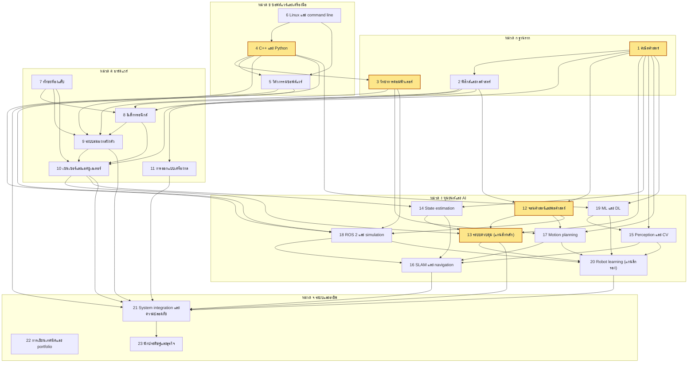

# ตอนที่ 1 จาก 11: ความเป็นไปได้ของกรอบ 5 ปี และภาพรวมหน้าเดียว

> **ข้อสรุปของตอนนี้:** ภายในวันที่ 30 กันยายน 2574 ระดับที่ไปถึงได้จริงคือ "วิศวกรอาวุโสที่ส่งมอบงานจริงในระดับสากล" (ระดับ 2 จาก 5 ระดับที่นิยามไว้ในส่วนที่ 1) ด้วยโอกาสประมาณร้อยละ 30 ถึง 45 ส่วนระดับผู้นำระดับโลกในแขนงย่อยมีโอกาสไม่เกินประมาณร้อยละ 3 และชั่วโมงเรียนเองตลอด 5 ปี (ประมาณ 2,450 ถึง 2,900 ชั่วโมง) ครอบคลุมเพียงประมาณครึ่งหนึ่งของชั่วโมงที่เป้าหมายต้องใช้ ส่วนที่เหลือต้องมาจากงานประจำที่ตรงสาย การเลือกงานแรกจึงเป็นการตัดสินใจที่มีผลต่อแผนมากที่สุด

---

## วิธีอ่านเอกสารนี้

ทุกข้อความสำคัญมีป้ายกำกับในวงเล็บ เพื่อแยกประเภทของข้อมูลออกจากกัน

| ป้ายกำกับ | ความหมาย |
|---|---|
| (ข้อเท็จจริง) | ตรวจสอบได้จากแหล่งภายนอก มีแหล่งอ้างอิงท้ายตอน |
| (อนุมาน) | ข้อสรุปที่ผมได้จากการนำข้อเท็จจริงมาคำนวณหรือเชื่อมโยงกัน ถ้าข้อเท็จจริงตั้งต้นผิด ข้อสรุปจะผิดตาม |
| (ความเห็น) | การตัดสินใจเชิงออกแบบหรือการคาดการณ์ของผม ซึ่งคนที่มีประสบการณ์คนอื่นอาจเห็นต่าง |
| ความมั่นใจสูง ปานกลาง หรือต่ำ | ระดับที่ผมคิดว่าข้อความนั้นจะถูกต้อง ระดับสูงหมายถึงผมจะประหลาดใจมากถ้าผิด ระดับต่ำหมายถึงผิดได้ง่ายและควรตรวจซ้ำ |

ข้อความในส่วนออกแบบแผนที่ไม่มีป้ายกำกับ ให้ถือว่าเป็นความเห็นเชิงออกแบบของผม ความมั่นใจปานกลาง

การนับปีของแผนในเอกสารนี้ใช้ดังนี้

| ปีของแผน | ช่วงวันที่ |
|---|---|
| ปีที่ 1 | 2 ตุลาคม 2569 ถึง 30 กันยายน 2570 |
| ปีที่ 2 | 1 ตุลาคม 2570 ถึง 30 กันยายน 2571 |
| ปีที่ 3 | 1 ตุลาคม 2571 ถึง 30 กันยายน 2572 |
| ปีที่ 4 | 1 ตุลาคม 2572 ถึง 30 กันยายน 2573 |
| ปีที่ 5 | 1 ตุลาคม 2573 ถึง 30 กันยายน 2574 |

---

# ส่วนที่ 1 ความเป็นไปได้ของกรอบ 5 ปี

## 1.1 นิยามคำว่า "เก่งระดับโลก" เป็นระดับที่วัดได้

คำว่า "เก่งระดับโลก" ใช้วางแผนไม่ได้ถ้าไม่มีเกณฑ์วัด ผมจึงแบ่งเป็น 5 ระดับ แต่ละระดับมีเกณฑ์ที่คนภายนอกตรวจสอบได้ และไม่ขึ้นกับความรู้สึกของตัวเอง (ความเห็น ความมั่นใจปานกลาง สำหรับการแบ่งระดับ ส่วนตัวอย่างผลงานในระดับ 4 และ 5 เป็นข้อเท็จจริง)

| ระดับ | ชื่อระดับ | เกณฑ์วัด | ตัวอย่างผลงานรูปธรรม 1 ชิ้น |
|---|---|---|---|
| 1 | วิศวกรหุ่นยนต์ระดับเริ่มต้นที่แข่งขันได้ในตลาดสากล | ต้องผ่านทั้ง 3 ข้อ: (ก) ได้รับข้อเสนองาน หรือผ่านถึงการสัมภาษณ์เทคนิครอบสุดท้าย จากบริษัทหุ่นยนต์ที่ส่งมอบหุ่นยนต์ให้ลูกค้าจริงอย่างน้อย 1 แห่ง (ข) มีโปรเจกต์สาธารณะอย่างน้อย 3 ชิ้นที่ทำครบตั้งแต่ฮาร์ดแวร์ถึงซอฟต์แวร์ โดยอย่างน้อย 1 ชิ้นเป็นหุ่นยนต์จริงที่ควบคุมแบบวงปิด (closed-loop control คือการควบคุมที่วัดผลลัพธ์จริงแล้วนำกลับมาแก้คำสั่งอย่างต่อเนื่อง) (ค) มี pull request (คำขอให้รวมโค้ดของเราเข้าโครงการของผู้อื่น) ที่ถูกรวมเข้าโครงการโอเพนซอร์สด้านหุ่นยนต์ที่มีผู้ใช้จริงอย่างน้อย 1 ครั้ง | หุ่นยนต์ทรงตัวสองล้อที่ออกแบบแผงวงจรพิมพ์ (PCB, printed circuit board) เอง เขียนเฟิร์มแวร์บนระบบปฏิบัติการเวลาจริง (RTOS, real-time operating system คือระบบปฏิบัติการที่รับประกันเวลาตอบสนองของงาน) ใช้ตัวควบคุมแบบ LQR (linear quadratic regulator คือตัวควบคุมที่คำนวณค่าขยายที่ดีที่สุดตามเกณฑ์ต้นทุนกำลังสอง) ที่หาสมการเองจากแบบจำลองพลศาสตร์ มีวิดีโอทดสอบการผลักรบกวน และมี repository (ที่เก็บโค้ดพร้อมประวัติการแก้ไข) ที่มีการทดสอบอัตโนมัติ |
| 2 | วิศวกรอาวุโสที่ส่งมอบงานจริง | ต้องผ่านทั้ง 3 ข้อ: (ก) เป็นเจ้าของงานตั้งแต่ออกแบบจนใช้งานจริงของระบบย่อยอย่างน้อย 1 ระบบที่ส่งถึงลูกค้าจริง ครบอย่างน้อย 1 รอบผลิตภัณฑ์ (ข) มีตำแหน่งหรือขอบเขตงานเทียบเท่าวิศวกรอาวุโส (senior engineer) ในบริษัทที่มีหุ่นยนต์ใช้งานจริง คือตัดสินใจเชิงเทคนิคของระบบย่อยได้เองและนำวิศวกร 2 ถึง 5 คนได้ (ค) มีผลงานโอเพนซอร์สที่มีนัยสำคัญถูกรวมอย่างน้อย 5 ครั้ง หรือดูแลไลบรารีของตัวเองที่มีผู้ใช้ภายนอก | ระบบควบคุมแรงของแขนกลที่ส่งมอบให้ลูกค้าอย่างน้อย 50 เครื่อง พร้อมเอกสารวิเคราะห์ความปลอดภัยและสถิติความล้มเหลวภาคสนามที่วัดได้ |
| 3 | ผู้เชี่ยวชาญที่วงการเฉพาะทางรู้จัก | ต้องผ่านอย่างน้อย 2 ใน 4 ข้อ: (ก) บทความวิชาการที่เป็นผู้เขียนหลักผ่านการพิจารณาโดยผู้ทรงคุณวุฒิ (peer review) ในเวทีชั้นนำ เช่น ICRA, IROS, RSS, CoRL, Humanoids, IEEE T-RO หรือ IEEE RA-L (ข) โครงการโอเพนซอร์สที่บริษัทหรือห้องแล็บภายนอกอย่างน้อย 3 แห่งนำไปใช้ หรือมีดาวบน GitHub อย่างน้อย 1,000 ดวง (ค) ได้รับเชิญบรรยายใน workshop ของการประชุมวิชาการหลัก (ง) มีขอบเขตงานระดับ staff engineer คือรับผิดชอบทิศทางเทคนิคข้ามหลายทีม | ไลบรารีโอเพนซอร์สสำหรับการควบคุมทั้งร่างของหุ่นยนต์ (whole-body control คือการคำนวณแรงหรือแรงบิดของทุกข้อต่อพร้อมกันเพื่อทำหลายภารกิจโดยไม่ละเมิดข้อจำกัด) ที่บริษัทหุ่นยนต์ 3 แห่งใช้งาน พร้อมบทความอธิบายใน IEEE RA-L |
| 4 | ผู้นำระดับโลกในแขนงย่อย | ต้องผ่านอย่างน้อย 1 ใน 3 ข้อ: (ก) วิธีการที่ตนสร้างกลายเป็นมาตรฐานอ้างอิง (baseline คือวิธีที่งานวิจัยอื่นต้องนำมาเปรียบเทียบ) ของแขนงย่อย หรือได้รางวัลบทความดีเด่นจากเวทีชั้นนำ (ข) เป็นผู้ก่อตั้งหรือผู้บริหารฝ่ายเทคโนโลยี (CTO) ของบริษัทหุ่นยนต์ที่มีลูกค้าจ่ายเงินจริงและได้เงินลงทุนระดับ Series A ขึ้นไป (Series A คือรอบระดมทุนจากนักลงทุนสถาบันรอบแรกหลังพิสูจน์ผลิตภัณฑ์เบื้องต้น) (ค) ได้รับเชิญเป็นผู้บรรยายหลัก (keynote) ในการประชุมวิชาการหลัก | วิธีเรียนนโยบายการควบคุมที่ห้องแล็บทั่วโลกนำไปใช้เป็น baseline ในลักษณะเดียวกับที่ Diffusion Policy ของ Cheng Chi และคณะเป็นในช่วงปี 2023 ถึง 2024 (ข้อเท็จจริง ความมั่นใจปานกลางถึงสูง) |
| 5 | ผู้กำหนดทิศทางวงการ | ผลงานหลายชิ้นต่อเนื่องหลายสิบปีที่เปลี่ยนวิธีคิดของทั้งวงการ หรือสร้างบริษัทที่นิยามหมวดผลิตภัณฑ์ใหม่ | การก่อตั้ง Boston Dynamics ของ Marc Raibert ซึ่งต่อยอดจากงานวิจัยหุ่นยนต์ขาที่ทรงตัวแบบพลวัตหลายสิบปี (ข้อเท็จจริง ความมั่นใจสูง) |

## 1.2 ภายใน 5 ปีน่าจะถึงระดับไหน

### ความน่าจะเป็นโดยประมาณ

ตัวเลขทั้งหมดในตารางนี้เป็นการคาดการณ์ของผม (ความเห็น ความมั่นใจต่ำถึงปานกลาง) เพราะไม่มีงานวิจัยที่ติดตามวิศวกรหุ่นยนต์รายบุคคลด้วยเกณฑ์แบบนี้ ผมให้ตัวเลขเพื่อใช้ตัดสินใจ ไม่ใช่เพื่อพยากรณ์อนาคตอย่างแม่นยำ

| ระดับ | โอกาสถึงภายใน 30 กันยายน 2574 | เหตุผลหลัก |
|---|---|---|
| 1 | ประมาณร้อยละ 85 ถึง 90 (และประมาณร้อยละ 55 ถึง 70 ที่จะถึงภายในวันจบการศึกษาเดือนพฤษภาคม 2571) | เกณฑ์ทุกข้อขึ้นกับงานที่ควบคุมได้ คือโปรเจกต์ การสัมภาษณ์ และการส่งโค้ดเข้าโครงการโอเพนซอร์ส ความเสี่ยงหลักคือรอบรับสมัครงานบัณฑิตใหม่ที่มีปีละครั้ง |
| 2 | ประมาณร้อยละ 30 ถึง 45 | หลังจบการศึกษามีเวลาทำงานประมาณ 3 ปี 4 เดือน การเป็นเจ้าของระบบย่อยที่ส่งถึงลูกค้าครบ 1 รอบผลิตภัณฑ์ต้องได้งานตรงสายตั้งแต่งานแรก และต้องได้รับมอบความรับผิดชอบเร็วกว่าปกติ (อนุมาน ความมั่นใจต่ำถึงปานกลาง: ในบริษัทเทคโนโลยีทั่วไป ผู้จบปริญญาตรีมักใช้เวลาหลายปีก่อนได้ขอบเขตงานระดับอาวุโส ผมยังไม่มีแหล่งข้อมูลที่ตรวจสอบได้สำหรับตัวเลขนี้) |
| 3 | ประมาณร้อยละ 8 ถึง 15 | ต้องมีผลงานที่คนนอกยอมรับ เช่น บทความในเวทีชั้นนำหรือไลบรารีที่บริษัทอื่นใช้ ซึ่งทำได้ระหว่างทำงานประจำแต่ต้องใช้เวลาเพิ่มจากงานบริษัท และการยอมรับต้องใช้เวลาตามปฏิทินหลังเผยแพร่ |
| 4 | ประมาณร้อยละ 1 ถึง 3 | ต้องมีผลงานที่เปลี่ยนวิธีทำงานของแขนงย่อย หรือบริษัทที่มีลูกค้าจริงและเงินลงทุนสถาบัน โชคและจังหวะตลาดมีผลมาก |
| 5 | ต่ำกว่าร้อยละ 0.1 | งานวิจัยเรื่องความเชี่ยวชาญพบซ้ำ ๆ ว่าระดับสูงสุดของสาขามักต้องใช้เวลาเตรียมตัวอย่างเข้มข้นประมาณ 10 ปีขึ้นไป (ข้อเท็จจริง ความมั่นใจปานกลางถึงสูง: Simon และ Chase ปี 1973 ไม่พบผู้เล่นหมากรุกระดับ grandmaster ที่ใช้เวลาเตรียมตัวน้อยกว่าประมาณ 10 ปี) และระดับนี้วัดกันที่ผลงานหลายสิบปี |

**ช่วงที่น่าจะไปถึง:** ระดับ 1 เต็มรูปแบบถึงระดับ 2 โดยค่ากลางคือ "ระดับ 2 ที่ยังไม่ครบทุกเกณฑ์" เช่น มีขอบเขตงานระดับอาวุโสแล้ว แต่ระบบย่อยที่รับผิดชอบยังส่งมอบไม่ครบ 1 รอบผลิตภัณฑ์ (ความเห็น ความมั่นใจปานกลาง)

### สมมติฐานที่ตัวเลขข้างบนต้องพึ่ง

| รหัส | สมมติฐาน | ถ้าสมมติฐานนี้ไม่จริง |
|---|---|---|
| ส1 | ทำได้ตามชั่วโมงที่วางแผนอย่างน้อยร้อยละ 75 วัดจากบันทึกเวลารายสัปดาห์ | ทุกระดับเลื่อนออกไปตามสัดส่วนชั่วโมงที่หายไป ใช้เกณฑ์ปรับแผนในส่วนที่ 8 |
| ส2 | ได้งานแรกที่ตรงสายภายในกลางปี 2571 คือบริษัทที่สร้างและส่งมอบหุ่นยนต์จริง งานเกี่ยวกับการควบคุมหรือการเรียนรู้ของหุ่นยนต์บนฮาร์ดแวร์จริง และมีวัฒนธรรมการตรวจโค้ดโดยวิศวกรที่เก่งกว่า | ชั่วโมงขาดประมาณ 1,500 ถึง 2,700 ชั่วโมง (คำนวณในข้อ 1.4) ระดับ 2 มีโอกาสลดเหลือประมาณร้อยละ 10 ถึง 20 |
| ส3 | ภาษาอังกฤษระดับอ่านเอกสารเทคนิค เขียนบทความเทคนิค และสัมภาษณ์งานได้ (จะตรวจในแขนงที่ 22 และแบบทดสอบในส่วนที่ 5) | งานในตลาดสากล บทความ และเครือข่ายออนไลน์ทั้งหมดช้าลง ต้องเพิ่มเวลาฝึกภาษาในแขนงที่ 22 |
| ส4 | ไม่มีเหตุการณ์ใหญ่ด้านสุขภาพ ครอบครัว หรือการเงินที่ทำให้หยุดเกิน 3 เดือน | เลื่อนแผนตามจำนวนเดือนที่หยุด |
| ส5 | ตลาดหุ่นยนต์ไม่เข้าสู่ภาวะถดถอยรุนแรง คือเงินลงทุนในบริษัทหุ่นยนต์ทั่วโลกไม่ลดลงต่ำกว่าระดับปี 2567 | หางานตรงสายยากขึ้น โอกาสระดับ 2 และ 4 ลดลง |
| ส6 | จบการศึกษาตามกำหนดประมาณเดือนพฤษภาคม 2571 | เส้นทางวิกฤตเลื่อนตามทั้งเส้น (ดูข้อ 2.5) |

## 1.3 สิ่งที่บีบเวลาได้ด้วยความเข้มข้น และสิ่งที่ผูกกับเวลาตามปฏิทิน

หลักการแยกคือ ถ้าผลลัพธ์ขึ้นกับจำนวนชั่วโมงที่เราลงแรงเอง สิ่งนั้นบีบได้ แต่ถ้าผลลัพธ์ขึ้นกับเวลาที่โลกภายนอกต้องใช้ หรือขึ้นกับกระบวนการทางชีววิทยาของสมอง สิ่งนั้นบีบไม่ได้ หรือบีบได้น้อยมาก

| สิ่งที่พิจารณา | บีบได้หรือไม่ | บีบได้ประมาณเท่าไร | เหตุผล |
|---|---|---|---|
| การเรียนทฤษฎี | บีบได้บางส่วน | เร็วขึ้นประมาณ 1.3 ถึง 2 เท่าเมื่อเทียบกับจังหวะรายวิชาปกติ (อนุมาน ความมั่นใจต่ำถึงปานกลาง) | ข้ามสิ่งที่รู้แล้วด้วยแบบทดสอบวัดระดับ และใช้แหล่งหลักแหล่งเดียวต่อแขนง แต่ยังถูกจำกัดด้วยเพดานการฝึกแบบตั้งใจต่อวัน (ข้อ 1.5) และความจำระยะยาวต้องอาศัยการทบทวนแบบเว้นระยะ ซึ่งต้องใช้วันตามปฏิทิน |
| การทำโปรเจกต์ | บีบได้บางส่วน | ประมาณ 1.5 ถึง 2 เท่า เมื่อใช้โปรเจกต์ที่รวมหลายแขนง | ถูกจำกัดด้วยเวลารอชิ้นส่วน การสั่งผลิต PCB และการขนส่ง ซึ่งมักใช้ประมาณ 1 ถึง 3 สัปดาห์ต่อรอบ (อนุมาน ความมั่นใจปานกลาง) และการ debug ฮาร์ดแวร์ที่คาดเวลาไม่ได้ |
| ทักษะสอบสัมภาษณ์งาน | บีบได้มาก | ฝึกเข้มข้น 8 ถึง 12 สัปดาห์ก่อนรอบสมัครงานก็พอถ้าฐานดี (ความเห็น ความมั่นใจปานกลาง) | เป็นทักษะแคบ วัดผลได้ทันที และมีแบบฝึกหัดจำนวนมาก |
| วันจบการศึกษา | บีบไม่ได้ | ไม่ได้เลย | กำหนดโดยหลักสูตรและปฏิทินมหาวิทยาลัย |
| รอบรับสมัครฝึกงานและงานบัณฑิตใหม่ | บีบไม่ได้ | ไม่ได้เลย | บริษัทส่วนใหญ่เปิดรับเป็นรอบ พลาดรอบหนึ่งอาจต้องรออีกประมาณ 1 ปี หรือรับงานที่ไม่ตรงสาย (อนุมาน ความมั่นใจปานกลาง) |
| ประสบการณ์ส่งมอบงานจริง | บีบไม่ได้ | ไม่ได้เลย | ความล้มเหลวภาคสนาม เช่น การสึกหรอ ความร้อนสะสม หรือพฤติกรรมผู้ใช้ที่ไม่คาดคิด เกิดตามเวลาใช้งานจริง และรอบผลิตภัณฑ์ฮาร์ดแวร์มักยาวหลายเดือนถึงหลายปี (อนุมาน ความมั่นใจปานกลาง) |
| ชื่อเสียง | บีบได้น้อยมาก | น้อยมาก | การอ้างอิงบทความและการยอมรับผลงานเกิดหลังเผยแพร่ 1 ถึง 3 ปี และการประชุมวิชาการหลักเปิดรับบทความปีละครั้ง (อนุมาน ความมั่นใจปานกลาง) |
| ความไว้วางใจจากเครือข่าย | บีบได้น้อย | น้อย | คนจะไว้ใจเมื่อเห็นผลงานที่สม่ำเสมอซ้ำหลายครั้งในเวลาที่ยาวพอ การเขียนเผยแพร่ต่อเนื่องช่วยได้ แต่ข้ามเวลาไม่ได้ |
| โชคและจังหวะตลาด | ควบคุมไม่ได้ | ไม่ได้ | ภาวะการลงทุน การรับคนของบริษัท และนโยบายวีซ่าเปลี่ยนตามปัจจัยภายนอก |
| การนอนและการสร้างความจำระยะยาว | บีบไม่ได้ | ไม่ได้ และการบีบให้ผลลบ | การนอนน้อยต่อเนื่องสะสมความบกพร่องทางความคิด (ข้อเท็จจริง ความมั่นใจสูง ดูข้อ 1.5.3) |
| การจดสิทธิบัตร | บีบไม่ได้ | ไม่ได้ | กระบวนการตรวจสอบของหน่วยงานรัฐใช้เวลานาน (รายละเอียดและตัวเลขจะตรวจในแขนงที่ 23) |
| การตั้งบริษัทและระดมทุน | บีบได้น้อย | น้อย | ต้องมีลูกค้าทดลองใช้ ผลการทดลอง และรอบการตัดสินใจของนักลงทุน ซึ่งเป็นเวลาของคนอื่น |

ข้อสรุปของตารางนี้ (อนุมาน ความมั่นใจปานกลาง): ความเข้มข้นที่เพิ่มขึ้นช่วยให้ "ความรู้และทักษะเชิงเทคนิค" มาเร็วขึ้นได้จริง แต่ระดับ 2 ขึ้นไปต้องการ "หลักฐานจากโลกภายนอก" เช่น ผลิตภัณฑ์ที่ส่งมอบแล้ว บทความ และการยอมรับ ซึ่งผูกกับเวลาตามปฏิทิน ดังนั้นแผน 10 ปีที่ถูกบีบเป็น 5 ปีจะได้ความรู้เชิงเทคนิคใกล้เคียงแผน 10 ปีในบางแขนง แต่จะไม่ได้หลักฐานภายนอกเท่าแผน 10 ปี

## 1.4 การคำนวณชั่วโมงรวม 5 ปี

### 1.4.1 ปฏิทินที่ใช้คำนวณ และสถานะการตรวจสอบ

ผมค้นปฏิทินการศึกษาของมหาวิทยาลัยเทคโนโลยีพระจอมเกล้าธนบุรี (มจธ.) แล้ว พบไฟล์ประกาศปฏิทินปีการศึกษา 2569 ที่ regis.kmutt.ac.th แต่เครือข่ายของสภาพแวดล้อมที่ผมใช้ทำงานบล็อกโดเมนของ มจธ. ทำให้เปิดไฟล์ต้นฉบับไม่ได้ วันที่ด้านล่างจึงมาจากข้อความในผลการค้นหาที่อ้างถึงไฟล์ปฏิทิน มจธ. และจากรูปแบบของปฏิทินปีก่อน ๆ ผมระบุสถานะของแต่ละบรรทัดไว้ชัดเจน

| ช่วง | วันที่ที่ใช้คำนวณ | ประเภทงบเวลา | สถานะการตรวจสอบ |
|---|---|---|---|
| ภาคการศึกษาที่ 1 ปีการศึกษา 2569 | เริ่ม 3 สิงหาคม 2569 สิ้นภาคประมาณ 12 ธันวาคม 2569 | เปิดเทอม | ยืนยันบางส่วน (จากผลการค้นหาที่อ้างปฏิทิน มจธ. ยังไม่ได้เปิดไฟล์ต้นฉบับ) |
| รูปแบบช่วงสอบของ มจธ. | ภาคละ 3 ช่วงสอบ ตัวอย่างภาค 1 ปีการศึกษา 2568 คือ 8 ถึง 12 กันยายน 2568, 20 ถึง 27 ตุลาคม 2568 และ 1 ถึง 12 ธันวาคม 2568 | ช่วงสอบ | ยืนยันบางส่วน (จากผลการค้นหาที่อ้างปฏิทิน มจธ. ปี 2568) |
| ช่วงสอบครั้งที่ 2 ของภาค 1 ปี 2569 | ประมาณ 19 ถึง 25 ตุลาคม 2569 (1 สัปดาห์) | ช่วงสอบ | ยังไม่ยืนยัน (ประมาณจากรูปแบบปี 2568) |
| ช่วงสอบครั้งที่ 3 ของภาค 1 ปี 2569 | ประมาณ 30 พฤศจิกายน ถึง 12 ธันวาคม 2569 (2 สัปดาห์) | ช่วงสอบ | ยังไม่ยืนยัน |
| ปิดภาคปลายปี 2569 | 13 ธันวาคม 2569 ถึง 3 มกราคม 2570 (3 สัปดาห์) | ปิดเทอม | อนุมานจากวันสิ้นภาค 1 และวันเปิดภาค 2 |
| ภาคการศึกษาที่ 2 ปีการศึกษา 2569 | เริ่ม 4 มกราคม 2570 เรียนวันสุดท้ายประมาณ 7 พฤษภาคม 2570 สิ้นภาคประมาณปลายเดือนพฤษภาคม 2570 | เปิดเทอม 17 สัปดาห์ และช่วงสอบ 4 สัปดาห์ (ประมาณกลางเดือนกุมภาพันธ์ กลางเดือนมีนาคม และกลางถึงปลายเดือนพฤษภาคม) | วันเปิดภาคยืนยันบางส่วน ช่วงสอบยังไม่ยืนยัน |
| ปิดภาคฤดูร้อน 2570 | ประมาณ 30 พฤษภาคม ถึง 1 สิงหาคม 2570 (9 สัปดาห์) | ปิดเทอม | ยังไม่ยืนยัน ถ้าลงเรียนภาคฤดูร้อนหรือฝึกงานในช่วงนี้ต้องคำนวณใหม่ |
| ปีการศึกษา 2570 ทั้งปี | ใช้รูปแบบเดียวกับปี 2569 คือ ภาค 1 ประมาณ 2 สิงหาคม ถึง 11 ธันวาคม 2570 ปิดภาค 3 สัปดาห์ และภาค 2 ประมาณ 3 มกราคม ถึง 31 พฤษภาคม 2571 | ตามประเภทของแต่ละช่วง | ยังไม่ยืนยัน (ยังค้นไม่พบประกาศปฏิทินปีการศึกษา 2570) |

**สิ่งที่ต้องทำ:** ให้เปิดไฟล์ปฏิทินทางการของ มจธ. แล้วส่งวันที่จริงของช่วงสอบทั้ง 3 ช่วงในแต่ละภาคมาให้ผม ผมจะคำนวณใหม่ ความคลาดเคลื่อนของแบบจำลองนี้ทำให้ชั่วโมงรวมช่วงเป็นนักศึกษาเปลี่ยนได้ไม่เกินประมาณ 200 ชั่วโมง (อนุมาน: ถ้าแต่ละภาคมีสัปดาห์เปิดเทอมกับสัปดาห์ปิดเทอมสลับกันได้ภาคละ 2 สัปดาห์ จำนวน 4 ภาค ความต่างของงบคือสัปดาห์ละ 25 ชั่วโมง)

### 1.4.2 ชั่วโมงเรียนเองช่วงเป็นนักศึกษา (2 ตุลาคม 2569 ถึง 31 พฤษภาคม 2571)

| ช่วง | ประเภท | จำนวนสัปดาห์ | ชั่วโมงต่อสัปดาห์ | ชั่วโมง |
|---|---|---|---|---|
| 2 ถึง 18 ตุลาคม 2569 | เปิดเทอม | 2.4 | 15 | 36 |
| ประมาณ 19 ถึง 25 ตุลาคม 2569 | ช่วงสอบ | 1 | 5 | 5 |
| ประมาณ 26 ตุลาคม ถึง 29 พฤศจิกายน 2569 | เปิดเทอม | 5 | 15 | 75 |
| ประมาณ 30 พฤศจิกายน ถึง 12 ธันวาคม 2569 | ช่วงสอบ | 2 | 5 | 10 |
| 13 ธันวาคม 2569 ถึง 3 มกราคม 2570 | ปิดเทอม | 3 | 40 | 120 |
| ภาค 2 ปีการศึกษา 2569 | เปิดเทอม | 17 | 15 | 255 |
| ภาค 2 ปีการศึกษา 2569 | ช่วงสอบ | 4 | 5 | 20 |
| ปิดภาคฤดูร้อน 2570 | ปิดเทอม | 9 | 40 | 360 |
| ภาค 1 ปีการศึกษา 2570 | เปิดเทอม | 15 | 15 | 225 |
| ภาค 1 ปีการศึกษา 2570 | ช่วงสอบ | 4 | 5 | 20 |
| ปิดภาคปลายปี 2570 | ปิดเทอม | 3 | 40 | 120 |
| ภาค 2 ปีการศึกษา 2570 | เปิดเทอม | 17 | 15 | 255 |
| ภาค 2 ปีการศึกษา 2570 | ช่วงสอบ | 4 | 5 | 20 |
| **รวมก่อนหักวันพัก** | | **86.4** | | **ประมาณ 1,520** |

จากนั้นต้องหักสองรายการ เพราะแผนที่ไม่หักจะประเมินชั่วโมงสูงเกินจริง

1. **สัปดาห์พักตามกติกาในส่วนที่ 7:** ปิดภาคปลายปีละ 1 สัปดาห์ (2 ครั้ง) และปิดภาคฤดูร้อน 2 สัปดาห์ รวม 4 สัปดาห์ของช่วงปิดเทอม คิดเป็นประมาณ 160 ชั่วโมง เหลือประมาณ 1,360 ชั่วโมง
2. **ความคลาดเคลื่อนจากชีวิตจริง** เช่น ป่วย งานกลุ่มของมหาวิทยาลัยที่หนักกว่าคาด หรือธุระครอบครัว ผมหักร้อยละ 10 (ความเห็น ความมั่นใจต่ำ เป็นค่าเผื่อที่ใช้กันทั่วไปในการวางแผนโครงการ ไม่ได้มาจากงานวิจัย) เหลือประมาณ 1,225 ชั่วโมง

**ชั่วโมงเรียนเองช่วงเป็นนักศึกษาที่ใช้วางแผน: ประมาณ 1,225 ถึง 1,360 ชั่วโมง** (อนุมาน ความมั่นใจปานกลาง)

ถ้าช่วงปิดภาคฤดูร้อน 2570 เป็นการฝึกงานประมาณ 8 สัปดาห์ ชั่วโมงเรียนเองในช่วงนั้นจะลดเหลือประมาณสัปดาห์ละ 10 ชั่วโมง ทำให้ชั่วโมงเรียนเองหายไปประมาณ 200 ชั่วโมง แต่จะได้ประสบการณ์ทำงานจริงประมาณ 320 ชั่วโมงมาแทน ผมจะวิเคราะห์ว่าคุ้มหรือไม่ในส่วนที่ 4

### 1.4.3 ชั่วโมงเรียนเองหลังเรียนจบ (1 มิถุนายน 2571 ถึง 30 กันยายน 2574)

```text
จำนวนวัน      = 1,217 วัน = 173.9 สัปดาห์
สัปดาห์ที่ฝึกได้จริง = 173.9 × (46 / 52) = 153.8 สัปดาห์   (หักวันลาพักร้อน ป่วย และช่วงงานหนักปีละประมาณ 6 สัปดาห์)
ชั่วโมงเรียนเอง   = 153.8 × 8  = 1,230 ชั่วโมง
                = 153.8 × 10 = 1,538 ชั่วโมง
```

**ชั่วโมงเรียนเองหลังจบที่ใช้วางแผน: ประมาณ 1,230 ถึง 1,540 ชั่วโมง** (อนุมาน ความมั่นใจปานกลาง) ถ้าเริ่มงานจริงเดือนกรกฎาคม 2571 แทนเดือนมิถุนายน จะมีเดือนมิถุนายนเป็นช่วงว่างที่เพิ่มได้อีกประมาณ 160 ชั่วโมง ผมไม่นับส่วนนี้เพื่อไม่ให้ประเมินสูงเกินจริง

### 1.4.4 ชั่วโมงเรียนรู้ที่ได้จากงานประจำ

งานประจำเป็นแหล่งชั่วโมงที่ใหญ่ที่สุดของแผน แต่ชั่วโมงทำงานไม่เท่ากับชั่วโมงฝึก เพราะงานส่วนใหญ่คือการทำสิ่งที่ทำได้อยู่แล้วซ้ำ ๆ งานวิจัยในข้อ 1.5.4 แสดงว่าประสบการณ์ที่นับเป็นปีแทบไม่ทำนายความสามารถ ผมจึงแปลงชั่วโมงทำงานเป็น "ชั่วโมงเรียนรู้เทียบเท่า" ด้วยตัวคูณที่ขึ้นกับประเภทงาน

```text
ชั่วโมงทำงาน = 153.8 สัปดาห์ × 40 ถึง 45 ชั่วโมง = 6,150 ถึง 6,920 ชั่วโมง

งานตรงสาย    (ตัวคูณ 0.35 ถึง 0.45) = 2,150 ถึง 3,110 ชั่วโมงเรียนรู้เทียบเท่า
งานไม่ตรงสาย (ตัวคูณ 0.05 ถึง 0.15) =   310 ถึง 1,040 ชั่วโมงเรียนรู้เทียบเท่า
```

ตัวคูณเป็นการประมาณของผม (ความเห็น ความมั่นใจต่ำ) ความหมายของตัวคูณ 0.35 คือ ในงานตรงสาย ประมาณร้อยละ 35 ของเวลาเป็นงานที่ยากกว่าระดับปัจจุบันเล็กน้อย และมีฟีดแบ็กจากคนที่เก่งกว่าหรือจากระบบจริง ส่วนงานไม่ตรงสาย เช่น งานติดตั้งและบำรุงรักษาที่ทำซ้ำรูปแบบเดิม ส่วนนี้จะเหลือเพียงร้อยละ 5 ถึง 15 ผมจะให้วิธีวัดตัวคูณจริงของงานตัวเองในส่วนที่ 8

### 1.4.5 ชั่วโมงที่เป้าหมายต้องใช้

ผมประมาณชั่วโมงของแต่ละแขนงจาก "จำนวนรายวิชาเทียบเท่า" คือ รายวิชา 3 หน่วยกิตที่เรียนอย่างจริงจังใช้เวลารวมประมาณ 120 ถึง 150 ชั่วโมง (เวลาบรรยายประมาณ 45 ชั่วโมงและเวลาศึกษาเองประมาณ 2 เท่า) บวกเวลาทำโปรเจกต์เพื่อเปลี่ยนความรู้เป็นทักษะ (อนุมาน ความมั่นใจต่ำถึงปานกลาง) ส่วนระดับเชี่ยวชาญของแกนหลัก ผมเทียบกับการเรียนเฉพาะทางระดับปริญญาโทที่มีวิทยานิพนธ์ คือประมาณ 8 ถึง 10 รายวิชาเทียบเท่ารวมกับโปรเจกต์วิจัย ตัวเลขรายแขนงอยู่ในตารางข้อ 2.2

| หมวด | แขนง | ชั่วโมงที่ต้องใช้ถึงความลึกเป้าหมาย |
|---|---|---|
| ก ฐานราก | 1 ถึง 3 | 960 |
| ข ซอฟต์แวร์และเครื่องมือ | 4 ถึง 6 | 560 |
| ค ฮาร์ดแวร์ | 7 ถึง 11 | 990 |
| ง หุ่นยนต์และ AI | 12 ถึง 20 | 3,400 |
| จ ระบบและอาชีพ | 21 ถึง 23 | 480 |
| **รวมเมื่อเรียนแยกแขนง** | | **6,390** |
| **รวมหลังหักส่วนที่ซ้อนกันจากโปรเจกต์รวมหลายแขนง (ประมาณร้อยละ 15)** | | **ประมาณ 5,430** |
| ถ้าต้องการให้แกนลึกที่สอง (robot learning) ถึงระดับเชี่ยวชาญด้วย | บวกประมาณ 900 ก่อนหักส่วนซ้อน | ประมาณ 6,200 |

ตัวเลขนี้คิดจากกรณีที่แต่ละแขนงต้องเริ่มจากหัวข้อแรก ชั่วโมงจริงจะลดลงตามผลแบบทดสอบวัดระดับในส่วนที่ 5 ซึ่งผมห้ามเดาไว้ล่วงหน้าตามกฎข้อ 3 นอกจากนี้ระดับ 2 ยังต้องการประสบการณ์ส่งมอบงานจริงอย่างน้อย 1 รอบผลิตภัณฑ์ ซึ่งเป็นเงื่อนไขตามปฏิทิน ไม่ใช่จำนวนชั่วโมง

### 1.4.6 เปรียบเทียบชั่วโมงที่มีกับชั่วโมงที่ต้องใช้

| สถานการณ์ | ชั่วโมงเรียนเอง | ชั่วโมงเรียนรู้เทียบเท่าจากงาน | รวม | เทียบกับแบบ T พื้นฐาน (5,430) | เทียบกับสองแกนลึกระดับเชี่ยวชาญ (6,200) |
|---|---|---|---|---|---|
| ก งานตรงสาย และทำตามแผนได้ดี | 2,900 | 3,110 | 6,010 | เกินประมาณ 580 | ขาดประมาณ 190 |
| ข งานตรงสาย และทำตามแผนได้ปานกลาง | 2,450 | 2,150 | 4,600 | ขาดประมาณ 830 | ขาดประมาณ 1,600 |
| ค งานไม่ตรงสาย | 2,450 ถึง 2,900 | 310 ถึง 1,040 | 2,760 ถึง 3,940 | ขาดประมาณ 1,490 ถึง 2,670 | ขาดประมาณ 2,260 ถึง 3,440 |

แหล่งชั่วโมงที่ยังไม่ได้นับ เพราะยังไม่รู้ขนาดจริง

- ชั่วโมงที่ประหยัดได้จากแบบทดสอบวัดระดับ ประมาณ 0 ถึง 800 ชั่วโมง ขึ้นกับผลสอบ
- ชั่วโมงในมหาวิทยาลัยที่ตรงกับแผน เช่น โครงงานจบที่เลือกหัวข้อให้ตรงกับโปรเจกต์ของแผน ประมาณ 0 ถึง 800 ชั่วโมง ผมไม่นับในกรณีฐาน เพราะกฎข้อ 1 ห้ามใช้ข้อมูลวิชาที่เรียนมากำหนดแผน และผมไม่รู้ว่าวิชาจะตรงกับแผนแค่ไหน

**ข้อสรุป (อนุมาน ความมั่นใจปานกลาง):**

1. ชั่วโมงเรียนเองอย่างเดียว (2,450 ถึง 2,900) ครอบคลุมประมาณร้อยละ 45 ถึง 53 ของชั่วโมงที่แบบ T พื้นฐานต้องใช้ ที่เหลือต้องมาจากงานประจำที่ตรงสาย
2. แบบ T พื้นฐาน (แกนลึกหลัก 1 แขนงถึงระดับเชี่ยวชาญ และแกนรองถึงระดับใช้คล่องระดับสูง) เป็นไปได้เฉพาะเมื่อได้งานตรงสาย และถึงตอนนั้นก็พอดีแบบไม่มีที่เหลือ
3. การให้แกนลึกทั้งสองแขนงถึงระดับเชี่ยวชาญไม่พอในทุกสถานการณ์ ยกเว้นแบบทดสอบวัดระดับและวิชาในมหาวิทยาลัยช่วยประหยัดรวมกันได้อย่างน้อยประมาณ 800 ถึง 1,600 ชั่วโมง ผมจึงกำหนดแกนที่สองเป็น "เชี่ยวชาญแบบมีเงื่อนไข" ในข้อ 2.3
4. ถ้าได้งานไม่ตรงสาย แผน 5 ปีนี้ไม่พอ ต้องเลือกระหว่างลดความลึก หรือขยายเป็น 6 ถึง 7 ปี

### 1.4.7 ถ้าชั่วโมงไม่พอ ต้องแลกอะไร (เรียงตามลำดับที่ควรทำก่อน)

| ลำดับ | สิ่งที่ทำ | ชั่วโมงที่ได้คืนหรือประหยัดได้ | สิ่งที่เสีย |
|---|---|---|---|
| 1 | ทำทุกอย่างเพื่อให้ได้งานตรงสาย ถึงแม้เงินเดือนจะต่ำกว่างานไม่ตรงสาย | ประมาณ 1,100 ถึง 2,800 | รายได้ช่วงแรกอาจต่ำกว่า |
| 2 | ให้แกนลึกที่สองหยุดที่ระดับใช้คล่องระดับสูง (กำหนดไว้แล้วในแผนพื้นฐาน) | ประมาณ 900 | ความลึกด้าน robot learning ซึ่งเป็นแขนงที่เติบโตเร็ว |
| 3 | ลดแขนง 23 (นักประดิษฐ์และธุรกิจ) ให้คงที่ระดับรู้พอใช้จนถึงปีที่ 5 | ประมาณ 70 | ความพร้อมตั้งบริษัทช้าลง |
| 4 | ลดแขนง 11 (การออกแบบเครื่องกล) เป็นรู้พอใช้ | ประมาณ 100 | ต้องพึ่งคนอื่นออกแบบชิ้นส่วนที่ซับซ้อน |
| 5 | ลดแขนง 15 (perception) เป็นรู้พอใช้ | ประมาณ 100 | สร้างระบบที่ต้องใช้ภาพเองได้น้อยลง |
| 6 | ขยายเป้าระดับเชี่ยวชาญของแกนหลักไปปีที่ 6 ถึง 7 | ไม่ประหยัด แต่ไม่ต้องลดมาตรฐาน | ช้าลง 1 ถึง 2 ปี |

สิ่งที่ห้ามนำมาแลกเด็ดขาด คือ ฐานรากคณิตศาสตร์และฟิสิกส์ ชั่วโมงนอน วันพัก และการทำงานกับฮาร์ดแวร์จริง เหตุผลอยู่ในข้อ 1.6

## 1.5 หลักฐานจากงานวิจัยเรื่องการฝึกและความเชี่ยวชาญ

### 1.5.1 การฝึกแบบตั้งใจ (deliberate practice) คืออะไร

Ericsson, Krampe และ Tesch-Römer (1993) นิยามการฝึกแบบตั้งใจว่าเป็นกิจกรรมที่ออกแบบมาเพื่อพัฒนาส่วนที่ยังทำไม่ได้โดยเฉพาะ ต้องใช้ความพยายามสูง มักไม่สนุกในตัวเอง มีฟีดแบ็กทันที และมักมีครูหรือโค้ชเป็นผู้ออกแบบ (ข้อเท็จจริง ความมั่นใจสูง) งานนั้นศึกษานักไวโอลินที่ Music Academy of West Berlin แบ่งเป็น 3 กลุ่ม และรายงานว่าเมื่ออายุ 18 ปี กลุ่มที่เก่งที่สุดสะสมชั่วโมงฝึกคนเดียวประมาณ 7,410 ชั่วโมง กลุ่มเก่งประมาณ 5,301 ชั่วโมง และกลุ่มที่จะเป็นครูดนตรีประมาณ 3,420 ชั่วโมง (ข้อเท็จจริง ความมั่นใจปานกลางถึงสูง ตัวเลขจากแหล่งทุติยภูมิที่อ้างงานต้นฉบับ)

### 1.5.2 กฎ 10,000 ชั่วโมงและข้อวิจารณ์

Malcolm Gladwell ทำให้ "กฎ 10,000 ชั่วโมง" เป็นที่รู้จักในหนังสือ Outliers (2008) โดยอ้างงานของ Ericsson (ข้อเท็จจริง ความมั่นใจสูง) ข้อวิจารณ์หลักมีดังนี้

| ข้อวิจารณ์ | แหล่ง | ผลต่อแผนนี้ |
|---|---|---|
| ตัวเลข 10,000 เป็นค่าเฉลี่ยจากการศึกษาเดียว เครื่องดนตรีเดียว เมืองเดียว มีความแปรปรวนระหว่างคนสูง และแต่ละสาขาต้องใช้ชั่วโมงต่างกัน สิ่งที่สำคัญกว่าจำนวนชั่วโมงคือชนิดของการฝึก การทำงานเดิมซ้ำ ๆ มากขึ้นไม่ได้ทำให้เก่งขึ้น | Ericsson และ Pool, หนังสือ Peak (2016) (ข้อเท็จจริง ความมั่นใจสูง) | แผนนี้ใช้ชั่วโมงเป็น "งบ" ไม่ใช่ "เป้าหมาย" และวัดความก้าวหน้าด้วยงานที่ต้องทำให้สำเร็จ |
| การวิเคราะห์อภิมาน (meta-analysis คือการรวมผลจากงานวิจัยหลายชิ้นมาวิเคราะห์ร่วมกัน) จาก 88 งานวิจัย พบว่าการฝึกแบบตั้งใจอธิบายความแปรปรวนของผลงานได้ประมาณร้อยละ 26 ในเกม ร้อยละ 21 ในดนตรี ร้อยละ 18 ในกีฬา ร้อยละ 4 ในการศึกษา และน้อยกว่าร้อยละ 1 ในงานวิชาชีพ | Macnamara, Hambrick และ Oswald (2014) Psychological Science (ข้อเท็จจริง ความมั่นใจสูง) | วิศวกรรมเป็นงานวิชาชีพ จำนวนชั่วโมงที่บันทึกได้จึงน่าจะทำนายความเก่งได้น้อย ต้องควบคุมคุณภาพของการฝึกและเลือกสภาพแวดล้อม |
| การทำซ้ำงานต้นฉบับปี 1993 ด้วยวิธีที่เข้มงวดขึ้น พบว่าผลมีขนาดเล็กกว่าเดิมมาก (อธิบายได้ประมาณร้อยละ 26 เทียบกับประมาณร้อยละ 48 ในงานเดิม) และกลุ่มที่เก่งที่สุดไม่ได้ฝึกมากกว่ากลุ่มเก่งอย่างมีนัยสำคัญ | Macnamara และ Maitra (2019) Royal Society Open Science (ข้อเท็จจริง ความมั่นใจปานกลางถึงสูง) | ชั่วโมงฝึกจำเป็นแต่ไม่พอ ความต่างระหว่างเก่งกับเก่งที่สุดมาจากปัจจัยอื่นด้วย |
| ในหมากรุกและดนตรี การฝึกแบบตั้งใจอธิบายได้ประมาณหนึ่งในสามของความแปรปรวนที่วัดได้อย่างเชื่อถือได้ | Hambrick และคณะ (2014) Intelligence (ข้อเท็จจริง ความมั่นใจสูง) | ส่วนที่เหลือมาจากปัจจัยอย่างความสามารถพื้นฐาน อายุที่เริ่ม และโอกาส |
| ผู้เล่นหมากรุกที่ถึงระดับมาสเตอร์ใช้ชั่วโมงฝึกต่างกันมาก ต่ำสุดประมาณ 3,000 ชั่วโมง ค่าเฉลี่ยของการฝึกรวมประมาณ 11,000 ชั่วโมง และบางคนใช้หลายหมื่นชั่วโมง | Gobet และ Campitelli (2007) Developmental Psychology (ข้อเท็จจริง ความมั่นใจปานกลางถึงสูง) | ไม่มีตัวเลขชั่วโมงใดรับประกันระดับ ตัวเลขในข้อ 1.4 จึงเป็นการประมาณเพื่อวางงบเท่านั้น |

ฝ่าย Ericsson โต้กลับว่างานวิเคราะห์อภิมานเหล่านั้นนับกิจกรรมที่ไม่ตรงนิยามการฝึกแบบตั้งใจอย่างเคร่งครัดรวมเข้าไปด้วย ผลจึงต่ำกว่าความจริง (Ericsson และ Harwell, 2019, Frontiers in Psychology) (ข้อเท็จจริง ความมั่นใจปานกลาง) ข้อโต้แย้งนี้มีน้ำหนัก แต่ไม่เปลี่ยนข้อสรุปที่ใช้กับแผนนี้ เพราะทั้งสองฝ่ายเห็นตรงกันว่า "การฝึกที่ออกแบบดีและมีฟีดแบ็ก" สำคัญกว่า "จำนวนชั่วโมงดิบ"

### 1.5.3 เพดานของการฝึกแบบตั้งใจต่อวัน

- Ericsson และคณะ (1993) รายงานว่านักไวโอลินกลุ่มเก่งที่สุดและกลุ่มเก่งฝึกคนเดียวประมาณวันละ 3.5 ชั่วโมง เทียบกับประมาณวันละ 1.3 ชั่วโมงในกลุ่มครูดนตรี และเสนอว่าการฝึกแบบตั้งใจทำได้ประมาณวันละ 4 ชั่วโมงก่อนที่คุณภาพจะลดลง (ข้อเท็จจริง ความมั่นใจปานกลางถึงสูง ตัวเลขจากแหล่งทุติยภูมิ) งานต้นฉบับยังรายงานว่ากลุ่มเก่งที่สุดนอนและงีบมากกว่ากลุ่มอื่น (ยังไม่ยืนยัน ผมยังไม่ได้ตรวจกับต้นฉบับโดยตรงในรอบนี้)
- Pencavel (2014) The Economic Journal ศึกษาคนงานโรงงานผลิตอาวุธในอังกฤษช่วงสงครามโลกครั้งที่ 1 พบว่าผลผลิตเพิ่มตามชั่วโมงจนถึงประมาณ 48 ถึง 49 ชั่วโมงต่อสัปดาห์ หลังจากนั้นผลผลิตต่อชั่วโมงลดลงชัดเจน และผลผลิตที่ 70 ชั่วโมงแทบไม่ต่างจากที่ 56 ชั่วโมง (ข้อเท็จจริง ความมั่นใจสูง) งานนี้เป็นงานใช้แรงกาย การนำมาใช้กับงานใช้ความคิดเป็นการอนุมาน (ความมั่นใจปานกลาง)
- Van Dongen และคณะ (2003) Sleep พบว่าการจำกัดเวลานอนไว้ที่ 6 ชั่วโมงต่อคืนเป็นเวลา 14 วัน ทำให้ความสามารถทางความคิดลดลงสะสมจนใกล้เคียงกับการอดนอนทั้งคืน 1 ถึง 2 คืน (ข้อเท็จจริง ความมั่นใจสูง)

**ผลต่อการออกแบบงบเวลา (อนุมาน ความมั่นใจปานกลาง):**

| ช่วง | งบเวลา | การฝึกแบบตั้งใจที่ทำได้จริง | ส่วนที่เหลือใช้ทำอะไร |
|---|---|---|---|
| เปิดเทอม | 15 ชั่วโมงต่อสัปดาห์ (ประมาณวันละ 2 ชั่วโมง) | ใช้เป็นการฝึกแบบตั้งใจได้เกือบทั้งหมด เพราะต่ำกว่าเพดาน | ไม่มี |
| ช่วงสอบ | 5 ชั่วโมงต่อสัปดาห์ | ทบทวนแบบเว้นระยะและงานนิสัยประจำวัน | ไม่มี |
| ปิดเทอม | 40 ชั่วโมงต่อสัปดาห์ | ไม่เกินวันละประมาณ 4 ชั่วโมง คือประมาณ 20 ถึง 24 ชั่วโมงต่อสัปดาห์ | อีกประมาณ 16 ถึง 20 ชั่วโมงใช้กับงานที่ใช้สมาธิน้อยกว่า เช่น ประกอบฮาร์ดแวร์ เขียนเอกสาร อ่านเพื่อสำรวจ และจัดระเบียบ repository |
| หลังเรียนจบ | 8 ถึง 10 ชั่วโมงต่อสัปดาห์ | ทำเป็นการฝึกแบบตั้งใจได้ทั้งหมด แต่คุณภาพหลังเลิกงานจะต่ำกว่าตอนเช้า | ควรวางช่วงยาวในวันหยุดตอนเช้า รายละเอียดในส่วนที่ 4 |

ข้อควรระวังที่สำคัญ: ช่วงเปิดเทอม 15 ชั่วโมงนี้อยู่บนภาระเรียนเต็มเวลา ภาระรวมต่อสัปดาห์จึงอาจเกิน 50 ชั่วโมง ซึ่งเป็นช่วงที่หลักฐานข้างบนชี้ว่าผลตอบแทนต่อชั่วโมงเริ่มลดลง ความเสี่ยงนี้จะถูกจัดการด้วยกติกาในส่วนที่ 7 และเกณฑ์ปรับแผนในส่วนที่ 8

### 1.5.4 ประสบการณ์ทำงานไม่ได้เท่ากับการฝึก

- Schmidt และ Hunter (1998) Psychological Bulletin รวมงานวิจัย 85 ปีเรื่องการคัดเลือกพนักงาน พบว่าจำนวนปีของประสบการณ์ทำงานทำนายผลการทำงานได้ต่ำ (ค่าสหสัมพันธ์ที่ปรับแล้วประมาณ 0.18) ขณะที่การทดสอบด้วยตัวอย่างงานจริง (work sample test) ทำนายได้ประมาณ 0.54 และความสามารถทางความคิดทั่วไปประมาณ 0.51 (ข้อเท็จจริง ความมั่นใจสูง)
- Choudhry, Fletcher และ Soumerai (2005) Annals of Internal Medicine ทบทวนงานวิจัยเรื่องประสบการณ์ของแพทย์ พบว่า 32 จาก 62 การประเมิน (ประมาณร้อยละ 52) รายงานว่าคุณภาพการรักษาลดลงเมื่อจำนวนปีที่ทำงานเพิ่มขึ้น (ข้อเท็จจริง ความมั่นใจสูง)

ผลต่อแผนนี้ (อนุมาน ความมั่นใจปานกลาง): ทุกเกณฑ์ผ่านในแผนจะใช้ "งานที่ต้องทำให้สำเร็จ" แทน "จำนวนชั่วโมงที่ใช้" และงานประจำจะนับเป็นการเรียนรู้เฉพาะส่วนที่มีความท้าทายและฟีดแบ็กเท่านั้น

### 1.5.5 ปัจจัยที่ควบคุมได้และควบคุมไม่ได้

| ระดับการควบคุม | ปัจจัย | สิ่งที่แผนทำกับปัจจัยนี้ |
|---|---|---|
| ควบคุมได้ | คุณภาพของการฝึก ความยากที่เลือก แหล่งฟีดแบ็ก การเลือกโปรเจกต์ ชั่วโมงภายในงบ การนอน การออกกำลังกาย การบันทึกและทบทวน | ออกแบบไว้ในทุกส่วนของแผน และวัดผลทุก 6 เดือน |
| ควบคุมได้บางส่วน | งานที่ได้ ที่ฝึกงานที่ได้ คนที่ยอมรีวิวงานให้ การได้รับเลือกให้ทำโปรเจกต์ที่สำคัญในบริษัท | เพิ่มโอกาสด้วยผลงานสาธารณะ การเขียน และการสมัครให้ตรงเวลา |
| ควบคุมไม่ได้ | ความสามารถทางความคิดพื้นฐานและความจำใช้งาน (working memory) ซึ่ง Hambrick และคณะ (2014) พบว่ามีผลต่อผลงาน (ข้อเท็จจริง ความมั่นใจปานกลาง) ความรู้ที่มีอยู่ ณ วันเริ่มแผน ภาวะตลาดและการลงทุน นโยบายวีซ่าและภูมิรัฐศาสตร์ ปัญหาสุขภาพที่ไม่คาดคิด จังหวะเวลาและโชค | ไม่พยายามควบคุม แต่ตั้งจุดตรวจและแผนสำรองในส่วนที่ 8 |

### 1.5.6 สรุปผลของงานวิจัยต่อการออกแบบแผน

1. ชั่วโมงเป็นงบ ไม่ใช่ตัววัดความเก่ง ความเก่งวัดด้วยงานที่ทำสำเร็จตามเกณฑ์
2. การฝึกแบบตั้งใจต่อวันมีเพดานประมาณ 4 ชั่วโมง ชั่วโมงที่เกินจากนี้ต้องเป็นงานที่ใช้สมาธิน้อยกว่า
3. ฟีดแบ็กเป็นหัวใจของการฝึกแบบตั้งใจ แผนนี้แทนครูด้วยการทดสอบอัตโนมัติ คำตอบอ้างอิง การจำลอง (simulation) และการรีวิวผ่านช่องทางเขียนออนไลน์ ซึ่งตรงกับวิธีทำงานที่ต้องการ
4. สภาพแวดล้อมการทำงานมีผลมากกว่าความพยายามส่วนตัวในช่วงหลังเรียนจบ เพราะเป็นแหล่งชั่วโมงที่ใหญ่ที่สุด

## 1.6 กลไกที่บีบเวลาได้จริง และสิ่งที่ห้ามตัดแม้จะรีบ

### กลไกที่บีบเวลาได้จริง (เรียงตามขนาดผล)

| ลำดับ | กลไก | ขนาดผลโดยประมาณ | วิธีใช้ในแผนนี้ |
|---|---|---|---|
| 1 | เลือกสภาพแวดล้อมการทำงานที่ตรงสาย มีหุ่นยนต์จริง มีวิศวกรที่เก่งกว่าคอยรีวิวงาน และให้ความรับผิดชอบเร็ว | ประมาณ 1,100 ถึง 2,800 ชั่วโมงเรียนรู้เทียบเท่า ซึ่งมากกว่าชั่วโมงเรียนเองทั้งหมดหลังเรียนจบ (อนุมาน ความมั่นใจต่ำถึงปานกลาง) | เกณฑ์เลือกงานในส่วนที่ 4 และเส้นทางวิกฤตในข้อ 2.5 |
| 2 | โปรเจกต์ที่รวมหลายแขนงในชิ้นเดียว | ประมาณร้อยละ 15 ของชั่วโมงรวม หรือประมาณ 960 ชั่วโมง (ความเห็น ความมั่นใจต่ำถึงปานกลาง) | ทุกปีมีโปรเจกต์รวมอย่างน้อย 1 ชิ้นที่ใช้ 5 แขนงขึ้นไป |
| 3 | ข้ามสิ่งที่รู้แล้วด้วยแบบทดสอบวัดระดับ | 0 ถึงประมาณ 800 ชั่วโมง ขึ้นกับผลสอบ | ส่วนที่ 5 |
| 4 | ให้งานในมหาวิทยาลัย เช่น โครงงานจบ นับซ้ำกับโปรเจกต์ของแผน ถ้าหลักสูตรอนุญาตให้เลือกหัวข้อ | 0 ถึงประมาณ 800 ชั่วโมง | เลือกหัวข้อโครงงานจบให้ตรงกับโปรเจกต์ปีที่ 2 |
| 5 | กำหนดความลึกตามแบบตัว T คือแขนงที่ไม่ใช่แกนอยู่ที่ระดับใช้คล่องหรือรู้พอใช้ | ทำให้ชั่วโมงรวมอยู่ที่ประมาณ 6,400 ชั่วโมง แทนที่จะเกินประมาณ 20,000 ชั่วโมงถ้าทุกแขนงต้องถึงระดับเชี่ยวชาญ (อนุมาน: 23 แขนง แขนงละประมาณ 900 ถึง 1,400 ชั่วโมง) | ตารางข้อ 2.2 |
| 6 | เรียนแบบทันใช้ (just-in-time) สำหรับแขนงที่ไม่ใช่แกน และเรียนล่วงหน้า (just-in-case) เฉพาะฐานราก | ลดการลืมก่อนได้ใช้ (ความเห็น ความมั่นใจปานกลาง) | ไทม์ไลน์ข้อ 2.6 วางแขนงที่ไม่ใช่แกนไว้ใกล้กับโปรเจกต์ที่ต้องใช้ |
| 7 | ใช้แหล่งเรียนหลักแหล่งเดียวต่อแขนง | ลดเวลาที่เสียไปกับการเปลี่ยนแหล่งและเรียนเนื้อหาซ้ำ (ความเห็น ความมั่นใจปานกลาง) | ส่วนที่ 3 กำหนดแหล่งหลัก 1 แหล่งและแหล่งเสริมไม่เกิน 2 แหล่ง |
| 8 | วงจรฟีดแบ็กเร็ว คือทดสอบในการจำลองก่อน มีการทดสอบอัตโนมัติ และทดสอบฮาร์ดแวร์แบบวนซ้ำ (hardware-in-the-loop คือการต่อฮาร์ดแวร์จริงเข้ากับระบบทดสอบอัตโนมัติ) | ลดเวลารอผลจากหลายวันเหลือหลายนาทีในหลายกรณี | ใช้ในทุกโปรเจกต์ |
| 9 | ฟีดแบ็กและเครือข่ายผ่านช่องทางเขียน คือส่งโค้ดเข้าโครงการโอเพนซอร์สเพื่อให้ผู้ดูแลโครงการรีวิว เขียนบทความเทคนิค และถามตอบในฟอรัม | ได้รีวิวจากวิศวกรระดับโลกโดยไม่ต้องพบตัว | แผนกำหนดผลงานเผยแพร่ขั้นต่ำต่อปีในส่วนที่ 4 |

### สิ่งที่ห้ามตัดแม้จะรีบ

| สิ่งที่ห้ามตัด | เหตุผลจากหลักการ |
|---|---|
| ฐานรากคณิตศาสตร์ คือ พีชคณิตเชิงเส้น แคลคูลัส สมการเชิงอนุพันธ์ ความน่าจะเป็น และ optimization | ทุกแขนงในหมวด ง ใช้คณิตศาสตร์เหล่านี้เป็นภาษาหลัก ถ้าข้ามไป จะเรียนแขนงที่สูงกว่าได้เพียงระดับใช้สูตรตาม ซึ่งไม่ถึงระดับสร้างใหม่ได้ |
| ฟิสิกส์และพลศาสตร์ | หุ่นยนต์ทำงานในโลกทางกายภาพ การควบคุมและการจำลองที่ไม่มีแบบจำลองทางกายภาพที่ถูกต้องจะใช้งานจริงไม่ได้ |
| การเขียนอัลกอริทึมหลักเองจากศูนย์อย่างน้อย 1 ครั้ง ก่อนใช้ไลบรารี | การเขียนเองบังคับให้เข้าใจทุกขั้น และทำให้ debug ไลบรารีได้เมื่อมันผิด |
| การทำงานกับฮาร์ดแวร์จริง | ความต่างระหว่างการจำลองกับโลกจริง (sim-to-real gap) เป็นแหล่งปัญหาหลักของงานหุ่นยนต์ ทักษะนี้ฝึกในการจำลองไม่ได้ |
| ความปลอดภัย ทั้งไฟฟ้า แบตเตอรี่ลิเธียม และหุ่นยนต์ที่เคลื่อนที่ | อุบัติเหตุครั้งเดียวอาจทำให้แผนหยุดหลายเดือนหรือถาวร |
| การนอนอย่างน้อย 7 ชั่วโมงและวันพักประจำสัปดาห์ | หลักฐานในข้อ 1.5.3 แสดงว่าการนอนน้อยสะสมความบกพร่องทางความคิด การตัดการนอนจึงไม่ได้เพิ่มชั่วโมงที่มีคุณภาพ |
| การทบทวนแบบเว้นระยะ (spaced repetition คือการทบทวนซ้ำในช่วงเวลาที่ห่างขึ้นเรื่อย ๆ เพื่อให้จำได้ระยะยาว) | ความรู้ที่ลืมไปต้องเรียนใหม่ ซึ่งเสียชั่วโมงมากกว่าการทบทวน |
| การเขียนอธิบายสิ่งที่เรียน | เป็นทั้งการตรวจว่าเข้าใจจริง และเป็นช่องทางสร้างชื่อเสียงกับรับฟีดแบ็กผ่านการเขียน |

## 1.7 สิ่งที่ทำไม่ได้ภายใน 5 ปี (บอกตรง ๆ)

1. **ระดับ 4 และระดับ 5 ทำไม่ได้ภายใน 5 ปีในความหมายของการวางแผน** โอกาสรวมไม่เกินประมาณร้อยละ 3 และส่วนใหญ่ขึ้นกับโชคและจังหวะ (ความเห็น ความมั่นใจปานกลาง)
2. **ความเชี่ยวชาญจนสร้างใหม่ได้ในทุกแขนงทำไม่ได้** ต้องใช้ชั่วโมงมากกว่างบหลายเท่า (อนุมาน ความมั่นใจสูง)
3. **ความเชี่ยวชาญระดับสร้างใหม่ได้ในสองแกนพร้อมกันทำไม่ได้ภายใต้สถานการณ์ปกติ** ทำได้เฉพาะเมื่อแบบทดสอบวัดระดับและวิชาในมหาวิทยาลัยช่วยประหยัดได้มาก (อนุมาน ความมั่นใจปานกลาง)
4. **การเรียนปริญญาเอกให้จบ และเป็นวิศวกรอาวุโสภาคอุตสาหกรรมภายใน 5 ปีเดียวกัน ทำไม่ได้** เพราะปริญญาเอกต่อจากปริญญาตรีมักใช้เวลาหลายปีเต็มเวลา ซึ่งใช้ช่วงหลังเรียนจบทั้งหมดของแผน (อนุมาน ความมั่นใจปานกลาง จะวิเคราะห์ในส่วนที่ 4)
5. **บริษัทหุ่นยนต์ที่มีลูกค้าจ่ายเงินและเติบโตแล้วภายในปี 2574 ไม่ควรเป็นเป้าหมายของแผน** สิ่งที่ทำได้คือความพร้อมในการตั้งบริษัท ได้แก่ ต้นแบบที่ทดสอบกับผู้ใช้จริง หลักฐานว่ามีคนต้องการ และทักษะการระดมทุนระดับรู้พอใช้ (ความเห็น ความมั่นใจปานกลาง)
6. **ประสบการณ์ส่งมอบผลิตภัณฑ์หลายรอบทำไม่ได้** ภายใน 3 ปี 4 เดือนหลังเรียนจบจะได้ประมาณ 1 ถึง 2 รอบเท่านั้น (อนุมาน ความมั่นใจปานกลาง)
7. **ชื่อเสียงระดับที่คนทั้งวงการรู้จักทำไม่ได้** ทำได้เพียงการเป็นที่รู้จักในแขนงย่อยแคบ ๆ ถ้าผลงานดีพอ

**สิ่งที่ทำได้จริงภายใน 5 ปี:** ระดับ 1 ที่แข็งแรงภายในวันจบการศึกษา ระดับ 2 ภายในปี 2574 (โอกาสประมาณร้อยละ 30 ถึง 45) ความเชี่ยวชาญระดับสร้างใหม่ได้ 1 แขนง (ระบบควบคุม) ถ้าได้งานตรงสาย ความรู้กว้างระดับใช้คล่องในแขนงส่วนใหญ่ และความพร้อมระดับเริ่มต้นสำหรับการตั้งบริษัท

## 1.8 ข้อโต้แย้งที่แข็งแรงที่สุดต่อส่วนที่ 1

| ข้อโต้แย้ง | คำตอบของผม | หลักฐานแบบใดที่จะทำให้ต้องเปลี่ยนแผน |
|---|---|---|
| ตัวเลขชั่วโมงที่ต้องใช้ทั้งหมดเป็นการอนุมาน ไม่มีงานวิจัยที่วัดชั่วโมงที่วิศวกรหุ่นยนต์ใช้ถึงแต่ละระดับ การคำนวณข้อ 1.4 จึงอาจผิดได้มาก | ยอมรับ ตัวเลขนี้ใช้เพื่อเห็นขนาดของช่องว่าง ไม่ใช่เพื่อพยากรณ์ | หลังทำตามแผน 6 เดือน ถ้าชั่วโมงจริงที่ใช้ต่อหัวข้อที่ผ่านเกณฑ์สูงหรือต่ำกว่าที่ประมาณเกิน 1.3 เท่าใน 3 แขนงขึ้นไป ให้คำนวณข้อ 1.4 ใหม่ทั้งหมด |
| ตัวคูณของงานตรงสาย (0.35 ถึง 0.45) อาจสูงเกินไป งานจริงอาจมีงานซ้ำมากกว่าที่คิด | เป็นไปได้ ผมจึงกำหนดให้วัดตัวคูณจริง | หลังเริ่มงาน 6 เดือน ถ้าบันทึกพบว่าเวลางานที่ท้าทายและมีฟีดแบ็กน้อยกว่าร้อยละ 25 ให้ถือว่าเป็นงานไม่ตรงสายและใช้แผนสำรองในส่วนที่ 8 |
| ความน่าจะเป็นของระดับ 2 อาจต่ำเกินไปสำหรับคนที่ทำงานในสตาร์ทอัปที่ให้ความรับผิดชอบเร็ว | เป็นไปได้ สตาร์ทอัปอาจให้เป็นเจ้าของระบบย่อยภายในปีแรก | ถ้าภายในปีที่ 3 ได้เป็นเจ้าของระบบย่อยที่ส่งถึงลูกค้าแล้ว ให้ปรับความน่าจะเป็นของระดับ 2 ขึ้น และเลื่อนเป้าระดับ 3 ให้เร็วขึ้น |
| 15 ชั่วโมงต่อสัปดาห์บนภาระเรียนเต็มเวลาอาจไม่ยั่งยืน แผนทั้งหมดจึงตั้งอยู่บนสมมติฐานที่อ่อน | เป็นความเสี่ยงจริง จึงวางกติกาพักในส่วนที่ 7 และเกณฑ์ปรับในส่วนที่ 8 | ถ้าบันทึกเวลาต่ำกว่า 10 ชั่วโมงต่อสัปดาห์ติดต่อกัน 4 สัปดาห์ในช่วงเปิดเทอม หรือพบสัญญาณหมดไฟตามส่วนที่ 7 ให้ใช้เกณฑ์ "เวลาน้อยลง" ในส่วนที่ 8 |

---

# ส่วนที่ 2 ภาพรวมหน้าเดียว

## 2.1 นิยามระดับความลึกที่ใช้ทั้งเอกสาร

| ระดับความลึก | นิยาม | ตัวอย่างการทดสอบ |
|---|---|---|
| รู้พอใช้ (working knowledge) | อธิบายแนวคิดหลักได้ถูกต้อง ใช้เครื่องมือหรือไลบรารีมาตรฐานทำงานทั่วไปได้โดยเปิดเอกสารประกอบ และรู้ว่าเมื่อไรต้องปรึกษาผู้เชี่ยวชาญ | ตอบคำถามแนวคิดถูกอย่างน้อยร้อยละ 70 และทำตัวอย่างมาตรฐานให้ทำงานได้ |
| ใช้คล่อง (fluent) | ทำงานจริงได้เองโดยไม่มีคนช่วย เขียนอัลกอริทึมมาตรฐานของแขนงได้เองจากศูนย์ debug ปัญหาที่ไม่เคยเห็นได้ในเวลาที่สมเหตุสมผล และอธิบายข้อดีข้อเสียของทางเลือกได้ | ทำโปรเจกต์ที่ไม่เคยทำให้เสร็จตามสเปกภายในเวลาที่กำหนด โดยใช้ความรู้ของแขนงนั้นเป็นหลัก |
| เชี่ยวชาญจนสร้างใหม่ได้ (expert, generative) | สร้างวิธีใหม่หรือดัดแปลงวิธีเดิมให้ใช้กับปัญหาที่ยังไม่มีคำตอบ อธิบายข้อจำกัดเชิงทฤษฎี วินิจฉัยความล้มเหลวที่คนส่วนใหญ่วินิจฉัยไม่ได้ และมีผลงานที่ผู้เชี่ยวชาญภายนอกยอมรับ | บทความที่ผ่าน peer review ไลบรารีที่คนอื่นนำไปใช้ หรือระบบที่ส่งมอบแล้วทำงานได้ตามสเปกในภาคสนาม |

## 2.2 ตารางรวมทุกแขนง

สัดส่วนเวลาคิดจากชั่วโมงที่ต้องใช้ถึงความลึกเป้าหมายของแต่ละแขนง หารด้วยชั่วโมงรวม 6,390 ชั่วโมง ซึ่งรวมทั้งชั่วโมงเรียนเองและชั่วโมงเรียนรู้จากงาน

| แขนง | ความลึกเป้าหมายภายใน 5 ปี | ชั่วโมงที่ต้องใช้ (ประมาณ) | สัดส่วนเวลา | แหล่งชั่วโมงหลัก | ปีที่เริ่ม | ปีที่ต้องถึงเป้า |
|---|---|---|---|---|---|---|
| **หมวด ก ฐานราก** | | | | | | |
| 1 คณิตศาสตร์ | ใช้คล่อง | 500 | ร้อยละ 8 | เรียนเอง | ปีที่ 1 | หัวข้อแกนปีที่ 2 ส่วน Lie group ปีที่ 3 |
| 2 ฟิสิกส์และกลศาสตร์ | ใช้คล่อง | 160 | ร้อยละ 3 | เรียนเอง | ปีที่ 1 | ปีที่ 2 |
| 3 วิทยาการคอมพิวเตอร์ | ใช้คล่อง | 300 | ร้อยละ 5 | เรียนเอง | ปีที่ 1 | โครงสร้างข้อมูลและอัลกอริทึมระดับพร้อมสัมภาษณ์ปลายปีที่ 1 ส่วนที่เหลือปีที่ 2 |
| **หมวด ข ซอฟต์แวร์และเครื่องมือ** | | | | | | |
| 4 C++ และ Python ระดับวิชาชีพ | ใช้คล่อง | 350 | ร้อยละ 6 | เรียนเอง แล้วต่อด้วยงาน | ปีที่ 1 | ปีที่ 2 |
| 5 วิศวกรรมซอฟต์แวร์ | ใช้คล่อง | 150 | ร้อยละ 2 | เรียนเอง แล้วต่อด้วยงาน | ปีที่ 1 | ปีที่ 2 |
| 6 Linux และ command line | ใช้คล่อง | 60 | ร้อยละ 1 | เรียนเอง | ปีที่ 1 | ปีที่ 1 |
| **หมวด ค ฮาร์ดแวร์** | | | | | | |
| 7 ทักษะห้องแล็บ | ใช้คล่อง | 60 | ร้อยละ 1 | เรียนเอง | ปีที่ 1 | ปีที่ 1 |
| 8 อิเล็กทรอนิกส์ | ใช้คล่อง | 250 | ร้อยละ 4 | เรียนเอง | ปีที่ 1 | ปีที่ 3 |
| 9 ระบบสมองกลฝังตัว | ใช้คล่อง | 280 | ร้อยละ 4 | เรียนเอง แล้วต่อด้วยงาน | ปีที่ 1 | ปีที่ 3 |
| 10 เซนเซอร์และแอคชูเอเตอร์ | ใช้คล่อง | 180 | ร้อยละ 3 | เรียนเอง | ปีที่ 1 | ปีที่ 3 |
| 11 การออกแบบเครื่องกล | ใช้คล่องระดับทำต้นแบบ และรู้พอใช้ระดับการผลิตจำนวนมาก | 220 | ร้อยละ 3 | เรียนเอง | ปีที่ 1 | ปีที่ 3 |
| **หมวด ง หุ่นยนต์และ AI** | | | | | | |
| 12 จลนศาสตร์และพลศาสตร์ | ใช้คล่อง (แล้วลึกต่อภายในแขนง 13) | 220 | ร้อยละ 3 | เรียนเอง | ปีที่ 1 | ปีที่ 2 |
| 13 ระบบควบคุม | **เชี่ยวชาญจนสร้างใหม่ได้ (แกนลึกหลัก)** | 1,400 | ร้อยละ 22 | เรียนเองช่วงเป็นนักศึกษา แล้วงานเป็นหลักหลังจบ | ปีที่ 1 | ใช้คล่องปีที่ 2 และเชี่ยวชาญปีที่ 5 |
| 14 State estimation | ใช้คล่อง | 180 | ร้อยละ 3 | เรียนเอง | ปีที่ 1 (ไตรมาส 4) | ปีที่ 3 |
| 15 Perception และ computer vision | ใช้คล่อง | 220 | ร้อยละ 3 | เรียนเอง | ปีที่ 2 | ปีที่ 3 |
| 16 SLAM และ navigation | รู้พอใช้ | 100 | ร้อยละ 2 | เรียนเอง | ปีที่ 3 | ปีที่ 3 |
| 17 Motion planning | ใช้คล่อง | 180 | ร้อยละ 3 | เรียนเอง | ปีที่ 2 | ปีที่ 3 |
| 18 ROS 2 และ simulation | ใช้คล่อง | 200 | ร้อยละ 3 | เรียนเอง แล้วต่อด้วยงาน | ปีที่ 1 (ไตรมาส 4) | ปีที่ 2 |
| 19 Machine learning และ deep learning | ใช้คล่อง | 350 | ร้อยละ 5 | เรียนเอง | ปีที่ 1 (ไตรมาส 4) | ปีที่ 3 |
| 20 Robot learning | **ใช้คล่องระดับสูง และเชี่ยวชาญแบบมีเงื่อนไข (แกนลึกรอง)** | 550 (และอีกประมาณ 900 ถ้าจะถึงระดับเชี่ยวชาญ) | ร้อยละ 9 | เรียนเองและงาน | ปีที่ 2 | ใช้คล่องระดับสูงปีที่ 4 และเชี่ยวชาญปีที่ 5 เฉพาะเมื่อผ่านเงื่อนไขในข้อ 2.3 |
| **หมวด จ ระบบและอาชีพ** | | | | | | |
| 21 System integration ความน่าเชื่อถือ และความปลอดภัย | ใช้คล่อง | 180 (ไม่รวมชั่วโมงที่ได้ในโปรเจกต์และงาน) | ร้อยละ 3 | งานเป็นหลัก | ปีที่ 1 (ผ่านโปรเจกต์) | ปีที่ 4 |
| 22 การเขียนเทคนิค การนำเสนอ และ portfolio | ใช้คล่อง | 150 (ไม่รวมการเขียนที่ทำในทุกแขนง) | ร้อยละ 2 | เรียนเองต่อเนื่อง | ปีที่ 1 | ปีที่ 2 แล้วรักษาระดับ |
| 23 ทักษะนักประดิษฐ์และธุรกิจ | รู้พอใช้ปีที่ 3 และใช้คล่องปีที่ 5 | 150 | ร้อยละ 2 | เรียนเอง | ปีที่ 2 | ปีที่ 5 |
| **รวม** | | **6,390** | **ร้อยละ 100** | | | |

คำอธิบายเพิ่มเติม: สัดส่วนของแขนง 13 สูงกว่าแขนงอื่นเพราะเป็นแกนลึกหลักตามหลักแบบตัว T แต่ชั่วโมงส่วนใหญ่ของแขนง 13 ช่วงปีที่ 3 ถึง 5 มาจากงานประจำ ไม่ได้มาจากชั่วโมงเรียนเอง การแบ่งชั่วโมงเรียนเองรายปีจะอยู่ในส่วนที่ 4

## 2.3 โปรไฟล์แบบตัว T

### การตัดสินใจ

- **แกนลึกหลัก: แขนง 13 ระบบควบคุม** ถึงระดับเชี่ยวชาญจนสร้างใหม่ได้ภายในปีที่ 5 ครอบคลุมการควบคุมแบบเหมาะที่สุด การควบคุมแบบทำนายล่วงหน้า (MPC, model predictive control คือการคำนวณคำสั่งที่ดีที่สุดในอนาคตช่วงสั้น ๆ ซ้ำทุกรอบเวลา) การควบคุมไม่เชิงเส้น และการควบคุมทั้งร่างบนหุ่นยนต์จริง
- **แกนลึกรอง: แขนง 20 robot learning** ถึงระดับใช้คล่องระดับสูงภายในปีที่ 4 และถึงระดับเชี่ยวชาญภายในปีที่ 5 เฉพาะเมื่อผ่านเงื่อนไขข้างล่าง ครอบคลุม imitation learning (การเรียนนโยบายจากการสาธิตของมนุษย์) reinforcement learning (การเรียนจากการลองผิดลองถูกโดยมีรางวัลเป็นสัญญาณ) การถ่ายโอนจากการจำลองสู่โลกจริง (sim-to-real) และการปรับแต่ง foundation model (แบบจำลองขนาดใหญ่ที่ฝึกจากข้อมูลจำนวนมากแล้วนำไปปรับใช้กับงานเฉพาะ) เช่น vision-language-action model (VLA คือแบบจำลองที่รับภาพและคำสั่งภาษาแล้วส่งออกคำสั่งการเคลื่อนที่)
- **แกนนอน:** แขนงที่เหลือ 21 แขนง อยู่ที่ระดับใช้คล่องหรือรู้พอใช้ตามตาราง 2.2

### เหตุผลจากทิศทางวงการ

| ข้อมูล | ประเภท |
|---|---|
| Figure AI บริษัทหุ่นยนต์ฮิวแมนนอยด์ระดมทุน Series C ได้มากกว่า 1 พันล้านดอลลาร์ ที่มูลค่าบริษัทประมาณ 39,000 ล้านดอลลาร์ ในเดือนกันยายน 2568 | ข้อเท็จจริง ความมั่นใจสูง |
| Physical Intelligence บริษัทที่พัฒนา foundation model สำหรับหุ่นยนต์ ระดมทุนประมาณ 600 ล้านดอลลาร์ที่มูลค่าประมาณ 5,600 ล้านดอลลาร์ในเดือนพฤศจิกายน 2568 | ข้อเท็จจริง ความมั่นใจปานกลางถึงสูง |
| เงินร่วมลงทุนในสตาร์ทอัปหุ่นยนต์ทั่วโลกปี 2025 รวมเกือบ 14,000 ล้านดอลลาร์ สูงกว่าปี 2024 ที่ประมาณ 8,200 ล้านดอลลาร์ | ยังไม่ยืนยัน (มาจากสรุปผลการค้นหา ยังไม่ได้เปิดรายงานต้นฉบับ) |
| สหพันธ์หุ่นยนต์นานาชาติ (IFR) รายงานว่าปี 2024 มีการติดตั้งหุ่นยนต์อุตสาหกรรมทั่วโลกประมาณ 542,000 ตัว และมีหุ่นยนต์อุตสาหกรรมที่ใช้งานอยู่ประมาณ 4.66 ล้านตัว | ข้อเท็จจริง ความมั่นใจสูง |
| แบบจำลอง VLA ระดับแนวหน้า เช่น π0 และ π0.5 ของ Physical Intelligence, GR00T ของ NVIDIA และ Gemini Robotics ของ Google DeepMind แยก "การให้เหตุผล" กับ "การควบคุม" ให้ทำงานที่ความเร็วต่างกัน ส่วนการควบคุมความถี่สูงยังต้องอาศัยตัวควบคุมระดับล่างที่ทำงานบนฮาร์ดแวร์จริง | ข้อเท็จจริงเรื่องชื่อและสถาปัตยกรรม ความมั่นใจปานกลาง ส่วนข้อสรุปเรื่องความจำเป็นของตัวควบคุมระดับล่างเป็นการอนุมาน ความมั่นใจปานกลาง |

### การให้คะแนนผู้สมัครเป็นแกนลึก

คะแนน 1 ถึง 5 และน้ำหนักเป็นความเห็นของผม (ความมั่นใจปานกลาง)

| เกณฑ์ | น้ำหนัก | 13 ระบบควบคุม | 20 Robot learning | 9 ระบบสมองกลฝังตัว | 21 System integration |
|---|---|---|---|---|---|
| ทิศทางวงการปี 2569 ถึง 2574 | ร้อยละ 25 | 4 | 5 | 3 | 4 |
| คุณค่าต่อเป้าหมาย industry นักประดิษฐ์ และบริษัท | ร้อยละ 25 | 5 | 4 | 4 | 4 |
| ความเป็นไปได้ที่จะถึงระดับเชี่ยวชาญภายใน 5 ปีโดยไม่มีปริญญาเอก | ร้อยละ 15 | 4 | 2 | 4 | 2 |
| ความทนทานต่อการเปลี่ยนแปลงของเทคโนโลยี | ร้อยละ 15 | 5 | 2 | 4 | 4 |
| การใช้ฐานร่วมกับแกนลึกอีกแกน ซึ่งช่วยประหยัดชั่วโมง | ร้อยละ 20 | 5 | 5 | 4 | 3 |
| **คะแนนถ่วงน้ำหนัก** | | **4.60** | **3.85** | **3.75** | **3.50** |

เหตุผลสรุป (ความเห็น ความมั่นใจปานกลาง)

1. **ระบบควบคุมเป็นสะพานระหว่างฮาร์ดแวร์กับการเรียนรู้** นโยบายที่เรียนมาจะทำงานบนหุ่นยนต์จริงได้ต้องมีตัวควบคุมระดับล่าง แบบจำลองแอคชูเอเตอร์ และการประมาณสถานะที่ดี คนที่เข้าใจทั้งสองฝั่งหาได้ยากกว่าคนที่รู้ฝั่งเดียว
2. **ระบบควบคุมทนต่อการเปลี่ยนแปลงของเทคโนโลยี** ทฤษฎีเสถียรภาพ optimization และพลศาสตร์ไม่ล้าสมัยภายใน 5 ปี ขณะที่สถาปัตยกรรมของ robot learning เปลี่ยนทุก 1 ถึง 2 ปี
3. **ระบบควบคุมเป็นไปได้มากกว่าที่จะถึงระดับเชี่ยวชาญโดยไม่มีปริญญาเอก** แหล่งเรียนระดับสูงเปิดฟรี ฝึกได้บนฮาร์ดแวร์ราคาไม่สูง และไม่ต้องใช้ข้อมูลหรือพลังประมวลผลขนาดใหญ่ ส่วน robot learning ระดับแนวหน้าแข่งกับห้องแล็บที่มีข้อมูลจากหุ่นยนต์จำนวนมากและพลังประมวลผลสูง
4. **robot learning เป็นทิศทางที่เงินทุนและผลิตภัณฑ์ใหม่กำลังไหลไป** นักประดิษฐ์ในปี 2574 ที่ใช้นโยบายที่เรียนมาไม่ได้จะสร้างผลิตภัณฑ์บางประเภทไม่ได้ จึงต้องเป็นแกนรอง
5. **แกนทั้งสองใช้ฐานร่วมกันมาก** คือ optimization ความน่าจะเป็น พลศาสตร์ และการจำลอง ทำให้ชั่วโมงที่ลงกับแกนหนึ่งช่วยอีกแกน

**ความไม่แน่นอนที่ต้องบอกตรง ๆ:** คะแนนของแขนง 20 (3.85) กับแขนง 9 (3.75) ใกล้กันมาก ถ้าลดน้ำหนักทิศทางวงการเหลือร้อยละ 10 และเพิ่มน้ำหนักความเป็นไปได้เป็นร้อยละ 30 แขนง 9 จะได้คะแนนสูงกว่า (3.90 เทียบกับ 3.40) ผมเลือกแขนง 20 เพราะให้น้ำหนักกับทิศทางวงการและการเสริมกันกับแกนหลัก แต่ถ้างานแรกเป็นงานด้านแอคชูเอเตอร์หรือเฟิร์มแวร์ควบคุมมอเตอร์ การเปลี่ยนแกนรองเป็นแขนง 9 เป็นทางเลือกสำรองที่วางไว้ในส่วนที่ 8

### เงื่อนไขที่แกนรองจะถึงระดับเชี่ยวชาญ

แขนง 20 จะเปลี่ยนเป้าจากใช้คล่องระดับสูงเป็นเชี่ยวชาญ เมื่อผ่านอย่างน้อย 2 ใน 3 ข้อ ณ จุดตรวจปลายปีที่ 3 (30 กันยายน 2572)

1. งานประจำมีส่วนของ robot learning บนหุ่นยนต์จริงอย่างน้อยร้อยละ 30 ของเวลางาน
2. แบบทดสอบวัดระดับและวิชาในมหาวิทยาลัยประหยัดชั่วโมงรวมกันได้อย่างน้อย 800 ชั่วโมง
3. แขนง 13 ผ่านเกณฑ์ใช้คล่องครบทุกหัวข้อแล้ว และอยู่ในเส้นทางถึงระดับเชี่ยวชาญตามกำหนด

### การยืนยันการเลือกอีกครั้งหลังแบบทดสอบวัดระดับ

แบบทดสอบวัดระดับใช้ยืนยัน "จังหวะเวลา" ของแบบตัว T ไม่ได้ใช้เปลี่ยน "ทิศทาง" ของแบบตัว T เพราะกฎข้อ 2 ให้เลือกจากทิศทางวงการและคุณค่าต่อเป้าหมาย กติกาคือ

| ผลแบบทดสอบในหมวด ก (คณิตศาสตร์ ฟิสิกส์ และวิทยาการคอมพิวเตอร์) | ผลต่อแบบตัว T |
|---|---|
| ได้อย่างน้อยร้อยละ 70 | คงแบบตัว T และเริ่มแขนง 13 เร็วขึ้น 1 ไตรมาส |
| ได้ร้อยละ 40 ถึง 69 | คงแบบตัว T และใช้ไทม์ไลน์ตามข้อ 2.6 |
| ได้น้อยกว่าร้อยละ 40 | คงแบบตัว T แต่เลื่อนเป้าใช้คล่องของแขนง 13 ออกไป 1 ถึง 2 ไตรมาส และเลื่อนการเริ่มแขนง 20 ตามไปเท่ากัน |

ทิศทางของแบบตัว T จะเปลี่ยนได้จากหลักฐานภายนอกที่ระบุไว้ในข้อ 2.8 หรือจากเกณฑ์ "ชอบแขนงอื่นมากกว่า" ในส่วนที่ 8 เท่านั้น เกณฑ์ตัวเลขละเอียดของแบบทดสอบจะอยู่ในส่วนที่ 5

## 2.4 แผนผังความเชื่อมโยงระหว่างแขนง

ลูกศรในแผนผังหมายถึง "แขนงต้นทางเป็นฐานของแขนงปลายทาง" กล่องสีเหลืองคือแขนงที่อยู่บนเส้นทางวิกฤต แขนง 22 (การเขียนเทคนิค) ไม่มีเส้นเชื่อม เพราะใช้กับทุกแขนงตลอดแผน



## 2.5 เส้นทางวิกฤต (critical path)

เส้นทางวิกฤตคือลำดับของทักษะและเหตุการณ์ที่ต้องเกิดตามลำดับ ถ้าขั้นใดล่าช้า ขั้นถัดไปทั้งหมดจะเลื่อน และทำให้ทั้งแผนเลื่อน แผนนี้มี 2 เส้นที่วิ่งขนานกันและมาบรรจบกันที่การได้งานแรก

### เส้นที่ 1 เส้นทางความรู้สู่แกนลึก

| ลำดับ | ทักษะหรือเหตุการณ์ | ต้องเสร็จภายใน | ถ้าล่าช้าจะเกิดอะไร |
|---|---|---|---|
| 1 | ทำแบบทดสอบวัดระดับ | 11 ตุลาคม 2569 | ทุกตารางเวลาไม่มีฐานที่ถูกต้อง |
| 2 | พีชคณิตเชิงเส้นและแคลคูลัสหลายตัวแปรระดับใช้คล่อง | 31 มีนาคม 2570 | จลนศาสตร์และระบบควบคุมเริ่มไม่ได้ |
| 3 | สมการเชิงอนุพันธ์และความน่าจะเป็นพื้นฐานระดับใช้คล่อง | 30 มิถุนายน 2570 | ระบบควบคุมแบบ state space และ state estimation เริ่มไม่ได้ |
| 4 | จลนศาสตร์และพลศาสตร์ส่วนแรก (แบบจำลองของหุ่นยนต์ทรงตัวและแขนกลสองข้อต่อ) | 31 กรกฎาคม 2570 | โปรเจกต์ที่ 2 ไม่มีแบบจำลองให้ออกแบบตัวควบคุม |
| 5 | ระบบควบคุมคลาสสิกและแบบ state space ระดับใช้คล่องพื้นฐาน | 31 สิงหาคม 2570 | สัมภาษณ์งานตำแหน่งด้านการควบคุมไม่ผ่าน |
| 6 | ระบบควบคุมแบบเหมาะที่สุดและ MPC ระดับใช้คล่อง | 30 กันยายน 2571 | แกนลึกเริ่มช้า เป้าระดับเชี่ยวชาญปีที่ 5 เสี่ยง |
| 7 | การควบคุมไม่เชิงเส้นและการควบคุมทั้งร่างบนฮาร์ดแวร์จริง | 30 กันยายน 2573 | ไม่มีเวลาพอสร้างหลักฐานระดับเชี่ยวชาญ |
| 8 | หลักฐานระดับเชี่ยวชาญด้านระบบควบคุม คือบทความที่ผ่าน peer review หรือไลบรารีที่คนภายนอกใช้ | 30 กันยายน 2574 | เป้าระดับเชี่ยวชาญเลื่อนเป็นปีที่ 6 ถึง 7 |

### เส้นที่ 2 เส้นทางอาชีพสู่งานตรงสาย

| ลำดับ | ทักษะหรือเหตุการณ์ | ต้องเสร็จภายใน | ถ้าล่าช้าจะเกิดอะไร |
|---|---|---|---|
| 1 | โปรเจกต์ที่ 1 เผยแพร่บน GitHub (ระบบควบคุมมอเตอร์แบบวงปิดบนไมโครคอนโทรลเลอร์) | 15 มกราคม 2570 | ใช้สมัครฝึกงานรอบฤดูร้อน 2570 ไม่ทัน (เส้นทางรองที่เกือบวิกฤต) |
| 2 | C++ Python และโครงสร้างข้อมูลกับอัลกอริทึมระดับพร้อมสัมภาษณ์ | 31 สิงหาคม 2570 | ไม่ผ่านรอบสัมภาษณ์เขียนโค้ด ซึ่งบริษัทส่วนใหญ่ใช้เป็นด่านแรก |
| 3 | โปรเจกต์ที่ 2 เผยแพร่ (หุ่นยนต์ทรงตัวสองล้อที่ออกแบบ PCB เอง) และ portfolio พร้อม | 31 สิงหาคม 2570 | ไม่มีหลักฐานความสามารถด้านฮาร์ดแวร์กับการควบคุมให้บริษัทเห็น |
| 4 | สมัครงานบัณฑิตใหม่ ช่วงสิงหาคม 2570 ถึงเมษายน 2571 โดยบริษัทใหญ่ในต่างประเทศมักเปิดรับเร็วที่สุด และสตาร์ทอัปมักรับใกล้วันเริ่มงานมากกว่า | เริ่มส่งใบสมัครชุดแรกภายใน 30 กันยายน 2570 | พลาดรอบของบริษัทที่เปิดรับเร็ว ต้องเลือกจากตัวเลือกที่น้อยลง (อนุมาน ความมั่นใจปานกลาง) |
| 5 | ได้ข้อเสนองานตรงสาย | 31 มีนาคม 2571 | ถ้าได้งานไม่ตรงสาย ชั่วโมงเรียนรู้ขาดประมาณ 1,100 ถึง 2,800 ชั่วโมง |
| 6 | จบการศึกษาและเริ่มงาน | พฤษภาคม ถึงมิถุนายน 2571 | ทุกอย่างหลังจากนี้เลื่อนตาม |
| 7 | เป็นเจ้าของระบบย่อยที่ส่งถึงลูกค้า | 30 กันยายน 2573 | ระดับ 2 ไม่ทันภายในปีที่ 5 |

**จุดบรรจบที่สำคัญที่สุด:** ขั้นที่ 5 ของเส้นที่ 1 (ระบบควบคุมระดับใช้คล่องพื้นฐาน) กับขั้นที่ 2 ถึง 4 ของเส้นที่ 2 ต้องพร้อมในเดือนสิงหาคม 2570 พร้อมกัน ช่วงเดือนกรกฎาคมถึงกันยายน 2570 จึงเป็นช่วงที่มีความเสี่ยงสูงที่สุดของทั้งแผน

## 2.6 ไทม์ไลน์ 5 ปีรายไตรมาส

ตัวเลขในคอลัมน์ "แขนงที่เน้น" คือหมายเลขแขนงในตาราง 2.2

| ไตรมาส | ช่วงวันที่ | บริบทตามปฏิทิน | แขนงที่เน้น | เหตุการณ์หรือผลงานสำคัญ |
|---|---|---|---|---|
| **ปีที่ 1 ไตรมาส 1** | ตุลาคม ถึงธันวาคม 2569 | เปิดเทอม ช่วงสอบ 2 ช่วง และปิดเทอม 3 สัปดาห์ | 1, 4, 6, 5, 7, 9, 10, 13 (PID พื้นฐาน), 22 | แบบทดสอบวัดระดับในสัปดาห์แรก เริ่มโปรเจกต์ที่ 1 และสร้างนิสัย Git กับ Linux ทุกวัน |
| **ปีที่ 1 ไตรมาส 2** | มกราคม ถึงมีนาคม 2570 | ภาค 2 เปิดเทอม และช่วงสอบ 2 ช่วง | 1, 2, 3, 8, 9, 10 | โปรเจกต์ที่ 1 เผยแพร่ภายใน 15 มกราคม 2570 และสมัครฝึกงานฤดูร้อน |
| **ปีที่ 1 ไตรมาส 3** | เมษายน ถึงมิถุนายน 2570 | เปิดเทอม ช่วงสอบปลายภาค และเริ่มปิดภาคฤดูร้อน | 12, 13, 3, 11, 10 | เริ่มโปรเจกต์ที่ 2 และเริ่มฝึกงานถ้าได้ |
| **ปีที่ 1 ไตรมาส 4** | กรกฎาคม ถึงกันยายน 2570 | ปิดภาคฤดูร้อนเดือนกรกฎาคม แล้วเปิดภาค 1 ปีการศึกษา 2570 ในเดือนสิงหาคม | 13, 14, 18, 19, 3, 4, 22 | โปรเจกต์ที่ 2 เผยแพร่ portfolio พร้อม และเริ่มสมัครงานบัณฑิตใหม่ |
| **ปีที่ 2 ไตรมาส 1** | ตุลาคม ถึงธันวาคม 2570 | เปิดเทอม ช่วงสอบ และปิดเทอม | 13 (optimal control และ MPC เบื้องต้น), 19, 3 (ระบบปฏิบัติการ concurrency และเครือข่าย), 14 | สัมภาษณ์งาน และเริ่มโปรเจกต์ที่ 3 ซึ่งควรเป็นหัวข้อเดียวกับโครงงานจบ |
| **ปีที่ 2 ไตรมาส 2** | มกราคม ถึงมีนาคม 2571 | ภาค 2 เปิดเทอม และช่วงสอบ | 15, 17, 20 (imitation learning), 18 (simulation) | ได้ข้อเสนองานภายใน 31 มีนาคม 2571 |
| **ปีที่ 2 ไตรมาส 3** | เมษายน ถึงมิถุนายน 2571 | สอบปลายภาค จบการศึกษา และเริ่มงาน | 20, 15, 22 | โปรเจกต์ที่ 3 เผยแพร่พร้อมรายงานเทคนิค และเริ่มงานแรก |
| **ปีที่ 2 ไตรมาส 4** | กรกฎาคม ถึงกันยายน 2571 | ทำงานประจำ และฝึกเองสัปดาห์ละ 8 ถึง 10 ชั่วโมง | 13 (MPC เชิงลึก), 21 (ผ่านงาน), 23 (เริ่มอ่าน) | จุดตรวจครบ 2 ปี ระดับ 1 ต้องผ่านครบทุกเกณฑ์ |
| **ปีที่ 3 ไตรมาส 1** | ตุลาคม ถึงธันวาคม 2571 | ทำงานประจำ | 13 (การควบคุมไม่เชิงเส้นและ Lyapunov), 1 (Lie group), 14 | ผลงานโอเพนซอร์สชิ้นแรกที่มีนัยสำคัญ |
| **ปีที่ 3 ไตรมาส 2** | มกราคม ถึงมีนาคม 2572 | ทำงานประจำ | 20 (reinforcement learning และ sim-to-real), 19 | เริ่มโปรเจกต์ที่ 4 (นโยบายที่เรียนในการจำลองแล้วใช้บนหุ่นยนต์จริง) |
| **ปีที่ 3 ไตรมาส 3** | เมษายน ถึงมิถุนายน 2572 | ทำงานประจำ | 16, 17, 15 | แขนง 15 และ 17 ถึงระดับใช้คล่อง |
| **ปีที่ 3 ไตรมาส 4** | กรกฎาคม ถึงกันยายน 2572 | ทำงานประจำ | 23 (ฝึกค้นหาโจทย์จากผู้ใช้จริง), 8, 9, 10, 11 (ปิดเป้า) | โปรเจกต์ที่ 4 เผยแพร่ และตรวจเงื่อนไขแกนรอง |
| **ปีที่ 4 ไตรมาส 1** | ตุลาคม ถึงธันวาคม 2572 | ทำงานประจำ | 13 (trajectory optimization และการควบคุมทั้งร่าง) | เริ่มโปรเจกต์ที่ 5 ซึ่งเป็นงานระดับเชี่ยวชาญด้านการควบคุม |
| **ปีที่ 4 ไตรมาส 2** | มกราคม ถึงมีนาคม 2573 | ทำงานประจำ | 20 | robot learning เข้าใกล้ระดับใช้คล่องระดับสูง |
| **ปีที่ 4 ไตรมาส 3** | เมษายน ถึงมิถุนายน 2573 | ทำงานประจำ | 21 (มาตรฐานความปลอดภัยและความน่าเชื่อถือ), 13 | ร่างบทความหรือเอกสารเทคนิคของโปรเจกต์ที่ 5 |
| **ปีที่ 4 ไตรมาส 4** | กรกฎาคม ถึงกันยายน 2573 | ทำงานประจำ | 13, 22 | ส่งบทความเข้าการประชุมวิชาการหรือเผยแพร่ไลบรารี และเป็นเจ้าของระบบย่อยที่ส่งถึงลูกค้า |
| **ปีที่ 5 ไตรมาส 1** | ตุลาคม ถึงธันวาคม 2573 | ทำงานประจำ | 13, 23 | ฝึกสัมภาษณ์ผู้ใช้เพื่อหาโจทย์ผลิตภัณฑ์ |
| **ปีที่ 5 ไตรมาส 2** | มกราคม ถึงมีนาคม 2574 | ทำงานประจำ | 20 (ถ้าผ่านเงื่อนไข), 23 | สร้างต้นแบบผลิตภัณฑ์รุ่นแรก |
| **ปีที่ 5 ไตรมาส 3** | เมษายน ถึงมิถุนายน 2574 | ทำงานประจำ | 23, 21 | ทดสอบต้นแบบกับผู้ใช้จริง และตัดสินใจเรื่องบริษัทตามเกณฑ์ในส่วนที่ 4 |
| **ปีที่ 5 ไตรมาส 4** | กรกฎาคม ถึงกันยายน 2574 | ทำงานประจำ | ทุกแขนง (ประเมินผล) | ประเมินระดับตามข้อ 1.1 และวางแผน 5 ปีถัดไป |

## 2.7 สารบัญของเอกสารทั้งหมด

| ตอน | ส่วน | เนื้อหา | สถานะ |
|---|---|---|---|
| 1 | ส่วนที่ 1 | ความเป็นไปได้ของกรอบ 5 ปี: นิยามระดับ ความน่าจะเป็น สิ่งที่บีบได้และบีบไม่ได้ การคำนวณชั่วโมง งานวิจัยเรื่องการฝึก กลไกบีบเวลา และสิ่งที่ทำไม่ได้ | ส่งแล้ว (ตอนนี้) |
| 1 | ส่วนที่ 2 | ภาพรวมหน้าเดียว: ตารางรวมทุกแขนง แบบตัว T แผนผังความเชื่อมโยง เส้นทางวิกฤต ไทม์ไลน์รายไตรมาส และสารบัญ | ส่งแล้ว (ตอนนี้) |
| 1 | ภาคผนวกของตอนที่ 1 | เริ่มเรียนที่ไหน (แหล่งเรียนหลักและแหล่งเสริมที่ตรวจแล้วของทั้ง 23 แขนง ขั้นตอนสัปดาห์แรก สถานที่ในไทย และชุมชนออนไลน์) และรู้ได้อย่างไรว่าใช้คล่องแล้ว (ด่านทดสอบ 5 ด่าน และงานทดสอบรายหัวข้อ) | เพิ่มตามคำขอ อยู่ท้ายไฟล์นี้ ต่อจากแหล่งอ้างอิงของตอนที่ 1 |
| 2 | ส่วนที่ 3 หมวด ก | ฐานราก: แขนง 1 คณิตศาสตร์ แขนง 2 ฟิสิกส์และกลศาสตร์ แขนง 3 วิทยาการคอมพิวเตอร์ | ส่งแล้ว ไฟล์ [02-section3-group-a-foundations.md](02-section3-group-a-foundations.md) |
| 3 | ส่วนที่ 3 หมวด ข | ซอฟต์แวร์และเครื่องมือ: แขนง 4 C++ และ Python แขนง 5 วิศวกรรมซอฟต์แวร์ แขนง 6 Linux | ส่งแล้ว ไฟล์ [03-section3-group-b-software.md](03-section3-group-b-software.md) |
| 4 | ส่วนที่ 3 หมวด ค | ฮาร์ดแวร์: แขนง 7 ถึง 11 | ส่งแล้ว ไฟล์ [04-section3-group-c-hardware.md](04-section3-group-c-hardware.md) |
| 5 | ส่วนที่ 3 หมวด ง ส่วนแรก | แขนง 12 จลนศาสตร์และพลศาสตร์ ถึงแขนง 16 SLAM และ navigation | ส่งแล้ว ไฟล์ [05-section3-group-d-robotics-ai-part1.md](05-section3-group-d-robotics-ai-part1.md) |
| 6 | ส่วนที่ 3 หมวด ง ส่วนหลัง | แขนง 17 motion planning ถึงแขนง 20 robot learning | ส่งแล้ว ไฟล์ [06-section3-group-d-robotics-ai-part2.md](06-section3-group-d-robotics-ai-part2.md) |
| 7 | ส่วนที่ 3 หมวด จ | แขนง 21 system integration ถึงแขนง 23 นักประดิษฐ์และธุรกิจ | ส่งแล้ว ไฟล์ [07-section3-group-e-systems-career.md](07-section3-group-e-systems-career.md) |
| 8 | ส่วนที่ 4 | แผน 5 ปีแบบแบ่งเฟส: ปีที่ 1 รายเดือน ปีที่ 2 ถึง 5 รายไตรมาส จุดตัดสินใจด้านอาชีพ และผลงานเผยแพร่ขั้นต่ำต่อปี | ส่งแล้ว ไฟล์ [08-section4-phased-plan.md](08-section4-phased-plan.md) |
| 9 | ส่วนที่ 5 | แบบทดสอบวัดระดับ: ข้อสอบทุกแขนง เวลาไม่เกิน 6 ชั่วโมง เกณฑ์ข้ามบทเรียน และผลต่อแผน | ส่งแล้ว ไฟล์ [09-section5-placement-test.md](09-section5-placement-test.md) |
| 10 | ส่วนที่ 6 | แผน 3 เดือนแรกรายสัปดาห์ (2 ตุลาคม 2569 ถึง 1 มกราคม 2570) อุปกรณ์ที่ต้องซื้อ และตัวชี้วัด ณ 1 มกราคม 2570 | ส่งแล้ว ไฟล์ [10-section6-first-3-months.md](10-section6-first-3-months.md) |
| 11 | ส่วนที่ 7 | การรักษาความเข้มข้นให้ยั่งยืน: กติกาพัก การนอน สัญญาณหมดไฟ และวิธีรับมือ | ยังไม่ส่ง |
| 11 | ส่วนที่ 8 | เกณฑ์ปรับแผน: จุดตรวจทุก 6 เดือน และสถานการณ์พิเศษ | ยังไม่ส่ง |
| 11 | บทปิด | ข้อจำกัดของแผนทั้งฉบับและสิ่งที่ควรศึกษาต่อ | ยังไม่ส่ง |

ทุกแขนงในส่วนที่ 3 ใช้รูปแบบเดียวกัน 6 หัวข้อ คือ (ก) หัวข้อหลัก หัวข้อย่อย และหัวข้อย่อยระดับลึกเรียงตามลำดับที่ควรเรียน (ข) ความลึกเป้าหมาย เหตุผล และปีที่ต้องถึงแต่ละระดับ (ค) แขนงที่ต้องรู้ก่อนและแขนงที่ต่อยอด (ง) วิธีทดสอบว่ารู้จริง (จ) แหล่งเรียนหลัก 1 แหล่งและแหล่งเสริมไม่เกิน 2 แหล่ง พร้อมราคาเป็นบาทและดอลลาร์ (ฉ) สถานะการตรวจสอบแหล่งเรียน

## 2.8 ข้อโต้แย้งที่แข็งแรงที่สุดต่อส่วนที่ 2

| ข้อโต้แย้ง | คำตอบของผม | หลักฐานแบบใดที่จะทำให้ต้องเปลี่ยนแผน |
|---|---|---|
| **ควรให้ robot learning เป็นแกนหลัก เพราะเงินลงทุนและตำแหน่งงานใหม่ไหลไปทางนั้น และนโยบายที่เรียนมากำลังแทนที่ตัวควบคุมแบบดั้งเดิมในหลายงาน เช่น การเดินของหุ่นยนต์สี่ขา** นี่คือข้อโต้แย้งที่แข็งแรงที่สุดต่อแผนนี้ | นโยบายที่เรียนมายังต้องอาศัยความเข้าใจด้านการควบคุมในการออกแบบรางวัล การตั้งค่าตัวควบคุมระดับล่าง แบบจำลองแอคชูเอเตอร์ และความปลอดภัย และระดับเชี่ยวชาญของ robot learning โดยไม่มีปริญญาเอกและไม่มีข้อมูลขนาดใหญ่ทำได้ยากกว่ามาก | ทุก 6 เดือน ให้สุ่มอ่านประกาศงานของบริษัทหุ่นยนต์ที่ส่งมอบหุ่นยนต์จริง 30 บริษัท ถ้าสัดส่วนตำแหน่งที่ต้องการ robot learning ต่อตำแหน่งที่ต้องการระบบควบคุมสูงกว่า 3 ต่อ 1 ติดต่อกัน 2 รอบ ให้สลับแกนหลักกับแกนรอง |
| แผนนี้กว้างเกินไปในปีที่ 1 ควรลึกแขนงเดียวตั้งแต่แรกเพื่อให้โดดเด่นเร็ว | แขนงลึกต้องมีฐานรากก่อน ถ้าข้ามฐาน จะลึกได้เพียงระดับใช้เครื่องมือ และการสัมภาษณ์งานส่วนใหญ่ทดสอบฐานกว้างก่อน | ถ้าแบบทดสอบวัดระดับได้อย่างน้อยร้อยละ 80 ในหมวด ก และ ข ให้ย้ายเวลาจากฐานรากไปที่แกนหลักเร็วขึ้น 1 ถึง 2 ไตรมาส |
| แขนง 9 (ระบบสมองกลฝังตัว) ควรเป็นแกนรองแทนแขนง 20 สำหรับคนที่อยากเป็นนักประดิษฐ์ เพราะผลิตภัณฑ์ฮาร์ดแวร์ทุกชิ้นต้องใช้ | เป็นข้อโต้แย้งที่สมเหตุสมผล คะแนนต่างกันเพียง 0.10 ผมเลือกแขนง 20 เพราะให้น้ำหนักกับทิศทางวงการ | ถ้างานแรกเป็นงานด้านเฟิร์มแวร์ควบคุมมอเตอร์หรือแอคชูเอเตอร์อย่างน้อยร้อยละ 50 ของเวลางาน ให้เปลี่ยนแกนรองเป็นแขนง 9 |
| เส้นทางวิกฤตพึ่งการได้งานตรงสายมากเกินไป ถ้าตลาดงานแย่ แผนทั้งหมดล้ม | ยอมรับ นี่คือความเปราะบางหลักของแผน ทางเลือกสำรองคือการเรียนปริญญาโทที่มีโครงการวิจัยด้านการควบคุมหรือ robot learning ซึ่งจะวิเคราะห์ในส่วนที่ 4 | ถ้าภายใน 31 มีนาคม 2571 ยังไม่มีข้อเสนองานตรงสาย ให้ใช้แผนสำรองในส่วนที่ 4 และ 8 |

---

## การตรวจตัวเองก่อนส่งตอนที่ 1

| ข้อ | คำถาม | ผลการตรวจ |
|---|---|---|
| 1 | ส่วนที่ 1 บอกตรง ๆ หรือไม่ว่าอะไรทำไม่ได้ภายใน 5 ปี | บอกแล้วในข้อ 1.7 รวม 7 ข้อ และในตารางความน่าจะเป็นข้อ 1.2 |
| 2 | ชั่วโมงรวมพอกับเป้าหมายจริงหรือไม่ | ไม่พอถ้าใช้ชั่วโมงเรียนเองอย่างเดียว พอดีแบบไม่มีที่เหลือเฉพาะเมื่อได้งานตรงสาย และไม่พอสำหรับสองแกนลึกระดับเชี่ยวชาญ ผมบอกส่วนที่ขาดเป็นตัวเลขและสิ่งที่ต้องแลกไว้ในข้อ 1.4.6 และ 1.4.7 |
| 3 | อ่านส่วนที่ 2 จบแล้วเห็นทุกแขนง ความเชื่อมโยง และเส้นทางวิกฤตหรือไม่ | ตาราง 2.2 มีครบ 23 แขนง แผนผัง 2.4 มีครบ 23 แขนง และเส้นทางวิกฤตอยู่ในข้อ 2.5 |
| 4 | มีแขนงใดในส่วนที่ 3 ที่รายละเอียดน้อยกว่าแขนงอื่นหรือไม่ | ยังไม่เกี่ยวกับตอนนี้ ส่วนที่ 3 จะตรวจในตอนที่ 2 ถึง 7 ด้วยรูปแบบ 6 หัวข้อเดียวกันทุกแขนง |
| 5 | แผน 3 เดือนมีแขนงใดเกินร้อยละ 30 ของชั่วโมงหรือไม่ | ยังไม่เกี่ยวกับตอนนี้ จะตรวจในตอนที่ 10 |
| 6 | มีส่วนใดถูกกำหนดจากข้อมูลส่วนตัวแทนหลักการเรียนรู้หรือไม่ | ไม่มี ข้อมูลส่วนตัวที่ใช้มีเพียงข้อจำกัดที่ระบุในคำสั่ง คือชั้นปี ปีที่คาดว่าจะจบ งบเวลา และวันเริ่มแผน ซึ่งใช้คำนวณเวลาเท่านั้น แบบตัว T เลือกจากทิศทางวงการและหลักการ ไม่ได้เลือกจากประวัติ และระดับเริ่มต้นยังไม่ถูกเดา โดยรอแบบทดสอบในส่วนที่ 5 |

## ข้อจำกัดของตอนนี้และสิ่งที่ควรศึกษาต่อ

### ข้อจำกัด

1. **ปฏิทินการศึกษายังยืนยันไม่ครบ** วันที่ช่วงสอบทั้งหมดและปฏิทินปีการศึกษา 2570 เป็นการประมาณจากรูปแบบปีก่อน ผลต่อชั่วโมงรวมไม่เกินประมาณ 200 ชั่วโมง
2. **ชั่วโมงที่เป้าหมายต้องใช้และตัวคูณของงานประจำเป็นการอนุมาน** ไม่มีงานวิจัยที่วัดค่าเหล่านี้ในวิศวกรรมหุ่นยนต์โดยตรง
3. **ความน่าจะเป็นของแต่ละระดับเป็นความเห็น** ใช้เพื่อตัดสินใจ ไม่ใช่เพื่อพยากรณ์อย่างแม่นยำ
4. **งานวิจัยเรื่องการฝึกส่วนใหญ่ศึกษาดนตรี หมากรุก และกีฬา** การนำมาใช้กับวิศวกรรมเป็นการอนุมาน
5. **ตัวเลขบางตัวผมตรวจผ่านแหล่งทุติยภูมิหรือสรุปผลการค้นหา ไม่ได้เปิดต้นฉบับ** เพราะเครือข่ายของสภาพแวดล้อมที่ใช้ทำงานบล็อกหลายโดเมน ผมระบุสถานะไว้ที่ข้อความนั้นแล้ว

### สิ่งที่ควรศึกษาต่อ

1. ปฏิทินการศึกษาทางการของ มจธ. ปีการศึกษา 2569 และ 2570 แล้วส่งวันที่จริงมาให้คำนวณใหม่
2. ประกาศรับสมัครงานบัณฑิตใหม่และฝึกงานของบริษัทหุ่นยนต์ที่สนใจ เพื่อยืนยันช่วงเวลาของรอบรับสมัครในเส้นทางวิกฤต
3. หนังสือ Peak ของ Ericsson และ Pool และบทความของ Macnamara และ Maitra (2019) ฉบับเต็ม เพื่อเข้าใจทั้งสองฝั่งของข้อถกเถียงเรื่องการฝึกแบบตั้งใจ

## แหล่งอ้างอิงของตอนนี้

### ปฏิทินการศึกษา มจธ.

- [ประกาศปฏิทินการศึกษา มจธ. ปีการศึกษา 2569 (ไฟล์ PDF ที่พบจากการค้นหา เปิดตรวจโดยตรงไม่ได้)](https://regis.kmutt.ac.th/calendar/AcademicCalendar2026-2569TH2.pdf)
- [ปฏิทินการศึกษา มจธ. ปีการศึกษา 2568 ฉบับภาษาอังกฤษ (ใช้ดูรูปแบบช่วงสอบ 3 ช่วงต่อภาค)](https://regis.kmutt.ac.th/calendar/calendar2025EN_R.pdf)
- [ปฏิทินการศึกษา มจธ. ปีการศึกษา 2567 ฉบับภาษาอังกฤษ (ใช้ดูรูปแบบภาค 2)](https://regis.kmutt.ac.th/calendar/Calendar2024-2567_EN.pdf)
- [หน้าปฏิทินการศึกษาของ มจธ.](https://www.kmutt.ac.th/en/education/academic-calendar/)

### งานวิจัยเรื่องการฝึกและความเชี่ยวชาญ

- [Ericsson, Krampe และ Tesch-Römer (1993) The role of deliberate practice in the acquisition of expert performance, Psychological Review, 100(3), 363 ถึง 406 (ฐานข้อมูล ERIC)](https://eric.ed.gov/?id=EJ471947)
- [Macnamara, Hambrick และ Oswald (2014) Deliberate practice and performance in music, games, sports, education, and professions: A meta-analysis, Psychological Science, 25, 1608 ถึง 1618](https://journals.sagepub.com/doi/10.1177/0956797614535810)
- [ScienceDaily (2014) สรุปผลงานวิเคราะห์อภิมานของ Macnamara และคณะ](https://www.sciencedaily.com/releases/2014/07/140716123835.htm)
- [Macnamara และ Maitra (2019) The role of deliberate practice in expert performance: revisiting Ericsson, Krampe และ Tesch-Römer (1993), Royal Society Open Science, 6, 190327](https://royalsocietypublishing.org/rsos/article/6/8/190327/68523/The-role-of-deliberate-practice-in-expert)
- [Hambrick และคณะ (2014) Deliberate practice: Is that all it takes to become an expert? Intelligence, 45, 34 ถึง 45](https://www.sciencedirect.com/science/article/abs/pii/S0160289613000421)
- [Gobet และ Campitelli (2007) ข้อมูลอ้างอิงผ่านบทความ Deliberate Practice: Necessary But Not Sufficient](https://journals.sagepub.com/doi/10.1177/0963721411421922)
- [Ericsson และ Harwell (2019) Deliberate practice and proposed limits on the effects of practice, Frontiers in Psychology](https://pmc.ncbi.nlm.nih.gov/articles/PMC6824411/)
- [หนังสือ Peak: Secrets from the New Science of Expertise (Ericsson และ Pool, 2016)](https://en.wikipedia.org/wiki/Peak:_Secrets_from_the_New_Science_of_Expertise)
- [Simon และ Chase (1973) Skill in Chess, American Scientist, 61, 394 ถึง 403](https://www.scirp.org/(S(i43dyn45teexjx455qlt3d2q))/reference/ReferencesPapers.aspx?ReferenceID=1338684)
- [Schmidt และ Hunter (1998) The validity and utility of selection methods in personnel psychology, Psychological Bulletin](https://www.semanticscholar.org/paper/The-validity-and-utility-of-selection-methods-in-of-Schmidt-Hunter/0b25a19e275f2c27710beb02fda8f98ae509043e/figure/0)
- [Choudhry, Fletcher และ Soumerai (2005) Systematic review: the relationship between clinical experience and quality of health care, Annals of Internal Medicine, 142, 260 ถึง 273](https://www.acpjournals.org/doi/10.7326/0003-4819-142-4-200502150-00008)
- [Pencavel (2014) The Productivity of Working Hours, The Economic Journal (ฉบับ working paper ของ Stanford SIEPR)](https://siepr.stanford.edu/publications/working-paper/productivity-working-hours)
- [Van Dongen และคณะ (2003) The cumulative cost of additional wakefulness, Sleep](https://www.med.upenn.edu/uep/assets/user-content/documents/VanDongen2003CumulativeCost.pdf)

### ทิศทางวงการหุ่นยนต์

- [SiliconANGLE (กันยายน 2568) Figure ระดมทุนมากกว่า 1 พันล้านดอลลาร์ที่มูลค่า 39,000 ล้านดอลลาร์](https://siliconangle.com/2025/09/16/humanoid-robot-startup-figure-raises-1b-39b-valuation/)
- [The Robot Report: Figure AI Series C](https://www.therobotreport.com/figure-ai-raises-1b-in-series-c-funding-toward-humanoid-robot-development/)
- [Physical Intelligence (ข้อมูลการระดมทุน)](https://en.wikipedia.org/wiki/Physical_Intelligence_Inc.)
- [IFR World Robotics 2025](https://ifr.org/ifr-press-releases/news/global-robot-demand-in-factories-doubles-over-10-years)
- [Gemini Robotics](https://en.wikipedia.org/wiki/Gemini_Robotics)
- [การเปรียบเทียบสถาปัตยกรรม GR00T, Gemini Robotics และ π (ใช้ประกอบการอนุมานเรื่องการแยกการให้เหตุผลกับการควบคุม)](https://blog.pebblous.ai/report/vla-architecture-comparison/en/)

---

# ภาคผนวกของตอนที่ 1: เริ่มเรียนที่ไหน และรู้ได้อย่างไรว่าใช้คล่องแล้ว

> **ข้อสรุปของภาคผนวกนี้:** ทุกแขนงมีจุดเริ่มต้นที่ชัดเจนแล้ว คือแหล่งหลัก 1 แหล่งที่ตรวจว่ายังเปิดอยู่ พร้อมขั้นตอนสัปดาห์แรก และแหล่งเสริมไม่เกิน 2 แหล่ง ส่วนคำถามว่า "เก่งจนคล่องแล้วหรือยัง" ให้ตอบด้วยหลักฐานจากด่านทดสอบ 5 ด่าน ได้แก่ อธิบายจากความจำ แก้โจทย์ที่ไม่เคยเห็น สร้างจากศูนย์ ถ่ายโอนและแก้ปัญหา และทดสอบซ้ำหลัง 2 ถึง 4 สัปดาห์ เพราะงานวิจัยแสดงว่าความรู้สึกว่า "เข้าใจแล้ว" เชื่อถือไม่ได้

---

## ก. วิธีใช้ภาคผนวกนี้

1. ภาคผนวกนี้เพิ่มเข้าไปในตอนที่ 1 โดยไม่แก้เนื้อหาเดิม
2. แหล่งหลักที่เลือกในภาคผนวกนี้จะเป็นแหล่งหลักเดียวกันในส่วนที่ 3 (ตอนที่ 2 ถึง 7) เพื่อไม่ให้เปลี่ยนแหล่งกลางทาง ส่วนที่ 3 จะเพิ่มหัวข้อย่อยระดับลึก ลำดับการเรียน และความเชื่อมโยงกับแขนงอื่น
3. **ยังต้องทำแบบทดสอบวัดระดับในส่วนที่ 5 ก่อนตัดสินใจข้ามบทเรียน** ขั้นตอน "เริ่มที่นี่" ของแต่ละแขนงเขียนไว้ให้รู้ว่าถ้ารู้พื้นฐานแล้วให้ข้ามไปที่ไหน แต่ผลแบบทดสอบเป็นตัวตัดสิน ไม่ใช่ความรู้สึก
4. **ไม่ต้องเริ่มทั้ง 23 แขนงพร้อมกัน** ไตรมาสแรกเรียนพร้อมกันไม่เกิน 3 สาย ตามไทม์ไลน์ข้อ 2.6 ดังนี้

| สาย | แขนงที่เริ่มในไตรมาสแรก | เหตุผล |
|---|---|---|
| สายทฤษฎี | แขนง 1 คณิตศาสตร์ (พีชคณิตเชิงเส้นและแคลคูลัสหลายตัวแปร) | อยู่ต้นเส้นทางวิกฤต ทุกแขนงในหมวด ง ใช้เป็นภาษาหลัก |
| สายลงมือทำ | โปรเจกต์ที่ 1 ซึ่งใช้แขนง 4, 7, 9, 10 และ 13 (เฉพาะ PID พื้นฐาน) | ต้องเผยแพร่ภายใน 15 มกราคม 2570 เพื่อใช้สมัครฝึกงาน |
| สายเครื่องมือและนิสัยประจำวัน | แขนง 5 (Git), แขนง 6 (Linux) และแขนง 22 (เขียนบันทึก) | ใช้ทุกวันในทุกสายอื่น และเป็นที่เก็บหลักฐานความคล่อง |

แขนงอื่นเริ่มตามไตรมาสในข้อ 2.6 ข้อมูลของแขนงเหล่านั้นในภาคผนวกนี้มีไว้ให้เห็นภาพล่วงหน้าและเตรียมตัว

## ข. สัปดาห์ศูนย์: สิ่งที่ทำได้ทันทีโดยไม่ต้องรอแบบทดสอบ

งานในสัปดาห์ศูนย์ไม่ขึ้นกับระดับความรู้ ทำได้ทันที ใช้เวลารวมประมาณ 4 ถึง 6 ชั่วโมง

| ลำดับ | งาน | วิธีทำ | เกณฑ์เสร็จ |
|---|---|---|---|
| 1 | สร้าง repository สำหรับเก็บหลักฐานการเรียน | สร้าง repository สาธารณะบน GitHub ชื่อ learning-log ตามโครงสร้างในข้อ ค.4 | มี README ที่มีตารางสถานะ 23 แขนง และ commit แรกแล้ว |
| 2 | เตรียมเครื่องที่ใช้ Linux | ถ้าใช้ Windows ให้ติดตั้ง WSL2 (ระบบที่ให้รัน Linux ภายใน Windows) พร้อม Ubuntu 24.04 LTS หรือ 26.04 LTS ถ้าใช้ macOS ให้ใช้ Terminal ไปก่อน แล้วเตรียมเครื่อง Ubuntu สำหรับ ROS 2 ภายหลัง | เปิด terminal ของ Ubuntu ได้ และรันคำสั่ง git --version ได้ |
| 3 | ติดตั้งโปรแกรมทบทวนแบบเว้นระยะ | ติดตั้ง Anki ซึ่งฟรีบนคอมพิวเตอร์และ Android ส่วนบน iPhone เป็นแอป AnkiMobile ราคาประมาณ 24.99 ดอลลาร์ (ประมาณ 840 บาท) แบบจ่ายครั้งเดียว ถ้าไม่อยากจ่าย ให้ใช้รุ่นคอมพิวเตอร์อย่างเดียวก็พอ | มีชุดบัตรทบทวนแยกตามแขนง |
| 4 | ตั้งระบบบันทึกเวลาและคะแนน | ใช้ตารางคำนวณที่มีคอลัมน์ตามแบบฟอร์มในข้อ ค.4 | บันทึกได้ครบทุกคอลัมน์ในวันแรก |
| 5 | อ่านข้อ ค ทั้งหมด | ทำความเข้าใจด่านทดสอบ 5 ด่าน | อธิบายด่านทั้ง 5 ให้ตัวเองฟังได้โดยไม่เปิดเอกสาร |

ข้อเท็จจริงที่ใช้ในตารางนี้: Ubuntu 26.04 LTS ชื่อรหัส Resolute Raccoon ออกเมื่อ 23 เมษายน 2569 (ข้อเท็จจริง ความมั่นใจสูง) และ Anki ฟรีบนคอมพิวเตอร์และ Android ส่วน AnkiMobile บน iOS ราคาประมาณ 24.99 ดอลลาร์แบบจ่ายครั้งเดียว (ข้อเท็จจริง ความมั่นใจปานกลางถึงสูง ยืนยันจากผลค้นหา) ส่วนการเลือกรุ่น Ubuntu ให้ตรงกับ ROS 2 จะกำหนดในแขนง 18

## ค. วิธีรู้ว่า "ใช้คล่อง" แล้ว (หลักการที่ใช้กับทุกหัวข้อ)

### ค.1 ทำไมความรู้สึกว่า "เข้าใจแล้ว" ใช้เป็นหลักฐานไม่ได้

| หลักฐาน | แหล่ง | ความหมายต่อการวัดตัวเอง |
|---|---|---|
| นักศึกษาส่วนใหญ่ทบทวนด้วยการอ่านซ้ำ และงานวิจัยเสนอว่าการอ่านซ้ำทำให้เกิด "ภาพลวงว่าตัวเองเก่ง" (illusion of competence) เพราะเนื้อหาที่เคยเห็นจะรู้สึกคุ้นและง่าย | Karpicke, Butler และ Roediger (2009) วารสาร Memory (ข้อเท็จจริง ความมั่นใจสูง) | ความรู้สึกคุ้นเคยกับเนื้อหาไม่ได้แปลว่าทำได้ |
| เมื่อทดสอบหลังผ่านไป 1 สัปดาห์ กลุ่มที่อ่าน 4 รอบจำได้ประมาณร้อยละ 40 ส่วนกลุ่มที่อ่าน 1 รอบแล้วฝึกดึงความจำออกมาด้วยการทดสอบ 3 รอบจำได้ประมาณร้อยละ 61 | Roediger และ Karpicke (2006) Psychological Science (ข้อเท็จจริง ความมั่นใจสูง) | การทดสอบตัวเองเป็นทั้งเครื่องวัดและวิธีเรียนที่ดีกว่าการอ่านซ้ำ |
| งานทบทวนวิธีเรียน 10 วิธีจัดให้การทดสอบตัวเอง (practice testing) และการฝึกแบบเว้นระยะ (distributed practice) มีประโยชน์สูง ส่วนการอ่านซ้ำและการขีดเส้นใต้มีประโยชน์ต่ำ | Dunlosky และคณะ (2013) Psychological Science in the Public Interest (ข้อเท็จจริง ความมั่นใจสูง) | ด่านทดสอบทุกด่านในข้อ ค.2 จึงเป็นการทดสอบ ไม่ใช่การอ่าน |
| การวิเคราะห์อภิมานจาก 839 การวัดใน 317 การทดลอง พบว่าการเว้นระยะช่วยการจำระยะยาว และระยะห่างที่ดีที่สุดยาวขึ้นตามระยะเวลาที่ต้องจำ | Cepeda และคณะ (2006) Psychological Bulletin (ข้อเท็จจริง ความมั่นใจสูง) | ต้องมีด่านทดสอบซ้ำหลัง 2 ถึง 4 สัปดาห์ ผ่านครั้งเดียวในวันที่เพิ่งเรียนยังไม่นับว่าคล่อง |
| ผู้ที่คะแนนอยู่กลุ่มล่างสุดประเมินตัวเองว่าอยู่ประมาณเปอร์เซ็นไทล์ที่ 62 ขณะที่คะแนนจริงอยู่ประมาณเปอร์เซ็นไทล์ที่ 12 | Kruger และ Dunning (1999) Journal of Personality and Social Psychology (ข้อเท็จจริง ความมั่นใจสูง) | การประเมินตัวเองของคนที่ยังไม่เก่งมักสูงเกินจริง |
| มีงานแย้งว่ารูปแบบของ Kruger และ Dunning ส่วนหนึ่งเป็นผลทางสถิติ และพบว่าความสามารถจริงกับการประเมินตัวเองสัมพันธ์กันในระดับปานกลางค่อนข้างต่ำ | Gignac และ Zajenkowski (2020) Intelligence (ข้อเท็จจริง ความมั่นใจปานกลางถึงสูง ข้อถกเถียงยังไม่จบ) | ไม่ว่าฝ่ายไหนถูก ข้อสรุปเชิงปฏิบัติเหมือนกัน คือการประเมินตัวเองแม่นยำไม่พอ ต้องใช้การทดสอบจากภายนอก |

### ค.2 ด่านทดสอบ 5 ด่าน และด่านภายนอก

หัวข้อใดจะนับว่า "ใช้คล่อง" ต้องผ่านด่าน 1 ถึง 5 ครบ ส่วนด่านที่ 6 ใช้กับแขนงที่อยู่บนเส้นทางวิกฤตและแขนงแกนลึก (ความเห็นเชิงออกแบบ ความมั่นใจปานกลาง ตัวเลขเกณฑ์เป็นค่าที่ผมตั้งจากหลักการ ไม่ได้มาจากงานวิจัยโดยตรง)

| ด่าน | ทำอะไร | เกณฑ์ผ่าน | หลักฐานที่ต้องเก็บ |
|---|---|---|---|
| 1 อธิบายจากความจำ | เขียนอธิบายหัวข้อนั้นไม่เกิน 1 หน้า หรืออัดเสียงอธิบายไม่เกิน 5 นาที โดยไม่เปิดเอกสาร ต้องมีนิยาม สมการหรือขั้นตอนหลัก ตัวอย่าง 1 ตัวอย่าง และข้อจำกัด 1 ข้อ แล้วเทียบกับสรุปท้ายบทของแหล่งหลัก | ครอบคลุมประเด็นหลักในสรุปท้ายบทอย่างน้อยร้อยละ 90 และไม่มีข้อผิดพลาดเชิงแนวคิด | ไฟล์ explain.md พร้อมรายการประเด็นที่ตกหล่น |
| 2 แก้โจทย์ที่ไม่เคยเห็น | ทำโจทย์ 8 ถึง 10 ข้อจากแหล่งที่ยังไม่เคยทำ เช่น โจทย์ท้ายบทของแหล่งเสริม หรือข้อสอบเก่าที่มีเฉลย ภายในเวลาที่กำหนดของแต่ละแขนง โดยไม่ดูเฉลยก่อนส่งคำตอบ | ถูกอย่างน้อยร้อยละ 80 ภายในเวลาที่กำหนด | ไฟล์ exercises.md ที่มีโจทย์ คำตอบ คะแนน และเวลาที่ใช้ |
| 3 สร้างจากศูนย์ | เริ่มจากไฟล์เปล่า แล้วเขียนโค้ด พิสูจน์สมการ ออกแบบวงจร หรือออกแบบชิ้นงานของหัวข้อนั้นเอง ห้ามคัดลอกและห้ามให้ AI เขียนแทน | ผ่านการทดสอบอัตโนมัติหรือการวัดจริงครบทุกข้อภายในเวลาที่กำหนด | โค้ดหรือแบบพร้อมการทดสอบใน repository |
| 4 ถ่ายโอนและแก้ปัญหา | นำความรู้ไปใช้กับโจทย์ที่ต่างจากตัวอย่างในแหล่งเรียน หรือหาข้อผิดพลาดในโค้ดหรือวงจรที่ถูกใส่ข้อผิดพลาดไว้ 3 จุด | แก้โจทย์ใหม่ได้ตามสเปก หรือหาข้อผิดพลาดเจอครบ 3 จุดภายในเวลาที่กำหนด | บันทึกขั้นตอนการวิเคราะห์และผลลัพธ์ |
| 5 ทดสอบความคงทน | หลังผ่านด่าน 2 และ 3 ไปแล้ว 2 ถึง 4 สัปดาห์ ให้ทำโจทย์และงานสร้างชุดใหม่ที่เล็กกว่าเดิม โดยไม่ทบทวนก่อน | ถูกอย่างน้อยร้อยละ 80 และใช้เวลาไม่เกิน 1.5 เท่าของครั้งแรก | ไฟล์ retention.md ที่มีวันที่และคะแนน |
| 6 ยืนยันจากภายนอก | ให้คนหรือระบบภายนอกตรวจ เช่น pull request ที่ผู้ดูแลโครงการรับ ระบบตรวจอัตโนมัติ (autograder) คำตอบในฟอรัมที่ได้รับการยอมรับ หรือการรีวิวจากวิศวกรที่ทำงานด้านนั้น | ผ่านการตรวจหรือถูกรับอย่างน้อย 1 ครั้งต่อแขนง | ลิงก์ไปยังหลักฐานภายนอก |

**กติกาการสอบตัวเอง**

1. ห้ามดูเฉลยก่อนส่งคำตอบ ถ้าติดเกิน 30 นาที ให้ดูคำใบ้ได้ 1 ครั้ง แต่นับข้อนั้นว่าไม่ผ่าน
2. เมื่อสอบซ้ำให้ใช้โจทย์ชุดใหม่ทุกครั้ง เพื่อวัดความเข้าใจ ไม่ใช่วัดว่าจำคำตอบได้
3. ถ้าไม่ผ่าน ให้กลับไปเรียนเฉพาะส่วนที่พลาด แล้วสอบใหม่หลังจากนั้นอย่างน้อย 3 วัน
4. จับเวลาจริงทุกครั้ง และบันทึกผลทันทีหลังสอบ
5. AI ช่วยได้ 2 งาน คือสร้างโจทย์แปรผัน และตรวจคำอธิบายในด่าน 1 แต่ต้องเทียบกับแหล่งหลักทุกครั้ง เพราะ AI ตอบผิดได้ และห้ามใช้ AI ทำงานในด่าน 3 และ 4 แทน (ความเห็น ความมั่นใจปานกลาง)

### ค.3 ระดับความลึกกับด่านที่ต้องผ่าน

| ระดับความลึก (นิยามในข้อ 2.1) | ด่านที่ต้องผ่าน |
|---|---|
| รู้พอใช้ | ด่าน 1 และ 2 และด่าน 5 แบบย่อ (ทำโจทย์ 4 ถึง 5 ข้อ ถูกอย่างน้อยร้อยละ 70) |
| ใช้คล่อง | ด่าน 1 ถึง 5 ครบ และด่าน 6 สำหรับแขนงที่อยู่บนเส้นทางวิกฤต (แขนง 1, 3, 4, 12 และ 13) |
| เชี่ยวชาญจนสร้างใหม่ได้ | ผ่านระดับใช้คล่องครบทุกหัวข้อของแขนง และมีหลักฐานภายนอกระดับสูงตามข้อ 2.1 เช่น บทความที่ผ่าน peer review ไลบรารีที่คนอื่นใช้ หรือระบบที่ส่งมอบแล้วทำงานในภาคสนาม |

แขนงจะนับว่าถึงความลึกเป้าหมาย เมื่อทุกหัวข้อหลักของแขนงผ่านด่านตามระดับที่กำหนด และผ่าน "งานทดสอบปิดแขนง" ในข้อ ง ของแขนงนั้น

### ค.4 ระบบเก็บหลักฐาน (learning-log)

หลักฐานทุกชิ้นเก็บไว้ใน repository เดียว ระบบนี้ทำหน้าที่ 3 อย่างพร้อมกัน คือวัดความคล่อง ฝึกใช้ Git ทุกวัน (แขนง 5) และเป็น portfolio ที่บริษัทเปิดดูได้

```text
learning-log/
  README.md                  ตารางสถานะของ 23 แขนง (ยังไม่เริ่ม, กำลังเรียน, รู้พอใช้, ใช้คล่อง)
  branch-01-math/
    topic-01-linear-algebra/
      explain.md             ด่าน 1
      exercises.md           ด่าน 2 (โจทย์ คะแนน เวลา วันที่)
      build/                 ด่าน 3 (โค้ดและการทดสอบ)
      transfer.md            ด่าน 4
      retention.md           ด่าน 5
  branch-02-physics/
  ...
  branch-23-inventor-business/
```

ใช้ GitHub Issues แทนรายการงาน คือ 1 issue ต่อ 1 หัวข้อ มีช่องเครื่องหมายถูก 6 ช่องตามด่าน และปิด issue เมื่อผ่านครบ

แบบฟอร์มบันทึกคะแนน

| วันที่ | แขนง | หัวข้อ | ด่าน | งานที่ทำ | คะแนน | เวลาที่ใช้ | ผ่านหรือไม่ | วันที่ต้องสอบซ้ำ |
|---|---|---|---|---|---|---|---|---|
| ตัวอย่าง 12 ต.ค. 2569 | 1 | พีชคณิตเชิงเส้น | 2 | โจทย์ 10 ข้อจาก problem set ของแหล่งเสริม | 8 จาก 10 | 75 นาที | ผ่าน | 2 พ.ย. 2569 |

### ค.5 แหล่งโจทย์ใหม่และฟีดแบ็กอัตโนมัติ

| ชนิดฟีดแบ็ก | ใช้กับด่าน | ตัวอย่าง |
|---|---|---|
| โจทย์ท้ายบทที่มีเฉลยจากแหล่งที่ยังไม่ได้เรียน | 2 และ 5 | ใช้แหล่งเสริมเป็นคลังโจทย์ของแหล่งหลัก |
| ระบบตรวจอัตโนมัติ | 2, 3 และ 6 | Exercism, LeetCode, งานเขียนโปรแกรมของ Coursera, OverTheWire |
| การทดสอบที่เขียนก่อนเขียนโค้ด | 3 | GoogleTest และ pytest |
| เครื่องมือวัด | 3 และ 4 | มัลติมิเตอร์ ออสซิลโลสโคป logic analyzer |
| การจำลอง | 3 และ 4 | MuJoCo และ Gazebo สำหรับตรวจตัวควบคุมก่อนใช้กับฮาร์ดแวร์จริง |
| คนภายนอกผ่านการเขียน | 6 | pull request, ฟอรัม และ Exercism mentoring (รายละเอียดในข้อ ฉ) |

## ง. แหล่งเรียนและวิธีรู้ว่าใช้คล่อง รายแขนง

ทุกแขนงใช้รูปแบบเดียวกัน คือ ความลึกเป้าหมาย ขั้นตอนเริ่มต้นสัปดาห์แรก ตารางแหล่งเรียน เหตุผลที่เลือกแหล่งหลัก ตารางหัวข้อหลักพร้อมงานทดสอบความคล่อง งานทดสอบปิดแขนง และข้อผิดพลาดที่พบบ่อย

**กติกาที่ใช้ในทุกแขนง**

1. **จำนวนแหล่ง:** ทุกแขนงมีแหล่งหลัก 1 แหล่ง และแหล่งเสริมไม่เกิน 2 แหล่ง ถ้าไม่มีแหล่งเดียวที่ครอบคลุมทั้งแขนง จะใช้ชุดวิชาต่อเนื่องจากผู้ให้บริการรายเดียว เช่น ชุดวิชาของ MIT OpenCourseWare และนับเป็น 1 แหล่ง เพราะใช้สัญกรณ์และระดับความยากต่อเนื่องกัน
2. **ราคา:** ราคาที่เป็นดอลลาร์แปลงเป็นบาทที่อัตรา 33.6 บาทต่อดอลลาร์ (ค่าเงินบาทปิดตลาดในประเทศประมาณ 33.58 บาทต่อดอลลาร์ วันที่ 2 ตุลาคม 2569) (ข้อเท็จจริง ความมั่นใจสูง) ราคาจริงที่จ่ายอาจสูงกว่าที่แปลงไว้ด้วย 2 เหตุผล คือ ธนาคารคิดอัตราแลกเปลี่ยนและค่าธรรมเนียมเมื่อใช้บัตรจ่ายเงินต่างประเทศ (อนุมาน ความมั่นใจปานกลาง) และบริการดิจิทัลจากผู้ให้บริการต่างประเทศอาจบวกภาษีมูลค่าเพิ่มร้อยละ 7 ตามกฎหมายที่มีผลตั้งแต่ 1 กันยายน 2564 (ข้อเท็จจริง ความมั่นใจปานกลางถึงสูง)
3. **สถานะการตรวจสอบ:** "ยืนยันจากหน้าเว็บโดยตรง" หมายถึงเปิดหน้านั้นได้จริง "ยืนยันจากผลค้นหา" หมายถึงเห็นจากผลการค้นหาหรือจากแหล่งรองที่เชื่อถือได้ แต่เปิดหน้าทางการไม่ได้ และ "ยังไม่ยืนยัน" หมายถึงตรวจไม่ได้ในรอบนี้ ข้อมูลที่ตรวจทั้งหมดตรวจระหว่างวันที่ 3 ตุลาคม 2569
4. **ด่านทดสอบ:** ตัวเลขด่านในตารางหมายถึงด่านในข้อ ค.2 คือ ด่าน 1 อธิบายจากความจำ ด่าน 2 แก้โจทย์ที่ไม่เคยเห็น ด่าน 3 สร้างจากศูนย์ ด่าน 4 ถ่ายโอนและแก้ปัญหา ด่าน 5 ทดสอบความคงทน และด่าน 6 ยืนยันจากภายนอก
5. **หลักฐานร่วม:** งานบางชิ้นใช้ได้กับหลายแขนง เช่น งานเรื่องการทำงานพร้อมกันในแขนง 3 กับแขนง 4 หรืองาน bootloader ในแขนง 9 กับแขนง 21 ให้นับหลักฐานชิ้นเดียวกันได้ทั้งสองแขนง โดยบันทึกใน learning-log ว่าใช้ร่วมกัน

### หมวด ก ฐานราก (แขนง 1 ถึง 3)

#### แขนง 1 คณิตศาสตร์

**ความลึกเป้าหมาย:** ใช้คล่องในพีชคณิตเชิงเส้น แคลคูลัสหลายตัวแปร สมการเชิงอนุพันธ์สามัญ ความน่าจะเป็นและสถิติ วิธีเชิงตัวเลข และการหาค่าเหมาะสมที่สุดแบบคอนเวกซ์ (convex optimization) ภายในปีที่ 2 ของแผน (ตุลาคม 2570 ถึงกันยายน 2571) และกลุ่มลี (Lie groups กลุ่มการแปลงต่อเนื่อง เช่น การหมุน) ภายในปีที่ 3 ของแผน

**เริ่มที่นี่ (สัปดาห์แรก ประมาณ 5 ถึง 6 ชั่วโมง)**

1. ติดตั้ง Python 3 พร้อม NumPy, SciPy และ JupyterLab แล้วสร้างคลังโค้ด (repository) บน GitHub สำหรับเก็บงาน (ประมาณ 45 นาที)
2. เปิด https://ocw.mit.edu/courses/18-06sc-linear-algebra-fall-2011/ เรียน 3 เซสชันแรกของ Unit I โดยดูวิดีโอ ทำโจทย์แบบจับเวลา แล้วตรวจกับเฉลย (ประมาณ 4 ชั่วโมง)
3. เขียนการกำจัดแบบเกาส์ (Gaussian elimination) แล้วเทียบกับ `numpy.linalg.solve` ด้วย pytest บนเมทริกซ์สุ่ม 100 ชุด ให้ต่างกันไม่เกิน 10 ยกกำลังลบ 8 (ประมาณ 1 ชั่วโมง)
4. ทางลัด: ถ้าทำ Exam 1 ของ 18.06SC ใน 60 นาทีได้อย่างน้อยร้อยละ 80 ให้ข้ามไป Unit II และถ้าทำข้อสอบปลายภาคของ 18.02SC หรือ 18.03SC ใน 3 ชั่วโมงได้ตามเกณฑ์เดียวกัน ให้ข้ามวิชานั้น

**แหล่งเรียน**

| บทบาท | แหล่ง | ค่าใช้จ่าย | ชั่วโมง | ใช้ส่วนไหน | เรียนจบแล้วทำอะไรได้ | สถานะการตรวจสอบ |
|---|---|---|---|---|---|---|
| หลัก | [18.06SC Linear Algebra](https://ocw.mit.edu/courses/18-06sc-linear-algebra-fall-2011/), [18.02SC Multivariable Calculus](https://ocw.mit.edu/courses/18-02sc-multivariable-calculus-fall-2010/), [18.03SC Differential Equations](https://ocw.mit.edu/courses/18-03sc-differential-equations-fall-2011/), [6.041SC Probabilistic Systems Analysis and Applied Probability](https://ocw.mit.edu/courses/6-041sc-probabilistic-systems-analysis-and-applied-probability-fall-2013/) และ [6.079 Introduction to Convex Optimization](https://ocw.mit.edu/courses/6-079-introduction-to-convex-optimization-fall-2009/) โดย Gilbert Strang, Denis Auroux, Arthur Mattuck และคณะ, John Tsitsiklis และ Stephen Boyd (MIT OpenCourseWare) ชุดวิชาจากผู้ให้บริการเดียวนับเป็น 1 แหล่ง | ฟรี | ประมาณ 600 ถึง 840 ชั่วโมง (ประมาณการ: วิชาละ 12 หน่วยกิต หน่วยกิตละ 14 ชั่วโมง โดย 18.06 เป็นแบบ 4-0-8 ส่วนวิชาอื่นยังไม่ยืนยัน) | ทุกหน่วยของ 4 วิชาแรกในปีที่ 1 และ 6.079 คู่กับหนังสือฟรีของ Boyd และ Vandenberghe ในปีที่ 2 | ทำข้อสอบปลายภาคของ 4 วิชาแรกได้อย่างน้อยร้อยละ 80 และเขียนปัญหาคอนเวกซ์ด้วย CVXPY | ยืนยันจากผลค้นหา: พร็อกซีปิดกั้น ocw.mit.edu และ 6.079 ไม่มีเฉลยที่เผยแพร่ |
| เสริม | [Fundamentals of Numerical Computation](https://fncbook.com/) โดย Tobin A. Driscoll และ Richard J. Braun (fncbook.com) | ฟรี | ประมาณ 100 ถึง 120 ชั่วโมง (ประมาณการ) | ฉบับ Python บทที่ 1 ถึง 7 ในปีที่ 2 | เขียนตัวแก้สมการเชิงอนุพันธ์ที่ให้ผลตรงกับ SciPy | ยืนยันจากผลค้นหา: พร็อกซีปิดกั้นเว็บไซต์ แต่คลังโค้ดยังเปิดอยู่ |
| เสริม | [A micro Lie theory for state estimation in robotics](https://arxiv.org/abs/1812.01537) โดย Joan Solà, Jérémie Deray และ Dinesh Atchuthan (arXiv) พร้อมไลบรารี [manif](https://github.com/artivis/manif) | ฟรี | ประมาณ 50 ถึง 70 ชั่วโมง (ประมาณการ) | ทั้งบทความในปีที่ 3 และใช้ manifpy เป็นคำตอบอ้างอิง | เขียน SO(3) และ SE(3) พร้อมจาโคเบียน (Jacobian เมทริกซ์อนุพันธ์ย่อย) ที่ตรงกับ manif | ยืนยันจากผลค้นหา: พร็อกซีปิดกั้น arXiv แต่ clone คลังโค้ด manif ได้โดยตรง |

**เหตุผลที่เลือกแหล่งหลัก:** 4 วิชาแรกเป็นรุ่น OCW Scholar สำหรับเรียนด้วยตนเอง มีโจทย์และข้อสอบพร้อมเฉลยครบ จึงตรวจตนเองได้เร็ว

**หัวข้อหลักและวิธีรู้ว่าใช้คล่อง**

| ลำดับ | หัวข้อและหัวข้อย่อย | งานทดสอบ (ด่าน) | เกณฑ์ผ่านและเวลา | ฟีดแบ็กจาก | ทดสอบความคงทน |
|---|---|---|---|---|---|
| 1 | **พีชคณิตเชิงเส้น**: การแยกเมทริกซ์ (matrix factorization) แบบ LU, QR และ SVD กำลังสองน้อยที่สุด (least squares) และค่าเฉพาะ (eigenvalues) | ทำข้อสอบปลายภาคของ 18.06SC เขียน QR เองเพื่อปรับระนาบเข้ากับจุดจากเซนเซอร์จำลอง และอธิบายว่าเหตุใด QR เสถียรกว่าสมการปกติ (normal equations) (ด่าน 1 ถึง 4) | ข้อสอบอย่างน้อยร้อยละ 80 และผลต่างจาก `numpy.linalg` ไม่เกิน 10 ยกกำลังลบ 10; เวลา 3 และ 8 ชั่วโมง | เฉลยทางการและ pytest | ข้อสอบหน่วยที่ไม่เคยทำ 60 นาที อย่างน้อยร้อยละ 75 (ด่าน 5) |
| 2 | **แคลคูลัสหลายตัวแปรและสมการเชิงอนุพันธ์สามัญ**: อนุพันธ์ย่อย (partial derivatives) ตัวคูณลากรองจ์ (Lagrange multipliers) การแปลงลาปลาซ (Laplace transform) และเสถียรภาพของระบบ x' = Ax | ทำข้อสอบปลายภาคของ 18.02SC และ 18.03SC หาจาโคเบียนของแขนกล 3 ข้อต่อด้วยมือ และจำลองระบบมวลสปริงที่มีตัวหน่วงเทียบกับผลเฉลยเชิงวิเคราะห์ (ด่าน 2 ถึง 4) | ทุกข้อสอบอย่างน้อยร้อยละ 80 และจาโคเบียนกับผลจำลองคลาดจากค่าอ้างอิงไม่เกิน 10 ยกกำลังลบ 6; เวลา ข้อสอบละ 3 ชั่วโมง งานโค้ด 8 ชั่วโมง | เฉลยทางการ ผลต่างสืบเนื่อง (finite difference) และ `solve_ivp` | ข้อสอบหน่วยที่ไม่เคยทำของสองวิชา อย่างละ 60 นาที อย่างน้อยร้อยละ 75 (ด่าน 5) |
| 3 | **ความน่าจะเป็นและสถิติ**: ทฤษฎีบทของเบย์ (Bayes' theorem) ความแปรปรวนร่วม (covariance) และภาวะน่าจะเป็นสูงสุด (maximum likelihood) | ทำข้อสอบปลายภาคของ 6.041SC และเขียนตัวกรองคาลมาน (Kalman filter ตัวประมาณสถานะจากการวัดที่มีสัญญาณรบกวน) หนึ่งมิติ (ด่าน 2 ถึง 4) | ข้อสอบอย่างน้อยร้อยละ 80 และความแปรปรวนของความคลาดเคลื่อนจริงต่างจากที่ทำนายไม่เกินร้อยละ 10; เวลา 3 และ 5 ชั่วโมง | เฉลยทางการและการจำลอง 1,000 รอบ | ข้อสอบย่อยที่ไม่เคยทำ 90 นาที อย่างน้อยร้อยละ 75 (ด่าน 5) |
| 4 | **วิธีเชิงตัวเลขและการหาค่าเหมาะสมที่สุด**: เลขสภาวะ (condition number) วิธีนิวตัน (Newton's method) และเงื่อนไขความเหมาะสม KKT (Karush-Kuhn-Tucker) | เขียนวิธีนิวตันและรุงเง-คุตตาอันดับ 4 (RK4) เอง และเขียนปัญหาคอนเวกซ์ 3 ข้อด้วย CVXPY พร้อมอธิบายว่าเหตุใดเป็นคอนเวกซ์ (ด่าน 1, 3 และ 4) | ผลต่างจาก SciPy ไม่เกิน 10 ยกกำลังลบ 8 อันดับการลู่เข้า (order of convergence) ของ RK4 อยู่ระหว่าง 3.8 ถึง 4.2 และส่วนตกค้าง KKT ไม่เกิน 10 ยกกำลังลบ 6; เวลา 12 ชั่วโมง | SciPy และ CVXPY | เขียน RK4 และนิวตันใหม่ใน 60 นาที ผ่านกรณีทดสอบเดิมอย่างน้อยร้อยละ 90 (ด่าน 5) |
| 5 | **กลุ่มลีสำหรับหุ่นยนต์**: แมนิโฟลด์ (manifold) ปริภูมิสัมผัส (tangent space) และแผนที่เอกซ์โพเนนเชียล (exponential map) | เขียนคลาส SO(3) และ SE(3) แล้วใช้ในตัวกรองคาลมานแบบขยาย (extended Kalman filter) และอธิบายว่าเหตุใดความคลาดเคลื่อนบนปริภูมิสัมผัสดีกว่ามุมออยเลอร์ (Euler angles) (ด่าน 1, 3 และ 4) | ผลต่างจาก manifpy ไม่เกิน 10 ยกกำลังลบ 9 บนตัวอย่างสุ่ม 1,000 ชุด รวมมุมใกล้ pi เรเดียน; เวลา 18 ชั่วโมง | manifpy | เขียน exp และ log ของ SO(3) ใหม่ใน 90 นาที ผ่านชุดทดสอบเดิมครบ (ด่าน 5) |

**งานทดสอบปิดแขนง:** สร้างตัวหาค่าเหมาะสมที่สุดของกราฟท่าทาง (pose graph optimization การปรับท่าทางทั้งเส้นทางให้เข้ากับการวัด) บน SE(2) และ SE(3) จากศูนย์ ทดสอบกับเส้นทางจำลอง 500 ท่าทาง และทำข้อสอบผสมที่ไม่เคยทำจาก 18.06SC, 18.03SC และ 6.041SC (ด่าน 2 ถึง 4) ผ่านเมื่อลู่เข้าภายใน 20 รอบ ค่าคลาดเคลื่อนเส้นทางไม่เกิน 1.05 เท่าของ `scipy.optimize.least_squares` และข้อสอบได้อย่างน้อยร้อยละ 80 ใน 3 ชั่วโมงภายในปีที่ 2 ส่วนโปรเจกต์ใช้ 3 สัปดาห์ภายในปีที่ 3 หลักฐานคือคลังโค้ด GitHub ที่มีระบบทดสอบอัตโนมัติ รายงาน PDF และสแกนข้อสอบที่ตรวจแล้ว

**ข้อผิดพลาดที่พบบ่อยและวิธีหลีกเลี่ยง**

- การดูวิดีโอโดยไม่ทำโจทย์ทำให้ประเมินตนเองสูงเกินจริง จึงควรทำโจทย์ก่อนเปิดเฉลยทุกครั้ง
- การเรียกไลบรารีแทนการคำนวณด้วยมือทำให้ไม่เข้าใจจริง จึงควรใช้โค้ดเพียงตรวจคำตอบ
- การลบมุมออยเลอร์ตรง ๆ ทำให้ผิดที่มุมใหญ่ จึงควรเรียนกลุ่มลีหลังผ่านหัวข้อที่ 1 และ 2 และทดสอบที่มุมใกล้ pi เรเดียน

#### แขนง 2 ฟิสิกส์และกลศาสตร์

**ความลึกเป้าหมาย:** ใช้คล่องภายในปีที่ 2 ของแผน (ตุลาคม 2570 ถึงกันยายน 2571) ในสถิตยศาสตร์ (statics แรงที่กระทำต่อวัตถุที่อยู่นิ่ง) กลศาสตร์วัสดุ (strength of materials ความเค้นและการเสียรูปของชิ้นส่วน) และพลศาสตร์ (dynamics การเคลื่อนที่และแรงที่เป็นสาเหตุ)

**เริ่มที่นี่ (สัปดาห์แรก ประมาณ 5 ชั่วโมง)**

1. เพิ่ม SymPy ในชุด Python ของแขนง 1 เตรียมสมุดกราฟวาดแผนภาพวัตถุอิสระ (free body diagram ภาพแรงภายนอกทุกแรงที่กระทำต่อวัตถุ) และสร้างคลังโค้ด (repository) บน GitHub (ประมาณ 30 นาที)
2. เปิด https://engineeringstatics.org/ อ่านบทที่ 1 และ 2 พร้อมเล่นแผนภาพโต้ตอบ (ประมาณ 2 ชั่วโมง)
3. ทำโจทย์ Numbas (โจทย์สุ่มค่าที่ตรวจทันที) ท้ายบทที่ 2 จนถูกติดกัน 8 ข้อ และของบทที่ 3 อีก 5 ข้อ แล้วเขียนฟังก์ชัน Python หาแรงตึงของสายเคเบิล 3 เส้นในสามมิติเพื่อตรวจคำตอบ (ประมาณ 2.5 ชั่วโมง)
4. ทางลัด: ถ้าทำโจทย์สุ่มจากบทที่ 5 และ 6 ถูกอย่างน้อย 8 จาก 10 ข้อใน 60 นาที ให้ทบทวนบทที่ 7 ถึง 10 แล้วเริ่ม Strength of Materials บทที่ 2 และถ้าผ่านเกณฑ์เดียวกันกับบทที่ 5, 6 และ 9 ของเล่มนั้น ให้เริ่ม 2.003SC ทันที

**แหล่งเรียน**

| บทบาท | แหล่ง | ค่าใช้จ่าย | ชั่วโมง | ใช้ส่วนไหน | เรียนจบแล้วทำอะไรได้ | สถานะการตรวจสอบ |
|---|---|---|---|---|---|---|
| หลัก | [2.003SC Engineering Dynamics](https://ocw.mit.edu/courses/2-003sc-engineering-dynamics-fall-2011/) โดย J. Kim Vandiver และ David Gossard (MIT OpenCourseWare) | ฟรี | ประมาณ 120 ถึง 168 ชั่วโมง (ประมาณการ: 12 หน่วยกิตแบบ 4-1-7 หน่วยกิตละ 14 ชั่วโมง) | ทั้งวิชา รวม Lecture 15 เรื่องลากรองจ์ Lecture 19 ถึง 27 เรื่องการสั่นสะเทือน ชุดโจทย์ 11 ชุด และ Quiz 1, Quiz 2 กับ Final Exam พร้อมเฉลย หลังผ่าน 18.02SC และ Unit II ของ 18.03SC | เขียนสมการการเคลื่อนที่ของวัตถุแข็งเกร็ง (rigid body) หลายชิ้นในระนาบด้วยวิธีนิวตัน-ออยเลอร์ (Newton-Euler) และลากรองจ์ (Lagrange) และได้อย่างน้อยร้อยละ 80 ในข้อสอบทั้ง 3 ชุด | ยืนยันจากผลค้นหา: พร็อกซีปิดกั้น ocw.mit.edu แต่สำเนาทางการบน GitHub ยืนยันชุดโจทย์ 11 ชุดและข้อสอบพร้อมเฉลย 3 ชุด ไม่มี Quiz 3 |
| เสริม | [Engineering Statics: Open and Interactive](https://engineeringstatics.org/) โดย Daniel W. Baker และ William Haynes (engineeringstatics.org) | ฟรี | ประมาณ 60 ถึง 80 ชั่วโมง (ประมาณการ) | ครบ 10 บทและโจทย์ Numbas ในตุลาคมถึงธันวาคม 2569 | แก้โจทย์สมดุล โครงสร้าง และแรงเสียดทานได้อย่างน้อย 17 จาก 20 ข้อในชุดสุ่มจับเวลา | ยืนยันจากผลค้นหา: พร็อกซีปิดกั้นเว็บไซต์ แต่ clone คลังโค้ดต้นฉบับได้และพบครบ 10 บท |
| เสริม | [Strength of Materials](https://engineeringmechanicsoer.github.io/StrengthBook/) โดย James K. Lord, Amy Richardson, Sneha Davison และ David A. Dillard (Virginia Tech Press ฉบับปี ค.ศ. 2026) พร้อม [Problem Set for Strength of Materials](https://engineeringmechanicsoer.github.io/StrengthOfMaterialsExercises/) | ฟรี | ประมาณ 90 ถึง 120 ชั่วโมง (ประมาณการ) | ครบ 15 บทและตารางภาคผนวก ทำโจทย์ผ่านแอปที่สุ่มค่าและตรวจทันที ในมกราคมถึงมิถุนายน 2570 | คำนวณความเค้น ระยะโก่ง และภาระวิกฤตของเสาได้อย่างน้อย 21 จาก 25 ข้อในชุดสุ่มจับเวลา | ยืนยันจากผลค้นหา: clone คลังโค้ดทั้งสองได้ แต่ชุดโจทย์ยังเป็นฉบับทดลองใช้ในชั้นเรียน |

**เหตุผลที่เลือกแหล่งหลัก:** พลศาสตร์ใช้ในหุ่นยนต์มากที่สุด และ 2.003SC มีลากรองจ์กับการสั่นสะเทือนซึ่งอีกสองแหล่งไม่มี พร้อมข้อสอบที่มีเฉลย ส่วนพลศาสตร์สามมิติเรียนต่อในแขนงพลศาสตร์หุ่นยนต์

**หัวข้อหลักและวิธีรู้ว่าใช้คล่อง**

| ลำดับ | หัวข้อและหัวข้อย่อย | งานทดสอบ (ด่าน) | เกณฑ์ผ่านและเวลา | ฟีดแบ็กจาก | ทดสอบความคงทน |
|---|---|---|---|---|---|
| 1 | **สถิตยศาสตร์**: โมเมนต์และคู่ควบ (couple) สมดุลสามมิติ โครงข้อหมุน (truss) แผนภาพแรงเฉือนและโมเมนต์ดัด (shear and moment diagrams) และแรงเสียดทานคูลอมบ์ (Coulomb friction) | โจทย์ Numbas สุ่มจากบทที่ 3 ถึง 10 จำนวน 20 ข้อแบบปิดหนังสือ และเขียนตัวแก้โครงข้อหมุนแบบเมทริกซ์ (ด่าน 2 และ 3) | ถูกอย่างน้อย 17 ข้อ ส่งไม่เกิน 2 ครั้งต่อข้อ และแรงในชิ้นส่วนของตัวอย่าง 3 แบบในบทที่ 6 ต่างจากหนังสือไม่เกินร้อยละ 1; เวลา 2.5 และ 4 ชั่วโมง | ตัวตรวจ Numbas และตัวอย่างในหนังสือ | ด่าน 5: หลัง 3 สัปดาห์ สุ่มใหม่ 10 ข้อจากบทที่ 4 ถึง 10 ใน 60 นาที ถูกอย่างน้อย 8 ข้อ |
| 2 | **กลศาสตร์วัสดุ**: ตัวคูณความปลอดภัย (factor of safety) การบิดของเพลา (torsion) การโก่งของคาน (beam deflection) วงกลมของมอร์ (Mohr's circle) และการโก่งเดาะ (buckling การเสียรูปด้านข้างฉับพลันของเสารับแรงอัด) | โจทย์สุ่มจาก Problem Set บทที่ 2 ถึง 15 จำนวน 25 ข้อ ออกแบบเพลามอเตอร์ข้อต่อหุ่นยนต์ และเขียนเครื่องคำนวณคานยื่นและคานช่วงเดียว (ด่าน 2 ถึง 4) | ถูกอย่างน้อย 21 ข้อ ส่งไม่เกิน 2 ครั้งต่อข้อ เพลามีตัวคูณความปลอดภัย 2.0 ถึง 2.5 และระยะโก่งตรงกับตารางภาคผนวกไม่เกินร้อยละ 1 ใน 8 กรณี; เวลา 3.5, 2 และ 6 ชั่วโมง | แอปส่งคำตอบ ตารางภาคผนวก และสคริปต์คำนวณซ้ำ | ด่าน 5: หลัง 3 สัปดาห์ สุ่มใหม่ 10 ข้อจากบทที่ 5, 6, 11, 12 และ 15 ใน 70 นาที ถูกอย่างน้อย 8 ข้อ |
| 3 | **จลนศาสตร์และจลนพลศาสตร์ (kinetics)**: จลนศาสตร์ (kinematics การบรรยายการเคลื่อนที่โดยไม่พิจารณาแรง) ในกรอบอ้างอิงที่หมุน ความเร่งโคริออลิส (Coriolis) และโมเมนตัมเชิงมุม (angular momentum) | Quiz 1 และ Quiz 2 ของ 2.003SC แบบปิดตำรา และหาสมการลูกตุ้มคู่ (double pendulum) แล้วจำลองด้วย `solve_ivp` (ด่าน 2 และ 3) | Quiz ละอย่างน้อยร้อยละ 80 และพลังงานรวมในการจำลองไม่มีแรงเสียดทาน 20 วินาทีเปลี่ยนไม่เกินร้อยละ 0.01; เวลา Quiz ละ 90 นาที และ 4 ชั่วโมง | เฉลยทางการและการอนุรักษ์พลังงาน | ด่าน 5: หลัง 3 สัปดาห์ โจทย์ใหม่ 3 ข้อจากชุดโจทย์ใน 75 นาที ได้อย่างน้อยร้อยละ 75 |
| 4 | **สมการลากรองจ์และการสั่นสะเทือน**: พิกัดวางนัยทั่วไป (generalized coordinates) การทำให้เป็นเชิงเส้น (linearization) ความถี่ธรรมชาติ (natural frequency) และรูปร่างโหมด (mode shapes) | Final Exam ของ 2.003SC ใช้กระดาษโน้ตได้ 3 แผ่น หาสมการรถกับลูกตุ้ม (cart-pole) แล้วอธิบายจากค่าเฉพาะ (eigenvalues) ว่าเหตุใดจุดตั้งตรงไม่เสถียร และวัดความถี่ของไม้บรรทัดเหล็กยื่นจากโต๊ะด้วยเซนเซอร์ความเร่งในโทรศัพท์ (ด่าน 1, 2 และ 4) | Final Exam อย่างน้อยร้อยละ 80 ค่าเฉพาะจากมือต่างจากจาโคเบียน (Jacobian เมทริกซ์อนุพันธ์ย่อย) เชิงตัวเลขไม่เกิน 10 ยกกำลังลบ 6 และความถี่ที่วัดต่างจากทฤษฎีไม่เกินร้อยละ 10 ใน 3 ความยาว; เวลา 90 นาทีตามหน้าข้อสอบ งานจำลอง 4 และการวัด 3 ชั่วโมง | เฉลยทางการ จาโคเบียนเชิงตัวเลข และการแปลงฟูริเยร์ (Fourier transform) | ด่าน 5: หลัง 3 สัปดาห์ ระบบสององศาอิสระใหม่ใน 60 นาที ความถี่ต่างจาก NumPy ไม่เกินร้อยละ 1 |

**งานทดสอบปิดแขนง:** ออกแบบแขนกลสองข้อต่อจากท่ออะลูมิเนียมที่ยกน้ำหนัก 0.5 กิโลกรัม โดยหาแรงบิดข้อต่อทั่วพื้นที่ทำงาน เลือกหน้าตัดท่อให้มีตัวคูณความปลอดภัยอย่างน้อย 2 และปลายแขนโก่งไม่เกิน 1 มิลลิเมตร จำลองด้วยสมการลากรองจ์หาแรงบิดสูงสุดของมอเตอร์ และวัดระยะโก่งของคานยื่นจริง (ด่าน 3, 4 และ 6) ผ่านเมื่อค่ามือกับโค้ดต่างกันไม่เกินร้อยละ 1 แรงบิดต่างจาก MuJoCo หรือ PyBullet ไม่เกินร้อยละ 2 ระยะโก่งที่วัดต่างจากค่าทำนายไม่เกินร้อยละ 15 และผู้ตรวจภายนอก เช่น วิศวกร ไม่พบข้อผิดพลาดเชิงแนวคิด ใช้เวลา 3 สัปดาห์ (ประมาณ 40 ชั่วโมง) ภายในปีที่ 2 หลักฐานคือคลังโค้ด GitHub พร้อมชุดทดสอบและข้อมูลการวัด และรายงาน PDF ที่มีกราฟเปรียบเทียบ รูปถ่าย และความเห็นของผู้ตรวจ

**ข้อผิดพลาดที่พบบ่อยและวิธีหลีกเลี่ยง**

- วาดแผนภาพวัตถุอิสระและกำหนดแกนก่อนเขียนสมการทุกข้อ เพราะการข้ามขั้นนี้ทำให้ลืมแรงหรือใส่เครื่องหมายผิด
- แปลงหน่วยอังกฤษในโจทย์บางข้อ เช่น kip และ ft เป็นหน่วย SI ก่อนคำนวณ และตรวจมิติทุกบรรทัด
- แก้ระบบเดียวกันด้วยวิธีลากรองจ์และวิธีนิวตัน-ออยเลอร์อย่างน้อย 3 ระบบ เพื่อหาข้อผิดพลาดที่ซ่อนอยู่

#### แขนง 3 วิทยาการคอมพิวเตอร์

**ความลึกเป้าหมาย:** ใช้คล่อง โดยโครงสร้างข้อมูลและอัลกอริทึมต้องพร้อมสัมภาษณ์งานภายในสิงหาคม 2570 (ปลายปีที่ 1 ของแผน) ส่วนการทำงานพร้อมกัน (concurrency) ระบบปฏิบัติการ และเครือข่ายภายในปีที่ 2 ของแผน (ตุลาคม 2570 ถึงกันยายน 2571)

**เริ่มที่นี่ (สัปดาห์แรก ประมาณ 6 ชั่วโมง)**

1. เปิด https://www.coursera.org/learn/algorithms-part1 สมัครเรียน Part I แล้วติดตั้ง OpenJDK, IntelliJ IDEA และ algs4.jar ตาม https://lift.cs.princeton.edu/java/windows (หรือหน้า mac และ linux) ติดตั้ง `g++` และสร้างบัญชี LeetCode แบบฟรี (ประมาณ 1 ชั่วโมง)
2. ดูบรรยายเรื่อง Union-Find และ Analysis of Algorithms แล้วส่งงาน Percolation ให้ตัวตรวจอัตโนมัติ (autograder) (ประมาณ 4 ชั่วโมง)
3. แก้ 2 ข้อแรกในหมวด Arrays and Hashing ของรายการ NeetCode 150 (ฟรี) บน LeetCode ด้วย C++ หรือ Python พร้อมจับเวลา (ประมาณ 45 นาที)
4. ทางลัด: ถ้าแก้โจทย์ easy 2 ข้อและ medium 2 ข้อจาก NeetCode 150 ได้อย่างน้อย 3 ข้อใน 90 นาที ให้ทำ Percolation ให้ได้ 90 คะแนนแล้วข้ามไป Mergesort และเริ่ม NeetCode 150 ที่หมวด Trees ถ้าคล่องภาษา C และ Linux แล้วให้เริ่ม OSTEP คู่ขนาน

**แหล่งเรียน**

| บทบาท | แหล่ง | ค่าใช้จ่าย | ชั่วโมง | ใช้ส่วนไหน | เรียนจบแล้วทำอะไรได้ | สถานะการตรวจสอบ |
|---|---|---|---|---|---|---|
| หลัก | [Algorithms, Part I และ Part II](https://www.coursera.org/learn/algorithms-part1) โดย Robert Sedgewick และ Kevin Wayne (Princeton University บน Coursera) ชุดวิชาจากผู้ให้บริการเดียวนับเป็น 1 แหล่ง | ฟรีรวมตัวตรวจอัตโนมัติ (ยังไม่ยืนยันหลังนโยบาย audit ของ Coursera ปี ค.ศ. 2025) | รวมประมาณ 115 ชั่วโมง (ตัวเลขของผู้ให้บริการ ยังไม่ยืนยัน) และฝึกโจทย์อีกประมาณ 150 ถึง 200 ชั่วโมง (ประมาณการ) | ทุกสัปดาห์และงาน 10 ชิ้น ในตุลาคม 2569 ถึงมีนาคม 2570 | เขียนโครงสร้างข้อมูลและอัลกอริทึมมาตรฐานจากศูนย์ได้อย่างน้อย 95 คะแนนทุกงาน | ยืนยันจากผลค้นหา: พร็อกซีปิดกั้น coursera.org แต่ผลค้นหายืนยันงานทั้ง 10 ชิ้น |
| เสริม | [Operating Systems: Three Easy Pieces](https://pages.cs.wisc.edu/~remzi/OSTEP/) รุ่น 1.10 โดย Remzi H. Arpaci-Dusseau และ Andrea C. Arpaci-Dusseau (University of Wisconsin-Madison) | ฟรี (ฉบับพิมพ์ไม่จำเป็น) | ประมาณ 110 ถึง 140 ชั่วโมง (ประมาณการ) | ส่วน Virtualization, Concurrency และ Persistence 5 บท พร้อม ostep-homework และ ostep-projects ในตุลาคม 2570 ถึงมีนาคม 2571 | ตอบโจทย์จำลองถูกอย่างน้อยร้อยละ 90 และเขียนโปรแกรมหลายเธรดที่ไม่มีสภาวะแข่งขัน (race condition) | ยืนยันจากผลค้นหา: พร็อกซีปิดกั้นเว็บไซต์ แต่ clone คลังโค้ดการบ้านและโปรเจกต์ได้ |
| เสริม | [Computer Networking: A Top-Down Approach](https://gaia.cs.umass.edu/kurose_ross/) ฉบับที่ 9 โดย James F. Kurose และ Keith W. Ross (เว็บไซต์ผู้เขียนและ Pearson) | สื่อบนเว็บไซต์ฟรี ส่วน eTextbook ไม่จำเป็น: สมัครสมาชิก 6 เดือน 64.98 ดอลลาร์ (ประมาณ 2,180 บาท) หรือตลอดชีพ 94.98 ดอลลาร์ (ประมาณ 3,190 บาท) ยังไม่ยืนยัน | ประมาณ 80 ถึง 100 ชั่วโมง (ประมาณการ) | วิดีโอบรรยายบทที่ 1 ถึง 6 แบบฝึกโต้ตอบ และ Wireshark labs ในเมษายนถึงกันยายน 2571 | วิเคราะห์แพ็กเก็ตจริงและเขียนโปรโตคอลส่งไฟล์แบบเชื่อถือได้บน UDP | ยืนยันจากผลค้นหา: พร็อกซีปิดกั้นเว็บไซต์ ราคายังไม่ยืนยัน |

**เหตุผลที่เลือกแหล่งหลัก:** ผู้สอนเป็นผู้แต่งตำรา Algorithms ฉบับที่ 4 และทุกงานมีตัวตรวจที่วัดความถูกต้อง หน่วยความจำ และเวลา จึงได้ผลตอบกลับเร็วและละเอียด

**หัวข้อหลักและวิธีรู้ว่าใช้คล่อง**

| ลำดับ | หัวข้อและหัวข้อย่อย | งานทดสอบ (ด่าน) | เกณฑ์ผ่านและเวลา | ฟีดแบ็กจาก | ทดสอบความคงทน |
|---|---|---|---|---|---|
| 1 | **โครงสร้างข้อมูลและอัลกอริทึม**: การวิเคราะห์ความซับซ้อน (asymptotic และ amortized analysis) ฮีป (heap) ต้นไม้แดงดำ (red-black tree) ตารางแฮช (hash table) การท่องกราฟ (BFS และ DFS) วิถีสั้นสุด การลดรูปปัญหา (reduction) และปัญหายากแบบ NP-complete | งานทั้ง 10 ชิ้น เขียนตารางแฮชและฮีปด้วย C++17 จากศูนย์ เขียน Dijkstra และ A* บนแผนที่ตาราง (occupancy grid) และเขียนการลดรูป 2 ข้อพร้อมพิสูจน์ (ด่าน 1 ถึง 3) | งานละอย่างน้อย 95 คะแนน GoogleTest ผ่านครบโดย AddressSanitizer ไม่พบปัญหา ต้นทุนเส้นทางตรงกับ NetworkX ทั้ง 100 แผนที่ และบทพิสูจน์ถูกทั้ง 2 ข้อ; เวลา 6, 6 และ 3 ชั่วโมง | ตัวตรวจของ Princeton, GoogleTest, NetworkX และผู้ตรวจภายนอก | ด่าน 5: หลัง 3 สัปดาห์ แก้ LeetCode 146, 295, 743 และ 207 ใน 105 นาทีรวม ผ่านทุกข้อโดยส่งไม่เกิน 2 ครั้งต่อข้อ |
| 2 | **การแก้โจทย์แบบสัมภาษณ์งาน**: ตัวชี้สองตัว (two pointers) การย้อนรอย (backtracking) และการโปรแกรมพลวัต (dynamic programming การเก็บผลของปัญหาย่อยที่ซ้อนทับไว้ใช้ซ้ำ) | ทำ NeetCode 150 ด้วย C++ หรือ Python สอบจำลอง 3 รอบ รอบละโจทย์ medium ที่ไม่เคยเห็น 3 ข้อ และสัมภาษณ์จำลองกับคนภายนอก 2 ครั้ง (ด่าน 1, 2 และ 6) | ผ่านอย่างน้อย 135 ข้อ นับเฉพาะข้อที่ส่งผ่านก่อนเปิดเฉลยและข้อ medium ภายใน 45 นาที สอบจำลองผ่านอย่างน้อย 7 จาก 9 ข้อ ข้อละไม่เกิน 35 นาที และผ่านสัมภาษณ์ 1 จาก 2 ครั้งภายในสิงหาคม 2570; เวลา สอบรอบละ 105 นาที | ประวัติการส่งของ LeetCode (หลักฐานเวลา) และความเห็นเป็นลายลักษณ์อักษรของผู้สัมภาษณ์ | ด่าน 5: หลัง 3 สัปดาห์ สุ่ม medium ใหม่ 2 ข้อใน 70 นาที ผ่านทั้ง 2 ข้อ แล้วทำซ้ำทุกเดือน |
| 3 | **การทำงานพร้อมกันและระบบปฏิบัติการ**: สภาวะแข่งขัน ล็อก ตัวแปรเงื่อนไข (condition variable) การติดตาย (deadlock) การจัดลำดับงาน (scheduling) และการแบ่งหน้า (paging) | การบ้านจำลอง OSTEP ด้วยค่า seed ใหม่ 30 ข้อ เขียนคิวบล็อก (blocking queue) และพูลเธรด (thread pool) ด้วย C++17 ทำโปรเจกต์ processes-shell และอธิบายผลของการจัดลำดับงานต่อลูปควบคุมหุ่นยนต์ (ด่าน 1 ถึง 4) | ตรงกับเฉลยจาก `-c` อย่างน้อย 27 ข้อ ทดสอบความเครียด 1,000 รอบโดย ThreadSanitizer ไม่พบปัญหา และผ่าน `test-wish.sh` ทุกกรณีโดย Valgrind ไม่พบหน่วยความจำรั่ว; เวลา 2, 8 และ 15 ชั่วโมง | ตัวเลือก `-c` ของตัวจำลอง, ThreadSanitizer และ Valgrind | ด่าน 5: หลัง 3 สัปดาห์ เขียนบัฟเฟอร์วงแหวน (ring buffer) ที่ปลอดภัยต่อเธรดใหม่ใน 90 นาทีให้ผ่าน 1,000 รอบ และโจทย์จำลองใหม่ 15 ข้อใน 60 นาที ถูกอย่างน้อย 13 ข้อ |
| 4 | **เครือข่ายคอมพิวเตอร์**: HTTP, DNS ซ็อกเก็ต (socket) UDP, TCP การควบคุมความคับคั่ง (congestion control) และ IP | แบบฝึกโต้ตอบ 30 ข้อ Wireshark labs 4 แล็บ และเขียนโปรโตคอลส่งไฟล์แบบเชื่อถือได้บน UDP ทดสอบด้วย `tc netem` (ด่าน 2 ถึง 4) | แบบฝึกถูกอย่างน้อย 27 ข้อ คำตอบแล็บตรงกับ tshark อย่างน้อยร้อยละ 90 และส่งไฟล์ 10 เมกะไบต์ผ่านลิงก์ที่สูญหายร้อยละ 10 ได้ SHA-256 ตรงทั้ง 20 ครั้ง; เวลา 2, 8 และ 12 ชั่วโมง | แบบฝึกโต้ตอบ, tshark และค่าแฮช | ด่าน 5: หลัง 3 สัปดาห์ แบบฝึกใหม่ 15 ข้อใน 45 นาที ถูกอย่างน้อย 13 ข้อ |

**งานทดสอบปิดแขนง:** สร้างบริการข้อมูลเซนเซอร์หุ่นยนต์ด้วย C++17 บน Linux ที่รับข้อความผ่าน UDP ประมวลผลด้วยพูลเธรดที่เขียนเอง ให้บริการวางแผนเส้นทาง A* ผ่าน TCP และบันทึกล็อกที่ไม่เสียหายเมื่อถูกหยุดกะทันหัน (ด่าน 3 และ 4) ผ่านเมื่อชุดทดสอบครอบคลุมโค้ดอย่างน้อยร้อยละ 80 ThreadSanitizer และ AddressSanitizer ไม่พบปัญหาในการรัน 1 ชั่วโมง รับได้อย่างน้อย 5,000 ข้อความต่อวินาทีบนโน้ตบุ๊กทั่วไปโดยความหน่วงเปอร์เซ็นไทล์ 99 (99th percentile) ไม่เกิน 10 มิลลิวินาที และเส้นทางตรงกับคำตอบอ้างอิงทั้ง 100 แผนที่ ใช้เวลา 4 สัปดาห์ (ประมาณ 50 ชั่วโมง) ภายในปีที่ 2 หลักฐานคือคลังโค้ด GitHub ที่มี CMake, GoogleTest และระบบทดสอบอัตโนมัติ และรายงานการออกแบบไม่เกิน 8 หน้า

**ข้อผิดพลาดที่พบบ่อยและวิธีหลีกเลี่ยง**

- พยายามเองอย่างน้อย 25 นาทีก่อนดูคำใบ้ และทำข้อที่ต้องดูเฉลยใหม่หลัง 1 และ 3 สัปดาห์ เพื่อไม่ให้เป็นการจำคำตอบ
- ฝึก LeetCode ด้วย C++ หรือ Python ตั้งแต่สัปดาห์แรก เพราะวิชาหลักใช้ Java

### หมวด ข ซอฟต์แวร์และเครื่องมือ (แขนง 4 ถึง 6)

#### แขนง 4 การเขียนโปรแกรม C++ และ Python ระดับวิชาชีพ

**ความลึกเป้าหมาย:** ใช้คล่อง (fluent) ภายในปีที่ 2 ของแผน (ตุลาคม 2570 ถึงกันยายน 2571) คือเขียน C++17, C++20 และ Python ระดับงานจริงได้เอง สร้างคลาสที่จัดการทรัพยากร คิวที่ปลอดภัยต่อหลายเธรด และแพ็กเกจ Python ที่มีการทดสอบได้ตั้งแต่ศูนย์ ไม่รวมระดับเชี่ยวชาญ เช่น template metaprogramming ขั้นสูง

**เริ่มที่นี่ (สัปดาห์แรก ประมาณ 4.5 ชั่วโมง)**

1. ติดตั้ง GCC หรือ Clang ที่รองรับ C++20 บน Ubuntu หรือ WSL2 เปิด https://www.learncpp.com/ อ่านบทเรียนการตั้งค่าคอมไพเลอร์ และตั้งแฟล็ก `-std=c++20 -Wall -Wextra -Wpedantic -Werror` ตั้งแต่วันแรก (1 ชั่วโมง)
2. อ่านบท C++ Basics และ Functions and Files โดยพิมพ์ตัวอย่างเอง แล้วทำแบบทดสอบท้ายบทก่อนเปิดเฉลย (2 ชั่วโมง)
3. ติดตั้ง Exercism CLI เข้าร่วม https://exercism.org/tracks/cpp และทำโจทย์ hello-world กับโจทย์แนวคิดข้อแรกให้ผ่านชุดทดสอบ (1 ชั่วโมง)
4. สร้าง Git repository ชื่อ cpp-python-practice เก็บโค้ดทุกแบบฝึกหัด (30 นาที)
5. ถ้าแบบทดสอบวัดระดับแสดงว่ารู้พื้นฐานแล้ว ให้ทำแบบทดสอบท้ายบทแบบจับเวลาจนถึงบท Compound Types: References and Pointers บทใดถูกอย่างน้อยร้อยละ 80 ให้ข้ามได้ และเริ่ม Exercism ที่ระดับ medium ทันที

**แหล่งเรียน**

| บทบาท | แหล่ง | ค่าใช้จ่าย | ชั่วโมง | ใช้ส่วนไหน | เรียนจบแล้วทำอะไรได้ | สถานะการตรวจสอบ |
|---|---|---|---|---|---|---|
| หลัก | [Learn C++](https://www.learncpp.com/) โดย Alex และผู้ร่วมปรับปรุง (LearnCpp.com) | ฟรี | ประมาณการ 150 ถึง 200 ชั่วโมง หรือ 90 ถึง 120 ชั่วโมงถ้าข้ามบทพื้นฐาน | ตั้งแต่บท References and Pointers ถึงบทที่ 27 Exceptions เน้นบทที่ 22 Move Semantics and Smart Pointers และบทที่ 26 Templates and Classes | เขียนโปรแกรม C++ หลายไฟล์ด้วย template และไลบรารีมาตรฐาน (STL) ออกแบบคลาสตามหลักผูกทรัพยากรกับอายุออบเจกต์ (RAII) และตอบแบบทดสอบท้ายบทที่ 22, 26 และ 27 ถูกอย่างน้อยร้อยละ 80 | ยืนยันจากผลค้นหา: ยืนยันบทที่ 22, 26, 27 และ 28 แล้ว เลขบทอื่นยังไม่ยืนยัน (3 ตุลาคม 2569) |
| เสริม | [Exercism C++ Track และ Python Track](https://exercism.org/tracks/cpp) โดยชุมชนและพี่เลี้ยงอาสา (Exercism) นับเป็น 1 แหล่งเพราะมาจากผู้ให้บริการเดียว | ฟรี รวมการขอรีวิวจากพี่เลี้ยง (mentoring) | ประมาณการ 60 ถึง 90 ชั่วโมง | โจทย์แนวคิดทั้งหมดและโจทย์ระดับ medium ขึ้นไปอย่างน้อย 25 ข้อต่อภาษา (Python ที่ https://exercism.org/tracks/python) ขอรีวิวอย่างน้อย 10 ครั้งต่อภาษา | แก้โจทย์ medium ที่ไม่เคยเห็นได้ใน 30 ถึง 45 นาทีต่อข้อ และเขียนโค้ดตามสำนวนของภาษาได้ | ยืนยันจากผลค้นหา: อ่าน config.json ของ exercism/cpp และ exercism/python บน GitHub แล้ว |
| เสริม | [Fluent Python ฉบับที่ 2](https://www.oreilly.com/library/view/fluent-python-2nd/9781492056348/) โดย Luciano Ramalho (O'Reilly Media ฉบับปี ค.ศ. 2022) | ราคาปก 79.99 ดอลลาร์ (ประมาณ 2,690 บาท) ราคาจริงเปลี่ยนตามร้านและช่วงลดราคา มือสองประมาณ 40 ถึง 42 ดอลลาร์ (ประมาณ 1,340 ถึง 1,410 บาท) | ประมาณการ 50 ถึง 70 ชั่วโมง | บทที่ 1 ถึง 3, 5 ถึง 9, 11, 13, 15 และ 17 ถึง 20 | เขียน dataclass, generator และคำบอกใบ้ชนิดข้อมูล (type hints) ที่ผ่าน `mypy --strict` ได้ | ยืนยันจากผลค้นหา: ราคาจากรายการร้านค้า ควรตรวจก่อนซื้อ |

**เหตุผลที่เลือกแหล่งหลัก:** เป็นแหล่งเรียน C++ สมัยใหม่แบบฟรีที่ละเอียดที่สุด ทุกบทมีแบบทดสอบพร้อมเฉลย และปลูกนิสัยเปิดคำเตือนของคอมไพเลอร์ตั้งแต่ต้น แต่ไม่มีบทเรื่องการทำงานพร้อมกัน (concurrency) จึงใช้หน้า std::memory_order ของ cppreference.com ประกอบหัวข้อที่ 3

**หัวข้อหลักและวิธีรู้ว่าใช้คล่อง**

| ลำดับ | หัวข้อและหัวข้อย่อย | งานทดสอบ (ด่าน) | เกณฑ์ผ่านและเวลา | ฟีดแบ็กจาก | ทดสอบความคงทน |
|---|---|---|---|---|---|
| 1 | **คลาส RAII และความหมายของการย้าย (move semantics)**: constructor, destructor, rule of five, rvalue reference, noexcept และ smart pointer | เขียน `DynArray<T>` จากศูนย์ ทดสอบเปรียบเทียบแบบสุ่ม 10,000 ขั้นกับ std::vector และอธิบาย 1 หน้าว่าเหตุใด noexcept สำคัญ (ด่าน 1 และ 3) | ผลตรงครบ 10,000 ขั้น หน่วยความจำรั่วศูนย์ไบต์ และการคัดลอกขณะขยายความจุเป็น 0; เวลา 3 ชั่วโมง | ตัวนับการคัดลอก และ AddressSanitizer | ด่าน 5: หลัง 3 สัปดาห์ เขียน `UniqueHandle<T>` ใน 45 นาที ผ่านอย่างน้อย 9 จาก 10 กรณี |
| 2 | **Template, STL และ C++20**: iterator, อัลกอริทึมมาตรฐาน, std::optional, std::variant และ concept | ทำโจทย์ Exercism C++ ระดับ medium ใหม่ 3 ข้อ และเขียน `RingBuffer<T, N>` ที่มี iterator (ด่าน 2, 3 และ 6) | ผ่านครบ 3 ข้อ RingBuffer ผ่านอย่างน้อย 12 กรณี และพี่เลี้ยงไม่เสนอให้เปลี่ยนไปใช้อัลกอริทึมมาตรฐาน; เวลา 3 ชั่วโมง | ชุดทดสอบและพี่เลี้ยงของ Exercism | ด่าน 5: หลัง 3 สัปดาห์ ทำโจทย์ใหม่ 2 ข้อใน 60 นาที ผ่าน 2 จาก 2 |
| 3 | **การทำงานพร้อมกันและลูปเวลาจริง (real-time loop)**: mutex, std::atomic แบบ acquire และ release, การแย่งข้อมูล (data race) | เขียนคิวมีขอบเขตด้วย mutex ให้ผู้ผลิตและผู้บริโภคฝั่งละ 4 เธรดส่ง 1,000,000 ชิ้น และบัฟเฟอร์วงแหวนแบบ atomic ป้อนลูป 1 กิโลเฮิรตซ์ พร้อมอธิบายการเลือก memory order (ด่าน 1 และ 3) ใช้เป็นหลักฐานร่วมกับแขนง 3 ได้ | ข้อมูลครบตามผลรวมตรวจสอบ (checksum) ThreadSanitizer ไม่มีรายงาน 10 รอบติด และ operator new ในลูปเป็น 0 ตลอด 10 วินาที; เวลา 4 ชั่วโมง | ThreadSanitizer และตัวนับการจองหน่วยความจำ | ด่าน 5: หลัง 3 ถึง 4 สัปดาห์ เขียนคิวใหม่ใน 45 นาที ส่ง 100,000 ชิ้นครบและ ThreadSanitizer ไม่มีรายงาน 5 รอบ |
| 4 | **Python ตามสำนวนของภาษา**: generator, context manager, decorator, dataclass, Protocol, mypy และ ruff | ทำโจทย์ Exercism Python ระดับ medium ใหม่ 3 ข้อ และเขียน pose_log.py ที่มี dataclass, generator อ่าน CSV และ decorator (ด่าน 2, 3 และ 6) | ผ่านครบ 3 ข้อโดยพี่เลี้ยงไม่แนะนำให้เปลี่ยนโครงสร้าง `mypy --strict` ไม่มีข้อผิดพลาด และอ่าน CSV 1,000,000 บรรทัดด้วยหน่วยความจำไม่เกิน 50 เมกะไบต์; เวลา 3 ชั่วโมง | Exercism, mypy และ tracemalloc | ด่าน 5: หลัง 3 สัปดาห์ ทำโจทย์ใหม่ 2 ข้อใน 50 นาที ผ่าน 2 จาก 2 |
| 5 | **แพ็กเกจ การทดสอบ และ NumPy**: pyproject.toml, pytest, pytest-cov และการคำนวณแบบเวกเตอร์ (vectorization) | สร้างแพ็กเกจ robokit จากศูนย์ ที่มีฟังก์ชันแบบเวกเตอร์ 3 ตัว (แปลงพิกัด เมทริกซ์ระยะทาง และค่าเฉลี่ยเคลื่อนที่) พร้อมเวอร์ชันลูปเป็นคำตอบอ้างอิง (ด่าน 3) | ติดตั้งใน environment ใหม่ได้ pytest อย่างน้อย 15 กรณีผ่าน ครอบคลุมอย่างน้อยร้อยละ 90 ผลตรงตาม `np.allclose` ที่ 10 ยกกำลังลบ 9 และเร็วกว่าลูปอย่างน้อย 20 เท่า; เวลา 3 ชั่วโมง | pytest, pytest-cov และ timeit | ด่าน 5: หลัง 3 สัปดาห์ สร้างแพ็กเกจใหม่พร้อม pytest 5 กรณีใน 45 นาที ผ่าน 5 จาก 5 |

**งานทดสอบปิดแขนง:** (ด่าน 3, 4 และ 6) สร้าง sensor-pipeline ฝั่ง C++20 อ่านข้อมูลเซนเซอร์วัดความเฉื่อย (IMU) ผ่านบัฟเฟอร์วงแหวนไปยังลูปกรองข้อมูล 1 กิโลเฮิรตซ์ ฝั่ง Python วิเคราะห์ผลด้วย NumPy ผ่านเมื่อมีการทดสอบ C++ อย่างน้อย 25 กรณี sanitizer ทั้งสามแบบไม่มีรายงาน เวลาต่อรอบที่เปอร์เซ็นไทล์ที่ 99 ไม่เกิน 100 ไมโครวินาที ฝั่ง Python ผ่าน `mypy --strict` และครอบคลุมอย่างน้อยร้อยละ 90 และผู้ตรวจภายนอก 1 คนไม่พบข้อบกพร่องค้าง เวลาไม่เกิน 3 สัปดาห์ (ประมาณ 30 ถึง 40 ชั่วโมง) เผยแพร่ GitHub repository พร้อมผลทดสอบ ผลวัดเวลา และรายงานการออกแบบ

**ข้อผิดพลาดที่พบบ่อยและวิธีหลีกเลี่ยง**

- ติดนิสัยใช้ new และ delete แบบดิบจากแหล่งเก่า ให้ตั้งกฎว่าโค้ดใหม่ใช้ RAII และ smart pointer เท่านั้น
- อ่านโดยไม่คอมไพล์ จึงไม่เห็นพฤติกรรมที่มาตรฐานไม่ได้นิยาม (undefined behavior) ให้เปิดคำเตือนทุกระดับและรัน sanitizer ทุกครั้ง
- วนลูปดัชนีกับอาร์เรย์ NumPy แบบเขียน C++ ให้วัดความเร็วเทียบกับแบบเวกเตอร์ทุกครั้ง

#### แขนง 5 วิศวกรรมซอฟต์แวร์

**ความลึกเป้าหมาย:** ใช้คล่องภายในปีที่ 2 ของแผน (ตุลาคม 2570 ถึงกันยายน 2571) คือตั้งโปรเจกต์ใหม่ให้มีระบบควบคุมเวอร์ชัน (version control) ระบบ build การทดสอบอัตโนมัติ การรวมโค้ดอย่างต่อเนื่อง (continuous integration หรือ CI) และคอนเทนเนอร์ (container) ได้เองตั้งแต่ศูนย์ และใช้ดีบักเกอร์ (debugger) กับเครื่องมือวัดประสิทธิภาพ (profiler) หาสาเหตุของบั๊กที่ไม่เคยเห็นได้

**เริ่มที่นี่ (สัปดาห์แรก ประมาณ 4 ถึง 4.5 ชั่วโมง)**

1. ตั้งค่า `git config` สร้างคีย์ SSH และเพิ่มลงบัญชี GitHub (30 นาที)
2. เปิด https://missing.csail.mit.edu/2026/ ดูบรรยายที่ 5 Version Control and Git และทำแบบฝึกหัดอย่างน้อย 4 ข้อแรก (2.5 ชั่วโมง)
3. ทำคอร์ส https://github.com/skills/introduction-to-github (ผู้ให้บริการระบุว่าไม่ถึง 1 ชั่วโมง) เพื่อฝึก branch, commit, คำขอรวมโค้ด (pull request) และ merge โดยมีการตรวจอัตโนมัติ
4. ย้ายโค้ดฝึกของแขนง 4 เข้า repository ที่มี README.md และทำงานผ่าน pull request ตั้งแต่สัปดาห์นี้ (30 นาที)
5. ถ้าแบบทดสอบวัดระดับแสดงว่าใช้ commit, branch, merge และ push ได้แล้ว ให้ข้ามข้อ 2 และ 3 ไปเริ่มที่บรรยายที่ 9 Code Quality และคอร์ส Test with Actions

**แหล่งเรียน**

| บทบาท | แหล่ง | ค่าใช้จ่าย | ชั่วโมง | ใช้ส่วนไหน | เรียนจบแล้วทำอะไรได้ | สถานะการตรวจสอบ |
|---|---|---|---|---|---|---|
| หลัก | [The Missing Semester of Your CS Education](https://missing.csail.mit.edu/2026/) ฉบับปี ค.ศ. 2026 โดย Anish Athalye, Jon Gjengset และ Jose Javier Gonzalez Ortiz (MIT CSAIL) | ฟรี | ประมาณการ 25 ถึง 45 ชั่วโมงสำหรับ 6 บรรยาย | บรรยายที่ 3, 4 Debugging and Profiling, 5, 6 Packaging and Shipping Code, 8 และ 9 พร้อมแบบฝึกหัดทุกข้อ (บรรยายที่ 1 และ 2 อยู่ในแขนง 6) | ใช้ gdb, AddressSanitizer และ Valgrind หาบั๊ก สร้างกราฟเปลวไฟ (flame graph) ด้วย perf เขียน Dockerfile และตั้ง GitHub Actions ได้ | ยืนยันจากผลค้นหา: อ่านต้นฉบับบรรยายจาก repository ทางการบน GitHub แล้ว (3 ตุลาคม 2569) |
| เสริม | [CMake Tutorial](https://cmake.org/cmake/help/latest/guide/tutorial/index.html) โดย Kitware และผู้ร่วมพัฒนา (cmake.org) | ฟรี | ประมาณการ 15 ถึง 25 ชั่วโมง | ทุกขั้นตามลำดับ หลังขั้น Testing and CTest ต่อด้วย [Quickstart: Building with CMake](http://google.github.io/googletest/quickstart-cmake.html) ของ GoogleTest ซึ่งเป็นเอกสารเครื่องมือ ไม่นับเป็นแหล่งแยก | เขียน CMakeLists.txt แบบเน้นเป้าหมาย (target-based) ที่มีไลบรารีและการทดสอบได้จากศูนย์ | ยืนยันจากผลค้นหา: พบเอกสารรุ่น 4.4.3 และอ่านต้นฉบับใน repository Kitware/CMake แล้ว |
| เสริม | [GitHub Skills](https://github.com/skills) 4 คอร์ส ได้แก่ Introduction to GitHub, Resolve merge conflicts, Review pull requests และ Test with Actions โดย GitHub นับเป็น 1 แหล่งเพราะเป็นชุดต่อเนื่องจากผู้ให้บริการเดียว | ฟรี (ต้องมีบัญชี GitHub) | 3 ถึง 4 ชั่วโมง (ผู้ให้บริการระบุรวมไม่ถึง 3 ชั่วโมง บวกเวลาทดลองซ้ำ) | ทั้ง 4 คอร์สตามลำดับ | แก้ข้อขัดแย้งในการรวมโค้ด (merge conflict) รีวิว pull request และตั้งกฎให้ต้องผ่านการทดสอบก่อน merge ได้ | ยืนยันจากผลค้นหา: อ่าน README ของทั้ง 4 repository แล้ว ชื่อคอร์สอาจเปลี่ยน |

**เหตุผลที่เลือกแหล่งหลัก:** เป็นหลักสูตรฟรีจาก MIT ที่สอนเครื่องมือวิศวกรรมซอฟต์แวร์โดยตรง ครอบคลุม Git การดีบัก การวัดประสิทธิภาพ Docker และ CI มากที่สุดในแหล่งเดียว และมีแบบฝึกหัดทุกบรรยาย แต่ไม่มีเฉลยทางการและไม่สอน CMake จึงเสริมด้วยอีก 2 แหล่ง

**หัวข้อหลักและวิธีรู้ว่าใช้คล่อง**

| ลำดับ | หัวข้อและหัวข้อย่อย | งานทดสอบ (ด่าน) | เกณฑ์ผ่านและเวลา | ฟีดแบ็กจาก | ทดสอบความคงทน |
|---|---|---|---|---|---|
| 1 | **Git และ GitHub**: โมเดลข้อมูล, merge, rebase, reflog, revert และการรีวิวโค้ด | อธิบายโมเดลข้อมูลของ Git จากความจำ แล้วแก้ issue ด้วย 3 commit เปิด pull request ที่ปิด issue อัตโนมัติ แก้ conflict ที่เตรียมไว้ กู้ branch ด้วย reflog และรีวิว pull request ของผู้อื่น 3 ความเห็น (ด่าน 1, 2 และ 6) | คำอธิบายผิดไม่เกิน 1 จุดเมื่อเทียบกับบรรยายที่ 5 ไม่มี commit สูญหาย และเจ้าของ pull request ยอมรับความเห็นอย่างน้อย 2 จาก 3; เวลา 75 นาทีสำหรับงาน Git และ 45 นาทีสำหรับการรีวิว | `git log --graph` และเจ้าของ pull request | ด่าน 5: หลัง 3 สัปดาห์ แก้ conflict และกู้ branch ใหม่ใน 25 นาที สำเร็จ 2 จาก 2 |
| 2 | **CMake**: PUBLIC, PRIVATE และ INTERFACE, CMakePresets.json, FetchContent, find_package และ install | สร้างโปรเจกต์ที่มีไลบรารี 2 ตัว โปรแกรม 1 ตัว และ GoogleTest จากศูนย์ (ด่าน 3) | clone ใหม่แล้ว build และทดสอบได้ใน 3 คำสั่ง ผ่านทั้ง GCC และ Clang และไม่มี include_directories หรือพาธสัมบูรณ์; เวลา 2 ชั่วโมง | CI 2 คอมไพเลอร์และเฉลยบทเรียน | ด่าน 5: หลัง 3 สัปดาห์ เขียน CMakeLists.txt ใหม่ใน 30 นาที ผ่าน ctest ภายในการแก้ไม่เกิน 2 รอบ |
| 3 | **GoogleTest และ pytest**: fixture, การทดสอบแบบกำหนดพารามิเตอร์ และความครอบคลุมของโค้ด (code coverage) | ให้ผู้อื่นซ่อนบั๊ก 6 จุดในสำเนาโค้ดจากแขนง 4 แล้วเขียนการทดสอบภาษาละอย่างน้อย 15 กรณีบนโค้ดฉบับถูก (ด่าน 2 และ 3) | ผ่านทั้งหมดบนโค้ดถูก ครอบคลุมอย่างน้อยร้อยละ 85 และจับบั๊กได้อย่างน้อย 5 จาก 6; เวลา 3 ชั่วโมง | ctest, pytest และ pytest-cov | ด่าน 5: หลัง 3 สัปดาห์ เขียน 16 กรณีใน 60 นาที จับบั๊กได้อย่างน้อย 3 จาก 4 |
| 4 | **การดีบักและการวัดประสิทธิภาพ**: gdb, strace, sanitizer, Valgrind, hyperfine, perf และ flame graph | หาสาเหตุบั๊กที่ไม่เคยเห็น 3 ตัว ได้แก่ segmentation fault, การใช้หน่วยความจำที่คืนแล้ว (use-after-free) และการแย่งข้อมูลระหว่างเธรด (data race) แล้วเร่งโปรแกรมที่ช้า 1 ตัว (ด่าน 2 และ 4) | ระบุบรรทัดต้นเหตุครบ 3 จาก 3 พร้อมหลักฐานจากเครื่องมือ และเร็วขึ้นอย่างน้อย 2 เท่าตาม hyperfine 10 รอบ; เวลา 3.5 ชั่วโมง | sanitizer, hyperfine และ flame graph ก่อนและหลัง | ด่าน 5: หลัง 3 ถึง 4 สัปดาห์ หาบั๊กใหม่ 2 ตัวใน 45 นาที ครบ 2 จาก 2 |
| 5 | **CI และ Docker**: GitHub Actions, matrix, cache, กฎป้องกัน branch และ Dockerfile แบบ multi-stage | เขียน workflow ที่ build บน GCC และ Clang รัน pytest บน Python 2 รุ่น มี job ของ AddressSanitizer และ job ที่ทดสอบใน container จาก Dockerfile ของตน แล้วเปิด pull request ที่จงใจให้ล้ม (ด่าน 3 และ 4) | main เป็นสีเขียว pull request ที่ล้มถูกบล็อกจริง รันไม่เกิน 10 นาทีเมื่อมีแคช และ image สุดท้ายไม่ใช้ root และเล็กกว่า image ขั้น build อย่างน้อยร้อยละ 50; เวลา 4 ชั่วโมง | ผลรัน GitHub Actions และ `docker image ls` | ด่าน 5: หลัง 3 สัปดาห์ เขียน workflow และ Dockerfile สำหรับแอป Python ใน 55 นาที เป็นสีเขียวภายในการแก้ไม่เกิน 2 รอบ |

**งานทดสอบปิดแขนง:** (ด่าน 3, 4 และ 6) ยกระดับงานปิดแขนงของแขนง 4 ให้มี README, การทดสอบสองภาษา, GitHub Actions พร้อม job ของ sanitizer และ Docker, สคริปต์ที่รันก่อน commit (pre-commit hook) และ release ที่มี tag ผ่านเมื่อผู้ตรวจภายนอกที่ไม่เคยเห็นโปรเจกต์ build และทดสอบได้ใน 15 นาทีจาก README อย่างเดียว, CI เป็นสีเขียว 10 commit ล่าสุด, มี pull request ที่ merge แล้วอย่างน้อย 10 รายการซึ่งอย่างน้อย 3 รายการมีความเห็นรีวิวจากผู้อื่น และครอบคลุมอย่างน้อยร้อยละ 80 เวลาไม่เกิน 4 สัปดาห์ (ประมาณ 30 ถึง 40 ชั่วโมง) เผยแพร่ repository สาธารณะ image บน ghcr.io และรายงานกรณีศึกษาการดีบัก

**ข้อผิดพลาดที่พบบ่อยและวิธีหลีกเลี่ยง**

- ใช้ Git เพียง add, commit และ push โดยไม่เข้าใจโมเดลข้อมูล ให้เรียนส่วนนี้ในบรรยายที่ 5 ก่อนและฝึกกู้คืนด้วย reflog
- คัดลอก CMakeLists.txt แบบเก่าที่ใช้ include_directories ให้ใช้คำสั่งแบบ target ตามบทเรียนทางการเท่านั้น
- เขียนการทดสอบเพื่อเพิ่มตัวเลขความครอบคลุม ให้วัดคุณภาพด้วยบั๊กจงใจแทน

#### แขนง 6 Linux และ command line

**ความลึกเป้าหมาย:** ใช้คล่องภายในปีที่ 1 ของแผน (ตุลาคม 2569 ถึงกันยายน 2570) คือทำงานประจำวันบน Linux ผ่านส่วนติดต่อแบบบรรทัดคำสั่ง (command line) โดยไม่พึ่งหน้าจอกราฟิก จัดการไฟล์ สิทธิ์ โปรเซส แพ็กเกจ และเครื่องระยะไกลได้เอง เขียนสคริปต์เชลล์ (shell script) ที่จัดการข้อผิดพลาดได้ และวินิจฉัยปัญหาที่ไม่เคยเห็นได้ แขนงนี้เป็นฐานของแขนง 4 และ 5 จึงเริ่มก่อน

**เริ่มที่นี่ (สัปดาห์แรก ประมาณ 5 ชั่วโมง)**

1. ติดตั้ง Ubuntu รุ่น LTS ในเครื่องเสมือน (virtual machine) แบบ dual boot หรือ WSL2 (1 ชั่วโมง)
2. ดาวน์โหลด PDF ฟรีจาก https://linuxcommand.org/tlcl.php อ่าน Part 1 บทที่ 1 ถึง 5 โดยพิมพ์ตัวอย่างเองทุกคำสั่ง (2 ชั่วโมง)
3. เล่น Bandit ที่ https://overthewire.org/wargames/bandit/ ด้วย `ssh bandit0@bandit.labs.overthewire.org -p 2220` ให้ถึง Level 5 โดยไม่เผยแพร่รหัสผ่าน (1 ชั่วโมง)
4. ดูบรรยายที่ 1 ของ Missing Semester ที่ https://missing.csail.mit.edu/2026/ และทำแบบฝึกหัดข้อ 1 ถึง 6 (1 ชั่วโมง)
5. ถ้าแบบทดสอบวัดระดับแสดงว่าใช้คำสั่งพื้นฐานได้แล้ว ให้เล่น Bandit Level 0 ถึง 10 รวดเดียว ถ้าผ่านใน 1 ชั่วโมงโดยไม่ดูคำใบ้ ให้ข้าม Part 1 ไปเริ่มที่ Part 3 Common Tasks and Essential Tools

**แหล่งเรียน**

| บทบาท | แหล่ง | ค่าใช้จ่าย | ชั่วโมง | ใช้ส่วนไหน | เรียนจบแล้วทำอะไรได้ | สถานะการตรวจสอบ |
|---|---|---|---|---|---|---|
| หลัก | [The Linux Command Line](https://linuxcommand.org/tlcl.php) ฉบับ Seventh Internet Edition โดย William Shotts (LinuxCommand.org) | PDF ฟรี (Creative Commons BY-NC-ND) ฉบับพิมพ์พร้อม ebook ของ No Starch Press 49.99 ดอลลาร์ (ประมาณ 1,680 บาท) หรือ ebook 39.99 ดอลลาร์ (ประมาณ 1,340 บาท) ไม่จำเป็นต้องซื้อ | ประมาณการ 50 ถึง 70 ชั่วโมงสำหรับประมาณ 28 บท | Part 1 ทั้งหมดรวมบทที่ 10 Processes, Part 2 (The Environment), Part 3 (Package Management, Networking, บทที่ 19 Regular Expressions และ Text Processing) และ Part 4 ตั้งแต่บทที่ 24 จนจบ | ทำงานกับไฟล์ สิทธิ์ โปรเซส และข้อความผ่าน command line ได้ และเขียน shell script ยาว 100 ถึง 200 บรรทัดที่ผ่าน shellcheck | ยืนยันจากผลค้นหา: PDF ไฟล์ TLCL-25.12A ปล่อยบน SourceForge 21 กรกฎาคม 2569 หนา 597 หน้า เลขบท 10, 19 และ 24 ตรงกัน (3 ตุลาคม 2569) ส่วนราคาฉบับพิมพ์ยังไม่ยืนยัน (เข้า nostarch.com ไม่ได้) |
| เสริม | [OverTheWire: Bandit](https://overthewire.org/wargames/bandit/) โดยชุมชน OverTheWire | ฟรี เล่นผ่าน SSH | ประมาณการ 15 ถึง 25 ชั่วโมง (34 ด่าน) | Level 0 ถึง 12 คู่กับ Part 1, Level 13 ถึง 20 คู่กับบท Networking และ Processes, Level 21 ถึง 24 คู่กับ Part 4 | ผ่าน Level 0 ถึง 24 โดยไม่เปิดเฉลย | ยืนยันจากผลค้นหา: host, พอร์ต 2220 และด่านสุดท้าย Level 33 |
| เสริม | [The Missing Semester of Your CS Education](https://missing.csail.mit.edu/2026/) ฉบับปี ค.ศ. 2026 โดย Anish Athalye, Jon Gjengset และ Jose Javier Gonzalez Ortiz (MIT CSAIL) | ฟรี | ประมาณการ 8 ถึง 12 ชั่วโมง | บรรยายที่ 1 Introduction to the Shell, บรรยายที่ 2 Command-line Environment และส่วน Resource Monitoring ของบรรยายที่ 4 | ตั้ง SSH แบบใช้คีย์อย่างเดียว ใช้ tmux และมี repository ไฟล์ตั้งค่าส่วนตัว (dotfiles) | ยืนยันจากผลค้นหา: อ่านต้นฉบับบรรยายจาก repository ทางการบน GitHub แล้ว |

**เหตุผลที่เลือกแหล่งหลัก:** เป็นหนังสือ command line ที่ครบที่สุดในตัวเลือก พาจากศูนย์ไปถึง shell script ระดับใช้งานจริง ฟรีและยังปรับปรุงต่อเนื่อง แต่ไม่มีแบบฝึกหัดพร้อมเฉลย จึงจับคู่กับ Bandit และ Missing Semester ที่ให้ผลป้อนกลับทันที

**หัวข้อหลักและวิธีรู้ว่าใช้คล่อง**

| ลำดับ | หัวข้อและหัวข้อย่อย | งานทดสอบ (ด่าน) | เกณฑ์ผ่านและเวลา | ฟีดแบ็กจาก | ทดสอบความคงทน |
|---|---|---|---|---|---|
| 1 | **ไฟล์และสิทธิ์**: การจับคู่ชื่อไฟล์ด้วยไวลด์การ์ด (glob), การใส่เครื่องหมายคำพูด (quoting), สิทธิ์ rwx, chmod, chown และ setgid | ผ่าน Bandit Level 0 ถึง 12 และสร้างไดเรกทอรีกลุ่มที่สมาชิกเขียนได้ ไฟล์ใหม่สืบทอดกลุ่ม และคนนอกอ่านไม่ได้ พร้อมอธิบายสิทธิ์ 2775 และ 600 จากความจำ (ด่าน 1, 2 และ 3) | ผ่าน 13 ด่านโดยดูคำใบ้ไม่เกิน 1 ด่าน และทดสอบด้วยผู้ใช้ 2 คนถูก 5 จาก 5 ข้อ; เวลา 3 ชั่วโมงสำหรับ Bandit และ 30 นาทีสำหรับงานสิทธิ์ | รหัสผ่านของด่านถัดไป และ `ls -l` กับ `stat` | ด่าน 5: หลัง 3 สัปดาห์ ทำงานสิทธิ์ซ้ำบนเครื่องเสมือนใหม่ใน 15 นาที ถูก 5 จาก 5 |
| 2 | **การเปลี่ยนทิศทางและท่อ**: การเปลี่ยนทิศทางข้อมูล (redirection), การต่อคำสั่งด้วยท่อ (pipe), grep กับนิพจน์ปรกติ (regular expression), sed และ awk | ตอบคำถาม 10 ข้อจากไฟล์ log อย่างน้อย 100,000 บรรทัด ข้อละคำสั่งบรรทัดเดียว เทียบกับคำตอบอ้างอิงที่เขียนด้วย Python ไว้ก่อน (ด่าน 2 และ 4) | ตรงคำตอบอ้างอิงอย่างน้อย 9 จาก 10 ข้อ โดยไม่ใช้ภาษาโปรแกรมอื่น; เวลา 45 นาที | `diff` กับคำตอบอ้างอิง | ด่าน 5: หลัง 3 สัปดาห์ ตอบคำถามใหม่ 5 ข้อจาก log ชุดใหม่ใน 25 นาที ถูกอย่างน้อย 4 จาก 5 |
| 3 | **โปรเซสและการตรวจสอบระบบ**: ps, htop, สัญญาณ (signal), systemctl, journalctl, df, lsof และ ss | แก้ 3 ปัญหาที่ผู้อื่นเตรียมไว้ ได้แก่ โปรเซสกิน CPU ที่เกิดใหม่ ดิสก์เต็ม และพอร์ต 8080 ถูกยึด พร้อมอธิบายว่าทำไมส่ง SIGTERM ก่อน SIGKILL (ด่าน 1, 2 และ 4) | แก้ได้ 3 จาก 3 โดยระบุ PID พาธไฟล์ และโปรเซสที่ยึดพอร์ตถูกต้อง; เวลา 30 นาที | htop, พื้นที่ว่างตาม df เกินร้อยละ 20 และ ss | ด่าน 5: หลัง 3 สัปดาห์ แก้ปัญหาใหม่ 2 แบบใน 20 นาที ครบ 2 จาก 2 |
| 4 | **แพ็กเกจ สภาพแวดล้อม และ shell script**: apt, ตัวแปรสภาพแวดล้อม (environment variable), getopts, `set -euo pipefail`, trap และ shellcheck | เขียน backup.sh จากศูนย์ที่ใช้ getopts, tar และ trap และ setup.sh ที่ติดตั้งแพ็กเกจ ตั้ง PATH และติดตั้ง dotfiles ใน container ubuntu ใหม่ (ด่าน 3) | shellcheck ไม่มีคำเตือน backup.sh ผ่าน 8 จาก 8 กรณีรวมการกด Ctrl-C และ setup.sh รันซ้ำได้โดยไม่เพิ่มบรรทัดซ้ำใน .bashrc; เวลา 3.5 ชั่วโมง | shellcheck, bats และ container ใหม่ | ด่าน 5: หลัง 3 สัปดาห์ เขียนสคริปต์ใหม่ที่ใช้ getopts ใน 30 นาที ผ่าน shellcheck และอย่างน้อย 4 จาก 5 กรณี |
| 5 | **SSH และเครื่องระยะไกล**: ssh-keygen, ssh config, rsync, การส่งต่อพอร์ต (port forwarding) และ tmux | ผ่าน Bandit Level 13 ถึง 24 และตั้งเครื่องเสมือนให้ล็อกอินด้วยคีย์ผ่านชื่อย่อ ปิดการล็อกอินด้วยรหัสผ่าน ซิงก์ด้วย rsync และรันงานใน tmux (ด่าน 2 และ 4) | ผ่าน 12 ด่านโดยดูคำใบ้ไม่เกิน 2 ด่าน `ssh -o PubkeyAuthentication=no` ถูกปฏิเสธ และงานใน tmux ทำต่อหลังเชื่อมต่อใหม่; เวลา 4 ชั่วโมงสำหรับ Bandit และ 45 นาทีสำหรับเครื่อง | Bandit และการทดสอบล็อกอิน | ด่าน 5: หลัง 3 สัปดาห์ ตั้งเครื่องใหม่ให้ล็อกอินด้วยคีย์อย่างเดียวใน 15 นาที ผ่าน 2 จาก 2 การทดสอบ |

**งานทดสอบปิดแขนง:** (ด่าน 2, 4 และ 6) หลังผ่าน Bandit ถึง Level 24 ให้สอบปฏิบัติบนเครื่องเสมือน Ubuntu ใหม่โดยใช้ได้เพียง man และ `--help` ผู้อื่นเตรียมงาน 12 ข้อที่ไม่เคยเห็นครอบคลุมทุกหัวข้อรวมการตั้งเวลาด้วย cron (ถ้าไม่มีผู้เตรียม ให้ใช้แบบฝึกหัดบรรยายที่ 1 และ 2 ที่ยังไม่ได้ทำ) ผ่านเมื่อถูกอย่างน้อย 11 จาก 12 ข้อตามสคริปต์ตรวจของผู้เตรียม ไม่มีข้อใดทำให้ระบบเสียหาย และ setup.sh ผ่าน CI ใน container ใหม่ เวลา 3 ชั่วโมง เผยแพร่ repository dotfiles พร้อม CI และบันทึกการเรียนจาก Bandit ที่ไม่เปิดเผยรหัสผ่านหรือเฉลย

**ข้อผิดพลาดที่พบบ่อยและวิธีหลีกเลี่ยง**

- เปิดเฉลย Bandit ทันทีที่ติด ให้ลองเองอย่างน้อย 30 นาทีและอ่าน man page ก่อน แล้วจึงถามในห้อง #wargames ของ Discord ของ OverTheWire
- ไม่ใส่เครื่องหมายคำพูดรอบตัวแปรจนสคริปต์พังเมื่อเจอชื่อไฟล์ที่มีช่องว่าง ให้รัน shellcheck ทุกครั้ง
- แก้ปัญหาสิทธิ์ด้วย sudo หรือ `chmod 777` ให้หาสาเหตุด้วย `ls -l` และ `id` ก่อนและให้สิทธิ์เท่าที่จำเป็น

### หมวด ค ฮาร์ดแวร์ (แขนง 7 ถึง 11)

#### แขนง 7 ทักษะห้องแล็บ

**ความลึกเป้าหมาย:** ใช้คล่องภายในปีที่ 1 ของแผน (ตุลาคม 2569 ถึงกันยายน 2570) คือบัดกรีแบบขาเสียบ (through-hole) และแบบติดผิว (surface-mount device) ใช้มัลติมิเตอร์ (multimeter) ออสซิลโลสโคป (oscilloscope) ลอจิกแอนะไลเซอร์ (logic analyzer) และแหล่งจ่ายไฟตั้งโต๊ะ (bench power supply) ย้ำหัวสาย (crimping) และทำงานอย่างปลอดภัย ควรเริ่มในไตรมาสแรกเพราะแขนง 8 และ 9 ต้องใช้ทักษะนี้

**เริ่มที่นี่ (สัปดาห์แรก ประมาณ 5 ชั่วโมง)**

1. จัดโต๊ะให้มีหัวแร้งควบคุมอุณหภูมิ มัลติมิเตอร์ แหล่งจ่ายที่จำกัดกระแส (current limit) ได้ และแว่นตานิรภัย อ่าน https://learn.sparkfun.com/tutorials/single-cell-lipo-battery-care/all แล้วเขียนกฎความปลอดภัยประจำโต๊ะไม่เกิน 10 ข้อ (1 ชั่วโมง)
2. อ่าน https://learn.sparkfun.com/tutorials/how-to-use-a-multimeter/all แล้ววัดตัวต้านทาน 10 ตัวเทียบรหัสสีและวัดกระแส LED ผ่าน 330 โอห์มจาก 5 โวลต์ บันทึกร้อยละความคลาดเคลื่อน (1 ชั่วโมง)
3. อ่าน How to Solder: Through-Hole Soldering ของ SparkFun และหน้า Common Soldering Problems ของ Adafruit แล้วบัดกรีบนแผ่นปริ้นต์อเนกประสงค์ (perfboard) 30 จุด ถ่ายภาพขยายเทียบภาพข้อบกพร่อง ตรวจความต่อเนื่อง (continuity) และนับจุดที่ต้องแก้เป็นค่าตั้งต้น (3 ชั่วโมง)
4. ถ้าแบบทดสอบวัดระดับ (placement test) แสดงว่าทำข้อ 2 และ 3 ได้แล้ว ให้ข้ามไปเริ่มที่ Surface Mount Components ของ Adafruit และ Measurement Techniques ของ XYZs of Oscilloscopes

**แหล่งเรียน**

| บทบาท | แหล่ง | ค่าใช้จ่าย | ชั่วโมง | ใช้ส่วนไหน | เรียนจบแล้วทำอะไรได้ | สถานะการตรวจสอบ |
|---|---|---|---|---|---|---|
| หลัก | [SparkFun Learn tutorials](https://learn.sparkfun.com/tutorials) ชุด 8 บท โดย SparkFun Electronics (SparkFun Learn) ชุดต่อเนื่องจากผู้ให้บริการเดียวจึงนับเป็น 1 แหล่ง | ฟรี | ประมาณการ 30 ถึง 40 ชั่วโมงรวมฝึก | Single Cell LiPo Battery Care, Battery Technologies, How to Use a Multimeter, How to Solder: Through-Hole Soldering, Working with Wire, Connector Basics, How to Use an Oscilloscope และ Using the USB Logic Analyzer with sigrok PulseView | วัดค่าไฟฟ้าโดยฟิวส์ไม่ขาด บัดกรีขาเสียบบกพร่องไม่เกิน 1 ใน 30 จุด และถอดรหัส UART, I2C และ SPI ถูกทุกไบต์ | ยืนยันจากผลค้นหา: เปิดหน้าเว็บตรงไม่ได้ (ต้นเดือนตุลาคม 2569) และ SparkFun เก็บบทเก่าเข้าคลังปลายปี 2567 ถ้าหน้าใดหายให้ใช้ Internet Archive |
| เสริม | [Adafruit Guide To Excellent Soldering](https://learn.adafruit.com/adafruit-guide-excellent-soldering) โดย Bill Earl (Adafruit Learning System) | ฟรี | ประมาณการ 12 ถึง 17 ชั่วโมงรวมฝึก | Making a good solder joint, Surface Mount Components และ Common Soldering Problems | จำแนกข้อบกพร่องจากภาพขยายถูก 9 ใน 10 ภาพ และบัดกรี 0603 กับ SOIC ได้ | ยืนยันจากผลค้นหา: พบหน้าหลัก PDF และบล็อก Adafruit 29 มีนาคม 2569 |
| เสริม | [XYZs of Oscilloscopes Primer](https://www.tek.com/en/documents/primer/xyzs-oscilloscopes-primer) โดย Tektronix (Tektronix) | ฟรี | ประมาณการ 8 ถึง 10 ชั่วโมง | Performance Terms, Systems and Controls, โพรบ (probe), Measurement Techniques และ Written Exercises | เลือกแบนด์วิดท์ (bandwidth) และอัตราการสุ่มตัวอย่าง (sample rate) พร้อมเหตุผลเชิงตัวเลข | ยืนยันจากผลค้นหา: พบ PDF ฉบับ 03W-8605-8 แต่แบบฝึกหัดในฉบับนี้ยังไม่ยืนยัน (มีในฉบับ 03W-8605-2 หน้า 50 ถึง 55) |

**เหตุผลที่เลือกแหล่งหลัก:** เป็นชุดฟรีที่ครอบคลุมหัวข้อย่อยมากที่สุดและตรวจผลได้ทันทีด้วยเครื่องมือวัด แต่ขาดบทบัดกรีแบบติดผิวและบทแหล่งจ่ายไฟ จึงเสริมด้วย Adafruit, Tektronix และคู่มือเครื่อง

**หัวข้อหลักและวิธีรู้ว่าใช้คล่อง**

| ลำดับ | หัวข้อและหัวข้อย่อย | งานทดสอบ (ด่าน) | เกณฑ์ผ่านและเวลา | ฟีดแบ็กจาก | ทดสอบความคงทน |
|---|---|---|---|---|---|
| 1 | **ความปลอดภัย**: หม้อแปลงแยกวงจร (isolation transformer), การชาร์จและเก็บแบตเตอรี่ลิเธียมพอลิเมอร์ (LiPo) และสายรัดข้อมือกันไฟฟ้าสถิต (electrostatic discharge, ESD) | เขียนขั้นตอนปฏิบัติงานมาตรฐาน (standard operating procedure) สำหรับชาร์จ LiPo จ่ายไฟวงจรใหม่ และจับชิ้นส่วนที่ไวต่อไฟฟ้าสถิต แล้วสาธิตและตอบคำถามฉุกเฉิน (ด่าน 1, 3 และ 6) | ทำถูกครบ 20 ข้อของรายการตรวจ (checklist) และตอบคำถามฉุกเฉินถูก 9 จาก 10 ข้อ; เวลา 45 นาที | เจ้าหน้าที่ห้องแล็บของมหาวิทยาลัยหรือ makerspace | ด่าน 5: หลัง 3 สัปดาห์ สถานการณ์ใหม่และคำถาม 5 ข้อ ถูก 4 ข้อขึ้นไปและข้ออันตรายถูกทั้งหมด |
| 2 | **มัลติมิเตอร์และแหล่งจ่ายไฟ**: ความแม่นยำ (accuracy) และความไม่แน่นอนของการวัด, แรงดันตกในมิเตอร์ (burden voltage) และโหมดกระแสคงที่ (constant current) | วัดวงจรปริศนา 3 วงจร ได้แก่ แรงดัน 10 โหนด กระแส 3 สาขา และความต้านทาน 5 ตัว พร้อมความไม่แน่นอน (ด่าน 2 และ 4) | ตรงค่าอ้างอิง 17 จาก 18 ค่า ฟิวส์ไม่ขาด และตั้งจำกัดกระแสทุกครั้ง; เวลา 60 นาที | มิเตอร์อีกเครื่องของผู้ตรวจและผลจำลองใน LTspice | ด่าน 5: หลัง 3 สัปดาห์ วงจรใหม่ 10 ค่าใน 25 นาที ถูก 9 ค่าขึ้นไป |
| 3 | **การบัดกรีและการแก้งาน (rework)**: จุดเย็น (cold joint), ขาเชื่อมกัน (solder bridge), แผ่นทองแดงหลุด, ชิ้นส่วน 0603, ไอซี SOIC, TSSOP, QFN และลมร้อน (hot air) | ประกอบบอร์ดฝึก 40 ชิ้นที่มี 0603 จำนวน 20 ชิ้นและไอซีทั้งสามแบบ แล้วถอด SOIC ด้วยลมร้อนและใส่กลับ (ด่าน 3 และ 4) | บกพร่องใต้กล้องขยาย 10 เท่าไม่เกิน 2 จุด และทำงานในการจ่ายไฟครั้งแรก; เวลา 3 ชั่วโมง | ภาพขยายเทียบหน้า Common Soldering Problems และมัลติมิเตอร์ | ด่าน 5: หลัง 3 สัปดาห์ SOIC 1 ตัวและ 0603 จำนวน 10 ชิ้นใน 40 นาที บกพร่องไม่เกิน 1 จุด |
| 4 | **สายไฟและการย้ำหัวสาย**: ขนาดสาย AWG (American Wire Gauge) และพิกัดกระแส, คีมย้ำสำหรับคอนแทกต์ JST, Dupont และ Molex, ชุดสายไฟ (wiring harness) และการทดสอบแรงดึง (pull test) | ทำชุดสายไฟหุ่นยนต์ที่มีหัวย้ำ 20 จุดจาก 2 ตระกูล และย้ำเพิ่ม 5 จุดเพื่อดึงแบบทำลาย (ด่าน 3) | หัวย้ำทั้ง 5 จุดทนแรงดึงไม่ต่ำกว่าค่าในเอกสารข้อมูล (datasheet) ของผู้ผลิตคอนแทกต์ ถ้าไม่ระบุให้เปลี่ยนรุ่น และทั้ง 20 จุดผ่านการตรวจด้วยตาและความต่อเนื่อง; เวลา 2 ชั่วโมง | ตาชั่งแขวนดิจิทัลและภาพในหน้า Working with Wire | ด่าน 5: หลัง 3 สัปดาห์ ย้ำ 6 จุดใน 20 นาที ผ่านด้วยตาครบ และสุ่มดึง 2 จุดผ่านทั้งคู่ |
| 5 | **ออสซิลโลสโคปและลอจิกแอนะไลเซอร์**: แบนด์วิดท์, อัตราการสุ่มตัวอย่าง, การชดเชยโพรบ (probe compensation), ทริกเกอร์ (trigger) และการถอดรหัสโปรโตคอล (protocol decoding) | สร้างสัญญาณมอดูเลตความกว้างพัลส์ (PWM) 20 กิโลเฮิรตซ์ สัดส่วนเวลาสูง (duty cycle) ร้อยละ 30 และส่งข้อมูลผ่าน UART, I2C และ SPI แล้ววัดและถอดรหัส พร้อมอธิบายผลของสปริงกราวด์สั้น (ด่าน 1, 2 และ 4) | ความถี่และสัดส่วนเวลาสูงคลาดไม่เกินร้อยละ 1 และถอดรหัสถูกทุกไบต์จาก 64 ไบต์; เวลา 90 นาที | ค่าในเฟิร์มแวร์และ Answer Key ของ XYZs of Oscilloscopes | ด่าน 5: หลัง 3 สัปดาห์ สัญญาณใหม่ใน 30 นาที คลาดไม่เกินร้อยละ 2 |

**งานทดสอบปิดแขนง:** (ด่าน 3, 4 และ 6) สร้างบอร์ดทดสอบสัญญาณที่มีชิ้นส่วนแบบติดผิวและขาเสียบ ต่อสายที่ย้ำเองกับ LiPo ผ่านฟิวส์และสวิตช์ จ่ายไฟครั้งแรกแบบจำกัดกระแส และรายงานการวัดด้วยเครื่องมือทั้งสามชนิด ผ่านเมื่อบอร์ดทำงานโดยแก้ไม่เกิน 2 จุด ผู้ตรวจภายนอกพบข้อบกพร่องการบัดกรีไม่เกิน 2 จุด หัวย้ำตัวอย่างผ่านค่าของผู้ผลิต รายงานมีผลการวัด 10 รายการพร้อมความไม่แน่นอน และทำตามรายการตรวจความปลอดภัยครบ เวลา 2 สัปดาห์ (ประมาณ 15 ชั่วโมง) เผยแพร่บน GitHub ทั้งภาพขยาย ค่าแรงดึง ภาพหน้าจอ รายการตรวจที่ลงนาม และวิดีโอการจ่ายไฟครั้งแรก

**ข้อผิดพลาดที่พบบ่อยและวิธีหลีกเลี่ยง**

- ใช้คลิปกราวด์ของโพรบกับวงจรที่ต่อไฟบ้านจนลัดวงจรผ่านสายดินของเครื่อง ให้วัดเฉพาะวงจรแรงดันต่ำที่แยกจากไฟบ้าน
- ใช้คีมทั่วไปกับคอนแทกต์ที่ต้องใช้คีมเฉพาะจนหัวย้ำหลุดเมื่อหุ่นยนต์สั่น ให้ใช้คีมที่ตรงตระกูลและดึงทดสอบทุกล็อต

#### แขนง 8 อิเล็กทรอนิกส์

**ความลึกเป้าหมาย:** ใช้คล่องภายในปีที่ 3 ของแผน (ตุลาคม 2571 ถึงกันยายน 2572) ทั้งวงจรแอนะล็อก วงจรดิจิทัล อิเล็กทรอนิกส์กำลัง และการออกแบบแผ่นวงจรพิมพ์ (printed circuit board) 2 ถึง 4 ชั้นจนพร้อมผลิต

**เริ่มที่นี่ (สัปดาห์แรก ประมาณ 5 ชั่วโมง)**

1. เปิดสารบัญที่ https://learningtheartofelectronics.com/about-the-book/table-of-contents/ แล้วสั่งซื้อหนังสือหลัก ระหว่างรอให้ติดตั้ง LTspice และ KiCad 10 (1 ชั่วโมง)
2. อ่านบท 1N: DC Circuits แล้วทำแล็บ 1L โดยเริ่มจากวงจรแบ่งแรงดัน 15 โวลต์ด้วยตัวต้านทาน 10 กิโลโอห์มสองตัวที่ต่อโหลด 10 กิโลโอห์ม คำนวณด้วยวงจรสมมูลเทวินิน (Thevenin equivalent) ก่อนวัด ต้องตรงภายในร้อยละ 5 (3.5 ชั่วโมง)
3. จำลองวงจรเดียวกันใน LTspice และเขียนบันทึก 1 หน้าเทียบค่าคำนวณ จำลอง และวัด (30 นาที)
4. ถ้าแบบทดสอบวัดระดับ (placement test) แสดงว่าเข้าใจวงจร DC, RC และทรานซิสเตอร์แล้ว ให้ข้ามไปเริ่มบท 6N และ 6L: Op-Amps I

**แหล่งเรียน**

| บทบาท | แหล่ง | ค่าใช้จ่าย | ชั่วโมง | ใช้ส่วนไหน | เรียนจบแล้วทำอะไรได้ | สถานะการตรวจสอบ |
|---|---|---|---|---|---|---|
| หลัก | [Learning the Art of Electronics: A Hands-On Lab Course](https://www.cambridge.org/9781009535182) ฉบับที่ 2 ปี ค.ศ. 2025 โดย Thomas C. Hayes, David Abrams และ Paul Horowitz (Cambridge University Press) | 69.99 ปอนด์ (ยังไม่แปลงเป็นบาท) หรือ 107.99 ดอลลาร์ (ประมาณ 3,630 บาท) ที่ Harvard Book Store ราคาต่างกันตามร้านและไม่รวมค่าส่ง | ประมาณการ 160 ถึง 200 ชั่วโมง | Part I ถึง V รวมบท Voltage Regulators และ MOSFET Switches ส่วน Part VI ไม่บังคับ | สร้างและวัดวงจรแอนะล็อกและดิจิทัลโดยคลาดจากค่าออกแบบไม่เกินร้อยละ 10 | ยืนยันจากผลค้นหา: ฉบับที่ 2 วางจำหน่าย 3 เมษายน 2568 ราคาปอนด์ตรงกันหลายแหล่ง แต่ราคาดอลลาร์ยังไม่ยืนยัน |
| เสริม | [Introduction to Power Electronics](https://www.coursera.org/learn/power-electronics) โดย Robert Erickson (University of Colorado Boulder ผ่าน Coursera) | โมดูลแรกฟรี ที่เหลือผ่าน Coursera Plus 59 ดอลลาร์ต่อเดือน (ประมาณ 1,980 บาท) ราคาเปลี่ยนตามโปรโมชัน | ผู้ให้บริการระบุ 12 ชั่วโมง ประมาณการจริง 20 ถึง 25 ชั่วโมง | ครบ 3 โมดูล เรื่องตัวแปลงแบบสวิตชิ่ง (switched-mode converter) สมดุลโวลต์วินาที และการสูญเสีย | คำนวณแรงดันกระเพื่อม (ripple) และประสิทธิภาพของตัวแปลงได้ตรงกับ LTspice ภายในร้อยละ 10 | ยังไม่ยืนยัน: ราคาและเงื่อนไขโหมด preview มาจากเว็บบุคคลที่สามและขัดกัน ให้ตรวจก่อนสมัคร |
| เสริม | [Phil's Lab](https://www.youtube.com/@PhilsLab) โดย Philip Salmony (YouTube) | ฟรี | ประมาณการ 25 ถึง 35 ชั่วโมงรวมทำตาม | #56 PCB Stack-Up and Build-Up, #165 และ #166 KiCad 9 Hardware Design Tutorial (TI MSPM0) โดยทำตามใน KiCad 10 และ #65 สำหรับไฟล์ผลิต | ออกแบบบอร์ดที่มี USB และภาคจ่ายไฟ และสร้างไฟล์ผลิตที่โรงงานรับได้ | ยืนยันจากผลค้นหา: พบ #165 และ #166 แต่ยังไม่ยืนยันว่า #166 เป็นบอร์ด 4 ชั้น |

**เหตุผลที่เลือกแหล่งหลัก:** เป็นหลักสูตรแล็บจากมหาวิทยาลัยฮาร์วาร์ดที่ทุกแล็บมีค่าคาดหวังให้ตรวจผลได้ทันที และครอบคลุมแอนะล็อก ดิจิทัล และพื้นฐานกำลังในเล่มเดียว

**หัวข้อหลักและวิธีรู้ว่าใช้คล่อง**

| ลำดับ | หัวข้อและหัวข้อย่อย | งานทดสอบ (ด่าน) | เกณฑ์ผ่านและเวลา | ฟีดแบ็กจาก | ทดสอบความคงทน |
|---|---|---|---|---|---|
| 1 | **วงจรพื้นฐานและทรานซิสเตอร์**: ไดโอด, ทรานซิสเตอร์แบบไบโพลาร์ (bipolar junction transistor) ในวงจรอีมิตเตอร์ร่วม (common-emitter) และมอสเฟต (MOSFET) เป็นสวิตช์ | ออกแบบวงจรอีมิตเตอร์ร่วมอัตราขยาย 10 เท่าจาก 12 โวลต์ และสวิตช์มอสเฟตขับ 1 แอมแปร์จากขา GPIO 3.3 โวลต์ แล้วจำลอง สร้าง และวัด (ด่าน 2 และ 3) | อัตราขยายและจุดทำงานคลาดไม่เกินร้อยละ 10 และแรงดันตกคร่อมมอสเฟตตรงกับเอกสารข้อมูล (datasheet) ภายในร้อยละ 20; เวลา 4 ชั่วโมง | LTspice และค่าคาดหวังในแล็บ Transistors I และ II | ด่าน 5: หลัง 3 สัปดาห์ วงจรตามอีมิตเตอร์ (emitter follower) ใหม่ใน 90 นาที คลาดไม่เกินร้อยละ 15 |
| 2 | **ออปแอมป์และวงกรองแอ็กทีฟ**: ออปแอมป์ (operational amplifier), เสถียรภาพ และวงกรองแอ็กทีฟ (active filter) แบบ Sallen-Key | ออกแบบวงกรองผ่านต่ำ (low-pass filter) Butterworth อันดับสองที่ 1 กิโลเฮิรตซ์ และวงวัดกระแสจากตัวต้านทานแบ่งกระแส (shunt resistor) ให้ได้ 1 โวลต์ต่อแอมแปร์ พร้อมอธิบายเหตุที่เลือก Sallen-Key (ด่าน 1, 2 และ 3) | ความถี่คัตออฟคลาดไม่เกินร้อยละ 5 วงวัดกระแสผิดไม่เกินร้อยละ 3 ในช่วง 0.2 ถึง 2 แอมแปร์ และไม่แกว่ง; เวลา 4 ชั่วโมง | กราฟโบเด (Bode plot) เทียบ LTspice และแล็บ Op-Amps IV | ด่าน 5: หลัง 3 สัปดาห์ วงกรองผ่านสูงที่ความถี่ใหม่ใน 90 นาที คลาดไม่เกินร้อยละ 8 |
| 3 | **วงจรดิจิทัลและไทมิง**: เครื่องสถานะจำกัด (finite state machine, FSM) ใน Verilog, ชุดทดสอบ (testbench), เวลาหน่วงการแพร่ (propagation delay), ภาวะกึ่งเสถียร (metastability) และตัวแปลงแอนะล็อกกับดิจิทัล (ADC, DAC) | เขียน FSM ถอดรหัสเอ็นโคดเดอร์สองเฟส (quadrature encoder) พร้อมตัวนับ 16 บิตและ testbench แล้วนำลงอุปกรณ์ลอจิกที่โปรแกรมได้ (FPGA) และวัดเวลาหน่วงของเกต 74HC (ด่าน 3 และ 4) | testbench ผ่านทุกเวกเตอร์รวมกรณีสัญญาณกระเด้ง ค่าเผื่อเวลา (slack) เป็นบวก และนับ 10,000 พัลส์ผิด 0 ครั้ง; เวลา 5 ชั่วโมง | testbench อัตโนมัติ รายงานไทมิง และลอจิกแอนะไลเซอร์ | ด่าน 5: หลัง 3 สัปดาห์ FSM ใหม่ เช่น ตัวรับ UART ใน 2 ชั่วโมง ผ่านทุกเวกเตอร์ |
| 4 | **อิเล็กทรอนิกส์กำลัง**: ตัวควบคุมแรงดันแบบตกคร่อมต่ำ (low-dropout regulator, LDO), ตัวแปลงลดแรงดัน (buck) และเพิ่มแรงดัน (boost), การขับเกต (gate drive), เวลาว่าง (dead time) และกระแสทะลุ (shoot-through) | ออกแบบ buck จาก 12 เป็น 5 โวลต์ 2 แอมแปร์โดยคำนวณค่าชิ้นส่วนเอง และวงจรขับมอเตอร์สองทิศทาง (H-bridge) 3 แอมแปร์ แล้ววัดประสิทธิภาพและแรงดันกระเพื่อม (ด่าน 2, 3 และ 4) | ประสิทธิภาพที่ 1 แอมแปร์ไม่ต่ำกว่าร้อยละ 85 แรงดันกระเพื่อมไม่เกิน 50 มิลลิโวลต์ยอดถึงยอด และไม่มีกระแสทะลุ; เวลา ออกแบบ 4 ชั่วโมง สร้างและวัด 2 วันทำงาน | มัลติมิเตอร์ 2 เครื่อง ออสซิลโลสโคป และการบ้านตรวจอัตโนมัติ | ด่าน 5: หลัง 3 สัปดาห์ คำนวณ boost จาก 5 เป็น 12 โวลต์ใน 60 นาที ต่างจาก LTspice ไม่เกินร้อยละ 10 |
| 5 | **การออกแบบแผ่นวงจรพิมพ์**: การตรวจกฎไฟฟ้า (electrical rules check, ERC), การจัดชั้น (stack-up), ตัวเก็บประจุลดสัญญาณรบกวน (decoupling capacitor), การตรวจกฎการออกแบบ (design rules check, DRC) และการออกแบบเพื่อการผลิต (design for manufacturing, DFM) | ออกแบบบอร์ด 4 ชั้นใน KiCad 10 ที่มี Cortex-M, USB, buck และขั้วต่อดีบัก SWD ขอรีวิวภายนอก ส่งผลิต และนำบอร์ดขึ้นทำงานครั้งแรก (bring-up) (ด่าน 3, 4 และ 6) | ERC และ DRC ผิด 0 รายการ ผ่านระบบตรวจ DFM ของโรงงาน และบอร์ดรอบแรกใช้ได้โดยแก้ด้วยสายเสริม (bodge wire) ไม่เกิน 2 จุด; เวลา ออกแบบไม่เกิน 40 ชั่วโมง | ระบบตรวจของ KiCad และผู้ผลิต และผู้รีวิวจากฟอรัม EEVblog | ด่าน 5: หลัง 3 สัปดาห์ บอร์ดเซนเซอร์ 2 ชั้นใน 6 ชั่วโมง ผ่าน ERC และ DRC และผู้รีวิวพบข้อร้ายแรงไม่เกิน 1 จุด |

**งานทดสอบปิดแขนง:** (ด่าน 3, 4 และ 6) ออกแบบและสร้างบอร์ดขับมอเตอร์หุ่นยนต์ 4 ชั้นที่รับไฟจากแบตเตอรี่ 3 เซลล์ มี buck 5 โวลต์ LDO 3.3 โวลต์ H-bridge 2 ช่อง และวงวัดกระแสมอเตอร์ ผ่านเมื่อ buck มีประสิทธิภาพไม่ต่ำกว่าร้อยละ 85 วงวัดกระแสคลาดไม่เกินร้อยละ 5 ขับมอเตอร์ที่กระแสพิกัด 15 นาทีโดยไม่ร้อนเกินค่าคำนวณ ERC และ DRC ไม่มีข้อผิดพลาด และแก้ด้วยสายเสริมไม่เกิน 2 จุด เวลาไม่เกิน 10 สัปดาห์รวมเวลาผลิต เผยแพร่ไฟล์ KiCad รายการชิ้นส่วน รายงานการวัด และบันทึกการรีวิวภายนอกบน GitHub

**ข้อผิดพลาดที่พบบ่อยและวิธีหลีกเลี่ยง**

- อ่านหรือดูวิดีโอโดยไม่สร้างวงจรจริง ให้ทำแล็บทุกบทและบันทึกค่าวัดเทียบค่าคาดหวัง
- วางลายตัวแปลงสวิตชิ่งให้ลูปกระแสสวิตชิ่ง (hot loop) กว้าง ให้ทำตามเลย์เอาต์แนะนำในเอกสารข้อมูลของไอซี

#### แขนง 9 ระบบสมองกลฝังตัว

**ความลึกเป้าหมาย:** ใช้คล่องภายในปีที่ 3 ของแผน (ตุลาคม 2571 ถึงกันยายน 2572) ในการเขียนเฟิร์มแวร์ ARM Cortex-M ตั้งแต่รีจิสเตอร์ถึงระบบปฏิบัติการเวลาจริง (real-time operating system, RTOS) และบูตโหลดเดอร์ (bootloader) ส่วน USB, Ethernet และการบูตอย่างปลอดภัย (secure boot) ระดับฮาร์ดแวร์ต้องการเพียงรู้พอใช้

**เริ่มที่นี่ (สัปดาห์แรก ประมาณ 5 ชั่วโมง)**

1. เปิด https://www.state-machine.com/video-course แล้วสั่งซื้อบอร์ด NUCLEO-C031C6 ดาวน์โหลดโปรเจกต์จาก GitHub ของคอร์ส และติดตั้ง KEIL MDK v6 Community Edition ซึ่งฟรี (1.5 ชั่วโมง)
2. ดูบทที่ 0 ถึง 2 และทำตามในดีบักเกอร์โดยตั้งจุดหยุด (breakpoint) และดูรีจิสเตอร์ (2 ชั่วโมง)
3. แก้โปรแกรมนับเลขให้นับถอยหลังถึงศูนย์ แล้วควบคุม LED ผ่านรีจิสเตอร์ GPIO และวัดความถี่กระพริบด้วยลอจิกแอนะไลเซอร์ (1.5 ชั่วโมง)
4. ถ้าแบบทดสอบวัดระดับ (placement test) แสดงว่าใช้พอยน์เตอร์ในภาษา C คล่องแล้ว ให้ข้ามไปบทที่ 16 กลุ่ม Interrupts หรือบทที่ 21 ถ้าเคยเขียนเฟิร์มแวร์ที่ใช้อินเทอร์รัปต์

**แหล่งเรียน**

| บทบาท | แหล่ง | ค่าใช้จ่าย | ชั่วโมง | ใช้ส่วนไหน | เรียนจบแล้วทำอะไรได้ | สถานะการตรวจสอบ |
|---|---|---|---|---|---|---|
| หลัก | [Modern Embedded Systems Programming](https://www.state-machine.com/video-course) โดย Miro Samek (Quantum Leaps) | คอร์สฟรี บอร์ด NUCLEO-C031C6 19.72 ดอลลาร์ (ประมาณ 660 บาท) | ประมาณการ 90 ถึง 120 ชั่วโมงรวมทำตาม | บทที่ 0 ถึง 57 ตั้งแต่ Startup Code และ Interrupts ถึง RTOS, Active Objects และ Embedded Unit Testing | เขียน startup code และ RTOS ขนาดเล็กเอง และออกแบบด้วยเครื่องสถานะ | ยืนยันจากผลค้นหา: หน้าคอร์สและคลัง GitHub ตรงกัน แต่ราคาบอร์ดยังไม่ยืนยัน |
| เสริม | [Nordic Developer Academy](https://academy.nordicsemi.com/) คอร์ส nRF Connect SDK Fundamentals, Intermediate และ Designing Low-Power Bluetooth LE Products โดย Nordic Semiconductor (ชุดเดียวกันนับเป็น 1 แหล่ง) | คอร์สฟรี บอร์ด nRF54L15 DK 39.15 ดอลลาร์ (ประมาณ 1,320 บาท) | ผู้ให้บริการระบุ 28 ถึง 34 ชั่วโมง ประมาณการจริง 45 ถึง 60 ชั่วโมง | Fundamentals ครบ 8 บท, Intermediate บท PWM, SPI, ADC และ Bootloaders and DFU/FOTA และบทวัดพลังงาน | ใช้ Zephyr กับ devicetree ตั้ง MCUboot ด้วยกุญแจของตนเอง และวัดกระแสได้ | ยืนยันจากผลค้นหา: หน้าคอร์สและแบบฝึก DFU ตรงกัน แต่ชั่วโมงและราคาบอร์ดยังไม่ยืนยัน |
| เสริม | [Mastering the FreeRTOS Real Time Kernel: A Hands-On Tutorial Guide](https://github.com/FreeRTOS/FreeRTOS-Kernel-Book) โดย Richard Barry and The FreeRTOS Team (FreeRTOS) | ฟรี | ประมาณการ 30 ถึง 40 ชั่วโมง | บท Task, Queue, Interrupt และ Resource Management และ Task Notifications รันบน Windows port ก่อน | ใช้ queue, mutex และ task notification ได้ถูกต้อง | ยืนยันจากผลค้นหา: รุ่น 1.1.0 ลงวันที่ 19 สิงหาคม 2567 แต่ยังไม่เห็นสารบัญฉบับนี้ |

**เหตุผลที่เลือกแหล่งหลัก:** ผู้สอนสร้างเฟรมเวิร์ก QP และคอร์สฟรีนี้พาสร้าง startup code ถึง RTOS เองบนบอร์ดจริง ส่วน Zephyr กับบูตโหลดเดอร์ใช้ Nordic และ CAN กับ Ethernet ใช้คู่มืออ้างอิงของชิป

**หัวข้อหลักและวิธีรู้ว่าใช้คล่อง**

| ลำดับ | หัวข้อและหัวข้อย่อย | งานทดสอบ (ด่าน) | เกณฑ์ผ่านและเวลา | ฟีดแบ็กจาก | ทดสอบความคงทน |
|---|---|---|---|---|---|
| 1 | **Cortex-M การดีบัก และอุปกรณ์รอบข้าง**: โค้ดเริ่มต้นระบบและตารางเวกเตอร์ (startup code, vector table), การดีบักผ่าน SWD (Serial Wire Debug), สัญญาณมอดูเลตความกว้างพัลส์ (PWM), ตัวแปลงแอนะล็อกกับดิจิทัล (ADC, DAC) และการเข้าถึงหน่วยความจำโดยตรง (direct memory access, DMA) | เขียนโปรแกรมแบบไม่มีระบบปฏิบัติการ (bare-metal) โดยไม่ใช้ไลบรารีของผู้ผลิต มีไดรเวอร์ PWM 20 กิโลเฮิรตซ์, ADC ที่ทริกเกอร์ทุก 100 ไมโครวินาทีผ่าน DMA และ DAC คลื่นไซน์ แล้วแก้บั๊กปริศนา 3 ตัวที่ผู้ตรวจฝังไว้ (ด่าน 1, 3 และ 4) | PWM คลาดไม่เกินร้อยละ 0.5 ADC ไม่หลุดตัวอย่างตลอด 10 นาที ความแปรปรวนของคาบ (jitter) ไม่เกิน 1 ไมโครวินาที พบสาเหตุบั๊กครบ 3 ตัวพร้อมหลักฐานจากรีจิสเตอร์ และอธิบายลำดับจากรีเซ็ตถึง main ได้; เวลา 9 ชั่วโมงและแก้บั๊ก 45 นาที | ดีบักเกอร์ ลอจิกแอนะไลเซอร์ และโค้ดอ้างอิงของ Quantum Leaps | ด่าน 5: หลัง 3 สัปดาห์ แก้บั๊กใหม่ 2 ตัวใน 30 นาทีได้ครบ และเขียนไดรเวอร์วัดความถี่ใน 90 นาทีคลาดไม่เกินร้อยละ 0.5 |
| 2 | **โปรโตคอลสื่อสาร**: UART, SPI, I2C, CAN และ CAN-FD และพื้นฐาน USB กับ Ethernet | อ่านเซนเซอร์ผ่าน SPI และ I2C ส่งผ่าน CAN 500 กิโลบิตต่อวินาทีไปอีกบอร์ดที่ส่งต่อคอมพิวเตอร์ผ่าน USB และให้บอร์ด Ethernet ตอบ ping (ด่าน 2 และ 4) | UART ส่ง 1,000,000 ไบต์ไม่ผิดตาม CRC, I2C กู้บัสค้าง 10 จาก 10 ครั้ง, CAN นาน 30 นาทีไม่มีเฟรมหาย และ ping ตอบครบ 1,000 ครั้ง; เวลา 2 วันทำงาน | PulseView, สคริปต์ Python ตรวจ CRC และ Wireshark | ด่าน 5: หลัง 3 สัปดาห์ ต่อเซนเซอร์ใหม่จากเอกสารข้อมูล (datasheet) ใน 2 ชั่วโมง อ่านถูก 10,000 ครั้ง |
| 3 | **RTOS**: การสลับบริบท (context switch), การจัดลำดับแบบอัตราคงที่ (rate monotonic scheduling), mutex, การกลับลำดับความสำคัญ (priority inversion) และ Zephyr | สร้าง RTOS ขนาดเล็กเอง เขียนแอป FreeRTOS 4 งานแล้วพอร์ตไป Zephyr และอธิบายการแก้ priority inversion (ด่าน 1, 3 และ 4) | งานคาบ 1 มิลลิวินาทีไม่พลาดกำหนดเวลาใน 10 นาที jitter ไม่เกิน 20 ไมโครวินาที และ RTOS ที่สร้างเองสลับบริบท 1,000,000 ครั้งไม่ค้าง; เวลา 16 ชั่วโมง | ลอจิกแอนะไลเซอร์และเฉลยของ Nordic | ด่าน 5: หลัง 3 สัปดาห์ วิเคราะห์ระบบ 3 งานใหม่บนกระดาษใน 60 นาทีแล้ววัด ผลตรงกันทุกงาน |
| 4 | **สถาปัตยกรรมเฟิร์มแวร์และพลังงานต่ำ**: เครื่องสถานะแบบลำดับชั้น (hierarchical state machine), active object, ตัวจับเวลาเฝ้าระบบ (watchdog) และงบพลังงาน (power budget) | เฟิร์มแวร์โหนดเซนเซอร์ใช้แบตเตอรี่แบบ active object พร้อมการทดสอบหน่วย (unit test) ที่กระแสเฉลี่ยไม่เกิน 50 ไมโครแอมแปร์ และให้ผู้อื่นรีวิว (ด่าน 3 และ 6) | การทดสอบครอบคลุมโค้ดตรรกะร้อยละ 80 ขึ้นไปและผ่านทั้งหมด กระแสคลาดจากงบไม่เกินร้อยละ 15 และ watchdog กู้ระบบ 10 จาก 10 ครั้ง; เวลา 3 วันทำงาน | Power Profiler Kit II หรือมัลติมิเตอร์ไมโครแอมแปร์ และผู้รีวิวใน Nordic DevZone | ด่าน 5: หลัง 3 สัปดาห์ เพิ่มสถานะใหม่ใน 60 นาที การทดสอบเดิมผ่านและกระแสเพิ่มไม่เกินร้อยละ 10 |
| 5 | **บูตโหลดเดอร์และความปลอดภัย**: การอัปเดตเฟิร์มแวร์ (device firmware update, DFU), การลงนามเฟิร์มแวร์ (firmware signing), การย้อนกลับ (rollback) และ MCUboot | เขียนบูตโหลดเดอร์ที่ตรวจ CRC เอง และตั้ง MCUboot ด้วยกุญแจของตนเอง แล้วทดสอบด้วยอิมเมจดัดแปลงและการตัดไฟระหว่างอัปเดต (ด่าน 1, 3 และ 4) | อิมเมจดัดแปลงถูกปฏิเสธ 10 จาก 10 ครั้ง อัปเดตที่ถูกตัดไฟกู้ได้ 20 จาก 20 ครั้ง และอธิบายได้ว่าทำไม CRC ใช้แทนลายเซ็นไม่ได้; เวลา 12 ชั่วโมง | สคริปต์ตัดไฟด้วยรีเลย์และบันทึกของ MCUboot | ด่าน 5: หลัง 3 สัปดาห์ เพิ่มการป้องกันการย้อนเวอร์ชันใน 2 ชั่วโมง ปฏิเสธอิมเมจเก่า 5 จาก 5 ครั้ง |

**งานทดสอบปิดแขนง:** (ด่าน 3, 4 และ 6) เฟิร์มแวร์โหนดควบคุมมอเตอร์ที่อ่านเอ็นโคดเดอร์ ควบคุมความเร็วแบบ PID ที่ 1 กิโลเฮิรตซ์ รับคำสั่งผ่าน CAN บน FreeRTOS หรือ Zephyr และมีบูตโหลดเดอร์ตรวจลายเซ็น ผ่านเมื่อ jitter ของลูปไม่เกิน 10 ไมโครวินาทีและไม่พลาดกำหนดเวลาใน 30 นาที ความเร็วเข้าเป้าภายในร้อยละ 2 CAN ไม่มีเฟรมหาย อิมเมจไม่มีลายเซ็นถูกปฏิเสธทุกครั้ง และผ่านการรีวิวโค้ดจากภายนอก เวลาไม่เกิน 10 สัปดาห์ เผยแพร่โค้ด แผนภาพสถาปัตยกรรม และผลการวัดบน GitHub

**ข้อผิดพลาดที่พบบ่อยและวิธีหลีกเลี่ยง**

- พึ่งไลบรารีสำเร็จรูป เช่น HAL หรือ Arduino จนแก้บั๊กระดับฮาร์ดแวร์ไม่ได้ ให้เขียนไดรเวอร์ระดับรีจิสเตอร์ก่อน
- ใช้ตัวแปรร่วมกับอินเทอร์รัปต์โดยไม่ประกาศ `volatile` และไม่ป้องกันส่วนวิกฤต ให้ใช้ queue หรือ task notification ของ RTOS

#### แขนง 10 เซนเซอร์และแอคชูเอเตอร์

**ความลึกเป้าหมาย:** ใช้คล่องภายในปีที่ 3 ของแผน (ตุลาคม 2571 ถึงกันยายน 2572) ประมาณ 180 ชั่วโมง ตั้งแต่เลือกอุปกรณ์จนวัดสมรรถนะของมอเตอร์ เซนเซอร์ และระบบส่งกำลัง ส่วนกล้องและเซนเซอร์วัดระยะด้วยเลเซอร์ (LiDAR) ต้องการเพียงรู้พอใช้

**เริ่มที่นี่ (สัปดาห์แรก ประมาณ 5.5 ชั่วโมง)**

1. เปิด https://www.coursera.org/learn/motors-circuits-design ตรวจสิทธิเรียนฟรีโดยไม่รับใบประกาศ (audit) และอุปกรณ์ที่ต้องใช้ แล้วลงทะเบียน (30 นาที)
2. เรียนโมดูลแรกและทำแบบทดสอบท้ายโมดูลถ้ามีสิทธิ (2 ชั่วโมง)
3. ต่อมอเตอร์กระแสตรงแบบมีแปรงถ่าน (brushed DC motor) ที่มีตัวเข้ารหัสตำแหน่ง (encoder) กับตัวขับแบบวงจรสะพาน H (H-bridge) ผ่านแหล่งจ่ายที่จำกัดกระแส ให้หมุนสองทิศทางด้วยการมอดูเลตความกว้างพัลส์ (PWM) (1 ชั่วโมง)
4. วัดความต้านทานขดลวด 5 ตำแหน่งและหาค่าคงที่แรงเคลื่อนไฟฟ้าย้อนกลับ (back-EMF constant) จากแรงดัน 3 ระดับ เทียบกับเอกสารข้อมูลผู้ผลิต (datasheet) แล้วบันทึกลง GitHub (2 ชั่วโมง)
5. ถ้าแบบทดสอบวัดระดับ (placement test) แสดงว่าเข้าใจสมการมอเตอร์และวงจรสะพาน H แล้ว ให้ข้ามไปที่ https://docs.simplefoc.com/theory_corner และหัวข้อที่ 3 แต่ยังทำขั้นที่ 4

**แหล่งเรียน**

| บทบาท | แหล่ง | ค่าใช้จ่าย | ชั่วโมง | ใช้ส่วนไหน | เรียนจบแล้วทำอะไรได้ | สถานะการตรวจสอบ |
|---|---|---|---|---|---|---|
| หลัก | [Embedding Sensors and Motors Specialization](https://www.colorado.edu/ali/embedding-sensors-motors-specialization) โดย James Zweighaft และ Jay Mendelson (University of Colorado Boulder ผ่าน Coursera) ชุด 4 คอร์สนับเป็น 1 แหล่ง | 49 ถึง 79 ดอลลาร์ต่อเดือน (ประมาณ 1,650 ถึง 2,650 บาท) ตามเว็บบุคคลที่สาม ราคาเปลี่ยนตามโปรโมชัน สิทธิ audit อาจเหลือเพียงโหมด preview ตั้งแต่ราวสิงหาคม 2568 | ผู้ให้บริการระบุคอร์สมอเตอร์ 4 สัปดาห์ สัปดาห์ละ 10 ชั่วโมง ทั้งชุดประมาณการ 75 ชั่วโมง | คอร์สมอเตอร์ทั้งคอร์ส และเฉพาะส่วนเซนเซอร์หมุน เซนเซอร์แรง และการต่อเข้าวงควบคุมของอีก 3 คอร์ส | ต่อมอเตอร์และเซนเซอร์เข้ากับไมโครคอนโทรลเลอร์ได้ทั้งวงจรและเฟิร์มแวร์ | ยืนยันจากผลค้นหา: ชื่อคอร์สและชั่วโมงตรงกัน แต่ราคา สิทธิ audit และชุดฮาร์ดแวร์ยังไม่ยืนยัน |
| เสริม | [SimpleFOC documentation](https://docs.simplefoc.com/) รุ่น 2.4.0 โดย Antun Skuric และผู้ร่วมพัฒนา (SimpleFOCproject) | ฟรี ฮาร์ดแวร์ซื้อแยก | ประมาณการ 35 ชั่วโมง | Theory corner, Getting Started Guide ทุกขั้น และ Practical guides เรื่องวัดค่ามอเตอร์กับจูนวงกระแส | ขับมอเตอร์ไร้แปรงถ่านแบบควบคุมกระแสและใช้เป็นตัวเทียบโค้ดของตนเอง | ยืนยันจากผลค้นหา: README ยืนยันรุ่น 2.4.0 แต่ยังไม่ได้เปิดหน้าเว็บจริง |
| เสริม | [A low cost modular actuator for dynamic robots](https://dspace.mit.edu/handle/1721.1/118671) วิทยานิพนธ์ปริญญาโท ปี ค.ศ. 2018 โดย Benjamin G. Katz (MIT DSpace) | ฟรี | ประมาณการ 10 ชั่วโมง | ส่วนออกแบบมอเตอร์ เฟือง ตัวขับ และผลทดสอบ | อธิบายเหตุผลเชิงตัวเลขของตัวกระตุ้นแบบเกือบขับตรง (quasi-direct-drive) ได้ | ยังไม่ยืนยัน: ผลค้นหาพบชื่อเรื่องและ handle แต่ยังเปิด PDF บน DSpace ไม่ได้ |

**เหตุผลที่เลือกแหล่งหลัก:** เป็นชุดคอร์สเดียวที่พบซึ่งสอนทั้งมอเตอร์และเซนเซอร์ถึงเฟิร์มแวร์บนบอร์ดจริงพร้อมแบบทดสอบอัตโนมัติ ส่วน FOC และระบบส่งกำลังใช้อีกสองแหล่งเสริม

**หัวข้อหลักและวิธีรู้ว่าใช้คล่อง**

| ลำดับ | หัวข้อและหัวข้อย่อย | งานทดสอบ (ด่าน) | เกณฑ์ผ่านและเวลา | ฟีดแบ็กจาก | ทดสอบความคงทน |
|---|---|---|---|---|---|
| 1 | **มอเตอร์กระแสตรงและตัวขับ**: ค่าคงที่แรงบิด (torque constant) เส้นโค้งแรงบิดและความเร็ว และแรงดันย้อนกลับขณะเบรก | วัดค่าคงที่ของมอเตอร์ที่ไม่เคยใช้ เลือกตัวขับ และเขียนตัวควบคุมความเร็วแบบป้อนกลับเอง (ด่าน 2 และ 3) | ค่าคงที่ต่างจาก datasheet ไม่เกินร้อยละ 10 ความเร็วคงตัวคลาดไม่เกินร้อยละ 2 และตัวขับทนกระแสอย่างน้อย 1.5 เท่าของกระแสขณะหยุดนิ่ง; เวลา 4 ชั่วโมง | datasheet ออสซิลโลสโคป และแบบทดสอบของคอร์สมอเตอร์ | ด่าน 5: หลัง 3 สัปดาห์ วัดมอเตอร์รุ่นใหม่ใน 90 นาที คลาดไม่เกินร้อยละ 15 |
| 2 | **สเต็ปเปอร์และเซอร์โว**: การแบ่งสเต็ปย่อย (microstepping) การหลุดสเต็ป และโปรไฟล์ความเร็วแบบสี่เหลี่ยมคางหมู | เขียนตัวสร้างโปรไฟล์เอง หาความเร็วก่อนหลุดสเต็ป และวัดมุมเซอร์โว 7 จุด (ด่าน 3) | กลับไปกลับมา 200 รอบไม่หลุดสเต็ป และความเร็วใช้งานเผื่ออย่างน้อยร้อยละ 30; เวลา 3 ชั่วโมง | encoder ภายนอกหรือรอยมาร์ก และ datasheet | ด่าน 5: หลัง 3 สัปดาห์ เขียนใหม่ใน 45 นาทีและเคลื่อน 100 รอบไม่หลุดสเต็ป |
| 3 | **เซนเซอร์ตำแหน่ง**: การถอดรหัสแบบควอดราเจอร์ (quadrature decoding) encoder แม่เหล็ก และการสอบเทียบ (calibration) | เขียนตัวถอดรหัสและไดรเวอร์ encoder แม่เหล็กเองโดยไม่ใช้ไลบรารี แล้วสอบเทียบ (ด่าน 3 และ 4) | หมุน 1,000 รอบค่านับที่ index ไม่คลาด และหลังสอบเทียบคลาดไม่เกิน 0.5 องศา; เวลา 5 ชั่วโมง | encoder อ้างอิงและเครื่องวิเคราะห์สัญญาณตรรกะ (logic analyzer) | ด่าน 5: หลัง 3 สัปดาห์ เขียนตัวถอดรหัสบนชิปต่างตระกูลใน 60 นาที และหมุน 100 รอบไม่คลาด |
| 4 | **การควบคุมเชิงสนาม (field-oriented control, FOC)**: มอเตอร์ไร้แปรงถ่าน การแปลง Clarke และ Park วงควบคุมกระแส และการมอดูเลตแบบเวกเตอร์ปริภูมิ (SVPWM) | ผ่าน Getting Started Guide แล้วเขียนลูป FOC เอง และอธิบายจากความจำว่าทำไมแรงบิดเรียบกว่าแบบหกจังหวะ (ด่าน 1, 3 และ 4) | กระแสแกน q ขึ้นถึงค่าสั่งใน 2 มิลลิวินาทีและพุ่งเกินไม่เกินร้อยละ 20 และต่างจาก SimpleFOC ไม่เกินร้อยละ 20; เวลา 16 ชั่วโมงใน 2 สัปดาห์ | SimpleFOC บนฮาร์ดแวร์เดียวกัน ออสซิลโลสโคป และฟอรัม SimpleFOC | ด่าน 5: หลัง 3 สัปดาห์ เขียนการแปลงใหม่ใน 60 นาที ผ่านการทดสอบหน่วย (unit test) 20 จาก 20 กรณี |
| 5 | **เฟืองและระบบส่งกำลัง**: ความเฉื่อยสะท้อน (reflected inertia) การขับย้อนกลับ (backdrivability) ระยะคลอน (backlash) และเฟืองดาวเคราะห์ ฮาร์มอนิก และไซคลอยด์ | เลือกมอเตอร์และอัตราทดให้สเปกข้อต่อที่ไม่เคยเห็น แล้วสร้างชุดลดรอบจริงและวัดผล (ด่าน 2 และ 4) | ตัวเลขต่างจากสเปรดชีตอิสระไม่เกินร้อยละ 5 และระยะคลอนที่วัด 5 ครั้งกระจายไม่เกินร้อยละ 20; เวลา 12 ชั่วโมง | ไดอัลเกจ (dial indicator) และผู้ตรวจภายนอก | ด่าน 5: หลัง 3 สัปดาห์ เลือกอัตราทดให้สเปกใหม่ใน 45 นาที คลาดจากเฉลยไม่เกินร้อยละ 10 |
| 6 | **เซนเซอร์แรง หน่วยวัดแรงเฉื่อย (IMU) กล้อง และ LiDAR**: โหลดเซลล์ (load cell) ความแปรปรวนแบบ Allan (Allan variance) และชนิดชัตเตอร์ของกล้อง | สอบเทียบเครื่องชั่งจากโหลดเซลล์ วิเคราะห์ IMU ที่วางนิ่ง 2 ชั่วโมง วัดระยะ LiDAR และเขียนเอกสารเลือกกล้อง (ด่าน 2 และ 3) | เครื่องชั่งคลาดไม่เกินร้อยละ 1 ของเต็มสเกล ค่าเดินสุ่มของมุม (angle random walk) ไม่เกิน 2 เท่าของ datasheet และ LiDAR อยู่ในสเปกผู้ผลิต; เวลา 8 ชั่วโมง | ตุ้มน้ำหนักที่รู้ค่า ตลับเมตร และแบบทดสอบของคอร์สเซนเซอร์แรง | ด่าน 5: หลัง 3 สัปดาห์ สอบเทียบโหลดเซลล์ใหม่ใน 60 นาที คลาดไม่เกินร้อยละ 2 |

**งานทดสอบปิดแขนง:** (ด่าน 3, 4 และ 6) สร้างตัวกระตุ้นแบบเกือบขับตรงจากมอเตอร์ไร้แปรงถ่าน encoder แม่เหล็ก เฟืองดาวเคราะห์อัตราทด 6 ถึง 10 และ FOC ที่เขียนเอง ผ่านเมื่อแรงบิดกับกระแสเป็นเชิงเส้นด้วยค่าสัมประสิทธิ์การตัดสินใจ (R squared) อย่างน้อย 0.98 แรงบิดคลาดจากที่โหลดเซลล์วัดไม่เกินร้อยละ 10 ระยะคลอนไม่เกิน 1 องศา ตำแหน่งคลาดไม่เกิน 0.5 องศา และร้อนไม่เกินพิกัดมอเตอร์ในการทดสอบ 10 นาที ภายใน 6 สัปดาห์ (60 ชั่วโมง) เผยแพร่โค้ด CAD ข้อมูลดิบ วิดีโอ และรายงานเทียบกับ Katz บน GitHub พร้อมลิงก์กระทู้รีวิวในฟอรัม SimpleFOC

**ข้อผิดพลาดที่พบบ่อยและวิธีหลีกเลี่ยง**

- ใช้ไลบรารีโดยไม่เข้าใจสมการมอเตอร์ ให้วัดพารามิเตอร์และเขียนการแปลงของ FOC เองก่อน
- จ่ายไฟโดยไม่จำกัดกระแสหรือลืมแรงดันย้อนกลับขณะเบรก ให้ตั้งค่าจำกัดกระแสและใส่ฟิวส์เสมอ
- เลือกอัตราทดจากแรงบิดอย่างเดียว ให้เทียบความเฉื่อยสะท้อนและระยะคลอนด้วยเสมอ

#### แขนง 11 การออกแบบเครื่องกล

**ความลึกเป้าหมาย:** ใช้คล่องในการทำต้นแบบ (prototyping) และรู้พอใช้ในการผลิตจำนวนมาก ภายในปีที่ 3 ของแผน (ตุลาคม 2571 ถึงกันยายน 2572) ประมาณ 220 ชั่วโมง คือสร้างกลไกให้ตรงสเปกภายในการแก้แบบไม่เกิน 2 รอบ

**เริ่มที่นี่ (สัปดาห์แรก ประมาณ 5 ชั่วโมง)**

1. สร้างบัญชี Onshape ซึ่งเป็นโปรแกรมออกแบบด้วยคอมพิวเตอร์ (CAD) บนเบราว์เซอร์ แล้วเปิดเส้นทางการเรียน (learning path) CAD Basics ที่ https://learn.onshape.com/learning-paths/introduction-to-cad (30 นาที)
2. ทำ CAD Basics พร้อมแบบฝึกหัดให้ได้ครึ่ง path (3 ชั่วโมง)
3. วัดของใช้ 2 ชิ้นด้วยเวอร์เนียร์ดิจิทัล (digital caliper) แล้วขึ้นรูปโดยกำหนดข้อจำกัดของภาพร่างครบ (fully constrained) และเปลี่ยนมิติหลัก 2 ค่าโดยโมเดลไม่พัง (1.5 ชั่วโมง)
4. เปิด https://ocw.mit.edu/courses/2-007-design-and-manufacturing-i-spring-2009/ ดาวน์โหลดสไลด์และข้อสอบฝึก แล้วเปิดตำรา FUNdaMENTALS of Design ที่ผู้สอนเขียนสำหรับวิชานี้บนเว็บไซต์วิชาของผู้สอน `pergatory.mit.edu/2.007/resources/FUNdaMENTALS.html` (ตำรานี้ไม่ได้อยู่บนหน้า MIT OpenCourseWare ผลค้นหาวันที่ 4 ตุลาคม 2569 พบไฟล์ PDF รายบทเปิดให้ดาวน์โหลดฟรี) (15 นาที)
5. ถ้าแบบทดสอบวัดระดับ (placement test) แสดงว่าใช้ CAD แบบกำหนดด้วยพารามิเตอร์ (parametric CAD) คล่องแล้ว ให้ข้ามไปที่ https://learn.onshape.com/learning-paths/onshape-fundamentals-cad

**แหล่งเรียน**

| บทบาท | แหล่ง | ค่าใช้จ่าย | ชั่วโมง | ใช้ส่วนไหน | เรียนจบแล้วทำอะไรได้ | สถานะการตรวจสอบ |
|---|---|---|---|---|---|---|
| หลัก | [2.007 Design and Manufacturing I](https://ocw.mit.edu/courses/2-007-design-and-manufacturing-i-spring-2009/) ภาคเรียน Spring ปี ค.ศ. 2009 โดยคณาจารย์ MIT Mechanical Engineering (MIT OpenCourseWare) พร้อมตำรา FUNdaMENTALS of Design ของ Alexander H. Slocum ที่ผู้สอนเขียนสำหรับวิชานี้ | ฟรี | ประมาณการ 90 ชั่วโมง | สไลด์บรรยาย 25 ครั้ง (กลไก เฟือง สายพาน และลูกเบี้ยว) และข้อสอบฝึกพร้อมเฉลยของ Exam 1 และ 2 ส่วนหลักข้อจำกัดพอดี (exact constraint) ตลับลูกปืน และเพลาอยู่ในตำรานอก OCW | ออกแบบชุดเพลาและตลับลูกปืนพร้อมการคำนวณโดยไม่เกิดข้อจำกัดเกิน (over-constraint) | ยืนยันจากผลค้นหา: ตรวจผ่านสำเนาเนื้อหา OCW บน GitHub แต่ลิงก์ตำราที่ pergatory.mit.edu ยังไม่ยืนยัน |
| เสริม | [Onshape Learning Center](https://learn.onshape.com/learning-paths/introduction-to-cad) path CAD Basics และ Onshape Fundamentals: CAD โดยทีมฝึกอบรมของ Onshape (Onshape) | คอร์สฟรี ส่วนแผนฟรีของโปรแกรมยังไม่ยืนยัน | ผู้ให้บริการระบุ path ละ 7 ชั่วโมง รวมคอร์สต่อยอดประมาณการ 40 ชั่วโมง | CAD Basics ครบ แล้วต่อคอร์สชุดประกอบ (assembly) แบบสั่งงาน (drawing) และงานแผ่นโลหะ (sheet metal) | สร้างชิ้นส่วน ชุดประกอบ และ drawing ที่มิติครบ | ยืนยันจากผลค้นหา: เวลาเฉลี่ยตรงกับหน้า Onshape แต่คอร์สต่อยอดยังไม่ตรวจ |
| เสริม | [Protolabs design guidelines](https://www.protolabs.com) โดย Protolabs (Protolabs) | ฟรี บางฉบับอาจต้องลงทะเบียน | ประมาณการ 10 ชั่วโมง | คู่มือการพิมพ์สามมิติ เครื่องกัดควบคุมด้วยคอมพิวเตอร์ (CNC) แผ่นโลหะ และการฉีดพลาสติกในเมนู Resources | แก้แบบให้ผ่านการตรวจของบริการผลิตตั้งแต่ครั้งแรก | ยังไม่ยืนยัน: โดเมนถูกบล็อก จึงให้เฉพาะโดเมนหลักเพื่อไม่เดา URL ย่อย |

**เหตุผลที่เลือกแหล่งหลัก:** เป็นวิชาที่ใช้หุ่นยนต์เป็นโจทย์ ครอบคลุมกลไกจนถึงการผลิตต้นแบบ ใช้ฟรี และมีข้อสอบฝึกพร้อมเฉลย แต่แหล่งทั้งสามสอนการกำหนดความคลาดเคลื่อนเชิงเรขาคณิต (GD&T) ไม่ลึก

**หัวข้อหลักและวิธีรู้ว่าใช้คล่อง**

| ลำดับ | หัวข้อและหัวข้อย่อย | งานทดสอบ (ด่าน) | เกณฑ์ผ่านและเวลา | ฟีดแบ็กจาก | ทดสอบความคงทน |
|---|---|---|---|---|---|
| 1 | **CAD แบบพาราเมตริก**: เจตนาการออกแบบ (design intent) ตัวแปร ข้อกำหนดการต่อชิ้น (mate) และ drawing | ขึ้นรูปชิ้นที่ไม่เคยเห็น 3 ชิ้นจาก drawing ประกอบกลไก 8 ถึง 12 ชิ้น และทำ drawing 1 แผ่น (ด่าน 2 และ 3) | มวลต่างจากเฉลยไม่เกินร้อยละ 1 เปลี่ยนพารามิเตอร์ 2 ค่าแล้วไม่พัง และ drawing ไม่มีมิติขาดหรือซ้ำ; ชิ้นละ 30 นาที ชุดประกอบ 90 นาที drawing 45 นาที | เฉลยมวลและการรีวิวจากผู้ใช้ CAD เป็นงานประจำ | ด่าน 5: หลัง 3 สัปดาห์ ขึ้นรูปชิ้นใหม่ใน 30 นาที มวลคลาดไม่เกินร้อยละ 1 |
| 2 | **วัสดุสำหรับต้นแบบ**: ความแข็งแรงคราก (yield strength) ความล้า (fatigue) พลาสติกพิมพ์สามมิติ และอะลูมิเนียม | เลือกวัสดุให้ชิ้นส่วน 6 ชิ้นพร้อมคำนวณการแอ่นตัว แล้วทดสอบดัดคานพิมพ์ 2 ทิศทาง (ด่าน 1 และ 2) | เหตุผลถูกอย่างน้อย 5 ใน 6 ชิ้น และการแอ่นตัวต่างจากที่วัดไม่เกินร้อยละ 25; เวลา 4 ชั่วโมง | ไดอัลเกจ (dial indicator) กับตุ้มน้ำหนัก และผู้ตรวจภายนอก | ด่าน 5: หลัง 3 สัปดาห์ เลือกวัสดุ 3 ชิ้นใหม่ใน 30 นาที ถูกอย่างน้อย 2 ชิ้น |
| 3 | **กลไกและชิ้นส่วนเครื่องจักร**: กลไกสี่ก้าน (four-bar linkage) การจัดตลับลูกปืนแบบยึดแน่นและแบบลอย เพลา ตัวยึด และหลักข้อจำกัดพอดี | ทำข้อสอบฝึกของ 2.007 แบบปิดหนังสือ แล้วสร้างชุดเพลากับตลับลูกปืน 2 ตัวและกลไกสี่ก้านตามโจทย์ (ด่าน 2 และ 3) | ข้อสอบได้อย่างน้อยร้อยละ 70 ระยะเยื้องศูนย์ขณะหมุน (runout) ไม่เกิน 0.1 มิลลิเมตร และมุมขาออกคลาดไม่เกิน 2 องศา; ข้อสอบ 2 ชั่วโมง งานสร้าง 12 ชั่วโมง | เฉลยของ 2.007 ไดอัลเกจ และผู้ตรวจภายนอก | ด่าน 5: หลัง 3 สัปดาห์ ออกแบบชุดเพลาใหม่ใน 60 นาที ไม่มีจุดผิดร้ายแรงและผิดเล็กไม่เกิน 2 จุด |
| 4 | **กระบวนการผลิตต้นแบบ**: การพิมพ์แบบหลอมเส้นพลาสติก (FDM) รอยตัดเลเซอร์ (kerf) ข้อจำกัดของ CNC และรัศมีพับแผ่นโลหะ | ทำชิ้นทดสอบงานสวม (fit) เพื่อสร้างตารางค่าเผื่อของเครื่องจริง และออกแบบชิ้น CNC กับแผ่นโลหะแล้วขอใบเสนอราคา (ด่าน 3 และ 4) | ชิ้นใหม่ 3 ชิ้นสวมได้ตามตั้งใจตั้งแต่ครั้งแรก มิติวิกฤตของ FDM คลาดไม่เกินบวกลบ 0.2 มิลลิเมตร และไม่มีคำเตือนร้ายแรงจากบริการ; เวลา 10 ชั่วโมง | เวอร์เนียร์ ผลตรวจของบริการผลิต และคู่มือ Protolabs | ด่าน 5: หลัง 3 สัปดาห์ ออกแบบชิ้นแผ่นโลหะใหม่ใน 45 นาที ผ่านการตรวจในครั้งแรก |
| 5 | **ความคลาดเคลื่อนและงานสวม**: งานสวมตาม ISO 286 GD&T เบื้องต้น และการสะสมความคลาดเคลื่อน (tolerance stack-up) | วิเคราะห์การสะสมความคลาดเคลื่อนของชุด 6 ชิ้นแบบกรณีเลวร้ายที่สุดและแบบสถิติ (RSS) เลือกงานสวมของตลับลูกปืน และทำ drawing ที่มีพื้นผิวอ้างอิง (datum) (ด่าน 2 และ 3) | ต่างจากเฉลยอิสระไม่เกินร้อยละ 5 งานสวมตรงคำแนะนำผู้ผลิต และ drawing ไม่มีข้อผิดพลาดเชิงความหมาย; เวลา 4 ชั่วโมง | การจำลองมอนติคาร์โลที่เขียนเอง และผู้ตรวจที่มีประสบการณ์ GD&T | ด่าน 5: หลัง 3 สัปดาห์ วิเคราะห์ชุด 4 ชิ้นใหม่ใน 30 นาที ต่างจากเฉลยไม่เกินร้อยละ 5 |
| 6 | **การออกแบบเพื่อการผลิตจำนวนมาก (รู้พอใช้)**: การฉีดพลาสติก (injection molding) มุมถอดแบบ (draft angle) งานปั๊มโลหะ และจุดคุ้มทุนของแม่พิมพ์ | ตอบคำถาม 10 ข้อที่ผู้ตรวจภายนอกออกไว้ล่วงหน้าจากคู่มือการฉีดพลาสติกและแผ่นโลหะของ Protolabs แล้วปรับชิ้นพิมพ์ 1 ชิ้นให้ฉีดได้ (ด่าน 1 และ 2) | ถูกอย่างน้อย 7 ใน 10 ข้อใน 30 นาที และแบบที่ปรับไม่มีคำเตือนร้ายแรง; ปรับแบบ 3 ชั่วโมง | เฉลยของผู้ตรวจที่อ้างหน้าคู่มือ และผลวิเคราะห์ของบริการผลิต | ด่าน 5: หลัง 3 สัปดาห์ ตอบชุดใหม่ 10 ข้อใน 30 นาที ถูกอย่างน้อย 7 ข้อ |

**งานทดสอบปิดแขนง:** (ด่าน 3, 4 และ 6) สร้างกลไก 2 แกน เช่น ชุดหมุนและก้ม (pan-tilt) ที่มีตลับลูกปืนและชุดลดรอบ ผลิตด้วยอย่างน้อย 3 กระบวนการ ผ่านเมื่อประกอบได้ภายในการแก้แบบไม่เกิน 2 รอบ ระยะคลอน (backlash) แต่ละแกนไม่เกิน 0.5 องศา รับ 1 กิโลกรัมที่ระยะ 200 มิลลิเมตรโดยการแอ่นตัวต่างจากที่คำนวณไม่เกินร้อยละ 30 และผู้ออกแบบเครื่องกลมืออาชีพยืนยันว่า drawing สั่งผลิตได้ ภายใน 8 สัปดาห์ (70 ชั่วโมง) เผยแพร่ลิงก์ Onshape drawing รายการวัสดุ (bill of materials) พร้อมต้นทุน และวิดีโอบน GitHub

**ข้อผิดพลาดที่พบบ่อยและวิธีหลีกเลี่ยง**

- ออกแบบชิ้นที่วาดได้แต่ผลิตไม่ได้ เช่น มุมภายในแหลมของงาน CNC ให้อ่านคู่มือกระบวนการก่อนออกแบบ
- จัดตลับลูกปืนแบบข้อจำกัดเกินจนฝืด ให้ยึดแน่นข้างหนึ่งและปล่อยลอยอีกข้างหนึ่ง

### หมวด ง หุ่นยนต์และ AI (แขนง 12 ถึง 20)

#### แขนง 12 จลนศาสตร์และพลศาสตร์ของหุ่นยนต์

**ความลึกเป้าหมาย:** ใช้คล่องภายในปีที่ 2 ของแผน (ตุลาคม 2570 ถึงกันยายน 2571) ประมาณ 220 ชั่วโมง คือเขียนจลนศาสตร์ เมทริกซ์จาโคเบียน (Jacobian) อัลกอริทึมนิวตันออยเลอร์แบบเวียนเกิด (RNEA) และอัลกอริทึมวัตถุแบบมีข้อต่อ (ABA) ได้เองโดยผลตรงกับไลบรารีอ้างอิง

**เริ่มที่นี่ (สัปดาห์แรก ประมาณ 4.5 ชั่วโมง)**

1. เปิด https://hades.mech.northwestern.edu/index.php/Modern_Robotics ดาวน์โหลดหนังสือฉบับก่อนตีพิมพ์ (preprint) และวิดีโอบทที่ 2 (15 นาที)
2. ติดตั้ง Python 3 แล้วรัน `pip install modern_robotics` และ `pip install pin` (Pinocchio) ซึ่งรุ่น 4.1.0 มีแพ็กเกจสำเร็จรูป (wheel) สำหรับ Linux และ macOS ส่วน Windows ใช้ conda-forge (45 นาที)
3. อ่านบทที่ 2 เรื่องปริภูมิโครงแบบ (configuration space) พร้อมวิดีโอ แล้วทำโจทย์สูตรของ Grübler 6 ข้อ ตรวจกับแบบทดสอบสัปดาห์แรกของคอร์ส Foundations of Robot Motion บน Coursera หรือผู้ตรวจภายนอก (3.5 ชั่วโมง)
4. ถ้าแบบทดสอบวัดระดับ (placement test) แสดงว่าเข้าใจเมทริกซ์การหมุนแล้ว ให้ข้ามไปบทที่ 3 เรื่องทวิสต์ (twist) และทำงานทดสอบหัวข้อที่ 1 ทันที

**แหล่งเรียน**

| บทบาท | แหล่ง | ค่าใช้จ่าย | ชั่วโมง | ใช้ส่วนไหน | เรียนจบแล้วทำอะไรได้ | สถานะการตรวจสอบ |
|---|---|---|---|---|---|---|
| หลัก | [Modern Robotics: Mechanics, Planning, and Control](https://hades.mech.northwestern.edu/index.php/Modern_Robotics) โดย Kevin M. Lynch และ Frank C. Park (Northwestern University และ Coursera) หนังสือ วิดีโอ โค้ด และคอร์สชุดเดียวกันนับเป็น 1 แหล่ง | หนังสือ preprint และโค้ดฟรี ส่วนฉบับพิมพ์ปี ค.ศ. 2017 และ Coursera ยังไม่ยืนยันราคา | ผลค้นหาระบุคอร์สละ 4 สัปดาห์ สัปดาห์ละ 5 ชั่วโมง (ยังไม่ยืนยัน) รวมโจทย์ประมาณการ 120 ชั่วโมง | บทที่ 2 ถึง 8 (บทที่ 7 อ่านเร็ว) บทที่ 12 เฉพาะการสัมผัส และ Coursera คอร์สที่ 1 ถึง 3 กับส่วนบทที่ 12 ของคอร์สที่ 5 | เขียนจลนศาสตร์และพลศาสตร์ของแขนกลเองใน Python | ยืนยันจากผลค้นหา: หน้าวิกิและชื่อคอร์สตรงกัน และตรวจคลังโค้ดโดยตรง แต่ราคาของ Coursera ยังไม่ยืนยัน |
| เสริม | [Pinocchio](https://github.com/stack-of-tasks/pinocchio) documentation และ practical exercises โดยทีม Willow ของ Inria และผู้ร่วมพัฒนา (stack-of-tasks) | ฟรี | ประมาณการ 25 ชั่วโมง | แบบฝึกหัดชุดที่ 1 ถึง 4 และฟังก์ชัน `rnea`, `crba` และ `aba` เป็นเฉลยเชิงตัวเลข | โหลดหุ่นยนต์จากไฟล์คำอธิบายหุ่นยนต์ (URDF) และตรวจโค้ดของตนเองที่คลาดไม่เกิน 10 ยกกำลังลบ 8 | ยืนยันจากหน้าเว็บโดยตรง: เปิด README แบบฝึกหัด และหน้า PyPI รุ่น 4.1.0 ได้ แต่ยังไม่ได้เปิดเว็บเอกสาร |
| เสริม | [Rigid Body Dynamics Algorithms](https://link.springer.com/book/10.1007/978-1-4899-7560-7) โดย Roy Featherstone (Springer) | เสียเงิน ราคายังไม่ยืนยัน ให้ลองยืมจากห้องสมุดมหาวิทยาลัยก่อน | ประมาณการ 30 ชั่วโมง | บท Spatial Vector Algebra, Inverse Dynamics และ Forward Dynamics (ตรวจชื่อบทจากสารบัญ) | เขียน RNEA และ ABA ในสัญกรณ์เวกเตอร์เชิงพื้นที่ (spatial vector) เองได้ | ยังไม่ยืนยัน: DOI ตรงกับที่ MuJoCo และ DART อ้างถึง แต่ยังเปิด SpringerLink ไม่ได้ |

**เหตุผลที่เลือกแหล่งหลัก:** หนังสือ วิดีโอ และโค้ดสอดคล้องกันทุกบท ใช้ฟรี และโค้ดเป็นเฉลยเชิงตัวเลขได้ทันที

**หัวข้อหลักและวิธีรู้ว่าใช้คล่อง**

| ลำดับ | หัวข้อและหัวข้อย่อย | งานทดสอบ (ด่าน) | เกณฑ์ผ่านและเวลา | ฟีดแบ็กจาก | ทดสอบความคงทน |
|---|---|---|---|---|---|
| 1 | **การเคลื่อนที่ของวัตถุแข็งเกร็ง**: กลุ่มการหมุน SO(3) และกลุ่มการเคลื่อนที่ SE(3) พิกัดเลขชี้กำลัง (exponential coordinates) แกนสกรู (screw axis) และแรงรวมหกมิติ (wrench) | เขียน `MatrixLog3`, `MatrixExp6`, `MatrixLog6` และ `Adjoint` เองโดยไม่ดูโค้ดไลบรารี และอธิบายจากความจำว่าเมื่อใดใช้กรอบคงที่ (space frame) หรือกรอบวัตถุ (body frame) (ด่าน 1 และ 3) | ผ่านการทดสอบหน่วย (unit test) บนข้อมูลสุ่ม 1,000 ชุดรวมมุมใกล้ 180 องศา คลาดไม่เกิน 10 ยกกำลังลบ 9; เวลา 3 ชั่วโมง | modern_robotics และแบบทดสอบ Coursera คอร์สที่ 1 | ด่าน 5: หลัง 3 สัปดาห์ เขียน `MatrixLog3` และ `MatrixExp6` ใหม่ใน 40 นาที ผ่านอย่างน้อยร้อยละ 95 |
| 2 | **จลนศาสตร์ไปข้างหน้าและ Jacobian**: สูตรผลคูณของเลขชี้กำลัง (product of exponentials, PoE) พารามิเตอร์ Denavit-Hartenberg ไฟล์ URDF ภาวะเอกฐาน (singularity) และสถิตยศาสตร์ (statics) | เขียน `FKinBody` และ `JacobianBody` เอง หาเมทริกซ์ตำแหน่งเริ่มต้น M และแกนสกรูของแขน UR5 ด้วยมือ หาโครงแบบเอกฐานของแขนที่มีข้อมือทรงกลม และแก้โจทย์สถิตยศาสตร์ 5 ข้อ (ด่าน 2, 3 และ 4) | ตำแหน่งและการหมุนคลาดจาก Pinocchio ไม่เกิน 10 ยกกำลังลบ 6 บน 1,000 โครงแบบสุ่ม Jacobian ต่างจากผลต่างสืบเนื่อง (finite difference) ไม่เกิน 10 ยกกำลังลบ 6 ระบุภาวะเอกฐานครบ 3 ประเภท และโจทย์คลาดไม่เกินร้อยละ 1; เวลา 6 ชั่วโมง | Pinocchio ผลต่างสืบเนื่อง และงานของ Coursera คอร์สที่ 2 | ด่าน 5: หลัง 3 สัปดาห์ เขียน `JacobianBody` และหา M ของหุ่นยนต์ 4 ข้อต่อใหม่ใน 45 นาที ถูกทุกค่า |
| 3 | **จลนศาสตร์ผกผัน**: วิธีเชิงวิเคราะห์ Newton-Raphson และกำลังสองน้อยที่สุดแบบหน่วง (damped least squares) | เขียนสองวิธีเชิงตัวเลขสำหรับแขน 6 ข้อต่อ ทดสอบกับเป้าหมาย 1,000 จุด และเขียนวิธีเชิงวิเคราะห์ของแขนระนาบ 3 ข้อต่อ (ด่าน 2, 3 และ 4) | สำเร็จอย่างน้อยร้อยละ 95 จากค่าเริ่มต้นสุ่ม คลาดสุดท้ายไม่เกิน 10 ยกกำลังลบ 4 และคำตอบเชิงวิเคราะห์ครบทุกชุด; เวลา 4 ชั่วโมง | Pinocchio และ `IKinBody` ของ modern_robotics | ด่าน 5: หลัง 3 สัปดาห์ เขียน damped least squares ใหม่ใน 45 นาที สำเร็จอย่างน้อยร้อยละ 95 |
| 4 | **พลศาสตร์แบบเวียนเกิด**: สมการลากรางจ์ เมทริกซ์มวล (mass matrix) RNEA อัลกอริทึมวัตถุแข็งเกร็งประกอบ (CRBA) และ ABA | เขียน RNEA และ ABA เองสำหรับแขน 6 ถึง 7 ข้อต่อ จำลองแขนตกอิสระ และพิสูจน์สมการลากรางจ์ของแขน 2 ข้อต่อด้วยมือ (ด่าน 1, 3 และ 4) | ต่างจาก Pinocchio ไม่เกิน 10 ยกกำลังลบ 8 บน 1,000 สถานะ และพลังงานรวมเปลี่ยนไม่เกินร้อยละ 0.1 ใน 10 วินาที (Runge-Kutta อันดับ 4 ขั้นเวลา 1 มิลลิวินาที); เวลา 10 ชั่วโมง | Pinocchio การอนุรักษ์พลังงาน และงานของ Coursera คอร์สที่ 3 | ด่าน 5: หลัง 3 สัปดาห์ เขียน RNEA ใหม่ใน 60 นาที คลาดไม่เกิน 10 ยกกำลังลบ 8 |
| 5 | **พื้นฐานการสัมผัส**: กรวยแรงเสียดทาน (friction cone) การปิดล้อมเชิงรูปทรง (form closure) และเชิงแรง (force closure) | เขียนโปรแกรมทดสอบการปิดล้อมของการจับในระนาบด้วยการโปรแกรมเชิงเส้น (LP) และทำโจทย์ท้ายบทที่ 12 อย่างน้อย 8 ข้อ (ด่าน 2 และ 3) | ตรงกับตัวอย่างในบทที่ 12 อย่างน้อย 10 กรณี และโจทย์ถูกอย่างน้อยร้อยละ 80; เวลา 4 ชั่วโมง | แบบทดสอบให้คะแนนของ Coursera คอร์สที่ 5 ถ้าเข้าถึงได้ ถ้าไม่ได้ ทุกข้อต้องตรวจด้วยโปรแกรม LP ของตนเองเทียบกับ `scipy.optimize.linprog` | ด่าน 5: หลัง 3 สัปดาห์ ทดสอบกรณีใหม่ 3 กรณีใน 30 นาที ถูกครบ 3 กรณี |

**งานทดสอบปิดแขนง:** (ด่าน 3, 4 และ 6) เขียนไลบรารีจลนศาสตร์และพลศาสตร์ขนาดเล็กใน Python เองตั้งแต่ SE(3) ถึง ABA ทดสอบเทียบ Pinocchio บนแขนกลจาก URDF สาธารณะแบบ 6 และ 7 ข้อต่อ และสาธิตการควบคุมแบบคำนวณแรงบิด (computed torque control) ในการจำลอง ผ่านเมื่อการทดสอบผ่านเกณฑ์ของหัวข้อที่ 1 ถึง 4 และรันอัตโนมัติในระบบทดสอบต่อเนื่อง (CI) ความคลาดเคลื่อนการติดตามแบบรากกำลังสองเฉลี่ย (RMS) ไม่เกิน 10 ยกกำลังลบ 3 เรเดียน และผู้ตรวจภายนอกไม่พบข้อผิดพลาดเชิงคณิตศาสตร์ ภายใน 4 สัปดาห์ (40 ชั่วโมง) เผยแพร่โค้ด ตารางเทียบกับ Pinocchio และรายงานบน GitHub

**ข้อผิดพลาดที่พบบ่อยและวิธีหลีกเลี่ยง**

- เรียนโดยไม่เขียนโค้ด ให้ทุกบทมีฟังก์ชันที่เขียนเองและผ่านการทดสอบก่อนไปต่อ
- สับสนกรอบ space กับ body ให้ใส่ชื่อกรอบในชื่อตัวแปร เช่น `T_sb`
- ใช้ Pinocchio เป็นกล่องดำ ให้ใช้เป็นตัวเทียบเท่านั้น และเปลี่ยนชื่อโมดูลเก่า `se3` ในตัวอย่างแบบฝึกหัดเป็น `pinocchio`

#### แขนง 13 ระบบควบคุม (แกนลึกหลัก)

**ความลึกเป้าหมาย:** ใช้คล่องภายในปีที่ 2 ของแผน (ตุลาคม 2570 ถึงกันยายน 2571) โดยหัวข้อที่ 1 ถึง 3 ผ่านภายใน 31 สิงหาคม 2570 แล้วเป็นเชี่ยวชาญจนสร้างวิธีใหม่ได้ภายในปีที่ 5 (ภายใน 30 กันยายน 2574) โดยหัวข้อที่ 5 เป็นสะพาน

**เริ่มที่นี่ (สัปดาห์แรก ประมาณ 5 ชั่วโมง)**

1. ติดตั้ง JupyterLab สั่ง `pip install control pytest` แล้วสร้าง repository ชื่อ control-fluency พร้อม log.md (1 ชั่วโมง)
2. เปิด https://fbswiki.org/wiki/index.php/Feedback_Systems:_An_Introduction_for_Scientists_and_Engineers ดาวน์โหลด PDF บทที่ 1 อ่านหัวข้อ 1.1 ถึง 1.4 แล้วสรุปครึ่งหน้าว่าการป้อนกลับ (feedback) ช่วยและเสี่ยงอย่างไร (2 ชั่วโมง)
3. รัน `cds110-L1_servomech-python.ipynb` ในโฟลเดอร์ examples ของ python-control เลือกขั้ววงปิด (closed-loop poles) 3 ชุด บันทึกการพุ่งเกิน (overshoot) และเวลาเข้าที่ (settling time) และอธิบายผลต่อแรงบิด (2 ชั่วโมง)
4. ถ้าแบบทดสอบวัดระดับแสดงว่าออกแบบตัวควบคุมคลาสสิกได้แล้ว ให้ทำงานทดสอบหัวข้อที่ 1 ถ้าผ่านให้ข้ามไปบทที่ 6 ของ FBS2e และถ้าผ่านหัวข้อที่ 2 ด้วยให้เริ่มหัวข้อที่ 4

**แหล่งเรียน**

| บทบาท | แหล่ง | ค่าใช้จ่าย | ชั่วโมง | ใช้ส่วนไหน | เรียนจบแล้วทำอะไรได้ | สถานะการตรวจสอบ |
|---|---|---|---|---|---|---|
| หลัก | [Feedback Systems ฉบับที่ 2 (FBS2e)](https://fbswiki.org/wiki/index.php/Feedback_Systems:_An_Introduction_for_Scientists_and_Engineers) โดย Karl J. Åström และ Richard M. Murray (Princeton University Press) คู่กับ notebook CDS 110 และ CDS 112 ของผู้เขียนใน python-control นับเป็น 1 แหล่งเพราะเป็นชุดประกอบหนังสือ | ฟรี ส่วนฉบับพิมพ์ยังไม่ได้ตรวจราคา | ประมาณการ 150 ชั่วโมง | บทที่ 5 ถึง 14 แบบฝึกหัดบทละ 4 ข้อ notebook CDS 110 บทเรียนที่ 1 ถึง 9 และ CDS 112 บทเรียนที่ 3 ถึง 5 | ออกแบบตัวควบคุมระบบเชิงเส้นอันดับไม่เกิน 6 ให้ผ่านสเปกใน 3 ชั่วโมง | ยังไม่ยืนยัน: fbswiki.org ถูกปิดกั้น แต่ python-control (29 กันยายน 2569) ยังลิงก์มาและอ้างเลขบทตรงกัน |
| เสริม | [Underactuated Robotics](https://github.com/RussTedrake/underactuated) โดย Russ Tedrake (MIT) | ฟรี | ประมาณการ 160 ชั่วโมง | บทที่ 3, 7 ถึง 10 และ 18 ในปีที่ 1 ถึง 2 บทที่ 5, 13 ถึง 15 และ 17 ในปีที่ 3 ถึง 5 | คุมระบบไม่เชิงเส้นใน Drake และระบุพารามิเตอร์จากข้อมูลได้ | ยืนยันจากหน้าเว็บโดยตรง: clone แล้ว (26 กันยายน 2569) ชื่อบทตรงกันและมีแบบฝึกหัดตรวจอัตโนมัติ 22 ชุด |
| เสริม | [Model Predictive Control ฉบับที่ 2](https://sites.engineering.ucsb.edu/~jbraw/mpc/) โดย James B. Rawlings, David Q. Mayne และ Moritz M. Diehl (Nob Hill Publishing) | PDF ฟรีตามข้อมูลทางอ้อม ฉบับพิมพ์ยังไม่ได้ตรวจราคา | ประมาณการ 150 ชั่วโมง | ปีที่ 2 บทที่ 1 และ 2 ปีที่ 3 ถึง 5 บทที่ 3 และ 8 | เขียนตัวควบคุมแบบทำนายด้วยแบบจำลอง (MPC) ที่มีข้อจำกัดและพิสูจน์เสถียรภาพวงปิดได้ | ยังไม่ยืนยัน: โดเมน UCSB ถูกปิดกั้น พบเพียงลิงก์จาก repository บุคคลที่สาม |

**เหตุผลที่เลือกแหล่งหลัก:** ครอบคลุมตัวควบคุมคลาสสิกถึงการป้อนกลับสถานะในเล่มเดียว ฟรี และมี notebook ของผู้เขียนให้ตรวจผลทันที

**หัวข้อหลักและวิธีรู้ว่าใช้คล่อง**

| ลำดับ | หัวข้อและหัวข้อย่อย | งานทดสอบ (ด่าน) | เกณฑ์ผ่านและเวลา | ฟีดแบ็กจาก | ทดสอบความคงทน |
|---|---|---|---|---|---|
| 1 | **การควบคุมคลาสสิก (classical control)**: ตัวควบคุมแบบสัดส่วน ปริพันธ์ และอนุพันธ์ (PID) และขอบเผื่อเฟส (phase margin) | ออกแบบด้วยมือให้ 3 ระบบที่ไม่เคยเห็น และคุมตำแหน่งมอเตอร์จริงที่มีตัวเข้ารหัสตำแหน่ง (encoder) (ด่าน 2 และ 4) | พุ่งเกินไม่เกินร้อยละ 10 ขอบเผื่อเฟสอย่างน้อย 45 องศา มอเตอร์คลาดไม่เกิน 1 องศา; เวลา 3 ชั่วโมง และ 8 ชั่วโมงบนฮาร์ดแวร์ | `control.stability_margins` และ encoder | ด่าน 5: หลัง 2 ถึง 4 สัปดาห์ ออกแบบระบบใหม่ใน 60 นาที ผ่านสเปกครบ และขอบเผื่อที่ประมาณด้วยมือคลาดไม่เกินร้อยละ 15 |
| 2 | **ปริภูมิสถานะ (state space)**: การวางขั้ว (pole placement), ตัวควบคุมกำลังสองเชิงเส้น (LQR), ตัวสังเกตสถานะ (observer) | เขียน LQR และตัวสังเกตเองด้วย NumPy คุมระบบรถลากลูกตุ้ม (cart-pole) ในแบบฝึกหัด cartpole_balancing และอธิบายจากความจำว่าเมื่อไรระบบทำให้เสถียรได้แต่ควบคุมไม่ได้ (ด่าน 1 และ 3) | การทดสอบหน่วย (unit test) 15 กรณีต่างจาก `control.lqr` ไม่เกิน 10 ยกกำลังลบ 6 และกลับสมดุลจาก 0.2 เรเดียนใน 3 วินาที; เวลา 4 ชั่วโมง | pytest และตัวตรวจอัตโนมัติ (autograder) ของ Underactuated | ด่าน 5: หลัง 3 สัปดาห์ เขียนใหม่ให้ระบบสองมวลใน 90 นาที ผ่าน unit test อย่างน้อยร้อยละ 90 |
| 3 | **การควบคุมดิจิทัลและการระบุระบบ (system identification)**: การแปลงเป็นเวลาไม่ต่อเนื่อง (discretization) และการเลือกอัตราสุ่ม | ระบุแบบจำลองมอเตอร์จากข้อมูลที่บันทึกเอง แล้วรันบนไมโครคอนโทรลเลอร์ที่ 50, 200 และ 1000 Hz (ด่าน 2 และ 4) | ความพอดีของแบบจำลอง (NRMSE fit) บนข้อมูลทดสอบอย่างน้อยร้อยละ 85 และฮาร์ดแวร์ต่างจากการจำลองไม่เกินร้อยละ 15; เวลา 16 ชั่วโมง | ข้อมูลทดสอบแยกชุด และเครื่องวิเคราะห์สัญญาณตรรกะ (logic analyzer) | ด่าน 5: หลัง 3 สัปดาห์ ระบุแบบจำลองจากข้อมูลใหม่ใน 90 นาที ความพอดีอย่างน้อยร้อยละ 80 |
| 4 | **การควบคุมเหมาะที่สุด (optimal control) และ MPC**: LQR แบบวนซ้ำ (iLQR), การหาวิถีเหมาะที่สุด (trajectory optimization), ต้นทุนปลายทาง (terminal cost) | เขียน MPC เชิงเส้นที่มีข้อจำกัดและ iLQR เอง และทำ MPC ไม่เชิงเส้นให้ cart-pole แกว่งขึ้น (ด่าน 3 และ 4) | ไม่ละเมิดข้อจำกัดใน 100 การจำลองสุ่ม ต้นทุนวงปิดต่างจาก `control.optimal.create_mpc_iosystem` ไม่เกินร้อยละ 1 และแกว่งขึ้นสำเร็จอย่างน้อย 95 จาก 100 ครั้ง; เวลา 16 ชั่วโมง | autograder ของ ilqr_driving และ python-control | ด่าน 5: หลัง 3 สัปดาห์ เขียน MPC เชิงเส้นใหม่ใน 2 ชั่วโมง ไม่ละเมิดข้อจำกัดใน 50 การจำลอง |
| 5 | **การควบคุมไม่เชิงเส้น คงทน (robust control) และแรง**: เสถียรภาพแบบ Lyapunov, การควบคุมแบบโหมดเลื่อน (sliding mode), การควบคุมอิมพีแดนซ์ (impedance control) และการควบคุมทั้งร่าง (whole-body control) | ออกแบบ sliding mode ให้แขน 2 ข้อต่อที่มวลปลายไม่แน่นอนร้อยละ 30 พร้อมบทพิสูจน์ Lyapunov และให้แขน KUKA iiwa ใน Drake กดผนังด้วยแรง 10 นิวตัน ในปีที่ 3 ถึง 4 (ด่าน 2, 3 และ 6) | คลาดการติดตามไม่เกิน 0.01 เรเดียน แรงคลาดไม่เกินร้อยละ 10 และผู้ตรวจภายนอกไม่พบข้อผิดพลาดสำคัญในบทพิสูจน์; เวลา 16 และ 25 ชั่วโมงตามลำดับ | การจำลองใน Drake และอาจารย์ด้านการควบคุม | ด่าน 5: หลัง 4 สัปดาห์ พิสูจน์ Lyapunov ให้ระบบ 2 สถานะใหม่และเขียน impedance control ใหม่ งานละ 2 ชั่วโมง แรงคลาดไม่เกินร้อยละ 15 |

**งานทดสอบปิดแขนง:** (ด่าน 3, 4 และ 6) ภายใน 30 กันยายน 2571 สร้างระบบจริงที่ไม่เคยทำ เช่น ลูกตุ้มกลับหัวแบบล้อปฏิกิริยา (reaction wheel) แล้วเทียบ PID, LQR และ MPC ที่อย่างน้อย 200 Hz ผ่านเมื่อทรงตัวอย่างน้อย 10 นาที กลับสมดุลหลังแรงกระแทกอย่างน้อย 9 จาก 10 ครั้ง และวิศวกรควบคุมภายนอกไม่พบข้อผิดพลาดเชิงทฤษฎี เวลา 6 สัปดาห์ เผยแพร่โค้ด ข้อมูลดิบ unit test 30 กรณี วิดีโอ และรายงาน 8 ถึง 12 หน้าบน GitHub

**สิ่งที่ระดับเชี่ยวชาญต้องมีเพิ่ม:** ภายใน 30 กันยายน 2574 ต้องมี (1) วิธีใหม่หรือการดัดแปลงสำคัญพร้อมเหตุผลเชิงทฤษฎี (2) การสาธิตบนหุ่นยนต์จริงอย่างน้อย 20 ครั้งเทียบวิธีอ้างอิงที่วงการยอมรับ (3) บทความที่ผ่านการพิจารณาโดยผู้ทรงคุณวุฒิ (peer review) ในเวทีอย่าง ICRA หรือ CDC หรือไลบรารีที่มีผู้ร่วมพัฒนาภายนอกอย่างน้อย 10 ราย และ (4) การเป็นผู้ตรวจบทความให้เวทีวิชาการอย่างน้อย 3 บทความ

**ข้อผิดพลาดที่พบบ่อยและวิธีหลีกเลี่ยง**

- ทำแต่การจำลองแล้วล้มเหลวบนของจริง จึงควรทดลองบนฮาร์ดแวร์ราคาไม่สูงทุกหัวข้อ
- เรียก `control.lqr` โดยไม่เคยเขียนเอง จึงควรเขียนจากศูนย์ก่อนแล้วใช้ไลบรารีตรวจคำตอบ
- รีบไป MPC ก่อนฐานแน่น จึงควรผ่านหัวข้อที่ 1 ถึง 3 ก่อนเริ่มหัวข้อที่ 4

#### แขนง 14 การประมาณสถานะ (state estimation)

**ความลึกเป้าหมาย:** ใช้คล่องภายในปีที่ 3 ของแผน (ตุลาคม 2571 ถึงกันยายน 2572) คือเขียนตัวกรอง (filter) ที่ประมาณค่าที่วัดตรงไม่ได้ เช่น ตำแหน่งและท่าทาง ได้เองและพิสูจน์ความสอดคล้อง (consistency) ด้วยสถิติ โดยเริ่มกรกฎาคม 2570 และผ่านหัวข้อที่ 1 ถึง 3 ภายในปีที่ 2 แหล่งเรียนรวมงานปิดแขนงใช้ประมาณ 200 ชั่วโมงซึ่งเกินงบ 180 ชั่วโมง จึงตัดบท 14 กับภาคผนวก H และ I ของแหล่งหลัก และบทที่ 9 กับแบบฝึกหัดท้ายบทของ Barfoot ให้เหลือประมาณ 178 ชั่วโมง

**เริ่มที่นี่ (สัปดาห์แรก ประมาณ 5 ชั่วโมง)**

1. clone https://github.com/rlabbe/Kalman-and-Bayesian-Filters-in-Python สั่ง `pip install -r requirements.txt` เปิด table_of_contents.ipynb และสร้าง repository ชื่อ estimation-fluency (1 ชั่วโมง)
2. อ่าน 01-g-h-filter แล้วทำ Exercise: Write Generic Algorithm ก่อนเปิดเฉลย (2 ชั่วโมง)
3. อ่าน 02-Discrete-Bayes แล้วเขียนตัวกรองเบย์แบบไม่ต่อเนื่อง (discrete Bayes filter) 10 ช่องเอง พร้อมการทดสอบหน่วย (unit test) เทียบกับ `filterpy.discrete_bayes` (2 ชั่วโมง)
4. บันทึกด้วยตัวเลขจากโค้ดว่าความเชื่อก่อนวัด (prior) และหลังวัด (posterior) ต่างกันอย่างไร
5. ถ้าแบบทดสอบวัดระดับแสดงว่าเขียนตัวกรองคาลมาน (Kalman filter) เชิงเส้นได้แล้ว ให้ทำงานทดสอบหัวข้อที่ 2 ถ้าผ่านให้ข้ามไปบท 08 และบท 10 ถึง 12

**แหล่งเรียน**

| บทบาท | แหล่ง | ค่าใช้จ่าย | ชั่วโมง | ใช้ส่วนไหน | เรียนจบแล้วทำอะไรได้ | สถานะการตรวจสอบ |
|---|---|---|---|---|---|---|
| หลัก | [Kalman and Bayesian Filters in Python](https://github.com/rlabbe/Kalman-and-Bayesian-Filters-in-Python) โดย Roger R. Labbe Jr. (GitHub) | ฟรี | ประมาณการ 75 ชั่วโมง ตัดเหลือ 65 ชั่วโมง | บท 01 ถึง 13 ตามลำดับ | เขียนตัวกรองตระกูลคาลมานและตัวกรองอนุภาค (particle filter) เองพร้อมตรวจความสอดคล้องได้ | ยืนยันจากหน้าเว็บโดยตรง: clone แล้ว (14 กรกฎาคม 2567) แต่ filterpy 1.4.5 ออกปี 2561 อาจไม่เข้ากับไลบรารีใหม่ |
| เสริม | [GTSAM documentation and Python example notebooks](https://github.com/borglab/gtsam) รุ่น 4.3 โดย Frank Dellaert และผู้ร่วมพัฒนา (Georgia Tech) | ฟรี | ประมาณการ 35 ชั่วโมง | GTSAM-Concepts และ notebook กลุ่ม nonlinear, slam และ navigation | สร้างกราฟปัจจัย (factor graph) สำหรับการรวมเซนเซอร์ (sensor fusion) ได้ | ยืนยันจากหน้าเว็บโดยตรง: clone แล้ว (2 ตุลาคม 2569) PyPI แสดงรุ่น 4.3.0 แต่บาง notebook อยู่ใน branch develop |
| เสริม | [State Estimation for Robotics ฉบับที่ 2](https://asrl.utias.utoronto.ca/~tdb/bib/barfoot_ser24.pdf) ฉบับปี ค.ศ. 2024 โดย Timothy D. Barfoot (Cambridge University Press) | PDF ฟรีตามข้อมูลทางอ้อม ฉบับพิมพ์ยังไม่ได้ตรวจราคา | ประมาณการ 50 ชั่วโมง ตัดเหลือ 38 ชั่วโมง | บทที่ 3, 4, 5, 7 และ 8 | ประมาณท่าทางสามมิติบนกลุ่มลี (Lie group) ได้ | ยังไม่ยืนยัน: โดเมนผู้เขียนถูกปิดกั้น แต่ README ของ lgmath จากห้องแล็บผู้เขียนลิงก์มาที่นี่ |

**เหตุผลที่เลือกแหล่งหลัก:** สอนตั้งแต่ตัวกรองเบย์ถึงตัวกรองอนุภาคด้วย notebook ที่รันได้ทุกบท มีแบบฝึกหัดพร้อมเฉลย และ filterpy ของผู้เขียนเป็นคำตอบอ้างอิง จึงได้ฟีดแบ็กเร็วและฟรี

**หัวข้อหลักและวิธีรู้ว่าใช้คล่อง**

| ลำดับ | หัวข้อและหัวข้อย่อย | งานทดสอบ (ด่าน) | เกณฑ์ผ่านและเวลา | ฟีดแบ็กจาก | ทดสอบความคงทน |
|---|---|---|---|---|---|
| 1 | **ตัวกรองเบย์ (Bayes filter)**: กฎของเบย์, ตัวกรองฮิสโทแกรม (histogram filter), การแจกแจงแบบเกาส์ (Gaussian) | เขียนตัวกรองเบย์ 100 ช่องและตัวกรองฮิสโทแกรม 50 คูณ 50 ช่องจากไฟล์ว่าง และอธิบายจากความจำว่าทำไมความเชื่อกระจายตัวหลังขั้นทำนาย (ด่าน 1 และ 3) | ต่างจาก filterpy ไม่เกิน 10 ยกกำลังลบ 9 และระบุตำแหน่งถูกใน 10 ก้าวอย่างน้อย 95 จาก 100 รอบ; เวลา 90 นาที | pytest เทียบกับ filterpy | ด่าน 5: หลัง 3 สัปดาห์ เขียนตัวกรอง 1 มิติใหม่ใน 30 นาที ผ่าน unit test ร้อยละ 100 |
| 2 | **ตัวกรองคาลมานเชิงเส้นและความสอดคล้อง**: สัญญาณรบกวนของกระบวนการ (Q) และของการวัด (R), ค่าความคลาดเคลื่อนกำลังสองแบบปรับมาตรฐาน (NEES และ NIS), ตัวปรับเรียบ (RTS smoother) | เขียนตัวกรองความเร็วคงที่ 2 มิติ (4 สถานะ) และตัวปรับเรียบเอง แล้วจำลองซ้ำแบบสุ่ม (Monte Carlo) 50 รอบ (ด่าน 2 และ 3) | ค่าเฉลี่ย NEES ในช่วง 3.25 ถึง 4.82 และ NIS ในช่วง 1.48 ถึง 2.59 อย่างน้อยร้อยละ 90 ของขั้นเวลา และความคลาดเคลื่อนรากกำลังสองเฉลี่ย (RMSE) ของตัวปรับเรียบต่ำกว่าตัวกรองอย่างน้อยร้อยละ 20; เวลา 3 ชั่วโมง | pytest และการทดสอบไคกำลังสอง | ด่าน 5: หลัง 3 สัปดาห์ เขียนตัวกรอง 1 มิติพร้อมตรวจ NIS ใน 60 นาที อยู่ในช่วงความเชื่อมั่นร้อยละ 95 อย่างน้อยร้อยละ 90 ของขั้นเวลา |
| 3 | **ตัวกรองไม่เชิงเส้น**: ตัวกรองคาลมานแบบขยาย (EKF), ตัวกรองแบบอันเซนต์ (UKF), ตัวกรองอนุภาค | เขียนทั้งสามแบบเองให้หุ่นยนต์ล้อที่วัดระยะและมุมไปยังจุดอ้างอิง โดยเปลี่ยนแบบจำลองจากบท 10 และ 11 (ด่าน 2 และ 3) | เมทริกซ์อนุพันธ์ (Jacobian) ต่างจากค่าเชิงตัวเลขไม่เกิน 10 ยกกำลังลบ 6 RMSE ของ EKF และ UKF ไม่เกิน 0.3 เมตร และตัวกรองอนุภาคหาตำแหน่งโดยไม่รู้จุดเริ่มต้นได้ภายใน 0.5 เมตรอย่างน้อย 90 จาก 100 รอบ; เวลา 8 ชั่วโมง | ผลต่างจำกัด (finite difference) และ filterpy | ด่าน 5: หลัง 4 สัปดาห์ เขียนขั้นปรับของ UKF ให้แบบจำลองการวัดใหม่ใน 90 นาที ผ่าน unit test ร้อยละ 100 |
| 4 | **ตัวกรองแบบสถานะคลาดเคลื่อน (error-state Kalman filter, ESKF) และการรวมเซนเซอร์**: ควอเทอร์เนียน (quaternion), กลุ่มการหมุน SO(3), หน่วยวัดแรงเฉื่อย (IMU) และค่าเบี่ยงเบน (bias) | เขียน ESKF 15 สถานะที่รวม IMU, GPS และการวัดระยะจากล้อ (wheel odometry) เอง ทดสอบกับข้อมูลจำลองแล้วกับข้อมูลจริง (ด่าน 3 และ 4) | ค่าเฉลี่ย NEES ของ 50 รอบในช่วง 13.52 ถึง 16.56 อย่างน้อยร้อยละ 90 ของขั้นเวลา RMSE ไม่เกิน 1.0 เมตร และวงปิดบนข้อมูลจริงคลาดไม่เกินร้อยละ 2 ของระยะทาง; เวลา 16 ชั่วโมง | ค่าจริงของข้อมูลจำลอง, NavStateImuEKF ของ GTSAM และตลับเมตร | ด่าน 5: หลัง 4 สัปดาห์ เพิ่มเข็มทิศแม่เหล็ก (magnetometer) ใน 2 ชั่วโมง ผ่านการตรวจ Jacobian และ NIS อยู่ในช่วงความเชื่อมั่นร้อยละ 95 |
| 5 | **กราฟปัจจัยและการปรับเรียบ (smoothing)**: การประมาณภายหลังสูงสุด (MAP) ด้วย Gauss-Newton, การอินทิเกรต IMU ล่วงหน้า (preintegration), ฟังก์ชันต้นทุนทนค่าผิดปกติ (robust kernel) | เขียน Gauss-Newton ให้กราฟท่าทาง 2 มิติที่มี 20 ท่าทางเอง แล้วสร้างตัวปรับเรียบแบบหน้าต่างคงที่ (fixed-lag smoother) ที่รวม IMU กับ GPS ซึ่งผิดปกติร้อยละ 10 และอธิบายว่าทำไมมุมหันเห (yaw) สังเกตไม่ได้ (ด่าน 1, 3 และ 4) | ต้นทุนต่างจาก GTSAM ไม่เกิน 10 ยกกำลังลบ 6 RMSE ต่ำกว่า ESKF อย่างน้อยร้อยละ 20 และ robust kernel ทำให้ RMSE เพิ่มไม่เกินร้อยละ 10; เวลา 16 ชั่วโมง | GTSAM และ GTSAM Discussions | ด่าน 5: หลัง 4 สัปดาห์ สร้างกราฟที่มีการปิดวง (loop closure) ใน GTSAM ใน 60 นาที ต่างจากเฉลยไม่เกิน 10 ยกกำลังลบ 6 |

**งานทดสอบปิดแขนง:** (ด่าน 3, 4 และ 6) สร้าง ESKF เวลาจริงและ fixed-lag smoother ให้หุ่นยนต์ล้อหรือโดรนจริงที่รวม IMU, การวัดระยะจากล้อ และ GPS แล้วเทียบกันบนข้อมูลที่บันทึกเอง 3 ชุดและชุดข้อมูลสาธารณะที่มีค่าจริง 1 ชุด ผ่านเมื่อ ESKF ทำงานอย่างน้อย 100 Hz บนหุ่นยนต์ ความคลาดเคลื่อนวิถีสัมบูรณ์ (absolute trajectory error) ไม่เกินร้อยละ 1 ของระยะทาง ปฏิเสธ GPS ผิดปกติได้ unit test 30 กรณีผ่าน และผู้รีวิวภายนอกไม่พบข้อผิดพลาดร้ายแรง เวลา 4 สัปดาห์ เผยแพร่โค้ด ชุดข้อมูล กราฟ NEES วิดีโอ และรายงาน 6 ถึง 10 หน้าบน GitHub

**ข้อผิดพลาดที่พบบ่อยและวิธีหลีกเลี่ยง**

- ปรับ Q และ R จนกราฟดูดีโดยไม่ตรวจ NEES หรือ NIS จึงควรรายงานคู่กับ RMSE ทุกครั้ง
- Jacobian ผิดเล็กน้อยแต่ตัวกรองยังพอทำงาน จึงควรตรวจ Jacobian เชิงตัวเลขทุกตัว
- สับสนควอเทอร์เนียนแบบ Hamilton กับ JPL จึงควรเขียนข้อตกลงไว้และทดสอบด้วยการหมุนที่รู้คำตอบ

#### แขนง 15 Perception และ computer vision

**ความลึกเป้าหมาย:** ใช้คล่องภายในปีที่ 3 ของแผน (ภายใน 30 กันยายน 2572) โดยเริ่มในปีที่ 2 perception (การรับรู้สภาพแวดล้อมจากเซนเซอร์) ในแผนนี้เน้น computer vision เชิงเรขาคณิตที่หุ่นยนต์ใช้จริง ได้แก่ แบบจำลองกล้อง การสอบเทียบ ความลึก point cloud (กลุ่มจุดสามมิติ) และท่าทาง 6 องศาอิสระ (6-DoF คือตำแหน่ง 3 แกนและการหมุน 3 แกน) ร่วมกับ deep learning ระดับนำโมเดลมาปรับใช้ได้

**เริ่มที่นี่ (สัปดาห์แรก ประมาณ 5 ชั่วโมง)**

1. ติดตั้ง Python 3 แล้วสั่ง `pip install opencv-python numpy matplotlib open3d pytest` พิมพ์แผ่น checkerboard ติดแผ่นแข็ง และสร้าง repository (1 ชั่วโมง)
2. เปิด https://szeliski.org/Book/ ดาวน์โหลด PDF ฉบับที่ 2 แล้วอ่านบทที่ 2 Image Formation ส่วนการฉายภาพ ค่าภายในของกล้อง (intrinsics) และความเพี้ยนของเลนส์ (lens distortion) (2 ชั่วโมง)
3. เขียนฟังก์ชันฉายจุดสามมิติลงภาพแบบ pinhole พร้อม radial distortion เองจากศูนย์ แล้วเขียน unit test เทียบกับ `cv2.projectPoints` ให้ต่างกันไม่เกิน 10 ยกกำลังลบ 6 พิกเซล (1 ชั่วโมง)
4. ทำตาม tutorial การสอบเทียบกล้องของ OpenCV (https://github.com/opencv/opencv/tree/5.x/doc/py_tutorials/py_calib3d) ด้วยภาพ 15 ถึง 20 ภาพ แล้วบันทึก reprojection error (ความคลาดเคลื่อนเมื่อฉายจุดกลับลงภาพ) เป้าหมายไม่เกิน 0.5 พิกเซล (1 ชั่วโมง)
5. ถ้าแบบทดสอบวัดระดับแสดงว่าสอบเทียบกล้องและอธิบาย homography (การแปลงระหว่างระนาบสองภาพ) ได้แล้ว ให้ทำงานทดสอบหัวข้อที่ 1 ทันที ถ้าผ่านให้ข้ามไปบทที่ 7 และ 11 ของ Szeliski

**แหล่งเรียน**

| บทบาท | แหล่ง | ค่าใช้จ่าย | ชั่วโมง | ใช้ส่วนไหน | เรียนจบแล้วทำอะไรได้ | สถานะการตรวจสอบ |
|---|---|---|---|---|---|---|
| หลัก | [Computer Vision: Algorithms and Applications ฉบับที่ 2](https://szeliski.org/Book/) โดย Richard Szeliski (Springer และเว็บไซต์ผู้เขียน) | PDF ฟรีหลังกรอกแบบฟอร์ม (ยังไม่ยืนยัน) ฉบับพิมพ์ยังไม่ได้ตรวจราคา | ประมาณการ 90 ชั่วโมงเฉพาะบทที่เลือก | บทที่ 2, 7, 8, 11, 12 และ 13 เต็มบท บทที่ 4, 6 และ 9 เฉพาะส่วนที่ใช้ | สอบเทียบกล้องและคู่กล้อง stereo และเขียนอัลกอริทึมเชิงเรขาคณิตมาตรฐานเองจากศูนย์ | ยังไม่ยืนยัน: เว็บไซต์ถูกบล็อก แต่ repository ของ OpenCV ยังอ้าง URL นี้ |
| เสริม | [CS231n: Deep Learning for Computer Vision](https://github.com/cs231n/cs231n.github.io) โดยทีมผู้สอน Stanford CS231n (Stanford University) | ฟรี | ประมาณการ 60 ชั่วโมง | course notes Module 0 ถึง 2 และ Assignment 1 กับ 2 ของภาคเรียน Spring 2026 ส่วน Assignment 3 เป็นตัวเลือก | เขียน layer มาตรฐานเองจากศูนย์ และ fine-tune โมเดล detection กับ segmentation ได้ | ยืนยันจากหน้าเว็บโดยตรง: clone repository ได้ commit ล่าสุด 14 พฤษภาคม 2569 |
| เสริม | [Open3D documentation](https://github.com/isl-org/Open3D) หมวด Geometry และ Pipelines โดย Qian-Yi Zhou และคณะ | ฟรี | ประมาณการ 20 ชั่วโมง | tutorial เรื่อง point cloud, ICP และ registration | แปลงภาพความลึกเป็น point cloud กรองสัญญาณรบกวน และลงทะเบียน (registration) point cloud ได้ | ยืนยันจากหน้าเว็บโดยตรง: รุ่น 0.20.0 ออก 16 กันยายน 2569 |

**เหตุผลที่เลือกแหล่งหลัก:** เป็นตำราที่ครอบคลุมทุกหัวข้อย่อยของแขนงในเล่มเดียว ตั้งแต่การเกิดภาพจนถึงการสร้างแบบจำลองสามมิติ และฉบับที่ 2 รวม deep learning แล้ว ข้อด้อยคือไม่มีเฉลย จึงใช้ OpenCV, Open3D และชุดข้อมูลที่มีค่าจริงเป็นคำตอบอ้างอิง งาน CS231n นับเป็นหลักฐานร่วมกับแขนง 19 ได้

**หัวข้อหลักและวิธีรู้ว่าใช้คล่อง**

| ลำดับ | หัวข้อและหัวข้อย่อย | งานทดสอบ (ด่าน) | เกณฑ์ผ่านและเวลา | ฟีดแบ็กจาก | ทดสอบความคงทน |
|---|---|---|---|---|---|
| 1 | **การเกิดภาพและการสอบเทียบกล้อง**: แบบจำลอง pinhole, intrinsics และ extrinsics, ความเพี้ยนของเลนส์, วิธีของ Zhang, การสอบเทียบคู่กล้อง stereo | เขียนการสอบเทียบแบบ Zhang เองจากศูนย์ สอบเทียบกล้อง 2 ตัว แล้ววัดความยาววัตถุจริงจากภาพ (ด่าน 1 และ 3) | reprojection error ไม่เกิน 0.5 พิกเซล ค่า fx, fy, cx, cy ต่างจาก `cv2.calibrateCamera` ไม่เกินร้อยละ 1 และวัดวัตถุ 200 มิลลิเมตรที่ระยะ 1 เมตรคลาดไม่เกินร้อยละ 2; เวลา 4 ชั่วโมง | OpenCV และไม้บรรทัดหรือเวอร์เนียร์ | ด่าน 5: หลัง 3 สัปดาห์ สอบเทียบกล้องใหม่ภายใน 60 นาที ได้ไม่เกิน 0.6 พิกเซล |
| 2 | **Feature และการจับคู่**: Harris corner, SIFT และ ORB, ratio test, RANSAC (การสุ่มชุดข้อมูลเล็กซ้ำเพื่อหาแบบจำลองที่ทนค่าผิดปกติ), homography | เขียน Harris, การจับคู่พร้อม ratio test และ RANSAC homography เอง ทดสอบกับชุด HPatches แล้วต่อพาโนรามา 3 ภาพ (ด่าน 2 และ 3) | มุมภาพคลาดไม่เกิน 3 พิกเซลในอย่างน้อยร้อยละ 90 ของคู่ภาพ และ RANSAC ไม่เกิน 1 วินาทีต่อคู่ภาพกว้าง 640 พิกเซล; เวลา 4 ชั่วโมง | homography จริงของชุดข้อมูล และ `cv2.findHomography` | ด่าน 5: หลัง 3 สัปดาห์ เขียน RANSAC homography ใหม่ภายใน 45 นาที ผ่านเกณฑ์เดิม |
| 3 | **เรขาคณิต epipolar และท่าทาง 6 องศาอิสระ**: essential และ fundamental matrix, normalized 8-point, triangulation, PnP (การหาท่าทางกล้องจากจุดที่รู้ตำแหน่ง) | เขียน 8-point, triangulation และ PnP เอง แล้วประมาณท่าทางกล่องที่ติด ArUco marker (ด่าน 3 และ 4) | การหมุนคลาดไม่เกิน 2 องศา PnP ต่างจาก `cv2.solvePnP` ไม่เกิน 0.5 องศาและ 2 มิลลิเมตร และเลื่อนกล่องจริง 100 มิลลิเมตรแล้ววัดคลาดไม่เกิน 3 มิลลิเมตร; เวลา 6 ชั่วโมง | ท่าทางจริงของชุดข้อมูล OpenCV และไม้บรรทัด | ด่าน 5: หลัง 4 สัปดาห์ เขียน 8-point และ triangulation ใหม่ภายใน 90 นาที ผ่าน unit test ทั้งหมด |
| 4 | **Stereo ความลึก และ point cloud**: rectification, disparity, block matching, กล้อง RGB-D, voxel, normal, ICP (การจับคู่จุดใกล้สุดซ้ำ) | เขียน block matching และ ICP ด้วย SVD เอง เทียบกับ `cv2.StereoSGBM` และ Open3D แล้ววัดขนาดกล่องจริงจาก point cloud (ด่าน 3 และ 4) | พิกเซลผิดของ block matching ไม่เกินร้อยละ 25 ICP ต่างจาก Open3D ไม่เกิน 0.5 องศาและ 5 มิลลิเมตร และขนาดกล่องที่ระยะ 1 เมตรคลาดไม่เกินร้อยละ 3; เวลา 8 ชั่วโมง | disparity จริงของชุด Middlebury, OpenCV, Open3D และตลับเมตร | ด่าน 5: หลัง 4 สัปดาห์ เขียน ICP ใหม่ภายใน 60 นาที ต่างจาก Open3D ไม่เกิน 1 องศาและ 1 เซนติเมตร |
| 5 | **Deep learning สำหรับ detection และ segmentation**: CNN, transfer learning, การตรวจจับวัตถุ, instance segmentation, ตัวชี้วัด IoU และ mAP | ทำ CS231n Assignment 1 และ 2 ให้ผ่านทุกเซลล์ แล้ว fine-tune Mask R-CNN ของ torchvision กับภาพที่ถ่ายและติดป้ายเองอย่างน้อย 200 ภาพของวัตถุ 3 ชนิด (ด่าน 2, 3 และ 6) | mAP ที่ IoU 0.5 อย่างน้อย 0.7 และ mask IoU เฉลี่ยอย่างน้อย 0.6 บนภาพทดสอบอย่างน้อย 50 ภาพที่ไม่ได้ใช้ฝึก ทำงานอย่างน้อย 10 เฟรมต่อวินาที; เวลา 16 ชั่วโมง | ตัวตรวจในตัว notebook, pycocotools และผู้อื่นรีวิวการวิเคราะห์ | ด่าน 5: หลัง 4 สัปดาห์ เขียน forward และ backward ของ convolution ใหม่ภายใน 60 นาที relative error ไม่เกิน 10 ยกกำลังลบ 7 |
| 6 | **การติดตาม (tracking)**: optical flow แบบ Lucas-Kanade, KLT tracker, tracking-by-detection, Kalman filter, Hungarian matching, ตัวชี้วัด MOTA | เขียน KLT tracker และ multi-object tracker เอง ทดสอบกับวิดีโอที่ติดป้ายเองอย่างน้อย 300 เฟรม (ด่าน 3 และ 4) | MOTA อย่างน้อย 0.6 ID switch ไม่เกิน 5 ครั้ง และทำงานอย่างน้อย 15 เฟรมต่อวินาที; เวลา 8 ชั่วโมง | ป้ายกำกับจริงคำนวณด้วย py-motmetrics และ OpenCV | ด่าน 5: หลัง 4 สัปดาห์ เขียน Hungarian matching และการจัดการ track ใหม่ภายใน 90 นาที MOTA ต่างจากของเดิมไม่เกิน 0.05 |

**งานทดสอบปิดแขนง:** (ด่าน 3, 4 และ 6) สร้างระบบ perception สำหรับการหยิบจับด้วยกล้อง RGB-D หรือคู่กล้อง stereo ที่สอบเทียบเอง ตรวจจับวัตถุ 3 ชนิด ประมาณท่าทาง 6 องศาอิสระ ติดตามวัตถุที่เคลื่อนที่ และส่งผลเป็น topic ของ ROS 2 ผ่านเมื่อท่าทางคลาดไม่เกิน 1 เซนติเมตรและ 5 องศาในอย่างน้อย 40 จาก 50 การทดลอง mAP อย่างน้อย 0.7 latency ไม่เกิน 150 มิลลิวินาทีที่อย่างน้อย 10 เฮิรตซ์ และ unit test อย่างน้อย 25 กรณีผ่านทั้งหมด เวลา 5 สัปดาห์ (ประมาณ 50 ชั่วโมง) หลักฐานคือ repository พร้อม continuous integration วิดีโอสาธิต และรายงานเทคนิค 6 ถึง 10 หน้า

**ข้อผิดพลาดที่พบบ่อยและวิธีหลีกเลี่ยง**

- เรียน deep learning อย่างเดียวแล้วข้ามเรขาคณิตของกล้อง ทำให้แปลงผลจากภาพเป็นพิกัดหุ่นยนต์ผิด ให้ผ่านหัวข้อที่ 1 ถึง 3 ก่อนเริ่มหัวข้อที่ 5
- สอบเทียบกล้องด้วยภาพน้อย มุมซ้ำ หรือภาพเบลอ แล้วโทษอัลกอริทึม ให้รายงาน reprojection error และการกระจายมุมของภาพทุกครั้ง
- ประเมินโมเดลด้วยภาพจากวิดีโอเดียวกับที่ใช้ฝึก ให้แยกชุดทดสอบตามฉากหรือวันที่ถ่ายตั้งแต่ต้น

#### แขนง 16 SLAM และ navigation

**ความลึกเป้าหมาย:** รู้พอใช้ (working knowledge) ภายในปีที่ 3 ของแผน (ภายใน 30 กันยายน 2572) ใช้เวลาประมาณ 100 ชั่วโมงตามตาราง 2.2 งานทดสอบทุกข้อของแขนงนี้รับรองระดับรู้พอใช้เท่านั้น คือ อธิบายแนวคิดหลักได้ถูกต้อง ใช้ Nav2 และ SLAM Toolbox ทำงานทั่วไปได้โดยเปิดเอกสาร และรู้ว่าเมื่อใดต้องปรึกษาผู้เชี่ยวชาญ แขนงนี้เริ่มหลังแขนง 18 ถึงระดับใช้คล่องแล้ว และใช้ทฤษฎีจากแขนง 14 เป็นฐาน

**เริ่มที่นี่ (สัปดาห์แรก ประมาณ 5 ชั่วโมง)**

1. เปิด https://docs.nav2.org/ หน้า Getting Started แล้วติดตั้ง Nav2 (ชุดซอฟต์แวร์นำทางมาตรฐานของ ROS 2) บนเครื่อง ROS 2 Jazzy จากแขนง 18 ด้วย `sudo apt install ros-jazzy-navigation2 ros-jazzy-nav2-bringup` (1 ชั่วโมง)
2. รัน `ros2 launch nav2_bringup tb3_simulation_launch.py headless:=False` กด 2D Pose Estimate ใน RViz เพื่อบอกตำแหน่งเริ่มต้นแก่ AMCL (Adaptive Monte Carlo Localization คือการประมาณตำแหน่งบนแผนที่ด้วยกลุ่มอนุภาคสุ่ม) แล้วส่งเป้าหมาย 5 จุด และจดเวลาที่ใช้ (1 ชั่วโมง)
3. อ่าน Navigation Concepts ครบ 5 หน้า แล้ววาดแผนภาพครึ่งหน้าว่าเซิร์ฟเวอร์แต่ละตัวของ Nav2 รับอะไรเข้าและส่งอะไรออก (1.5 ชั่วโมง)
4. ดูบรรยายเรื่อง particle filter (ตัวกรองอนุภาค) 1 บรรยายในช่องของ Cyrill Stachniss แล้วจับคู่แนวคิดกับพารามิเตอร์ของ AMCL อย่างน้อย 5 ตัว เช่น max_particles (1.5 ชั่วโมง)
5. ถ้าแบบทดสอบวัดระดับหรือแขนง 14 แสดงว่าอธิบาย particle filter ได้แล้ว ให้ข้ามข้อ 4 และถ้าเคยตั้งค่า Nav2 กับ SLAM Toolbox มาแล้ว ให้ทำงานทดสอบหัวข้อที่ 1 และ 2 ทันที ผ่านแล้วเริ่มหัวข้อที่ 3

**แหล่งเรียน**

| บทบาท | แหล่ง | ค่าใช้จ่าย | ชั่วโมง | ใช้ส่วนไหน | เรียนจบแล้วทำอะไรได้ | สถานะการตรวจสอบ |
|---|---|---|---|---|---|---|
| หลัก | [Nav2 Documentation](https://docs.nav2.org/) โดยทีมผู้ดูแลโครงการ Nav2 (Open Navigation LLC และชุมชน ROS) | ฟรี | ประมาณการ 55 ชั่วโมง | Getting Started, Nav2 Behavior Trees, First-Time Robot Setup Guide ครบ 9 หน้า, Configuration Guide เฉพาะ AMCL, Costmap 2D, planner และ controller อย่างละ 1 ตัว, Tuning Guide, Simple Commander API และ General Tutorials 5 เรื่อง รวม Navigating while Mapping | ตั้งค่า Nav2 กับหุ่นยนต์ขับเคลื่อนสองล้อในการจำลองได้ภายใน 1 วันทำงาน สร้างแผนที่ ระบุตำแหน่ง และถึงเป้าหมายอย่างน้อย 9 ใน 10 ครั้งโดยไม่ชน | ยืนยันจากหน้าเว็บโดยตรง: ตรวจจากไฟล์ต้นฉบับของเว็บบน GitHub เพราะเว็บไซต์ถูกบล็อก เอกสารรองรับรุ่น Lyrical, Kilted, Jazzy และ Humble |
| เสริม | [บรรยาย SLAM Course และ Mobile Sensing and Robotics](https://www.youtube.com/@CyrillStachniss) โดย Cyrill Stachniss (University of Bonn) | ฟรี | ประมาณการ 25 ชั่วโมง | เฉพาะบรรยายเรื่อง particle filter, occupancy grid, graph-based SLAM และภาพรวม visual odometry กับ ICP ข้ามบรรยาย EKF SLAM และ UKF เพราะเกินระดับรู้พอใช้ | อธิบายเป็นลายลักษณ์อักษรได้ว่า particle filter ทำงานอย่างไร และทำไม loop closure ลดความคลาดเคลื่อนสะสม | ยังไม่ยืนยัน: YouTube ถูกบล็อก มีเพียงลิงก์ระดับช่อง ให้ค้นชื่อเพลย์ลิสต์ในช่องเอง |
| เสริม | [Basic Knowledge on Visual SLAM (ฉบับภาษาอังกฤษของ 14 Lectures on Visual SLAM)](https://github.com/gaoxiang12/slambook-en) โดย Xiang Gao และคณะ (GitHub) | ฟรี | ประมาณการ 15 ชั่วโมง | บท Introduction to SLAM, Visual Odometry Part I, Loop Closure และ Discussions and Outlook พร้อมรันโค้ดใน slambook2 | อธิบายความต่างของ visual SLAM แบบใช้จุดเด่นกับแบบตรง และเลือกระบบ SLAM ให้เหมาะกับเซนเซอร์ได้ | ยืนยันจากหน้าเว็บโดยตรง: เปิดหน้า repository และตรวจชื่อบทจากไฟล์ต้นฉบับแล้ว |

**เหตุผลที่เลือกแหล่งหลัก:** เป็นเอกสารทางการของชุดซอฟต์แวร์นำทางมาตรฐานของ ROS 2 ครอบคลุม AMCL, costmap, behavior tree (ต้นไม้พฤติกรรมที่ตัดสินใจลำดับงาน) และการวางแผนเส้นทางโดยตรง และทุกบทเรียนให้ฟีดแบ็กทันทีจากหุ่นยนต์จำลอง ส่วนคณิตศาสตร์เบื้องหลังเติมด้วยบรรยายของ Stachniss

**หัวข้อหลักและวิธีรู้ว่าใช้คล่อง** (แขนงนี้วัดระดับรู้พอใช้ ทุกงานเปิดเอกสารได้)

| ลำดับ | หัวข้อและหัวข้อย่อย | งานทดสอบ (ด่าน) | เกณฑ์ผ่านและเวลา | ฟีดแบ็กจาก | ทดสอบความคงทน |
|---|---|---|---|---|---|
| 1 | **การระบุตำแหน่งด้วย AMCL**: Bayes filter แบบย่อ, particle filter, แบบจำลอง odometry และเซนเซอร์, resampling, KLD-sampling | ตั้งตำแหน่งเริ่มผิด 0.5 เมตรและ 20 องศา ขับหุ่นยนต์ 3 นาที เขียนสคริปต์เทียบ /amcl_pose กับตำแหน่งจริงจาก Gazebo ปรับพารามิเตอร์ 3 ตัว และตอบคำถามแนวคิด 10 ข้อ (ด่าน 1 และ 2) | ตำแหน่งคลาดเฉลี่ยไม่เกิน 0.10 เมตร มุมไม่เกิน 5 องศา ลู่เข้าภายใน 30 วินาที และตอบถูกอย่างน้อย 7 ใน 10 ข้อ; เวลา 3 ชั่วโมง | สคริปต์วัดเทียบค่าจริง และเฉลยที่เขียนจากสไลด์ไว้ก่อนลงมือ | ด่าน 5 แบบย่อ: หลัง 3 สัปดาห์ ทำงานเดียวกันในโลกใหม่ภายใน 90 นาที คลาดไม่เกิน 0.15 เมตร และตอบคำถามใหม่ถูก 4 ใน 5 ข้อ |
| 2 | **Occupancy grid และ graph-based SLAM**: log-odds, inverse sensor model, pose graph, loop closure | สร้างแผนที่ด้วย SLAM Toolbox ในโลกที่มีทางวน เขียน Python ไม่เกิน 150 บรรทัดสร้าง occupancy grid จาก rosbag2 และอธิบาย 1 หน้าว่าทำไม loop closure ทำให้กำแพงซ้อนหายไป (ด่าน 1 และ 2) | กำแพงคลาดไม่เกิน 0.10 เมตรอย่างน้อย 18 ใน 20 จุด แผนที่ของตนเองตรงกับ SLAM Toolbox อย่างน้อยร้อยละ 90 ของช่อง และคำอธิบายได้อย่างน้อย 4 จาก 5 คะแนน; เวลา 4 ชั่วโมง | เรขาคณิตจริงของไฟล์โลก สคริปต์เทียบแผนที่ และเกณฑ์ 5 ข้อจากสไลด์บรรยาย | ด่าน 5 แบบย่อ: หลัง 3 สัปดาห์ สร้างแผนที่โลกใหม่ภายใน 60 นาที ผ่านอย่างน้อย 17 ใน 20 จุด |
| 3 | **ภาพรวม visual SLAM และ LiDAR SLAM**: visual odometry, front end และ back end, bundle adjustment, LiDAR odometry ด้วย ICP, ตัวชี้วัด ATE (ความคลาดเคลื่อนของเส้นทางทั้งเส้น) | บันทึก rosbag2 จาก Gazebo ที่เพิ่มสัญญาณรบกวนของ LiDAR ส่วนเบี่ยงเบนมาตรฐาน 0.01 เมตร เส้นทางอย่างน้อย 100 เมตร รัน KISS-ICP และประเมินด้วย evo แล้วกรอกตารางเปรียบเทียบระบบ SLAM 4 แบบ (ด่าน 2) | ATE ไม่เกินร้อยละ 2 ของความยาวเส้นทาง และตารางถูกอย่างน้อย 8 ใน 10 ช่อง; เวลา 4 ชั่วโมง | evo คำนวณเทียบค่าจริงอัตโนมัติ และเฉลยจากตำราเสริม | ด่าน 5 แบบย่อ: หลัง 3 สัปดาห์ รันกับข้อมูลชุดใหม่ภายใน 60 นาที ATE ไม่เกินร้อยละ 3 |
| 4 | **Costmap และการวางแผนเส้นทางของหุ่นยนต์เคลื่อนที่**: ชั้น static, obstacle และ inflation, footprint, global planner, local controller | ทดลอง planner 2 ตัวคูณ controller 2 ตัวในโลกที่มีทางแคบ ส่งเป้าหมาย 10 จุดด้วย Simple Commander API แล้วปรับ inflation_radius และเขียนตารางข้อดีข้อเสีย (ด่าน 2) | ชุดที่ดีที่สุดถึงเป้าหมายอย่างน้อย 9 ใน 10 จุดโดยไม่ชน และคำอธิบายตรงกับ Tuning Guide; เวลา 4 ชั่วโมง | Simple Commander รายงานผลอัตโนมัติ และ Tuning Guide | ด่าน 5 แบบย่อ: หลัง 3 สัปดาห์ ตั้งค่าหุ่นยนต์ฐานใหม่ภายใน 90 นาที ถึงเป้าหมายอย่างน้อย 8 ใน 10 จุด |
| 5 | **โครงสร้าง Nav2 และ behavior tree**: lifecycle node, BT Navigator, โหนด Sequence และ Fallback, Groot | ทำบทเรียน Writing a New Behavior Tree Plugin แล้วสร้าง BT node ของตนเอง 1 ตัว ใส่ในต้นไม้ Navigate To Pose และทดสอบ 3 สถานการณ์ (ด่าน 1 และ 2) | ปลั๊กอินโหลดได้ ทำงานถูก 3 ใน 3 สถานการณ์ และ unit test อย่างน้อย 2 กรณีผ่าน; เวลา 4 ชั่วโมง | `colcon test`, log ของ BT Navigator และภาพจาก Groot | ด่าน 5 แบบย่อ: หลัง 3 สัปดาห์ เพิ่มการกู้สถานการณ์แบบใหม่ในไฟล์ XML ภายใน 60 นาที ทำงานถูก 3 ใน 3 ครั้ง |

**งานทดสอบปิดแขนง:** ในโลกจำลองที่ไม่เคยเห็นซึ่งผู้อื่นหรือสคริปต์สุ่มสร้างให้ สร้างแผนที่ ระบุตำแหน่ง ตั้งเขตห้ามเข้า 1 เขต สั่งตรวจตรา 5 จุด 3 รอบ และให้ behavior tree กู้สถานการณ์เมื่อทางถูกปิด ผ่านเมื่อถึงอย่างน้อย 4 ใน 5 จุดทุกรอบโดยไม่ชนและไม่เข้าเขตห้าม ตำแหน่งคลาดเฉลี่ยไม่เกิน 0.15 เมตร กู้สถานการณ์ได้อย่างน้อย 2 ใน 3 รอบ และผู้ตรวจภายนอกยืนยันว่าอธิบายพารามิเตอร์สำคัญถูกอย่างน้อย 8 ใน 10 ตัว เวลา 12 ชั่วโมงภายใน 2 สัปดาห์ หลักฐานคือ repository ที่มีไฟล์ launch พารามิเตอร์ แผนที่ วิดีโอ 3 รอบ และรายงาน 2 ถึง 3 หน้าที่ระบุสิ่งที่ยังต้องปรึกษาผู้เชี่ยวชาญ

**ข้อผิดพลาดที่พบบ่อยและวิธีหลีกเลี่ยง**

- ปรับพารามิเตอร์แบบลองสุ่ม ให้อ่าน Tuning Guide ก่อน เปลี่ยนทีละ 1 ค่า และบันทึกผลเป็นตัวเลขทุกครั้ง
- โทษ AMCL หรือ planner ทั้งที่ต้นเหตุคือ TF หรือ odometry ผิด ให้ตรวจต้นไม้ TF ด้วย `ros2 run tf2_tools view_frames` ก่อนเสมอ
- ใช้เวลามากเกินไปกับคณิตศาสตร์ของ EKF SLAM ทั้งที่เป้าหมายเป็นระดับรู้พอใช้ ให้หยุดเมื่อผ่านงานทดสอบ

#### แขนง 17 Motion planning

**ความลึกเป้าหมาย:** ใช้คล่องภายในปีที่ 3 ของแผน (ภายใน 30 กันยายน 2572) โดยเริ่มในปีที่ 2 คือเขียนอัลกอริทึมวางแผนการเคลื่อนที่ (motion planning) มาตรฐาน ได้แก่ A*, D* Lite, PRM, RRT, RRT* และการกำหนดเวลาให้เส้นทาง เองจากศูนย์พร้อมชุดทดสอบ ใช้ MoveIt 2 กับแขนกลใหม่ได้เอง และอธิบายข้อแลกเปลี่ยนระหว่างวิธีด้วยตัวเลขที่วัดได้

**เริ่มที่นี่ (สัปดาห์แรก ประมาณ 5 ชั่วโมง)**

1. เปิดแบบฝึกหัดบน Google Colab ที่ https://colab.research.google.com/github/RussTedrake/manipulation/blob/master/book/trajectories/exercises/rrt_planning.ipynb ซึ่งติดตั้งตัวตรวจให้เอง (45 นาที)
2. เปิด https://manipulation.csail.mit.edu/trajectories.html อ่านส่วน Visualizing the configuration space เพื่อเข้าใจ configuration space (ปริภูมิของค่าข้อต่อทุกชุดที่หุ่นยนต์เป็นได้) แล้วอ่านหัวข้อ Sampling-based motion planning ครบ (1.5 ชั่วโมง)
3. ทำแบบฝึกหัด RRT Motion Planning ให้แขน Kuka โดยเขียน RRT (ต้นไม้สุ่มที่ขยายอย่างรวดเร็ว) และ RRT-Connect จนตัวตรวจอัตโนมัติ (autograder) ผ่านทุกข้อ (2 ชั่วโมง)
4. เขียน A* (การค้นหาเส้นทางที่ใช้ค่าประมาณระยะที่เหลือ) บนตารางสองมิติจากศูนย์ พร้อม pytest 5 กรณีที่เทียบต้นทุนกับ Dijkstra (1 ชั่วโมง)
5. ถ้าแบบทดสอบวัดระดับแสดงว่าเขียน A* และ RRT จากศูนย์ได้ภายใน 1 ชั่วโมงต่ออัลกอริทึม ให้ทำการทดสอบความคงทนของหัวข้อที่ 2 และ 3 เป็นการสอบผ่าน แล้วเริ่มหัวข้อที่ 4

**แหล่งเรียน**

| บทบาท | แหล่ง | ค่าใช้จ่าย | ชั่วโมง | ใช้ส่วนไหน | เรียนจบแล้วทำอะไรได้ | สถานะการตรวจสอบ |
|---|---|---|---|---|---|---|
| หลัก | [Robotic Manipulation บท Motion Planning](https://manipulation.csail.mit.edu/trajectories.html) โดย Russ Tedrake (MIT) | ฟรี | ประมาณการ 45 ชั่วโมงรวมแบบฝึกหัด | ทั้งบท ได้แก่ Inverse Kinematics, Kinematic trajectory optimization, Sampling-based motion planning, Graphs of Convex Sets ระดับภาพรวม และ Time-optimal path parameterizations พร้อมแบบฝึกหัด 4 ข้อที่มีตัวตรวจ | เขียน RRT และ RRT-Connect ให้แขน 7 ข้อต่อจนผ่านตัวตรวจ และตั้งปัญหา trajectory optimization ที่มีข้อจำกัดการชนใน Drake ได้ | ยืนยันจากหน้าเว็บโดยตรง: ตรวจจากไฟล์ต้นฉบับของบทบน GitHub ของผู้เขียน |
| เสริม | [MoveIt 2 Documentation](https://moveit.picknik.ai/main/index.html) โดยทีมผู้ดูแล MoveIt (สนับสนุนโดย PickNik Robotics) | ฟรี | ประมาณการ 40 ชั่วโมง | Tutorials ครบ 6 เรื่อง, Concepts ครบ 7 หน้า, Examples เรื่อง Motion Planning API, Time Parameterization และ OMPL Interface และ How-To Guides เรื่อง CHOMP, STOMP, Pilz และ Benchmarking | ตั้งค่า MoveIt 2 ให้แขนกลใหม่และเปรียบเทียบ planner ด้วย benchmarking | ยืนยันจากหน้าเว็บโดยตรง: ตรวจจากไฟล์ต้นฉบับบน GitHub สาขา main ปรับปรุงล่าสุด 16 กันยายน 2569 |
| เสริม | [Planning Algorithms](https://lavalle.pl/planning/) โดย Steven M. LaValle (ฉบับออนไลน์ของผู้เขียน) | ฉบับออนไลน์ฟรี ฉบับพิมพ์ยังไม่ได้ตรวจราคา | ประมาณการ 35 ชั่วโมง | บท Discrete Planning, The Configuration Space, Sampling-Based Motion Planning และ Sampling-Based Planning Under Differential Constraints (ตรวจชื่อบทกับสารบัญเมื่อเปิดหนังสือ) | อธิบายได้ว่าทำไม A* ที่ใช้ฮิวริสติกที่ยอมรับได้จึงให้เส้นทางที่ดีที่สุด และทำไม RRT กับ PRM มีความสมบูรณ์เชิงความน่าจะเป็น | ยังไม่ยืนยัน: โดเมนถูกบล็อก ถ้าลิงก์ใช้ไม่ได้ ให้ใช้ Modern Robotics บท 10 แทน |

**เหตุผลที่เลือกแหล่งหลัก:** เป็นบันทึกรายวิชาของ MIT ที่ปรับปรุงทุกภาคการศึกษา ฟรีทั้งหมด และแบบฝึกหัดมีตัวตรวจอัตโนมัติ จึงได้ฟีดแบ็กเร็วกว่าตำราที่ไม่มีเฉลย ส่วน kinodynamic planning และ trajectory optimization เชิงลึกให้เรียนจาก Underactuated Robotics ซึ่งเป็นแหล่งของแขนง 13 เพื่อไม่ให้แหล่งหลักซ้อนกัน

**หัวข้อหลักและวิธีรู้ว่าใช้คล่อง**

| ลำดับ | หัวข้อและหัวข้อย่อย | งานทดสอบ (ด่าน) | เกณฑ์ผ่านและเวลา | ฟีดแบ็กจาก | ทดสอบความคงทน |
|---|---|---|---|---|---|
| 1 | **Configuration space และการตรวจการชน**: สิ่งกีดขวางใน configuration space, การตรวจหยาบและละเอียด, กล่องครอบแบบลำดับชั้น, ระยะแบบมีเครื่องหมาย | เขียนตัวตรวจการชนของแขนระนาบ 2 ข้อต่อกับสิ่งกีดขวาง 3 ชิ้น สร้างภาพ configuration space และฟังก์ชันตรวจเส้นเชื่อมจากศูนย์ (ด่าน 1 และ 3) | ตรงกับตัวอ้างอิงจากไลบรารี shapely อย่างน้อยร้อยละ 99.5 ของ 10,000 ท่าสุ่ม และตอบว่าไม่ชนทั้งที่ชนจริงไม่เกินร้อยละ 0.5 ของ 1,000 เส้น; เวลา 3 ชั่วโมง | ชุดทดสอบเทียบ shapely และ timeit | ด่าน 5: หลัง 3 สัปดาห์ เขียนตัวตรวจของแขน 3 ข้อต่อภายใน 90 นาที ตรงอย่างน้อยร้อยละ 99 |
| 2 | **การค้นหาบนกราฟ**: Dijkstra, A*, ฮิวริสติกที่ยอมรับได้และสอดคล้อง, weighted A*, D* Lite สำหรับวางแผนซ้ำเมื่อแผนที่เปลี่ยน | เขียน A* และ D* Lite จากศูนย์บนตาราง 8 ทิศ ทดสอบกับแผนที่สุ่ม 100 แผ่น และเปลี่ยนแผนที่ 20 ช่องระหว่างทาง (ด่าน 2 และ 3) | ต้นทุนของ A* เท่ากับ Dijkstra ครบ 100 แผ่น (คลาดไม่เกิน 10 ยกกำลังลบ 9) D* Lite เท่ากับ A* ที่วางแผนใหม่ครบ 100 กรณี และขยายโหนดเฉลี่ยไม่เกินร้อยละ 50 ของ A*; เวลา 4 ชั่วโมง | ชุดทดสอบและตัวนับโหนด | ด่าน 5: หลัง 3 สัปดาห์ เขียน A* ใหม่ภายใน 45 นาที ผ่านครบ 100 แผ่น |
| 3 | **Sampling-based planners**: PRM, RRT, RRT-Connect, RRT*, ปัญหาช่องแคบ, shortcutting, OMPL | ทำแบบฝึกหัด RRT Motion Planning และ Improving RRT Path Quality ให้ผ่านตัวตรวจ แล้วเขียน RRT* เองเทียบกับ RRT* ของ OMPL 50 รอบ (ด่าน 2, 3 และ 6) | ตัวตรวจผ่านทุกข้อ RRT* หาเส้นทางพบอย่างน้อย 48 ใน 50 รอบ และต้นทุนสูงกว่า OMPL ไม่เกินร้อยละ 10; เวลา 5 ชั่วโมง | ตัวตรวจของรายวิชา และ OMPL | ด่าน 5: หลัง 3 สัปดาห์ เขียน RRT-Connect ใหม่ภายใน 60 นาที ผ่านตัวตรวจครบ |
| 4 | **การสร้าง trajectory และการกำหนดเวลา**: path เทียบกับ trajectory, spline, โปรไฟล์ความเร็วสี่เหลี่ยมคางหมู, การกำหนดเวลาที่เร็วที่สุดภายใต้ขีดจำกัด | เขียนฟังก์ชันสร้าง trajectory ของแขน 6 ข้อต่อที่ทุกข้อต่อเคลื่อนพร้อมกันภายใต้ขีดจำกัดความเร็วและความเร่ง แล้วเทียบกับ MoveIt บน 20 เส้นทาง (ด่าน 3 และ 4) | ละเมิดขีดจำกัดไม่เกินร้อยละ 1 ที่ 1,000 จุดเวลาต่อเส้น ครบ 20 เส้น และนานกว่า MoveIt ไม่เกินร้อยละ 15; เวลา 4 ชั่วโมง | สคริปต์ตรวจขีดจำกัด และ MoveIt | ด่าน 5: หลัง 3 สัปดาห์ เขียน time scaling ของข้อต่อเดียวภายใน 45 นาที ผ่านครบ 20 กรณี |
| 5 | **การวางแผนด้วย optimization และ kinodynamic planning**: CHOMP, STOMP, TrajOpt, kinematic trajectory optimization ใน Drake, kinodynamic RRT (การวางแผนที่เคารพพลวัต) | เขียน CHOMP แบบย่อสำหรับจุดสองมิติกับสิ่งกีดขวาง 5 ชิ้น และ kinodynamic RRT สำหรับระบบ double integrator แล้วจำลองซ้ำ (ด่าน 3 และ 4) | CHOMP ไม่ชนอย่างน้อย 18 ใน 20 คู่ kinodynamic RRT ถึงเป้าหมายอย่างน้อย 18 ใน 20 ปัญหา และผลจำลองซ้ำคลาดไม่เกิน 0.01 เมตร; เวลา 6 ชั่วโมง | การจำลองซ้ำอัตโนมัติ และ CHOMP ของ MoveIt | ด่าน 5: หลัง 3 สัปดาห์ เขียนรอบอัปเดตของ CHOMP ภายใน 60 นาที ผ่านการตรวจเกรเดียนต์ด้วยผลต่างจำกัด คลาดไม่เกิน 10 ยกกำลังลบ 4 |
| 6 | **MoveIt 2 และ OMPL กับแขนกล**: Setup Assistant, URDF และ SRDF, planning scene, MoveIt Task Constructor, benchmarking | ตั้งค่า MoveIt 2 ให้แขนกลที่ไม่เคยใช้ สร้างงานหยิบและวางในชั้นวาง 3 ช่อง และเปรียบเทียบ planner 3 แบบกับคำขอ 50 ชุด (ด่าน 4 และ 6) | planner ที่ดีที่สุดสำเร็จอย่างน้อย 48 ใน 50 ไม่มี trajectory ที่ชน และหยิบวางสำเร็จ 5 ใน 5 ครั้งในการจำลอง; เวลา 6 ชั่วโมง | benchmarking ของ MoveIt และการรีวิวโค้ดผ่าน GitHub Discussions ของ MoveIt | ด่าน 5: หลัง 3 สัปดาห์ ตั้งค่าแขนกลอีกรุ่นภายใน 90 นาที สำเร็จอย่างน้อย 18 ใน 20 คำขอ |

**งานทดสอบปิดแขนง:** (ด่าน 3, 4 และ 6) รวม RRT-Connect, shortcutting และ time parameterization ที่เขียนเองเป็นปลั๊กอิน planner ของ MoveIt 2 แล้วแข่งกับ OMPL RRTConnect บนคำขอ 50 ชุดในฉากที่สคริปต์สุ่มสร้าง ผ่านเมื่อสำเร็จอย่างน้อย 45 ใน 50 คำขอ ไม่มี trajectory ที่ชนหรือละเมิดขีดจำกัด เวลาวางแผนเฉลี่ยไม่เกิน 2 เท่าของ OMPL มี unit test อย่างน้อย 15 กรณีผ่านใน continuous integration และผู้ตรวจภายนอก 1 คนไม่พบข้อผิดพลาดเชิงแนวคิด เวลา 25 ชั่วโมงภายใน 3 สัปดาห์ หลักฐานคือ repository ผลเปรียบเทียบ วิดีโอใน RViz และรายงาน 3 ถึง 4 หน้า

**ข้อผิดพลาดที่พบบ่อยและวิธีหลีกเลี่ยง**

- อ่านทฤษฎีมากแต่ไม่เขียนอัลกอริทึมเอง ให้ทุกหัวข้อมีโค้ดของตนเองพร้อมชุดทดสอบก่อนไปหัวข้อถัดไป
- ตรวจการชนเฉพาะที่จุดยอดของเส้นทาง ให้มีการตรวจตามเส้นเชื่อมและการตรวจขีดจำกัดความเร็วในชุดทดสอบเสมอ
- สรุปผลของ planner ที่มีความสุ่มจากการรันครั้งเดียว ให้รันอย่างน้อย 50 รอบแล้วรายงานอัตราสำเร็จกับค่าเฉลี่ย

#### แขนง 18 ROS 2 และ simulation

**ความลึกเป้าหมาย:** ใช้คล่องภายในปีที่ 2 ของแผน (ตุลาคม 2570 ถึงกันยายน 2571) โดยเริ่มในไตรมาสที่ 4 ของปีที่ 1 ระดับใช้คล่องใช้กับ ROS 2 (Robot Operating System รุ่นที่ 2 คือชุดซอฟต์แวร์กลางสำหรับสร้างระบบหุ่นยนต์) และ Gazebo ส่วน MuJoCo, Isaac Sim และ Isaac Lab ตั้งเป้าระดับรู้พอใช้ในแขนงนี้ แล้วลงลึกต่อในแขนง 20

**เริ่มที่นี่ (สัปดาห์แรก ประมาณ 5 ชั่วโมง)**

1. ติดตั้ง Ubuntu 24.04 บนเครื่องจริงหรือแบ่งพาร์ติชัน แล้วติดตั้ง ROS 2 Jazzy ตาม https://docs.ros.org/en/jazzy/Installation/Ubuntu-Install-Debs.html (1.5 ชั่วโมง)
2. เปิด https://docs.ros.org/en/jazzy/Tutorials.html ทำบทเรียน Configuring environment และตั้ง ROS_DOMAIN_ID เป็นเลขเฉพาะของตนเอง (30 นาที)
3. ทำหมวด Beginner: CLI tools จนถึงเรื่อง action เพื่อรู้จัก node (โปรแกรมย่อยในระบบ ROS), topic (ช่องส่งข้อความแบบประกาศและรับฟัง), service (การถามและรอคำตอบ), parameter (ค่าตั้งของโหนด) และ action (งานที่ใช้เวลานานและยกเลิกได้) (2 ชั่วโมง)
4. ทำบทเรียน Writing a simple publisher and subscriber (Python) แล้วดัดแปลงให้ความถี่ในการส่งเป็น parameter ที่เปลี่ยนได้ขณะรัน และตรวจด้วย `ros2 topic hz` ว่าคลาดไม่เกินร้อยละ 5 (1 ชั่วโมง)
5. ถ้าแบบทดสอบวัดระดับแสดงว่าเขียน publisher, subscriber และ service ได้เองภายใน 30 นาทีโดยไม่เปิดเอกสาร ให้ข้ามหมวด Beginner ไปหมวด Intermediate และทำงานทดสอบหัวข้อที่ 1 ทันที

**แหล่งเรียน**

| บทบาท | แหล่ง | ค่าใช้จ่าย | ชั่วโมง | ใช้ส่วนไหน | เรียนจบแล้วทำอะไรได้ | สถานะการตรวจสอบ |
|---|---|---|---|---|---|---|
| หลัก | [ROS 2 Documentation ชุด Jazzy Jalisco](https://docs.ros.org/en/jazzy/Tutorials.html) โดย Open Robotics และชุมชนผู้ร่วมเขียน (docs.ros.org) | ฟรี | ประมาณการ 80 ชั่วโมง | Beginner และ Intermediate ครบ (ทำทั้ง C++ และ Python) Advanced เรื่อง rosbag2 และ ROS 2 Tracing และ Demos เรื่อง Quality of Service, Managed Nodes และ Real-Time Programming | สร้างแพ็กเกจ C++ และ Python เขียน launch file และ URDF ใช้ tf2 ถูกต้อง และเขียนชุดทดสอบที่รันด้วย `colcon test` | ยืนยันจากหน้าเว็บโดยตรง: ตรวจจากไฟล์ต้นฉบับของเว็บบน GitHub ยืนยันว่า Lyrical Luth (LTS รองรับถึงพฤษภาคม 2574) และ Jazzy (ถึงพฤษภาคม 2572) ยังได้รับการสนับสนุน |
| เสริม | [Gazebo Documentation รุ่น Harmonic และ Jetty](https://gazebosim.org/docs/harmonic/getstarted/) โดย Open Robotics และผู้ดูแลโครงการ Gazebo | ฟรี | ประมาณการ 30 ชั่วโมง | หน้าเลือกคู่รุ่น, Simulation Tutorials และ How-to Guides ด้าน ROS 2 ครบ 7 บท | สร้างโลกจำลอง ใส่หุ่นยนต์ และเชื่อมกับ ROS 2 ด้วย ros_gz_bridge | ยืนยันจากหน้าเว็บโดยตรง: ตรวจจากไฟล์ต้นฉบับบน GitHub แพ็กเกจ Jetty สำหรับ Ubuntu 26.04 ยังเป็นสถานะ coming soon |
| เสริม | [MuJoCo Documentation และสมุดโน้ตสอนบน Colab](https://mujoco.readthedocs.io/en/stable/overview.html) โดย Google DeepMind | ฟรี | ประมาณการ 20 ชั่วโมง | สมุดโน้ต Introductory tutorial, Model Editing และ LQR | เขียนไฟล์ MJCF ของหุ่นยนต์อย่างง่ายและจำลองผ่าน Python ได้ | ยืนยันจากหน้าเว็บโดยตรง: รุ่น 3.14.0 บน PyPI ออก 22 กันยายน 2569 |

**เหตุผลที่เลือกแหล่งหลัก:** เป็นเอกสารทางการที่ครอบคลุมหัวข้อแกนของแขนงตามลำดับที่ต่อยอดกัน และทุกบทลงมือแล้วเห็นผลทันที เลือกชุด Jazzy เพราะบทเรียนครบที่สุด

**เงื่อนไขการย้ายรุ่น:** ให้เรียนบน Ubuntu 24.04 กับ ROS 2 Jazzy และ Gazebo Harmonic ก่อน แล้วย้ายไป ROS 2 Lyrical กับ Gazebo Jetty บน Ubuntu 26.04 ภายในปีที่ 2 **เฉพาะเมื่อมีแพ็กเกจไบนารีทางการของ Gazebo Jetty สำหรับ Ubuntu 26.04 แล้ว** ถ้ายังไม่มี ให้ใช้ Jazzy กับ Harmonic ต่อ ซึ่งรองรับถึงพฤษภาคม 2572

**หัวข้อหลักและวิธีรู้ว่าใช้คล่อง**

| ลำดับ | หัวข้อและหัวข้อย่อย | งานทดสอบ (ด่าน) | เกณฑ์ผ่านและเวลา | ฟีดแบ็กจาก | ทดสอบความคงทน |
|---|---|---|---|---|---|
| 1 | **แนวคิดหลักและการสร้างแพ็กเกจ**: node, topic, service, action, parameter, ข้อความที่นิยามเอง, executor, colcon, rosdep | สร้างแพ็กเกจจากศูนย์: โหนด C++ จำลองแบตเตอรี่ที่มีทุกช่องทางสื่อสาร กับโหนด Python ที่เรียกใช้ (ด่าน 3) | build ผ่านโดยไม่มีคำเตือน ชุดทดสอบผ่าน 8 ใน 8 กรณี และการยกเลิก action ทำงานถูก; เวลา 3 ชั่วโมง เปิดได้เฉพาะเอกสาร API | launch_testing และ pull request ให้ผู้อื่นตรวจ | ด่าน 5: หลัง 3 สัปดาห์ เขียนแพ็กเกจที่มี service และ action ภายใน 75 นาที ผ่านชุดทดสอบครบ |
| 2 | **Launch, QoS, DDS, lifecycle node และการ debug**: launch file, namespace, remap, QoS (กติกาการส่งข้อความ เช่น reliable หรือ best effort), DDS (ชั้นสื่อสารกลางที่ ROS 2 ใช้), rosbag2 | ให้เพื่อนหรือสคริปต์สร้างระบบที่เสียโดยตั้งใจ 5 สถานการณ์ที่ไม่บอกล่วงหน้า แล้ววินิจฉัยและแก้ (ด่าน 4) | แก้ได้อย่างน้อย 4 ใน 5 ภายใน 60 นาทีพร้อมระบุสาเหตุ; เวลา 2 ชั่วโมง | สคริปต์ตรวจ และเฉลยของผู้สร้างสถานการณ์ | ด่าน 5: หลัง 3 สัปดาห์ แก้ระบบที่เสียแบบใหม่ 3 สถานการณ์ภายใน 40 นาที ถูกอย่างน้อย 2 ใน 3 |
| 3 | **tf2, URDF และ xacro**: กรอบพิกัด map, odom และ base_link ตาม REP 105, URDF (ไฟล์ XML บรรยายโครงสร้างหุ่นยนต์), xacro, ค่าความเฉื่อย | เขียน xacro ของหุ่นยนต์สองล้อที่มี LiDAR กล้อง และ IMU จากศูนย์ และโหนดที่แปลงจุดจาก LiDAR ไปกรอบ odom (ด่าน 3) | `check_urdf` ผ่าน ต้นไม้ TF ตรงตาม REP 105 ค่าที่แปลงคลาดจากการคำนวณด้วยมือไม่เกิน 1 มิลลิเมตรและ 0.1 องศาครบ 5 กรณี; เวลา 3 ชั่วโมง | `check_urdf`, view_frames และ unit test | ด่าน 5: หลัง 3 สัปดาห์ เขียน xacro ของแขนกล 2 ข้อต่อภายใน 60 นาที ผ่านครบ |
| 4 | **ros2_control และเวลาจริง (real-time)**: controller_manager, hardware interface, diff_drive_controller, jitter (ความไม่สม่ำเสมอของรอบเวลา), เคอร์เนล PREEMPT_RT | เขียนปลั๊กอิน hardware interface ที่จำลองมอเตอร์ 2 ตัวใช้กับ diff_drive_controller แล้ววัด jitter ของลูป 500 เฮิรตซ์ทั้งตอนเครื่องว่างและตอนมีภาระ (ด่าน 3 และ 4) | odometry หลังเดินตรง 5 เมตรคลาดไม่เกินร้อยละ 2 jitter ที่เปอร์เซ็นไทล์ 99 ไม่เกิน 200 ไมโครวินาทีขณะเครื่องว่าง และไม่เกิน 500 ไมโครวินาทีขณะมีภาระบน PREEMPT_RT ไม่มีรอบพลาดกำหนดเวลาตลอด 10 นาที; เวลา 5 ชั่วโมง | ชุดทดสอบ odometry, ros2_tracing และการรีวิวโค้ดจากผู้อื่น | ด่าน 5: หลัง 3 สัปดาห์ เขียนปลั๊กอินแบบ Actuator กับ joint_trajectory_controller ภายใน 90 นาที คลาดไม่เกิน 0.01 เรเดียน |
| 5 | **Gazebo รุ่นปัจจุบันกับ ROS 2**: SDF, ปลั๊กอินเซนเซอร์, ros_gz_bridge, gz_ros2_control, ros_gz_project_template | นำหุ่นยนต์จากหัวข้อที่ 3 และ 4 ลงโลก Gazebo Harmonic ที่สร้างเอง และใช้ gz_ros2_control โดยไม่แก้โค้ดตัวควบคุม (ด่าน 3 และ 4) | เซนเซอร์ทุกตัวส่งข้อมูลคลาดจากความถี่ที่ตั้งไม่เกินร้อยละ 5 และสลับระหว่างฮาร์ดแวร์จำลองกับ Gazebo ด้วยอาร์กิวเมนต์เดียว; เวลา 4 ชั่วโมง | `ros2 topic hz` และสคริปต์วัดผลจาก rosbag2 | ด่าน 5: หลัง 3 สัปดาห์ สร้างโลกใหม่ที่มีสิ่งกีดขวาง 5 ชิ้นภายใน 60 นาที ผ่านเกณฑ์ความถี่และ TF ครบ |
| 6 | **MuJoCo, Isaac Lab และพื้นฐาน sim-to-real** (ระดับรู้พอใช้): MJCF, การสัมผัส, Isaac Sim และ Isaac Lab (เครื่องจำลองและกรอบงานเรียนรู้ของ NVIDIA) | เขียน MJCF ของลูกตุ้มและ cart-pole แล้วเทียบคาบกับสูตร ทำบทเรียน Isaac Lab จนฝึก cart-pole ได้ และเขียนรายการตรวจ sim-to-real 10 ข้อ (ด่าน 1 และ 2) | คาบคลาดจากสูตรไม่เกินร้อยละ 2 นโยบายทรงตัวได้อย่างน้อยร้อยละ 90 ของตอน และรายการตรวจวัดเป็นตัวเลขได้อย่างน้อย 8 ใน 10 ข้อ; เวลา 8 ชั่วโมง | สูตรเชิงวิเคราะห์ กราฟผลของ Isaac Lab และ GitHub Discussions | ด่าน 5 แบบย่อ: หลัง 3 สัปดาห์ เขียน MJCF ของลูกตุ้มคู่ภายใน 45 นาที พลังงานรวมเปลี่ยนไม่เกินร้อยละ 1 ใน 10 วินาที |

**งานทดสอบปิดแขนง:** (ด่าน 3, 4 และ 6) สร้างระบบหุ่นยนต์ล้อจำลองครบวงจรจาก repository ว่าง ที่มี hardware interface ของตนเอง โหนด lifecycle ที่ตรวจสุขภาพเซนเซอร์ และ continuous integration บน GitHub Actions แล้วพอร์ตหุ่นยนต์ตัวเดียวกันไป MuJoCo ผ่านเมื่อ CI ผ่าน ชุดทดสอบอย่างน้อย 15 กรณีผ่านทั้งหมด โหนด lifecycle เปลี่ยนสถานะถูก 3 ใน 3 ครั้งเมื่อตัดสัญญาณเซนเซอร์ odometry จากสองเครื่องจำลองต่างกันไม่เกิน 0.2 เมตรหลังขับ 10 เมตร และผู้ตรวจภายนอก 1 คนไม่พบปัญหาที่ต้องแก้ก่อนรวม เวลา 30 ชั่วโมงภายใน 4 สัปดาห์

**ข้อผิดพลาดที่พบบ่อยและวิธีหลีกเลี่ยง**

- ทำบทเรียนตามทีละคำสั่งแต่ไม่เคยสร้างแพ็กเกจเอง ให้ปิดเอกสารแล้วเขียนใหม่เองภายในเวลาจำกัดหลังจบแต่ละหมวด
- ใช้คำตอบจากอินเทอร์เน็ตที่เป็นของ ROS 1 หรือ Gazebo Classic ให้ตรวจชื่อรุ่นในหน้าเอกสารทุกครั้ง
- ไม่เขียนชุดทดสอบตั้งแต่ต้น ให้ทุกแพ็กเกจมีอย่างน้อย 1 กรณีใน `colcon test` ตั้งแต่วันแรก

#### แขนง 19 Machine learning และ deep learning

**ความลึกเป้าหมาย:** ใช้คล่องภายในปีที่ 3 ของแผน (ภายใน 30 กันยายน 2572) โดยเริ่มในไตรมาสที่ 4 ของปีที่ 1 คือเขียนอัลกอริทึมมาตรฐานของการเรียนรู้ของเครื่อง (machine learning คือการให้คอมพิวเตอร์เรียนรูปแบบจากข้อมูล) และการเรียนรู้เชิงลึก (deep learning คือการเรียนรู้ด้วยโครงข่ายประสาทเทียมหลายชั้น) ได้เองจากศูนย์ ฝึกแบบจำลองด้วย PyTorch บน GPU ได้เอง และหาสาเหตุเมื่อการฝึกล้มเหลวได้ ส่วน generative model ตั้งเป้าระดับพื้นฐาน

**เริ่มที่นี่ (สัปดาห์แรก ประมาณ 5 ชั่วโมง)**

1. สร้างสภาพแวดล้อม Python 3.11 แยกต่างหาก แล้วติดตั้ง torch, torchvision และ `d2l==1.0.3` (แพ็กเกจนี้ใช้ได้ถึง Python 3.11) ถ้าไม่มี GPU ให้ใช้ Google Colab (1 ชั่วโมง)
2. เปิด https://d2l.ai/ เลือกแท็บ PyTorch อ่านหัวข้อ 2.1, 2.4 และ 2.5 (Automatic Differentiation) โดยพิมพ์โค้ดเองในโน้ตบุ๊กเปล่า (1.5 ชั่วโมง)
3. อ่านหัวข้อ 3.1 ถึง 3.4 แล้วเขียนการถดถอยเชิงเส้น (linear regression) จากศูนย์ด้วย tensor และ autograd บนข้อมูลสังเคราะห์ ตรวจว่าน้ำหนักที่เรียนได้ต่างจากค่าจริงไม่เกิน 0.01 ทุกตัว และทำแบบฝึกท้ายหัวข้อ 3.4 อย่างน้อย 2 ข้อ (2 ชั่วโมง)
4. บันทึกโค้ดลง repository ของแขนง และเขียนบันทึกไม่เกิน 5 บรรทัดว่าเข้าใจอะไรและติดตรงไหน (30 นาที)
5. ถ้าแบบทดสอบวัดระดับแสดงว่าเขียน linear และ softmax regression ด้วย autograd ได้แล้ว ให้ข้ามไปบทที่ 5 ของ D2L และวิดีโอบทที่ 1 ของ Zero to Hero แต่ต้องผ่านงานทดสอบของหัวข้อที่ข้ามก่อนนับว่าจบ

**แหล่งเรียน**

| บทบาท | แหล่ง | ค่าใช้จ่าย | ชั่วโมง | ใช้ส่วนไหน | เรียนจบแล้วทำอะไรได้ | สถานะการตรวจสอบ |
|---|---|---|---|---|---|---|
| หลัก | [Dive into Deep Learning ฉบับ PyTorch](https://github.com/d2l-ai/d2l-en) โดย Aston Zhang, Zachary C. Lipton, Mu Li และ Alexander J. Smola (d2l.ai) | ฟรี ฉบับพิมพ์ยังไม่ได้ตรวจราคา | ประมาณการ 120 ชั่วโมง | บทที่ 2 ถึง 7 ครบ บทที่ 8 เรื่อง Batch Normalization และ ResNet และบทที่ 9 ถึง 14 | เขียน MLP, CNN, ResNet และ transformer ได้ทั้งแบบจากศูนย์และแบบใช้ API และฝึกบน GPU ได้ | ยืนยันจากหน้าเว็บโดยตรง: รุ่น 1.0.3 ออก 18 สิงหาคม ค.ศ. 2023 เนื้อหาเสถียรแต่ไม่ได้ปรับปรุงต่อ |
| เสริม | [Neural Networks: Zero to Hero](https://github.com/karpathy/nn-zero-to-hero) โดย Andrej Karpathy (YouTube และ GitHub) | ฟรี | ประมาณการ 40 ชั่วโมง | บทที่ 1 ถึง 7 ตั้งแต่ micrograd ถึง Let's build GPT | เขียน autograd engine เอง เขียน backward ด้วยมือได้ตรงกับ PyTorch และเขียน GPT ระดับตัวอักษรจากศูนย์ | ยืนยันจากหน้าเว็บโดยตรง: README เปิดได้ ส่วนความยาววิดีโอบน YouTube ยังไม่ยืนยัน |
| เสริม | [Understanding Deep Learning](https://github.com/udlbook/udlbook) โดย Simon J. D. Prince (The MIT Press และ GitHub) | ฟรีเป็น PDF ฉบับพิมพ์ยังไม่ได้ตรวจราคา | ประมาณการ 35 ชั่วโมง | บทที่ 5, 8, 17 และ 18 พร้อมโน้ตบุ๊กและคู่มือเฉลยบางข้อ | พิสูจน์ที่มาของ loss และเขียน VAE กับ diffusion model ขนาดเล็กได้ ซึ่งเป็นฐานของแขนง 20 | ยืนยันจากหน้าเว็บโดยตรง: ดาวน์โหลด PDF ฉบับ 9 กุมภาพันธ์ ค.ศ. 2026 ได้จริง |

**เหตุผลที่เลือกแหล่งหลัก:** เป็นหนังสือที่เน้นการเขียนโค้ดมากที่สุด ทุกแนวคิดมีทั้งฉบับเขียนจากศูนย์และฉบับใช้ API ซึ่งตรงกับนิยามใช้คล่อง และฟรีทั้งเล่ม งานที่ใช้ CS231n ในแขนง 15 นับเป็นหลักฐานร่วมกับแขนงนี้ได้

**หัวข้อหลักและวิธีรู้ว่าใช้คล่อง**

| ลำดับ | หัวข้อและหัวข้อย่อย | งานทดสอบ (ด่าน) | เกณฑ์ผ่านและเวลา | ฟีดแบ็กจาก | ทดสอบความคงทน |
|---|---|---|---|---|---|
| 1 | **พื้นฐาน ML และมุมมองเชิงความน่าจะเป็น**: regression, classification, loss จาก maximum likelihood, regularization, cross-validation, bias และ variance, ตัวชี้วัด | ให้ผู้อื่นเลือกชุดข้อมูลตารางที่ไม่เคยใช้ เขียน logistic regression พร้อม L2 ด้วย NumPy เทียบกับ scikit-learn ทำ 5-fold cross-validation วาด learning curve และพิสูจน์บนกระดาษว่า cross-entropy มาจาก maximum likelihood (ด่าน 1, 3 และ 4) | ค่าสัมประสิทธิ์ต่างจาก scikit-learn ไม่เกินร้อยละ 1 ROC-AUC ต่างไม่เกิน 0.01 และการพิสูจน์ถูกทุกขั้น; เวลา 4 ชั่วโมงและ 30 นาที | scikit-learn, pytest และบทที่ 5 ของ Understanding Deep Learning | ด่าน 5: หลัง 3 สัปดาห์ เขียน softmax regression พร้อม L2 ใหม่ภายใน 60 นาที accuracy ต่างจาก scikit-learn ไม่เกิน 1 จุดร้อยละ |
| 2 | **โครงข่ายประสาทและ backpropagation จากศูนย์**: MLP, computational graph, automatic differentiation, backpropagation ผ่าน batch normalization | เขียน autograd engine ระดับ scalar ไม่เกิน 150 บรรทัดจากไฟล์เปล่า ฝึก MLP บนข้อมูล two moons และทำแบบฝึก Backprop Ninja ให้ครบโดยไม่ดูเฉลย (ด่าน 3) | gradient ต่างจาก autograd ของ PyTorch ไม่เกิน 10 ยกกำลังลบ 6 (float64) accuracy อย่างน้อยร้อยละ 95 และแบบฝึก Backprop Ninja ต่างไม่เกิน 10 ยกกำลังลบ 5; เวลา 3 และ 4 ชั่วโมง | torch.autograd และ finite difference | ด่าน 5: หลัง 2 ถึง 4 สัปดาห์ เขียน forward และ backward ของ MLP 1 ชั้นซ่อนภายใน 45 นาที ผ่านเกณฑ์เดิมครบทุกพารามิเตอร์ |
| 3 | **PyTorch, GPU และ data pipeline**: nn.Module, Dataset และ DataLoader, augmentation, mixed precision, checkpoint, profiler | สร้าง pipeline ฝึก ResNet-18 บน CIFAR-10 จากไฟล์เปล่า ใช้ mixed precision บันทึก checkpoint แล้วฝึกต่อ และวัดว่า DataLoader เป็นคอขวดหรือไม่ (ด่าน 3) | accuracy อย่างน้อยร้อยละ 93 การฝึกต่อจาก checkpoint ให้กราฟ loss ต่อเนื่อง และมี pytest อย่างน้อย 5 ข้อ; เวลาเขียนโค้ด 8 ชั่วโมง | accuracy บนชุดทดสอบ ค่าอ้างอิงของ cifar10-airbench และ torch.profiler | ด่าน 5: หลัง 3 สัปดาห์ สร้าง pipeline ของ Fashion-MNIST ภายใน 90 นาที accuracy อย่างน้อยร้อยละ 90 |
| 4 | **CNN และการฝึกเชิงปฏิบัติ**: ResNet, batch และ layer normalization, SGD และ AdamW, learning rate schedule, transfer learning, การ debug การฝึก | ทำ ablation (ถอดหรือเปลี่ยนทีละองค์ประกอบ) 4 ชุดชุดละ 3 seed และให้ผู้อื่นฝังบั๊ก 3 จุดในสคริปต์ฝึกแล้วหาให้ครบ (ด่าน 4 และ 6) | ตาราง ablation มีค่าเฉลี่ยและส่วนเบี่ยงเบนมาตรฐาน อธิบายผลด้วยกลไกได้ถูก และหาบั๊กครบ 3 จุดภายใน 90 นาที | ผู้ฝังบั๊กเป็นผู้ตรวจ และ D2L บทที่ 8 และ 12 | ด่าน 5: หลัง 4 สัปดาห์ หาบั๊กชุดใหม่ครบ 3 จุดภายใน 60 นาที |
| 5 | **Sequence model และ transformer**: attention แบบ query, key และ value, multi-head attention, positional encoding, causal mask (หน้ากากกันการมองข้อมูลอนาคต) | เขียน GPT ระดับตัวอักษรจากไฟล์เปล่า ฝึกบน tiny Shakespeare ด้วยการตั้งค่าเดียวกับ nanoGPT และเขียน unit test ตรวจ causal mask (ด่าน 3) | validation loss ไม่เกิน 1.55 เทียบกับค่าอ้างอิง 1.4697 ใน README ของ nanoGPT และ unit test ยืนยันว่าข้อมูลอนาคตไม่รั่ว; เวลาเขียนโค้ด 6 ชั่วโมง | README ของ nanoGPT และ unit test | ด่าน 5: หลัง 3 สัปดาห์ เขียน multi-head causal self-attention ภายใน 45 นาที ต่างจาก `scaled_dot_product_attention` ไม่เกิน 10 ยกกำลังลบ 5 |
| 6 | **Generative model เบื้องต้น**: latent variable model, ELBO, VAE, reparameterization trick, diffusion model (การเรียนการลบสัญญาณรบกวนทีละขั้น) | เขียน VAE บน MNIST และ DDPM บนข้อมูลสองมิติแบบเกาส์เซียน 8 กลุ่ม แล้วพิสูจน์ ELBO บนกระดาษ (ด่าน 1 และ 3) | DDPM สร้างตัวอย่างครบ 8 กลุ่มโดยแต่ละกลุ่มได้ร้อยละ 8 ถึง 17 ของตัวอย่าง และการพิสูจน์ถูกทุกขั้น; เวลา 8 ชั่วโมงและ 30 นาที | สคริปต์นับสัดส่วนตัวอย่าง และโน้ตบุ๊กกับเฉลยของ Understanding Deep Learning | ด่าน 5: หลัง 3 สัปดาห์ เขียน loss และการสุ่มย้อนกลับของ DDPM บนข้อมูลสองยอดภายใน 60 นาที แต่ละยอดได้ร้อยละ 40 ถึง 60 |

**งานทดสอบปิดแขนง:** (ด่าน 3, 4 และ 6) เก็บภาพวัตถุ 5 ชนิดอย่างน้อย 1,500 ภาพ และชุดทดสอบแยกอีก 300 ภาพในวันอื่นที่แสงต่างกัน แล้วสร้างระบบจำแนกภาพ 3 แบบ คือ ResNet ที่เขียนเอง ViT ที่เขียนเอง และการ fine-tune แบบจำลองที่ฝึกไว้แล้ว ผ่านเมื่อแบบที่ดีที่สุดได้ accuracy อย่างน้อยร้อยละ 90 บนชุดทดสอบวันอื่น มี pytest อย่างน้อย 10 ข้อที่ผ่านใน GitHub Actions และผู้ตรวจภายนอก 1 คนไม่พบข้อผิดพลาดเชิงหลักการ เวลา 3 สัปดาห์ (ไม่เกิน 40 ชั่วโมง) หลักฐานคือ repository สาธารณะ log การทดลอง รายงาน 4 ถึง 6 หน้า และวิดีโอสาธิตไม่เกิน 3 นาที

**ข้อผิดพลาดที่พบบ่อยและวิธีหลีกเลี่ยง**

- ดูวิดีโอโดยไม่เขียนโค้ดเอง ให้พิมพ์โค้ดเองในโน้ตบุ๊กเปล่าทุกครั้ง และผ่านงานทดสอบก่อนขึ้นหัวข้อถัดไป
- ข้ามการตรวจความสมเหตุสมผล (sanity check) เช่น ไม่ลองให้แบบจำลองจำ batch เดียวได้ก่อน ให้กำหนดเป็นขั้นบังคับในทุกโปรเจกต์
- ใช้ชุดทดสอบปรับค่า hyperparameter จนข้อมูลรั่ว ให้แยกชุดทดสอบตั้งแต่ต้นและเปิดใช้เพียงครั้งเดียว

#### แขนง 20 Robot learning

**ความลึกเป้าหมาย:** ใช้คล่องระดับสูง (advanced fluent) ภายในปีที่ 4 ของแผน (ภายใน 30 กันยายน 2573) โดยเริ่มในปีที่ 2 แขนงนี้เป็นแกนลึกรอง ครอบคลุม imitation learning (การเรียนนโยบายจากการสาธิต) reinforcement learning (การเรียนจากการลองผิดลองถูกโดยมีรางวัลเป็นสัญญาณ) sim-to-real (การถ่ายโอนจากการจำลองสู่โลกจริง) และ VLA (แบบจำลองที่รับภาพและภาษาแล้วส่งคำสั่ง) ใช้คล่องระดับสูงหมายถึงผ่านทุกหัวข้อ ทำซ้ำผลของบทความใหม่ได้ และประเมินนโยบาย (policy) บนหุ่นยนต์จริงพร้อมสถิติ

**เริ่มที่นี่ (สัปดาห์แรก ประมาณ 5.5 ชั่วโมง)**

1. ตรวจเงื่อนไขก่อน: ต้องผ่านงานทดสอบหัวข้อที่ 1 ถึง 4 ของแขนง 19 แล้ว
2. clone https://github.com/berkeleydeeprlcourse/homework_spring2026 ติดตั้งตาม README ของการบ้านชุดที่ 1 และสมัคร Weights & Biases (เครื่องมือบันทึกการทดลอง) (1 ชั่วโมง)
3. ดูวิดีโอบรรยาย CS 285 ครั้งแรกและครั้งที่สองเรื่อง imitation learning จาก http://rail.eecs.berkeley.edu/deeprlcourse/ (2.5 ชั่วโมง)
4. เขียนคลาส MSEPolicy ในการบ้านชุดที่ 1 ที่ทำนาย action chunk (การทำนายการกระทำหลายก้าวต่อเนื่องในครั้งเดียว) แล้วฝึกบนงาน Push-T (2 ชั่วโมง)
5. ถ้าแบบทดสอบวัดระดับแสดงว่าเขียน behavior cloning และ REINFORCE ได้แล้ว ให้ข้ามไปทำ FlowMatchingPolicy และเริ่มการบ้านชุดที่ 2 ทันที และสั่งชิ้นส่วนแขน SO-101 ล่วงหน้า

**แหล่งเรียน**

| บทบาท | แหล่ง | ค่าใช้จ่าย | ชั่วโมง | ใช้ส่วนไหน | เรียนจบแล้วทำอะไรได้ | สถานะการตรวจสอบ |
|---|---|---|---|---|---|---|
| หลัก | [CS 285: Deep Reinforcement Learning, Decision Making, and Control](https://github.com/berkeleydeeprlcourse/homework_spring2026) โดย Sergey Levine และทีมผู้สอน (UC Berkeley) | ฟรี ค่าประมวลผลบนคลาวด์เป็นทางเลือก | ประมาณการ 160 ชั่วโมง | การบ้าน Spring 2026 ชุดที่ 1, 2, 3 และ 5 และชุดที่ 4 ของ Fall 2023 (model-based RL) แทนชุดที่ต้องใช้ GPU H100 | เขียนอัลกอริทึมหลักของ imitation learning และ RL ได้เองบนโค้ดฐานของวิชา | ยืนยันจากหน้าเว็บโดยตรง: แก้ไขล่าสุด 4 พฤษภาคม 2569 ส่วนวิดีโอยังไม่ยืนยัน |
| เสริม | [LeRobot](https://github.com/huggingface/lerobot) โดยทีม LeRobot ของ Hugging Face ร่วมกับแขน SO-101 | ซอฟต์แวร์ฟรี ชิ้นส่วนแขนสองตัว (leader และ follower) ประมาณ 229.88 ดอลลาร์ (ประมาณ 7,720 บาท) หรือแขน follower ตัวเดียว 121.94 ดอลลาร์ (ประมาณ 4,100 บาท) ไม่รวมชิ้นส่วนพิมพ์สามมิติ ค่าส่ง และภาษีนำเข้า | ประมาณการ 110 ชั่วโมง | หน้า SO-101, Imitation Learning for Robots, Compute Hardware Guide, หน้า Policies และ Benchmarks | เก็บข้อมูลด้วย teleoperation ฝึก ACT บนแขนจริง และ fine-tune SmolVLA ได้ | ยืนยันจากหน้าเว็บโดยตรง: รุ่น 0.6.1 ราคาชิ้นส่วนจาก README ของ SO-ARM100 |
| เสริม | [MuJoCo Playground](https://github.com/google-deepmind/mujoco_playground) โดย Kevin Zakka และคณะ (Google DeepMind) | ฟรี ต้องใช้ GPU ของ NVIDIA หรือ Google Colab | ประมาณการ 50 ชั่วโมง | โน้ตบุ๊ก locomotion และ manipulation และไฟล์ randomize.py ของ Go1 | ฝึกนโยบายการเดินด้วย PPO และออกแบบ domain randomization ได้ | ยืนยันจากหน้าเว็บโดยตรง: แพ็กเกจ playground รุ่น 0.2.0 บน PyPI |

**เหตุผลที่เลือกแหล่งหลัก:** เป็นวิชา deep RL ระดับบัณฑิตศึกษาที่ครอบคลุมทั้ง imitation learning และ RL ลึกที่สุด และการบ้านเป็นโค้ดจริงที่วัดผลเป็นตัวเลข ส่วนงานบนหุ่นยนต์จริงใช้ LeRobot

**หัวข้อหลักและวิธีรู้ว่าใช้คล่อง**

| ลำดับ | หัวข้อและหัวข้อย่อย | งานทดสอบ (ด่าน) | เกณฑ์ผ่านและเวลา | ฟีดแบ็กจาก | ทดสอบความคงทน |
|---|---|---|---|---|---|
| 1 | **พื้นฐาน RL**: MDP (กรอบสถานะ การกระทำ และรางวัล), สมการ Bellman, Q-learning, policy gradient, GAE, actor-critic | ทำการบ้านชุดที่ 2 เขียน value iteration บน FrozenLake และพิสูจน์ว่า baseline ไม่ทำให้ gradient เอนเอียง (ด่าน 1 และ 3) | value ต่างจากการแก้สมการ Bellman โดยตรงไม่เกิน 10 ยกกำลังลบ 6 policy gradient บน CartPole-v1 ได้ผลตอบแทนเฉลี่ยอย่างน้อย 475 ครบ 3 seed และการพิสูจน์ถูกทุกขั้น; เวลาการบ้าน 25 ชั่วโมง | reward_threshold ของ Gymnasium และ CleanRL | ด่าน 5: หลัง 3 สัปดาห์ เขียน REINFORCE พร้อม baseline ภายใน 90 นาที ได้อย่างน้อย 475 ใน 2 จาก 3 seed |
| 2 | **Deep RL ขั้นสูง**: DQN, SAC, PPO, model-based RL, offline RL | ทำการบ้านชุดที่ 3, 4 (Fall 2023) และ 5 แล้วเขียน PPO สำหรับ action ต่อเนื่องจากไฟล์เปล่า เทียบกับ CleanRL บน HalfCheetah-v5 จำนวน 5 seed (ด่าน 3 และ 4) | SAC ได้ผลตอบแทนเฉลี่ยอย่างน้อย 4,800 ภายใน 1 ล้าน step และ PPO ได้ IQM ไม่ต่ำกว่าร้อยละ 90 ของ CleanRL; เวลาการบ้าน 75 ชั่วโมงและ PPO 8 ชั่วโมง | CleanRL และ reward_threshold ของ Gymnasium | ด่าน 5: หลัง 4 สัปดาห์ เขียนขั้น update ของ SAC ภายใน 2 ชั่วโมง loss ต่างจาก CleanRL ไม่เกิน 10 ยกกำลังลบ 5 |
| 3 | **Imitation learning**: behavior cloning, DAgger, action chunking ใน ACT, diffusion และ flow matching policy | ทำการบ้านชุดที่ 1 ให้ครบ เขียน DAgger โดยใช้นโยบาย SAC เป็นผู้เชี่ยวชาญ และฝึก ACT กับ diffusion policy ด้วย LeRobot บนชุดข้อมูลจำลอง (ด่าน 3 และ 4) | FlowMatchingPolicy ดีกว่า MSEPolicy ครบ 3 seed DAgger ได้อย่างน้อยร้อยละ 90 ของผู้เชี่ยวชาญภายใน 5 รอบ และนโยบายที่ฝึกเองห่างจาก checkpoint ทางการไม่เกิน 10 จุดร้อยละ; เวลา 36 ชั่วโมง | ตัวประเมินของการบ้าน และ lerobot-eval | ด่าน 5: หลัง 3 สัปดาห์ เขียน loss ของ flow matching ภายใน 60 นาที แล้วทดสอบกับข้อมูลที่ถูกได้สองแบบ แต่ละแบบได้ร้อยละ 40 ถึง 60 |
| 4 | **Sim-to-real**: reality gap, domain randomization, system identification (การวัดพารามิเตอร์ของระบบจริง), latency, teacher-student distillation | ใน MuJoCo Playground ฝึกนโยบาย Go1 แบบใช้และไม่ใช้ domain randomization แล้วทดสอบนอกช่วงที่สุ่ม กลั่นนโยบายครูเป็นนักเรียน และระบุพารามิเตอร์ข้อต่อ SO-101 (ด่าน 3 และ 4) | แบบ randomize รักษาผลตอบแทนอย่างน้อยร้อยละ 80 นอกช่วง นักเรียนได้อย่างน้อยร้อยละ 85 ของครู และแบบจำลองทำนายมุมข้อต่อคลาดไม่เกิน 3 องศา; เวลา 30 ชั่วโมง | สคริปต์ประเมินที่ตั้งพารามิเตอร์ไว้ล่วงหน้า และ encoder ของมอเตอร์ | ด่าน 5: หลัง 4 สัปดาห์ เขียนฟังก์ชัน domain randomization ใหม่ภายใน 90 นาที ผ่าน unit test ครบ |
| 5 | **Teleoperation และการประเมินบนหุ่นยนต์จริง**: leader และ follower, คุณภาพข้อมูล, โปรโตคอลประเมิน, ช่วงความเชื่อมั่น | ประกอบแขน SO-101 เก็บข้อมูลงานหยิบวาง 50 episode จาก 5 ตำแหน่ง ฝึก ACT แล้วประเมิน 20 ครั้งตามโปรโตคอลที่เขียนก่อนเก็บข้อมูล (ด่าน 3 และ 6) | สำเร็จอย่างน้อยร้อยละ 70 พร้อมช่วงความเชื่อมั่นแบบ Wilson และผู้ตรวจคนที่สองให้ผลจากวิดีโอตรงกันอย่างน้อย 19 ใน 20 ครั้ง; เวลา 25 ชั่วโมงภายใน 2 สัปดาห์ | ผลทดลองจริงและผู้ตรวจอิสระ | ด่าน 5: หลัง 4 สัปดาห์ ทำงานใหม่ครบตั้งแต่ calibrate ถึงประเมินภายใน 1 วัน สำเร็จอย่างน้อย 6 ใน 10 |
| 6 | **Foundation model และ VLA**: RT-2, OpenVLA, π0 และ π0.5, GR00T, SmolVLA, LoRA, การเลือกแบบจำลองตามงบ GPU | fine-tune SmolVLA บนข้อมูล SO-101 ประเมินบน LIBERO และบนแขนจริงใน 3 สภาวะเทียบกับ ACT แล้วนำเสนอ 20 นาทีเปรียบเทียบสถาปัตยกรรม (ด่าน 1, 4 และ 6) | SmolVLA สำเร็จอย่างน้อยร้อยละ 60 ในสภาวะที่เคยเห็น (20 ครั้ง) ต่ำกว่า ACT ไม่เกิน 10 จุดร้อยละ ผล LIBERO ห่างจาก checkpoint ทางการไม่เกิน 10 จุดร้อยละ; เวลา 40 ชั่วโมงใน 6 สัปดาห์ | ผลทดลองจริง lerobot-eval และผู้ฟังภายนอก | ด่าน 5: หลัง 4 สัปดาห์ วาดแผนภาพการไหลของข้อมูลใน π0 และ OpenVLA แล้วตอบคำถาม 10 ข้อ ถูกอย่างน้อย 8 ข้อ |

**งานทดสอบปิดแขนง:** (ด่าน 3, 4 และ 6) โปรเจกต์บนหุ่นยนต์จริงที่ไม่อยู่ในบทเรียนใด เช่น การเสียบหมุดลงรู เก็บข้อมูลอย่างน้อย 100 episode เทียบอย่างน้อย 3 วิธี และเพิ่มองค์ประกอบ RL หรือ sim-to-real ผ่านเมื่อ commit โปรโตคอลประเมินก่อนเริ่ม ทดลองอย่างน้อย 30 ครั้งต่อวิธีต่อสภาวะ วิธีที่ดีที่สุดสำเร็จอย่างน้อยร้อยละ 70 ผู้อื่นทำซ้ำได้ผลห่างไม่เกิน 15 จุดร้อยละ และรายงาน 6 ถึง 8 หน้าได้ความเห็นจากผู้ตรวจภายนอกอย่างน้อย 2 คน หรือส่งเข้า workshop ของ CoRL, RSS หรือ ICRA เวลา 10 สัปดาห์ (ประมาณ 150 ชั่วโมง)

**สิ่งที่ระดับเชี่ยวชาญต้องมีเพิ่ม:** ตั้งเป้าระดับนี้เฉพาะเมื่อผ่านเงื่อนไขในข้อ 2.3 ณ 30 กันยายน 2572 และต้องใช้เวลาเพิ่มประมาณ 900 ชั่วโมง ได้แก่ สร้างหรือดัดแปลงวิธีให้แก้ปัญหาที่ยังไม่มีคำตอบ โดยมีบทความที่เป็นผู้เขียนหลักผ่าน peer review ใน CoRL, RSS, ICRA หรือ IROS หรือ workshop ของเวทีเหล่านี้อย่างน้อย 1 ฉบับ มีผลงานที่ผู้อื่นนำไปใช้ และวินิจฉัยความล้มเหลวที่คนส่วนใหญ่วินิจฉัยไม่ได้ เช่น ผลของ latency ต่อ VLA

**ข้อผิดพลาดที่พบบ่อยและวิธีหลีกเลี่ยง**

- กระโดดไป fine-tune VLA ก่อนเข้าใจพื้นฐาน ให้ผ่านหัวข้อที่ 1 ถึง 3 ก่อน และรัน baseline ACT ทุกครั้งก่อนลอง VLA
- ประเมินด้วยการทดลองไม่กี่ครั้งหรือเผยแพร่เฉพาะวิดีโอที่สำเร็จ ให้เขียนโปรโตคอลก่อนและทดลองอย่างน้อย 20 ครั้ง
- รายงานผล RL จาก seed เดียว ให้ใช้ 3 ถึง 5 seed และรายงาน IQM พร้อมช่วงความเชื่อมั่น

### หมวด จ ระบบและอาชีพ (แขนง 21 ถึง 23)

#### แขนง 21 System integration ความน่าเชื่อถือ และความปลอดภัย

**ความลึกเป้าหมาย:** ใช้คล่องภายในปีที่ 4 ของแผน (ภายใน 30 กันยายน 2573) โดยเรียนผ่านโปรเจกต์ตั้งแต่ปีที่ 1 และผ่านงานประจำเป็นหลักหลังเรียนจบ ส่วนหัวข้อความปลอดภัยไซเบอร์ตั้งเป้าระดับรู้พอใช้ เพราะเป็นงานของผู้เชี่ยวชาญเฉพาะทาง

**เริ่มที่นี่ (สัปดาห์แรก ประมาณ 5 ชั่วโมง)**

1. ใน learning-log สร้างโฟลเดอร์ของแขนงนี้ และแม่แบบตารางข้อกำหนด ICD (Interface Control Document คือเอกสารที่ระบุข้อตกลงระหว่างระบบย่อย) และตารางทวนสอบ (verification matrix) (1 ชั่วโมง)
2. เปิด https://www.nasa.gov/reference/systems-engineering-handbook/ อ่านบทที่ 2 เรื่องวิศวกรรมระบบ (systems engineering) และ V-model แล้วอ่านหัวข้อ 4.2 และภาคผนวก C ซึ่งเป็น checklist การเขียนข้อกำหนด (2 ชั่วโมง)
3. เขียนข้อกำหนด 15 ข้อของหุ่นยนต์ในโปรเจกต์ที่ 1 ในรูปแบบ "ระบบต้อง (shall) ..." ที่มีตัวเลขและหน่วย แล้วตรวจกับ checklist เป้าหมายผ่านอย่างน้อย 12 ใน 15 ข้อ (2 ชั่วโมง)
4. ถ้าแบบทดสอบวัดระดับแสดงว่าเคยเขียนข้อกำหนดในงานจริงและทำข้อ 3 ผ่านอย่างน้อย 14 ใน 15 ข้อภายใน 60 นาที ให้ข้ามไปหัวข้อ 5.2 ถึง 5.4 (integration และ verification) และหัวข้อ 6.3 (Interface Management)

**แหล่งเรียน**

| บทบาท | แหล่ง | ค่าใช้จ่าย | ชั่วโมง | ใช้ส่วนไหน | เรียนจบแล้วทำอะไรได้ | สถานะการตรวจสอบ |
|---|---|---|---|---|---|---|
| หลัก | [NASA Systems Engineering Handbook (NASA/SP-2016-6105 Rev2)](https://www.nasa.gov/reference/systems-engineering-handbook/) โดย NASA | ฟรี | ประมาณการ 40 ชั่วโมง | บทที่ 2, หัวข้อ 4.1 และ 4.2, 5.2 ถึง 5.4, 6.2 ถึง 6.4 และภาคผนวก C, D และ L (เทียบเลขบทกับสารบัญจริง) | เขียนข้อกำหนดที่ทวนสอบได้ ICD และตารางทวนสอบได้ | ยังไม่ยืนยัน: เว็บไซต์ถูกบล็อก |
| เสริม | [STPA Handbook](https://psas.scripts.mit.edu/home/get_file.php?name=STPA_handbook.pdf) โดย Nancy G. Leveson และ John P. Thomas (MIT) | ฟรี | ประมาณการ 30 ชั่วโมง | บทที่ 1 ถึง 3 และตัวอย่างในภาคผนวกเป็นเฉลยเทียบ | ทำ STPA (การวิเคราะห์อันตรายที่มองอุบัติเหตุว่าเกิดจากการควบคุมที่ไม่เพียงพอ) ได้ครบ 4 ขั้น | ยังไม่ยืนยัน: โดเมนถูกบล็อก |
| เสริม | [Site Reliability Engineering](https://sre.google/sre-book/table-of-contents/) โดย Betsy Beyer และคณะ (Google, ฉบับพิมพ์โดย O'Reilly) | ฉบับออนไลน์ฟรี ฉบับพิมพ์ยังไม่ได้ตรวจราคา | ประมาณการ 20 ชั่วโมง | บทเรื่อง Service Level Objectives, Monitoring, Troubleshooting และ Postmortem Culture | ออกแบบ telemetry (ข้อมูลสถานะที่บันทึกต่อเนื่อง) และเขียน postmortem แบบไม่กล่าวโทษบุคคลได้ | ยังไม่ยืนยัน: โดเมนถูกบล็อก |

**เหตุผลที่เลือกแหล่งหลัก:** ครอบคลุมแกนของวิศวกรรมระบบในเล่มเดียว ตั้งแต่ข้อกำหนด ส่วนเชื่อมต่อ จนถึง verification และ validation และมี checklist ให้ตรวจงานตัวเองได้ทันที มาตรฐานความปลอดภัยในหัวข้อที่ 4 และ 5 ต้องซื้อ ราคายังไม่ยืนยัน ให้ขอใช้ผ่านห้องสมุดหรือบริษัทก่อนซื้อเอง

**หัวข้อหลักและวิธีรู้ว่าใช้คล่อง**

| ลำดับ | หัวข้อและหัวข้อย่อย | งานทดสอบ (ด่าน) | เกณฑ์ผ่านและเวลา | ฟีดแบ็กจาก | ทดสอบความคงทน |
|---|---|---|---|---|---|
| 1 | **วิศวกรรมระบบ**: ConOps (เอกสารที่เล่าว่าระบบถูกใช้อย่างไร), ข้อกำหนดที่ทวนสอบได้, traceability, ICD, verification กับ validation | เขียน ConOps ข้อกำหนด 25 ถึง 30 ข้อ ICD 3 จุด และตารางทวนสอบของหุ่นยนต์โปรเจกต์ที่ 2 จากไฟล์เปล่า แล้วทวนสอบจริงอย่างน้อย 10 ข้อ (ด่าน 3 และ 6) | ข้อกำหนดอย่างน้อยร้อยละ 90 ผ่าน checklist ไม่มีข้อกำหนดที่ไม่มีที่มาหรือไม่มีการทดสอบ และผู้ตรวจภายนอกพบปัญหาร้ายแรงไม่เกิน 2 จุด; เวลา 12 ชั่วโมง (ทำซ้ำกับระบบในงานประจำจึงรับรองใช้คล่อง) | checklist ภาคผนวก C และวิศวกรที่ทำงานจริง | ด่าน 5: หลัง 3 สัปดาห์ เขียนข้อกำหนด 10 ข้อของระบบย่อยใหม่ภายใน 75 นาที ผ่าน checklist อย่างน้อย 9 ข้อ |
| 2 | **การทดสอบ integration และ hardware-in-the-loop**: การ integrate ทีละส่วน, contract test, HIL (การทดสอบเฟิร์มแวร์จริงกับอุปกรณ์ที่ป้อนสัญญาณแทนโลกจริง), การฉีดความผิดพลาด | สร้างชุดทดสอบ HIL ของตัวควบคุมมอเตอร์อย่างน้อย 15 กรณี ในนั้นฉีดความผิดพลาดอย่างน้อย 5 กรณี แล้วให้ผู้อื่นแอบใส่ bug 3 จุด (ด่าน 3 และ 4) | รันด้วยคำสั่งเดียวจบภายใน 10 นาที รันติดกัน 20 รอบโดยไม่มีผลกระพริบ จับ bug ได้ครบ 3 จุด; เวลา 16 ชั่วโมง | CI และผู้ใส่ bug | ด่าน 5: หลัง 2 ถึง 4 สัปดาห์ เพิ่มส่วนเชื่อมต่อใหม่พร้อมการทดสอบ 5 กรณีภายใน 3 ชั่วโมง ไม่กระพริบใน 10 รอบ |
| 3 | **ความน่าเชื่อถือ**: อัตราความล้มเหลวและ MTBF (เวลาเฉลี่ยระหว่างความล้มเหลว), ระบบอนุกรมและขนาน, FMEA (การวิเคราะห์รูปแบบความเสียและผลกระทบ), fault tree, logging, postmortem | ทำ FMEA ของหุ่นยนต์ทรงตัวอย่างน้อย 25 รูปแบบ ทำ fault tree แล้วเทียบกับการจำลอง Monte Carlo 100,000 รอบ จากนั้นให้ผู้อื่นแอบสร้างความผิดพลาด 3 แบบแล้ววินิจฉัยจาก log อย่างเดียว (ด่าน 2, 3 และ 4) | ค่าจาก fault tree ต่างจาก Monte Carlo ไม่เกินร้อยละ 5 วินิจฉัยถูก 3 ใน 3 กรณีกรณีละไม่เกิน 30 นาที; เวลา 14 ชั่วโมง | Monte Carlo และผู้สร้างความผิดพลาด | ด่าน 5: หลัง 3 สัปดาห์ ทำ fault tree ของเหตุการณ์ใหม่ภายใน 45 นาที ต่างจาก Monte Carlo ไม่เกินร้อยละ 5 |
| 4 | **ความปลอดภัยและมาตรฐาน**: การประเมินความเสี่ยงตาม ISO 12100, STPA, ขอบเขตของ ISO 10218, ISO/TS 15066, ISO 13849, IEC 61508 และ ANSI/A3 R15.08 | ทำ STPA ของหุ่นยนต์เคลื่อนที่ที่มีแขนกลในคลังสินค้า และทำแบบทดสอบ 15 ข้อว่าแต่ละสถานการณ์ใช้มาตรฐานใด โดยให้วิศวกรความปลอดภัยหรืออาจารย์สุ่มโจทย์และตรวจ (ด่าน 2 และ 6) | unsafe control action อย่างน้อย 20 รายการครบ 4 ประเภท ผู้ตรวจพบข้อผิดพลาดเชิงวิธีไม่เกิน 2 จุด และแบบทดสอบถูกอย่างน้อย 13 ใน 15 ข้อ; เวลา 10 ชั่วโมงและ 45 นาที (ใช้คล่องด้านการวิเคราะห์ รู้พอใช้ด้านมาตรฐาน) | ผู้ตรวจภายนอก และภาคผนวกของ STPA Handbook | ด่าน 5: หลัง 3 สัปดาห์ ทำ STPA แบบย่อของระบบใหม่ภายใน 2 ชั่วโมง ได้อย่างน้อย 10 รายการครบ 4 ประเภท |
| 5 | **การหยุดฉุกเฉิน**: emergency stop กับ protective stop, ประเภทการหยุด 0, 1 และ 2, วงจรสองช่องกับ safety relay, STO (การตัดแรงบิดอย่างปลอดภัยที่ motor drive) | ใช้ไฟไม่เกิน 24 โวลต์ DC สร้างระบบหยุดฉุกเฉินแบบสองช่องที่ไม่ผ่านซอฟต์แวร์ วัดเวลาและระยะหยุด 20 ครั้งด้วยออสซิลโลสโคป แล้วทดสอบความผิดพลาดช่องเดียว (ด่าน 3 และ 4) | หยุดสำเร็จ 20 ใน 20 ครั้งภายในเวลาที่ตั้งไว้ก่อนทดสอบ ตรวจพบความผิดพลาดช่องเดียวและไม่ยอมเริ่มใหม่ 5 ใน 5 ครั้ง และวิศวกรไฟฟ้าไม่พบทางที่ซอฟต์แวร์ลบล้างการหยุดได้; เวลา 12 ชั่วโมง | ออสซิลโลสโคป log ของ encoder และวิศวกรไฟฟ้า | ด่าน 5: หลัง 3 สัปดาห์ อธิบายประเภทการหยุดครบ 3 ประเภทภายใน 15 นาที และวัดซ้ำ 10 ครั้งผ่านครบ |
| 6 | **ความปลอดภัยไซเบอร์พื้นฐาน** (ระดับรู้พอใช้): threat modeling ด้วย STRIDE, พื้นผิวการโจมตีของ ROS 2, SROS2 | ทำ threat model อย่างน้อย 15 ภัยคุกคาม และเปิดใช้ SROS2 กับระบบ 3 node แล้วพิสูจน์ด้วยการจับแพ็กเก็ตและทดสอบสิทธิ์ (ด่าน 1 และ 2) | ครอบคลุมครบ 6 หมวดของ STRIDE ไม่พบข้อมูลที่อ่านได้ 3 ใน 3 topic และ node ที่ไม่มีสิทธิ์เข้าไม่ได้ 3 ใน 3 กรณี; เวลา 7 ชั่วโมง | การจับแพ็กเก็ต และเพื่อนที่ลองเชื่อมต่อโดยไม่รู้วิธีล่วงหน้า | ด่าน 5 แบบย่อ: หลัง 3 สัปดาห์ ตั้ง SROS2 ให้ระบบใหม่ภายใน 60 นาที ผ่าน 2 ใน 2 |

**งานทดสอบปิดแขนง:** (ด่าน 3, 4 และ 6) ในปีที่ 4 ไตรมาส 3 ถึง 4 เป็นเจ้าของการ integrate ระบบย่อย 1 ระบบในงานประจำหรือโปรเจกต์ที่ 5 และส่งมอบหลักฐานครบ ตั้งแต่ข้อกำหนด ชุดทดสอบ HIL FMEA STPA จนถึงผลวัดการหยุดฉุกเฉิน ผ่านเมื่อทวนสอบข้อกำหนดครบร้อยละ 100 ทดสอบต่อเนื่อง 8 ชั่วโมงพร้อมฉีดความผิดพลาดอย่างน้อย 10 ครั้งแล้วเข้าสู่สถานะปลอดภัยทุกครั้ง และหัวหน้างานหรือวิศวกรอาวุโสลงความเห็นเป็นลายลักษณ์อักษรว่าพร้อมส่งมอบ เวลา 12 สัปดาห์ (เรียนเองประมาณ 40 ชั่วโมง)

**ข้อผิดพลาดที่พบบ่อยและวิธีหลีกเลี่ยง**

- เขียนข้อกำหนดที่วัดไม่ได้ เช่น "หุ่นยนต์ต้องปลอดภัย" ให้ทุกข้อมีตัวเลข หน่วย และวิธีทวนสอบตั้งแต่ตอนเขียน
- ทำ FMEA หรือ STPA หลังสร้างเสร็จเพื่อให้เอกสารครบ ให้วิเคราะห์ก่อนสั่งชิ้นส่วนหรือก่อนเขียนโค้ดส่วนควบคุม
- ให้ซอฟต์แวร์เป็นผู้หยุดฉุกเฉิน ให้การหยุดตัดพลังงานหรือใช้ STO ผ่านฮาร์ดแวร์ และให้ซอฟต์แวร์เพียงรับรู้สถานะ

#### แขนง 22 การเขียนเทคนิค การนำเสนอ และ portfolio

**ความลึกเป้าหมาย:** ใช้คล่องภายในปีที่ 2 ของแผน (ภายใน 30 กันยายน 2571) แล้วรักษาระดับด้วยการเขียนและนำเสนอต่อเนื่องจนจบแผน หัวข้อที่ 1 และ 2 ต้องผ่านก่อน 15 มกราคม 2570 เพื่อใช้กับ README ของโปรเจกต์ที่ 1 และหัวข้อที่ 6 (portfolio) ต้องผ่านก่อน 31 สิงหาคม 2570 ตามเส้นทางวิกฤตเส้นที่ 2

**เริ่มที่นี่ (สัปดาห์แรก ประมาณ 5 ชั่วโมง)**

1. ติดตั้ง Vale (โปรแกรมตรวจสำนวนภาษาอังกฤษ หรือ prose linter) จาก github.com/vale-cli/vale พร้อมชุดกฎ Google จาก github.com/vale-cli/Google และตั้ง GitHub Actions ให้รันทุกครั้งที่ push (1 ชั่วโมง)
2. เปิด https://developers.google.com/tech-writing/one ทำหน่วย Words, Active voice, Clear sentences และ Short sentences โดยทำแบบฝึกก่อนเปิดเฉลย (2 ชั่วโมง)
3. เขียน README ของ learning-log ใหม่ให้มี 4 ส่วน คือ repository นี้คืออะไร ใช้อย่างไร โครงสร้างโฟลเดอร์ และตารางสถานะ 23 แขนง แล้วรัน Vale จนไม่มี error (1 ชั่วโมง)
4. อ่านหน้า Start here และ The compass ของ https://diataxis.fr/ แล้วจัดประเภทไฟล์ใน learning-log ว่าเป็น tutorial, how-to guide, reference หรือ explanation (1 ชั่วโมง)
5. ถ้าแบบทดสอบวัดระดับแสดงว่าทำแบบฝึก Active voice และ Short sentences ถูกอย่างน้อยร้อยละ 90 ให้ข้ามไปหน่วย Lists and tables, Paragraphs, Audience และ Documents ทันที

**แหล่งเรียน**

| บทบาท | แหล่ง | ค่าใช้จ่าย | ชั่วโมง | ใช้ส่วนไหน | เรียนจบแล้วทำอะไรได้ | สถานะการตรวจสอบ |
|---|---|---|---|---|---|---|
| หลัก | [Technical Writing One และ Technical Writing Two](https://developers.google.com/tech-writing) โดยทีม technical writing ของ Google | ฟรี | ประมาณการ 15 ชั่วโมงรวมการนำไปแก้เอกสารของตัวเอง | Technical Writing One ทุกหน่วย และ Technical Writing Two หน่วย Self-editing, Organizing large documents, Illustrating และ Creating sample code (เทียบชื่อหน่วยกับสารบัญจริง) | แก้ย่อหน้าเทคนิคให้ชัด และใช้ active voice (ประโยคที่ผู้กระทำเป็นประธาน) เป็นหลักได้ | ยังไม่ยืนยัน: โดเมนถูกบล็อก โครงการโอเพนซอร์สหลายโครงการยังลิงก์มา |
| เสริม | [How to write a great research paper](https://www.microsoft.com/en-us/research/academic-program/write-great-research-paper/) และ [How to give a great research talk](https://www.microsoft.com/en-us/research/academic-program/give-great-research-talk/) โดย Simon Peyton Jones (Microsoft Research) | ฟรี | ประมาณการ 6 ชั่วโมง | ข้อแนะนำ 7 ข้อใช้เป็น checklist ตรวจบทความ และหลักการพูด | เขียนบทนำที่ระบุ contribution (สิ่งใหม่ที่งานนี้ให้) ได้ชัด และเตรียมการพูด 10 ถึง 15 นาทีได้ | ยืนยันจากหน้าเว็บโดยตรง: เปิดได้ทั้ง 2 หน้า |
| เสริม | [Diátaxis documentation framework](https://diataxis.fr/) โดย Daniele Procida | ฟรี | ประมาณการ 8 ชั่วโมง | หน้า Start here, The compass และหน้าของเอกสารทั้ง 4 ประเภท | จัดเอกสารเป็น 4 ประเภทที่ไม่ปนกันได้ | ยืนยันจากผลค้นหา: ตรวจผ่าน repository ต้นฉบับ ปรับปรุงล่าสุด 6 สิงหาคม 2569 |

**เหตุผลที่เลือกแหล่งหลัก:** สั้น ฟรี และมีแบบฝึกพร้อมเฉลยทันที จึงได้ฟีดแบ็กเร็ว และโครงการโอเพนซอร์สขนาดใหญ่แนะนำให้ผู้เขียนเอกสารทบทวนก่อนเริ่ม

**หัวข้อหลักและวิธีรู้ว่าใช้คล่อง**

| ลำดับ | หัวข้อและหัวข้อย่อย | งานทดสอบ (ด่าน) | เกณฑ์ผ่านและเวลา | ฟีดแบ็กจาก | ทดสอบความคงทน |
|---|---|---|---|---|---|
| 1 | **ประโยคและย่อหน้าภาษาอังกฤษเชิงเทคนิค**: การเลือกคำ, active voice, ประโยคสั้น, รายการและตาราง, ย่อหน้าที่มีประโยคหลัก, การเขียนให้ตรงผู้อ่าน, self-editing | แก้ย่อหน้าที่อ่านยาก 10 ย่อหน้า ครึ่งหนึ่งจากแบบฝึกที่ยังไม่เคยทำ อีกครึ่งจากบันทึกเก่าของตัวเอง (ด่าน 2 และ 4) | แก้ปัญหาที่เฉลยระบุได้อย่างน้อยร้อยละ 80 Vale ไม่มี error passive voice ไม่เกินร้อยละ 10 และผู้อ่านภายนอกสรุปใจความถูกอย่างน้อย 4 ใน 5 ย่อหน้า; เวลา 90 นาที | เฉลยของหลักสูตร Vale และผู้อ่านภายนอก | ด่าน 5: หลัง 3 สัปดาห์ แก้ย่อหน้าใหม่ 5 ย่อหน้าภายใน 45 นาที ผ่านเกณฑ์เดิม |
| 2 | **ประเภทเอกสารและ README**: เอกสาร 4 ประเภทของ Diátaxis, โครงสร้าง README, เอกสาร package ของ ROS 2, docs as code (เขียนเอกสารด้วย Markdown เก็บใน Git และตรวจด้วย CI) | เขียน README, tutorial 1 เรื่อง, how-to guide 2 เรื่อง และหน้า reference ของโปรเจกต์ที่ 1 ใหม่จากไฟล์เปล่า แล้วทดสอบกับผู้อ่านที่ไม่เคยเห็นโปรเจกต์ 2 คน (ด่าน 3 และ 6) | ผู้ทดสอบทั้ง 2 คนติดตั้งและรันสำเร็จภายใน 30 นาทีโดยถามไม่เกิน 1 คำถาม และ Vale กับ lychee (โปรแกรมตรวจลิงก์เสีย) ผ่าน; เวลาเขียน 6 ชั่วโมง | การทดสอบกับผู้อ่านจริง และ CI | ด่าน 5: หลัง 3 สัปดาห์ เขียน README ของโปรเจกต์ใหม่ภายใน 60 นาที ผู้ทดสอบ 1 คนรันสำเร็จภายใน 30 นาที |
| 3 | **Design document รายงานเทคนิค และบล็อก**: เป้าหมาย สิ่งที่ไม่ใช่เป้าหมาย ทางเลือกพร้อมข้อดีข้อเสีย, กราฟที่เข้าใจได้ด้วยตัวเอง | เขียน design document (เอกสารออกแบบก่อนลงมือสร้าง) 4 ถึง 6 หน้า รายงานเทคนิค 6 ถึง 8 หน้า และบล็อก 800 ถึง 1,200 คำของโปรเจกต์ที่ 2 (ด่าน 3) | ผู้อ่านภายนอก 2 คนอ่าน design document ไม่เกิน 15 นาทีแล้วตอบ 3 คำถามหลักถูกทั้งหมด และผลในรายงานทำซ้ำได้ด้วยคำสั่งเดียว; เวลารวม 19 ชั่วโมง | ผู้อ่านภายนอก และอาจารย์หรือหัวหน้างาน | ด่าน 5: หลัง 4 สัปดาห์ เขียน design document 2 หน้าของระบบใหม่ภายใน 2 ชั่วโมง ผู้อ่าน 1 คนตอบถูกครบ |
| 4 | **การเขียนบทความวิจัย** (ระดับรู้พอใช้จนถึงปีที่ 2): ข้อแนะนำ 7 ข้อ, โครงสร้างบทความเชิงทดลอง, บทคัดย่อ, related work, รูปแบบ IEEE | เขียนบทความแบบ workshop 4 หน้าจากผลของโปรเจกต์ที่ 3 แล้วให้ผู้ตรวจ 2 คนอ่าน (ด่าน 3 และ 6) | ผู้ตรวจยืนยันว่าทำตามข้อแนะนำครบ 7 ข้อ และสรุป contribution ได้ตรงหลังอ่านเฉพาะบทคัดย่อกับบทนำ; เวลาร่างแรก 20 ชั่วโมง หัวข้อนี้ยกเป็นใช้คล่องเมื่อส่งบทความเข้า workshop ภายในปีที่ 3 และได้ความเห็นจากผู้ตรวจภายนอกอย่างน้อย 2 คน | ผู้ตรวจ 2 คน และผลพิจารณาของ workshop | ด่าน 5: หลัง 4 สัปดาห์ เขียนบทคัดย่อและรายการ contribution ของงานอื่นภายใน 45 นาที ผู้อ่านระบุถูกอย่างน้อย 2 ใน 3 ข้อ |
| 5 | **การนำเสนอและวิดีโอสาธิต**: โครงการพูด 10 ถึง 15 นาที, สไลด์ข้อความน้อย, วิดีโอสาธิต | เตรียมการพูด 10 นาทีเรื่องโปรเจกต์ที่ 2 อัดวิดีโอ และทำวิดีโอสาธิต 90 วินาทีที่มีคำบรรยายภาษาอังกฤษ แล้วให้ผู้ชม 3 คนตอบแบบสอบถาม (ด่าน 3 และ 6) | เวลาคลาดไม่เกิน 30 วินาที ผู้ชมอย่างน้อย 2 ใน 3 คนเขียนปัญหาและผลหลักพร้อมตัวเลขได้ถูก และวิดีโอแสดงผลสำเร็จภายใน 15 วินาทีแรก; เวลา 12 ชั่วโมง | คำตอบของผู้ชม และการจับเวลา | ด่าน 5: หลัง 3 สัปดาห์ พูด 5 นาทีเรื่องงานอื่น ผู้ชมอย่างน้อย 2 ใน 3 สรุปผลหลักถูก |
| 6 | **Portfolio และภาษาอังกฤษสำหรับงานเทคนิค**: หน้าโปรเจกต์ (ปัญหา บทบาท ผลเป็นตัวเลข), GitHub Pages, Lighthouse (เครื่องมือตรวจคุณภาพหน้าเว็บ), การวัดระดับภาษาตาม CEFR | ทำ portfolio บน GitHub Pages ที่มีโปรเจกต์อย่างน้อย 3 ชิ้น เรียน B1 English for Developers ของ freeCodeCamp จนสอบรับรองฟรีผ่าน และสัมภาษณ์จำลองภาษาอังกฤษ 30 นาที (ด่าน 4 และ 6) | Lighthouse ด้าน Accessibility อย่างน้อย 90 ทุกหน้า วิศวกรหรือผู้สรรหางาน 2 คนดู 60 วินาทีแล้วบอกทักษะหลักได้ถูกอย่างน้อย 2 ใน 3 อย่าง และผลสอบภาษาภายนอกอยู่ที่ระดับ B2 ขึ้นไป เช่น IELTS Academic อย่างน้อย 6.5 (ราคาสอบยังไม่ได้ตรวจ) ภายใน 31 สิงหาคม 2570; เวลา portfolio 12 ชั่วโมง | Lighthouse, การสอบภายนอก และผู้สรรหางาน | ด่าน 5: ทุก 3 เดือน ปรับ portfolio ภายใน 3 ชั่วโมง และผู้ดูใหม่บอกทักษะหลักถูกอย่างน้อย 2 ใน 3 อย่าง |

**งานทดสอบปิดแขนง:** (ด่าน 3, 4 และ 6) ภายใน 30 กันยายน 2571 เผยแพร่ชุดผลงานของโปรเจกต์ที่ 3 ให้ครบ ตั้งแต่เอกสารตาม Diátaxis จนถึงวิดีโอและ portfolio ที่เป็นปัจจุบัน ผ่านเมื่อทุกหัวข้อผ่านด่านครบ มีหลักฐานภายนอกอย่างน้อย 2 รายการ เช่น pull request แก้เอกสารที่ผู้ดูแลโครงการโอเพนซอร์สรับ หรือบทความที่ workshop รับ และผู้สรรหางานหรือวิศวกร 2 คนให้ความเห็นเป็นลายลักษณ์อักษรว่า portfolio แสดงทักษะได้ชัด เวลา 6 สัปดาห์

**ข้อผิดพลาดที่พบบ่อยและวิธีหลีกเลี่ยง**

- อ่านคู่มือการเขียนแต่ไม่ได้เขียนงานจริง ให้ทุกหน่วยจบด้วยการแก้เอกสารจริงของตัวเอง 1 ชิ้น
- ทำ portfolio ที่บอกแต่ชื่อเครื่องมือ ให้ทุกโปรเจกต์มีประโยคผลลัพธ์ที่วัดได้ในย่อหน้าแรก
- ให้ AI แปลหรือเขียนแทนจนทักษะภาษาไม่เพิ่ม ให้เขียนร่างแรกเองเสมอ และใช้เครื่องมือตรวจหลังร่างเสร็จเท่านั้น

#### แขนง 23 ทักษะนักประดิษฐ์และธุรกิจ

**ความลึกเป้าหมาย:** รู้พอใช้ภายในปีที่ 3 ของแผน (ภายใน 30 กันยายน 2572) และใช้คล่องภายในปีที่ 5 (ภายใน 30 กันยายน 2574) ส่วนหัวข้อทรัพย์สินทางปัญญาตั้งเป้าเพียงรู้พอใช้ เพราะงานจริงต้องใช้ผู้เชี่ยวชาญ

**เริ่มที่นี่ (สัปดาห์แรก ประมาณ 5 ชั่วโมง)**

1. เปิด https://www.startupschool.org/ ตรวจว่ายังฟรี แล้วสร้างโฟลเดอร์ของแขนงนี้แบบส่วนตัว (private) เพราะจะมีข้อมูลผู้ให้สัมภาษณ์ (1 ชั่วโมง)
2. ดูบทเรียน How to Get and Evaluate Startup Ideas และ How to Talk to Users แล้วสรุปกฎการถามเป็น checklist ไม่เกิน 10 ข้อ (2 ชั่วโมง)
3. เลือกกลุ่มผู้ใช้ 1 กลุ่มที่เข้าถึงได้ เช่น ช่างซ่อมบำรุงในโรงงาน เขียนคำถามสัมภาษณ์ 10 ข้อที่ถามเฉพาะพฤติกรรมในอดีต แล้วสัมภาษณ์จริง 1 คนผ่านวิดีโอคอลหรือแชตเป็นข้อความ (1 ชั่วโมง)
4. ตรวจบันทึกกับ checklist เป้าหมายคือคำถามที่ขอความเห็นต่อไอเดียเท่ากับ 0 ข้อ และได้ข้อเท็จจริงเกี่ยวกับพฤติกรรมในอดีตอย่างน้อย 3 ข้อ (1 ชั่วโมง)
5. ถ้าแบบทดสอบวัดระดับแสดงว่าเคยทำ customer discovery (การค้นหาลูกค้าและปัญหาด้วยการสัมภาษณ์) มาแล้ว และข้อ 4 ผ่านทั้ง 2 เป้า ให้ข้ามไปหัวข้อที่ 3

**แหล่งเรียน**

| บทบาท | แหล่ง | ค่าใช้จ่าย | ชั่วโมง | ใช้ส่วนไหน | เรียนจบแล้วทำอะไรได้ | สถานะการตรวจสอบ |
|---|---|---|---|---|---|---|
| หลัก | [Y Combinator Startup School](https://www.startupschool.org/) โดยพาร์ตเนอร์และผู้ก่อตั้งของ Y Combinator | ฟรี (ยังไม่ยืนยัน) | ประมาณการ 30 ชั่วโมงรวมงานฝึก | บทเรื่องการหาไอเดีย การคุยกับผู้ใช้ MVP ตัวชี้วัด และการระดมทุน (ค้นด้วยชื่อบท) | สัมภาษณ์ผู้ใช้โดยไม่ชี้นำ วางขอบเขต MVP (รุ่นที่เล็กที่สุดที่ทดสอบสมมติฐานหลักกับผู้ใช้จริงได้) และคำนวณสัดส่วนหุ้นหลังแปลง SAFE (สัญญาที่ผู้ลงทุนจ่ายก่อนแล้วได้หุ้นในรอบถัดไป) ได้ | ยังไม่ยืนยัน: โดเมนถูกบล็อก |
| เสริม | [The Hardware Hacker](https://nostarch.com/hardwarehacker) โดย Andrew "bunnie" Huang (No Starch Press) | เสียเงิน ราคายังไม่ยืนยัน | ประมาณการ 15 ชั่วโมง | ส่วนเรื่องการผลิต การทำงานกับโรงงาน และทรัพย์สินทางปัญญาในจีน | ระบุกับดักของการผลิตฮาร์ดแวร์ครั้งแรกได้อย่างน้อย 5 ข้อ | ยังไม่ยืนยัน: โดเมนถูกบล็อก ให้ตรวจราคาก่อนซื้อ |
| เสริม | [WIPO Academy DL-101 General Course on Intellectual Property](https://welc.wipo.int/acc/index.jsf?lang=en&page=wipoDLCatalog.xhtml) โดย World Intellectual Property Organization | ฟรีพร้อมใบรับรองเมื่อสอบผ่าน | 55 ชั่วโมงตามที่ผู้ให้บริการระบุ (จากแหล่งรอง) | ทั้งหลักสูตร เปิดเป็นรอบ ต้องลงทะเบียนล่วงหน้า | อธิบายความต่างของทรัพย์สินทางปัญญาแต่ละประเภทได้ | ยืนยันจากผลค้นหา: แหล่งรองตรวจหน้า catalog เมื่อ 13 กันยายน 2569 |

**เหตุผลที่เลือกแหล่งหลัก:** ครอบคลุมช่วงต้นของการตั้งบริษัทที่แผนนี้เน้น คือการหาปัญหาจริง การสร้างผลิตภัณฑ์แรก และการระดมทุนรอบแรก และฟรี จุดอ่อนคือเน้นบริษัทซอฟต์แวร์ จึงใช้คู่กับ The Hardware Hacker ส่วนค่าธรรมเนียมสิทธิบัตรในไทยให้ตรวจจากกรมทรัพย์สินทางปัญญาโดยตรง

**หัวข้อหลักและวิธีรู้ว่าใช้คล่อง**

| ลำดับ | หัวข้อและหัวข้อย่อย | งานทดสอบ (ด่าน) | เกณฑ์ผ่านและเวลา | ฟีดแบ็กจาก | ทดสอบความคงทน |
|---|---|---|---|---|---|
| 1 | **การค้นหาปัญหาและการสัมภาษณ์ผู้ใช้**: การเลือกกลุ่มผู้ใช้ที่แคบพอ, การถามพฤติกรรมในอดีต, commitment (คำมั่นที่มีต้นทุนต่อผู้ให้ เช่น เวลาหรือเงิน), ตารางความถี่และค่าใช้จ่าย | สัมภาษณ์ผู้ใช้ 10 คนจากกลุ่มเดียวกันด้วยคำถามเรื่องพฤติกรรมและค่าใช้จ่ายในอดีต แล้วสรุปเป็นตาราง (ด่าน 3 และ 6) | อย่างน้อย 8 ใน 10 บันทึกมีข้อเท็จจริงในอดีตอย่างน้อย 3 ข้อ คำถามขอความเห็นต่อไอเดีย 0 ข้อ และได้ commitment อย่างน้อย 2 รายการ; เวลา 15 ชั่วโมงภายใน 4 สัปดาห์ | checklist จากบทเรียน และผู้ก่อตั้งที่เคยผ่านโครงการบ่มเพาะ | ด่าน 5: หลัง 4 สัปดาห์ สัมภาษณ์ผู้ใช้ใหม่ 3 คน ทุกบันทึกผ่านเกณฑ์เดิม |
| 2 | **กลยุทธ์การทำต้นแบบ**: works-like prototype (ต้นแบบพิสูจน์การทำงาน), looks-like prototype (ต้นแบบพิสูจน์รูปลักษณ์), ขั้นตรวจสอบก่อนผลิต EVT, DVT และ PVT | เขียนแผนต้นแบบของผลิตภัณฑ์จากหัวข้อที่ 1 พร้อมเกณฑ์ของ EVT, DVT และ PVT แล้วสร้างต้นแบบรุ่นแรก (ด่าน 3) | ทุกรุ่นตอบคำถามความเสี่ยงที่ระบุล่วงหน้าอย่างน้อย 1 ข้อ เกณฑ์ทุกขั้นเป็นตัวเลข และต้นแบบใช้งบและเวลาเกินแผนไม่เกินร้อยละ 20; เวลาแผน 6 ชั่วโมง ต้นแบบ 6 สัปดาห์ | ผลทดสอบต้นแบบ และวิศวกรที่เคยนำผลิตภัณฑ์เข้าสู่การผลิต | ด่าน 5: หลัง 4 สัปดาห์ เขียนแผน EVT, DVT และ PVT ของผลิตภัณฑ์อื่นภายใน 60 นาที แต่ละขั้นมีเกณฑ์ตัวเลขอย่างน้อย 3 ข้อ |
| 3 | **Unit economics และต้นทุนจาก BOM**: BOM (รายการชิ้นส่วนพร้อมรหัสและราคา) ที่ 1, 100 และ 1,000 ชิ้น, ต้นทุนถึงมือ (รวมค่าขนส่ง อากร และภาษี), อัตรากำไรขั้นต้น | ทำ BOM ของต้นแบบจากผู้ขายจริงอย่างน้อย 2 แหล่ง แล้วสร้างแบบจำลอง unit economics ในตารางคำนวณที่เปลี่ยนสมมติฐานได้ (ด่าน 3 และ 4) | ทุกบรรทัดมีรหัสชิ้นส่วนของผู้ผลิต ต้นทุนที่ 100 ชิ้นต่างจากใบเสนอราคาจริงไม่เกินร้อยละ 15 และอัตรากำไรขั้นต้นอย่างน้อยร้อยละ 50 หรือมีเหตุผล (เกณฑ์ที่ผมตั้งเอง); เวลา 8 ชั่วโมง | ใบเสนอราคาจริง และผู้ตรวจที่มีพื้นฐานการเงิน | ด่าน 5: หลัง 4 สัปดาห์ ทำ BOM 15 บรรทัดของแผงวงจรอื่นภายใน 90 นาที ต่างจากราคาบนเว็บผู้ขายไม่เกินร้อยละ 10 |
| 4 | **การออกแบบเพื่อการผลิตและห่วงโซ่อุปทาน**: DFM (การออกแบบเพื่อการผลิต), การเลือกชิ้นส่วนที่ยังไม่เลิกผลิต, ผู้รับจ้างประกอบ, lead time, แหล่งสำรอง | เตรียมไฟล์ผลิตแผงวงจรของต้นแบบ ตรวจ DFM ด้วยเครื่องมือของโรงงาน และขอใบเสนอราคา 2 แห่ง (ด่าน 3) | DFM ไม่มี error ไม่มีชิ้นส่วนสถานะเลิกผลิตหรือไม่แนะนำ ได้ใบเสนอราคาครบพร้อม lead time และแผงที่ได้รับทำงานโดยแก้ด้วยมือไม่เกิน 2 จุด; เวลา 8 ชั่วโมง | เครื่องมือ DFM ของโรงงาน และผลทดสอบแผงจริง | ด่าน 5: หลัง 4 สัปดาห์ เตรียมไฟล์และตรวจ DFM ของแผงอีกแผ่นภายใน 3 ชั่วโมง ไม่มี error |
| 5 | **ทรัพย์สินทางปัญญา** (ระดับรู้พอใช้): สิทธิบัตร, อนุสิทธิบัตร (การคุ้มครองระดับรองในไทยที่ไม่ต้องมีขั้นการประดิษฐ์สูงเท่าสิทธิบัตร), การค้นงานที่มีมาก่อน (prior art), FTO, PCT | เรียน DL-101 จนสอบผ่าน ค้นงานที่มีมาก่อนของไอเดียตัวเองอย่างน้อย 20 ฉบับใน Google Patents หรือ Espacenet และเขียนบันทึกกลยุทธ์ 2 หน้า (ด่าน 2 และ 6) | สอบ DL-101 ผ่าน ค่าธรรมเนียมในบันทึกตรงกับเอกสารทางการทุกตัวเลข และผู้เชี่ยวชาญด้านสิทธิบัตรพบข้อผิดพลาดร้ายแรงไม่เกิน 1 จุด; เวลา 10 ชั่วโมงนอกจากหลักสูตร | final exam ของ WIPO และหน่วยทรัพย์สินทางปัญญาของมหาวิทยาลัย | ด่าน 5 แบบย่อ: หลัง 4 สัปดาห์ ตอบคำถามสถานการณ์ 10 ข้อภายใน 30 นาที ถูกอย่างน้อย 8 ข้อ |
| 6 | **การระดมทุนและกับดักของบริษัทฮาร์ดแวร์**: pre-seed และ seed, SAFE และ valuation cap, cap table (ตารางผู้ถือหุ้น), ทุนให้เปล่า, pitch deck | สร้าง cap table ที่มี SAFE 2 ฉบับแล้วแปลงในรอบ seed และทำ pitch deck นำเสนอ 3 นาทีต่อผู้ฟังที่มีประสบการณ์ (ด่าน 3 และ 6) | สัดส่วนหุ้นต่างจากการคำนวณวิธีที่สองไม่เกินร้อยละ 0.1 และผู้ฟังอย่างน้อย 2 ใน 3 คนเขียนปัญหาและลูกค้าได้ตรง; เวลา 12 ชั่วโมง | การคำนวณซ้ำ และผู้ฟังภายนอก | ด่าน 5: หลัง 4 สัปดาห์ คำนวณ cap table ที่มี SAFE 3 ฉบับภายใน 45 นาที ผ่านเกณฑ์เดิม |

**งานทดสอบปิดแขนง:** (ด่าน 3, 4 และ 6) ในปีที่ 5 ไตรมาส 1 ถึง 3 พิสูจน์โอกาสทางธุรกิจของผลิตภัณฑ์หุ่นยนต์ 1 ชิ้นครบวงจร ได้แก่ สัมภาษณ์ผู้ใช้อย่างน้อย 20 คน สร้างต้นแบบ 2 รอบ ทดสอบกับผู้ใช้จริงอย่างน้อย 5 ราย และเขียนบันทึกการตัดสินใจว่าจะตั้งบริษัทหรือไม่ ผ่านเมื่อได้คำมั่นเป็นลายลักษณ์อักษรอย่างน้อย 1 รายการ เช่น หนังสือแสดงเจตจำนง (LOI) หรือการสั่งซื้อล่วงหน้าที่จ่ายเงินจริง หรือได้บันทึกการตัดสินใจไม่ทำต่อที่มีหลักฐานครบ และผู้ตรวจภายนอก 2 คน เช่น ผู้ลงทุนระยะเริ่มต้น ให้คะแนนความพร้อมอย่างน้อยร้อยละ 70 เวลา 36 สัปดาห์ (เรียนเองประมาณ 40 ชั่วโมง)

**ข้อผิดพลาดที่พบบ่อยและวิธีหลีกเลี่ยง**

- นับคำชมของผู้ใช้เป็นหลักฐาน ให้นับเฉพาะคำมั่นที่มีต้นทุนต่อผู้ให้
- คิดต้นทุนจากราคาชิ้นส่วนอย่างเดียว ให้รวมค่าประกอบ ทดสอบ ขนส่ง ภาษี และของเสีย แล้วเทียบกับใบเสนอราคาจริงทุกครั้ง
- เผยแพร่รายละเอียดการประดิษฐ์ใน portfolio หรือการแข่งขันก่อนยื่นคำขอ ให้ตัดสินใจเรื่องทรัพย์สินทางปัญญาก่อนเผยแพร่

## จ. สถานที่ในประเทศไทยสำหรับฝึกและซื้อชิ้นส่วนฮาร์ดแวร์

> **สรุป:** สถานที่ที่ตรวจพบในรอบนี้ส่วนใหญ่เป็นร้านขายชิ้นส่วน ไม่ใช่สถานที่สอน ที่ฝึกหลักของแผนนี้จึงมี 2 แห่ง คือโต๊ะทำงานของตัวเองที่มีเครื่องมือตามข้อ ช และห้องปฏิบัติการของมหาวิทยาลัยที่เรียนอยู่ ส่วนร้านในตารางใช้ซื้อชิ้นส่วนสำหรับโปรเจกต์

### จ.1 ข้อเท็จจริงที่ต้องรู้ก่อนใช้ตาราง

1. **ข้อมูลมาจากแหล่งรอง** รอบนี้เปิดเว็บไซต์ของร้านและสถานที่โดยตรงไม่ได้ เพราะเครือข่ายของสภาพแวดล้อมที่ผมใช้ทำงานบล็อกโดเมนเหล่านั้น ข้อมูลร้านจึงมาจากเอกสารแหล่งซื้อชิ้นส่วน 2 ชุดบน GitHub ที่ผู้เขียนตรวจราคาหรือซื้อของจริงในช่วง 26 กันยายนถึง 2 ตุลาคม 2569 (ข้อเท็จจริง ความมั่นใจปานกลาง)
2. **ไม่พบ hackerspace แบบดั้งเดิมในกรุงเทพฯ** hackerspace คือพื้นที่ที่สมาชิกจ่ายค่าบำรุงแล้วใช้เครื่องมือร่วมกันและสอนกันเอง บทความลงวันที่ 15 มีนาคม 2569 ซึ่งสำรวจหลังงาน FOSSASIA ที่กรุงเทพฯ ระบุว่าไม่พบพื้นที่แบบนี้ และตัวเลือกที่ใกล้ที่สุดคือ FabCafe Bangkok (ข้อเท็จจริงจากแหล่งเดียว ความมั่นใจต่ำถึงปานกลาง)
3. **ยังไม่ได้สำรวจ** ศูนย์ฝึกอบรมหรือคอร์สแบบพบหน้าด้านหุ่นยนต์ในไทย ร้านในต่างจังหวัด และผู้ผลิตแผ่นวงจรพิมพ์ในต่างประเทศ จึงไม่ได้ใส่ไว้ในตาราง
4. **กติกาก่อนเดินทาง:** ส่งข้อความถามสต็อก ราคา และเวลาเปิดปิดก่อนไปทุกครั้ง และพกรหัสชิ้นส่วนของผู้ผลิต (MPN, manufacturer part number คือรหัสที่ระบุชิ้นส่วนได้แน่นอน) กับขนาดตัวถัง (package) ไปด้วย

### จ.2 ตารางสถานที่

| สถานที่ | ประเภทและที่ตั้ง | ใช้กับแขนงและงานใด | ค่าใช้จ่ายหรือเงื่อนไข | สถานะการตรวจสอบ |
|---|---|---|---|---|
| [สถาบันวิทยาการหุ่นยนต์ภาคสนาม มจธ. (FIBO)](https://fibo.kmutt.ac.th/) | สถาบันวิจัยและการสอนด้านหุ่นยนต์ มจธ. วิทยาเขตบางมด | ถ้าเป็นนักศึกษา มจธ. ให้ถามเรื่องการเป็นผู้ช่วยวิจัย การยืมเครื่องมือ และวิชาเลือกข้ามภาค ซึ่งตรงกับแขนง 13 ถึง 21 | ขึ้นกับสถานะนักศึกษาและการอนุญาตของสถาบัน ผู้ที่ไม่ใช่นักศึกษา มจธ. ไม่ควรวางแผนพึ่งที่นี่ | ยังไม่ยืนยัน (โดเมนถูกบล็อก มีเพียงหลักฐานจาก portfolio ของผู้ช่วยสอนและ repository ของทีมนักศึกษาว่าสถาบันยังดำเนินงานถึงปี 2569) |
| ย่านร้านอิเล็กทรอนิกส์บ้านหม้อ เช่น [Electronics Source](https://www.es.co.th/) | กลุ่มร้านชิ้นส่วนและเครื่องมือ ถนนบ้านหม้อ เขตพระนคร ใกล้ปากคลองตลาด | ซื้อชิ้นส่วนพื้นฐานได้ในวันเดียว เช่น ตัวต้านทาน ตัวเก็บประจุ ขั้วต่อ สายไฟ ฟิวส์ และเครื่องมือบัดกรี ใช้กับแขนง 7 ถึง 10 และเทียบราคาในหัวข้อรายการวัสดุ (BOM, bill of materials) ของแขนง 23 | ไม่มีค่าเข้า ราคาต่างกันตามร้าน | ยืนยันจากผลค้นหา (เอกสารบุคคลที่สามที่ซื้อของจริงเมื่อ 28 กันยายน 2569) |
| [Arduitronics](https://www.arduitronics.com/) | ร้านออนไลน์ ส่งทั่วประเทศ | บอร์ด ESP32 และ Arduino โมดูลรีเลย์ ตัวแปลงไฟ และเซนเซอร์ สำหรับโปรเจกต์ที่ 1 และแขนง 8 ถึง 10 | ตัวอย่างราคาที่บันทึกเมื่อ 26 กันยายน 2569: ESP32-DevKitC แบบ 38 ขา 185 บาท | ยืนยันจากผลค้นหา |
| [Cybertice](https://www.cybertice.com/) | ร้านออนไลน์ ส่งทั่วประเทศ | บอร์ด ESP32 รุ่นเล็ก เซนเซอร์ และโมดูลสำหรับต้นแบบ แหล่งรองระบุว่าออกใบกำกับภาษีได้ ซึ่งจำเป็นเมื่อต้องเบิกเงินจากมหาวิทยาลัยหรือบริษัท | ตัวอย่างราคาที่บันทึกเมื่อ 26 กันยายน 2569: ESP32-C3 Super Mini 125 บาท | ยืนยันจากผลค้นหา |
| [ThaiEasyElec](https://www.thaieasyelec.com/) | ร้านออนไลน์และหน้าร้าน 66/3 ถนนเทศบาลรังสรรค์เหนือ แขวงลาดยาว เขตจตุจักร | บอร์ด Raspberry Pi และ Arduino เซนเซอร์ และชิ้นส่วน แหล่งรองระบุว่ามีทีมเทคนิคให้สอบถาม | ยังไม่ได้ตรวจเวลาเปิดหน้าร้าน | ยืนยันจากผลค้นหา |
| [DigiKey Thailand](https://www.digikey.co.th/) | ผู้จัดจำหน่ายชิ้นส่วนระดับโลก เว็บไซต์ภาษาไทย ราคาเป็นบาท ส่งจากต่างประเทศ | ซื้อชิ้นส่วนตาม MPN ตรวจสถานะการผลิตของชิ้นส่วน (ยังผลิตอยู่ ไม่แนะนำสำหรับงานใหม่ หรือเลิกผลิต) และอ่าน datasheet ใช้กับแขนง 8, 9 และ 23 | ส่งฟรีเมื่อสั่งตั้งแต่ 1,600 บาท ผู้ซื้อจ่ายอากรและภาษีมูลค่าเพิ่มเอง ใช้เวลาประมาณ 4 วัน | ยืนยันจากผลค้นหา (ตรวจเงื่อนไขอีกครั้งตอนชำระเงิน) |
| [Gravitech Thai](https://www.gravitechthai.com/) | ร้านชิ้นส่วนและบริการออกแบบกับประกอบแผงวงจร รังสิตและคลองหลวง จังหวัดปทุมธานี | ขอใบเสนอราคาประกอบแผงวงจรจำนวนน้อยในไทยพร้อมใบกำกับภาษี ใช้กับหัวข้อการออกแบบเพื่อการผลิต (DFM, design for manufacturing) ของแขนง 23 | ราคาตามใบเสนอราคา ยังไม่ได้ตรวจ | ยืนยันจากผลค้นหา |
| [FabCafe Bangkok](https://fabcafe.com/th/fab-space-rental/) | คาเฟ่ที่มีพื้นที่และเครื่องมือผลิตชิ้นงานให้เช่า กรุงเทพฯ (ยังไม่ได้ตรวจที่อยู่) | เช่าเครื่องตัดเลเซอร์หรือเครื่องพิมพ์สามมิติสำหรับโครงและชิ้นส่วนต้นแบบของแขนง 11 และต้นแบบที่ใช้ดูรูปลักษณ์ของแขนง 23 | ยังไม่ได้ตรวจอัตราค่าเช่าและชนิดเครื่องที่มีจริง | ยืนยันจากผลค้นหา (แหล่งเดียว) |

### จ.3 คำแนะนำเรียงตามลำดับ

**สถานที่ฝึก**

1. **ห้องปฏิบัติการของมหาวิทยาลัยที่เรียนอยู่** ถ้าเป็นนักศึกษา มจธ. คือ FIBO ให้ส่งอีเมลถึงอาจารย์ที่ปรึกษาหรือผู้ดูแลห้องปฏิบัติการภายใน 31 ตุลาคม 2569 เพื่อถาม 3 เรื่อง คือ ใช้ออสซิลโลสโคปกับเครื่องกำเนิดสัญญาณได้ช่วงเวลาใด มีตำแหน่งผู้ช่วยวิจัยหรือไม่ และใช้เครื่องพิมพ์สามมิติได้หรือไม่ เหตุผลคือเป็นทางเดียวที่ได้เครื่องมือราคาแพงฟรีและได้ฟีดแบ็กจากผู้มีประสบการณ์ในช่วงเป็นนักศึกษา (ความเห็น ความมั่นใจปานกลางถึงสูง)
2. **โต๊ะทำงานของตัวเอง** ใช้ฝึกทุกวัน เพราะงานแขนง 7 ถึง 10 ต้องทำซ้ำหลายรอบ และห้องปฏิบัติการเปิดไม่ตรงกับเวลาเรียนเองเสมอไป รายการเครื่องมืออยู่ในข้อ ช
3. **FabCafe Bangkok** ใช้เมื่อต้องตัดเลเซอร์หรือพิมพ์สามมิติ และมหาวิทยาลัยไม่มีเครื่องให้ใช้
4. **หลังเรียนจบ ห้องปฏิบัติการของบริษัทที่ทำงาน** เป็นแหล่งเครื่องมือและฟีดแบ็กที่ใหญ่ที่สุด ข้อนี้คือเหตุผลอีกข้อที่ตอนที่ 1 ให้การเลือกงานเป็นตัวแปรสำคัญที่สุด

**แหล่งซื้อ**

1. **Arduitronics หรือ Cybertice** สำหรับบอร์ดและโมดูลของโปรเจกต์ที่ 1 ในไตรมาสแรก เพราะสั่งออนไลน์ได้และราคาบอร์ดต่ำ
2. **ย่านบ้านหม้อ** สำหรับชิ้นส่วนพื้นฐานที่ต้องใช้ทันที และเครื่องมือที่ควรจับดูก่อนซื้อ เช่น หัวแร้งและมัลติมิเตอร์
3. **DigiKey Thailand** เมื่อออกแบบวงจรเองในแขนง 8 และ 9 และต้องใช้ชิ้นส่วนตาม MPN ที่แน่นอน ให้รวมรายการสั่งให้ถึง 1,600 บาทเพื่อไม่เสียค่าส่ง
4. **ThaiEasyElec** เมื่อต้องการ Raspberry Pi หรือต้องการถามทีมเทคนิค
5. **Gravitech Thai** ในปีที่ 3 เมื่อทำแผงวงจรของแขนง 8 และงานการผลิตของแขนง 23 และต้องการผู้ผลิตที่ติดต่อเป็นภาษาไทย

**ความปลอดภัย:** งานที่ใช้ไฟบ้าน 220 โวลต์ และงานชาร์จแบตเตอรี่ลิเทียมพอลิเมอร์ (LiPo) ให้ทำในห้องปฏิบัติการที่มีผู้ดูแลจนกว่าจะผ่านด่าน 3 ของหัวข้อความปลอดภัยในแขนง 7

## ฉ. ชุมชนออนไลน์สำหรับรับฟีดแบ็กผ่านการเขียน

> **สรุป:** ทุกชุมชนในข้อนี้รับคำถามและให้ฟีดแบ็กเป็นข้อความ จึงตรงกับวิธีรับฟีดแบ็กที่ต้องการ ใช้เป็นหลักฐานด่าน 6 ได้ และควรเข้าร่วมทีละไม่เกิน 5 ชุมชนตามช่วงของแผนในข้อ ฉ.5 ไม่ใช่สมัครทั้งหมดในสัปดาห์แรก

ข้อเท็จจริงเรื่องการตรวจ: เว็บไซต์หลักของชุมชนส่วนใหญ่ถูกบล็อกในรอบนี้ ผมจึงตรวจผ่านไฟล์ต้นฉบับของเอกสารทางการบน GitHub เช่น หน้า Contact ของเอกสาร ROS 2 และ README ของแต่ละโครงการ ซึ่งบอกได้ว่าโครงการกำหนดให้ใช้ช่องทางใด แต่บอกไม่ได้ว่าลิงก์เชิญเข้า Discord หรือ Slack ยังใช้ได้หรือไม่

### ฉ.1 เลือกช่องทางให้ตรงชนิดคำถาม

| ชนิดคำถาม | ช่องทางที่เหมาะ | เหตุผล |
|---|---|---|
| ปัญหาเฉพาะที่มีคำตอบถูกผิด เช่น error หรือติดตั้งไม่ได้ | เว็บถามตอบแบบ Stack Exchange หรือหมวด Q&A ของ GitHub Discussions | ค้นย้อนหลังได้ และคำตอบมีการโหวตหรือการยอมรับ |
| การใช้งานไลบรารีใดไลบรารีหนึ่ง | GitHub Discussions ของไลบรารีนั้น | ผู้พัฒนาไลบรารีตอบเอง และมักอธิบายถึงทฤษฎีเบื้องหลัง |
| bug ที่ทำซ้ำได้ | GitHub Issues ตามแม่แบบของโครงการ | ผู้ดูแลติดตามและแก้ได้ |
| ขอรีวิวโค้ดที่ทำงานได้แล้ว | Exercism mentoring, Code Review Stack Exchange หรือ pull request | ได้ความเห็นเรื่องความอ่านง่ายและสำนวนของภาษา |
| คำถามเชิงออกแบบหรือแนวปฏิบัติ | Open Robotics Discourse หรือ Reddit | เหมาะกับคำถามที่ไม่มีคำตอบเดียว |
| คำถามสั้นที่ต้องการคำตอบเร็ว | Discord, Slack หรือ Zulip | ตอบเร็วแต่ค้นย้อนหลังยาก บางที่ลบข้อความเก่า จึงต้องคัดลอกคำตอบที่ได้ลง learning-log |

### ฉ.2 รายชื่อชุมชนตามหมวด

| ชุมชน | แขนง | ฟีดแบ็กที่ได้ | สิ่งที่ต้องรู้ก่อนถาม | สถานะการตรวจสอบ |
|---|---|---|---|---|
| **หมวด ก ฐานราก** | | | | |
| [Mathematics Stack Exchange](https://math.stackexchange.com/) | 1 | ตรวจวิธีพิสูจน์และวิธีคิดของโจทย์ที่ทำแล้ว | ต้องแสดงสิ่งที่ลองทำแล้ว คำถามแบบการบ้านที่ไม่แสดงความพยายามมักถูกปิด (จากความรู้เดิม) | ยังไม่ยืนยัน |
| [Physics Stack Exchange](https://physics.stackexchange.com/) | 2 | อธิบายแนวคิดฟิสิกส์ที่เข้าใจผิด | ถามที่แนวคิด ไม่ขอเฉลยตัวเลข (จากความรู้เดิม) | ยังไม่ยืนยัน |
| [Exercism mentoring](https://exercism.org/docs/using/feedback/mentor) และ[ฟอรัม](https://forum.exercism.org/) | 3, 4, 5 | ผลจาก test และการวิเคราะห์อัตโนมัติทันที และความเห็นจากพี่เลี้ยงอาสาสมัคร 1 ถึง 3 ประเด็นต่อรอบ | ช่องขอ mentoring พร้อมกันต่อ track มีจำกัด 1 ถึง 4 ช่อง ต้องส่งโค้ดที่ผ่าน test แล้ว และบอกว่าอยากได้ความเห็นเรื่องใด | ยืนยันจากผลค้นหา |
| **หมวด ข ซอฟต์แวร์และเครื่องมือ** | | | | |
| [Code Review Stack Exchange](https://codereview.stackexchange.com/) | 4, 5 | รีวิวจากคนที่ไม่รู้จักผู้เขียน ช่วยลดอคติของการรีวิวโดยเพื่อน | รับเฉพาะโค้ดที่ทำงานถูกแล้ว ต้องใส่โค้ดในโพสต์ ไม่ใช่ลิงก์อย่างเดียว (จากความรู้เดิม) | ยังไม่ยืนยัน |
| [Discussions on Python.org หมวด Python Help](https://discuss.python.org/t/about-the-python-help-category/42) | 4, 5 | คำตอบเรื่องภาษา Python การทำแพ็กเกจ และไลบรารีมาตรฐาน | ใส่โค้ดเป็น code block ไม่ใช้ภาพหน้าจอ และแจ้งเมื่อแก้ได้แล้ว | ยืนยันจากผลค้นหา |
| [CMake Discourse หมวด Usage](https://discourse.cmake.org/c/usage/12) | 5 | คำตอบเรื่องโครงสร้าง target, find_package, CTest และ CMakePresets | แนบ CMakeLists.txt ที่ย่อจนเหลือเฉพาะส่วนที่ทำให้เกิดปัญหา (minimal reproducible example) | ยืนยันจากผลค้นหา |
| [OverTheWire Discord](https://overthewire.org/information/chat.html) ห้อง #wargames | 6 | คำใบ้เมื่อติดด่าน Bandit ผ่านข้อความส่วนตัว | ห้ามเผยแพร่รหัสผ่านของด่านและห้ามบอกคำตอบให้ผู้อื่น | ยืนยันจากผลค้นหา |
| **หมวด ค ฮาร์ดแวร์** | | | | |
| [EEVblog Electronics Community Forum](https://www.eevblog.com/forum/) | 7, 8 | วิเคราะห์ภาพจากออสซิลโลสโคป รีวิวผังวงจรและเลย์เอาต์แผงวงจร | แนบผังวงจรที่อ่านได้ รุ่นเครื่องมือ ค่าที่คาดหวัง และค่าที่วัดได้ | ยืนยันจากผลค้นหา |
| [Electrical Engineering Stack Exchange](https://electronics.stackexchange.com/) | 7 ถึง 10 และวงจรหยุดฉุกเฉินของแขนง 21 | ตรวจแบบวงจรและอธิบายผลวัดที่ผิดปกติ | ถามปัญหาเดียวต่อโพสต์ แนบ datasheet และไม่ถามขอแนะนำสินค้า (จากความรู้เดิม) | ยังไม่ยืนยัน |
| [SparkFun Community](https://community.sparkfun.com/) | 7 | ความเห็นต่องานบัดกรีและงานย้ำหัวสายตามบทเรียนของ SparkFun | แนบภาพถ่ายขยายของงานและชื่อบทเรียนที่ทำ | ยืนยันจากผลค้นหา |
| [FreeRTOS Community Forums](https://forums.freertos.org/) | 9 | คำตอบเรื่องเคอร์เนล stack overflow และ priority inversion | แนบ FreeRTOSConfig.h และผลจากการเปิด configASSERT | ยืนยันจากผลค้นหา |
| [Nordic DevZone](https://devzone.nordicsemi.com/) | 9 | คำตอบจากวิศวกรของ Nordic เรื่อง nRF Connect SDK, Zephyr และการวัดพลังงาน | แนบ prj.conf, overlay ของ devicetree และ log | ยืนยันจากผลค้นหา |
| [SimpleFOC Community](https://community.simplefoc.com) | 9, 10 | ความเห็นต่อการต่อวงจรขับมอเตอร์ไร้แปรงถ่าน การจูนวงควบคุมกระแส และโค้ดควบคุมแบบ FOC (field oriented control) | ทำ Getting Started Guide ให้ครบก่อน แล้วแนบกราฟที่บันทึกได้ | ยังไม่ยืนยัน (ลิงก์มาจาก README ทางการ) |
| [Hackaday.io](https://hackaday.io/) | 8 ถึง 11, 22, 23 | ความเห็นจากผู้อ่านต่อหน้าโปรเจกต์และบันทึกการสร้าง (build log) | ห้ามเผยแพร่รายละเอียดสิ่งประดิษฐ์ที่ยังไม่ได้ยื่นคำขอสิทธิบัตรหรืออนุสิทธิบัตร | ยังไม่ยืนยัน |
| **หมวด ง หุ่นยนต์และ AI** | | | | |
| [python-control Discussions](https://github.com/python-control/python-control/discussions) | 13, 14 | คำตอบจากผู้ดูแลเรื่องการแปลงเป็นระบบเวลาไม่ต่อเนื่องและการอ่านกราฟ Bode | ใช้หมวด Q&A ระบุรุ่นไลบรารี แนบกราฟ และแสดงความพยายามของตัวเอง | ยืนยันจากหน้าเว็บโดยตรง |
| [Drake Discussions](https://github.com/RobotLocomotion/drake/discussions) และ [Pinocchio Discussions](https://github.com/stack-of-tasks/pinocchio/discussions) | 12, 13, 17 | ผู้พัฒนาตอบเรื่องการสร้างแบบจำลอง optimization และพลศาสตร์ | Drake ให้ถามใน Discussions ไม่ใช่ Issues และบางกระทู้ใน Q&A ยังไม่มีผู้ตอบ จึงไม่ควรพึ่งเป็นช่องทางเดียว | ยืนยันจากหน้าเว็บโดยตรง |
| [GTSAM Discussions](https://github.com/borglab/gtsam/discussions) | 14, 16 | ความเห็นต่อการออกแบบ factor graph ของตัวเอง | บอกว่าตรวจ Jacobian และ noise model แล้วหรือยัง | ยืนยันจากหน้าเว็บโดยตรง |
| [Open3D Discussions](https://github.com/isl-org/Open3D/discussions) | 15 | คำตอบเรื่อง registration และความต่างระหว่าง legacy API กับ tensor API | แนบ point cloud ขนาดเล็กหรือโค้ดที่สร้างข้อมูลได้ | ยืนยันจากหน้าเว็บโดยตรง |
| [Robotics Stack Exchange](https://robotics.stackexchange.com/) | 16, 17, 18 | ช่องทางหลักที่เอกสาร ROS 2 และ Gazebo กำหนดสำหรับคำถามแก้ปัญหา | ใส่แท็ก ros2 และชื่อรุ่น เช่น jazzy บอกวิธีติดตั้ง และคัดลอก error เป็นตัวอักษร | ยืนยันจากผลค้นหา (ผ่านหน้า Contact ของเอกสาร ROS 2) |
| [Open Robotics Discourse](https://discourse.openrobotics.org/) และ [Zulip](https://openrobotics.zulipchat.com/) | 16, 17, 18, 21 | การอภิปรายการออกแบบ แนวปฏิบัติ และข่าวการออกรุ่น | ไม่ใช่ที่ถามแก้โค้ด คำถามแก้โค้ดให้ไปที่ Robotics Stack Exchange | ยืนยันจากผลค้นหา |
| [Nav2 Discussions](https://github.com/ros-navigation/navigation2/discussions), [MoveIt 2 Discussions](https://github.com/moveit/moveit2/discussions) และ Nav2 Slack | 16, 17 | คำแนะนำเรื่องการตั้งค่า การจูน และการเขียนปลั๊กอิน | แนบไฟล์พารามิเตอร์ log และภาพจาก RViz Discussions ของ MoveIt 2 ตอบช้ากว่าที่อื่น | Discussions ยืนยันจากหน้าเว็บโดยตรง ลิงก์เชิญ Slack ยังไม่ยืนยัน |
| [MuJoCo หมวด Asking for Help](https://github.com/google-deepmind/mujoco/discussions/categories/asking-for-help) และ [Isaac Lab Discussions](https://github.com/isaac-sim/IsaacLab/discussions) | 18, 20 | คำตอบเรื่อง MJCF การสัมผัส และการติดตั้ง Isaac Lab | แนบ MJCF ที่ย่อแล้ว ปัญหาของ Isaac Sim เองให้ถามในฟอรัมของ NVIDIA | ยืนยันจากหน้าเว็บโดยตรง |
| ฟอรัมของ [Dive into Deep Learning](https://discuss.d2l.ai/) | 19 | คำตอบแบบฝึกหัดที่ผู้อ่านแบ่งปัน ซึ่งช่วยแทนเฉลยที่หนังสือไม่มี | โพสต์ในกระทู้ของหัวข้อนั้น และระบุรุ่น torch กับ d2l | ยังไม่ยืนยัน (ลิงก์มาจาก README ทางการ) |
| [LeRobot GitHub Issues](https://github.com/huggingface/lerobot/issues), LeRobot Discord และ Discord ของ SO-ARM100 | 19, 20 | คำแนะนำเรื่องการประกอบและสอบเทียบแขน SO-101 การตั้งค่าการฝึก และ code review | ลิงก์ Discord ใน README กับในหน้า PyPI ไม่ตรงกัน ให้ใช้ลิงก์จาก README ล่าสุด ผู้ส่ง pull request ต้องรีวิว pull request ของผู้อื่นอย่างน้อย 1 รายการก่อน และต้องเปิดเผยเมื่อใช้ AI ช่วยเขียนในสัดส่วนมาก | เอกสาร CONTRIBUTING ยืนยันจากหน้าเว็บโดยตรง ลิงก์ Discord ยังไม่ยืนยัน |
| [MuJoCo Playground Discussions](https://github.com/google-deepmind/mujoco_playground/discussions) | 20 | คำตอบเรื่องการติดตั้ง JAX กับ GPU และการฝึก locomotion | ถ้าผลการฝึกต่างจากที่คาด ให้บอกว่าตั้ง JAX_DEFAULT_MATMUL_PRECISION ตาม README แล้วหรือยัง | ยืนยันจากหน้าเว็บโดยตรง |
| [Hugging Face Papers](https://huggingface.co/papers) | 15, 19, 20, 22 | ความเห็นในหน้าบทความ และโมเดลหรือชุดข้อมูลที่อ้างบทความนั้น | Papers with Code ใช้ไม่ได้แล้ว เพราะเว็บล่มตั้งแต่ปลายมิถุนายน 2568 และเปลี่ยนเส้นทางมาที่ Hugging Face | ยืนยันจากผลค้นหา |
| **หมวด จ ระบบและอาชีพ** | | | | |
| pull request เข้าโครงการโอเพนซอร์ส เช่น [Nav2](https://github.com/ros-navigation/navigation2), [MoveIt 2](https://github.com/moveit/moveit2) และ [ROS 2](https://github.com/ros2/ros2) | 5, 16, 17, 18, 21, 22 | code review จากผู้ดูแลโครงการ ซึ่งเป็นหลักฐานด่าน 6 ที่น่าเชื่อถือที่สุด | อ่าน CONTRIBUTING และแม่แบบ issue ก่อน และไม่ถามเรื่องเดียวกันทั้งใน issue และ Discussions | ยืนยันจากหน้าเว็บโดยตรง |
| [Write the Docs Slack](https://www.writethedocs.org/slack/) และ [Discussions ของ Diátaxis](https://github.com/evildmp/diataxis-documentation-framework) | 22 | ความเห็นต่อเอกสารและ README จากผู้เขียนเอกสารมืออาชีพ ในห้อง #learn-tech-writing และ #diataxis | ต้องกรอกแบบฟอร์มสมัครก่อนเข้า และข้อความเก่ากว่า 90 วันจะหายไป | ยืนยันจากผลค้นหา |
| [arXiv หมวด cs.RO](https://arxiv.org/list/cs.RO/recent) | 13, 19, 20, 22 | ไม่มีการพิจารณาโดยผู้ทรงคุณวุฒิ แต่ทำให้คนในวงการเห็นงานและติดต่อกลับได้ | ผู้ส่งครั้งแรกต้องได้การรับรอง (endorsement) จากผู้ที่เคยส่งในหมวดนั้น และนโยบายนี้ปรับเมื่อ 21 มกราคม 2569 | ยืนยันจากผลค้นหา |
| [r/robotics](https://www.reddit.com/r/robotics/), [r/embedded](https://www.reddit.com/r/embedded/) และ [r/ControlTheory](https://www.reddit.com/r/ControlTheory/) | ทั่วไป, 9, 13 | ความเห็นต่อโปรเจกต์และเส้นทางอาชีพ คุณภาพคำตอบไม่สม่ำเสมอ | อ่านกฎของแต่ละ subreddit ก่อนโพสต์ทุกครั้ง | ยังไม่ยืนยัน |

**แขนงที่ยังไม่มีชุมชนเฉพาะที่ตรวจแล้ว:** แขนง 11 (การออกแบบเครื่องกล) แขนง 21 ในส่วนการวิเคราะห์ความปลอดภัยแบบ STPA และแขนง 23 (ธุรกิจ) ให้ใช้ผู้ตรวจที่เป็นคนตามที่กำหนดในตารางของแขนงนั้นแทน เช่น วิศวกรภายนอกที่ตรวจงาน STPA ในแขนง 21 (ความเห็น ความมั่นใจปานกลาง)

### ฉ.3 แม่แบบคำถามที่ได้คำตอบเร็ว

ชุมชนเกือบทั้งหมดใช้ภาษาอังกฤษ แม่แบบนี้จึงเขียนเป็นภาษาอังกฤษเพื่อคัดลอกไปใช้ได้ทันที

```text
Title: [ROS 2 Jazzy] Nav2 MPPI controller oscillates at 0.2 m/s on a diff-drive robot

Goal: what I am trying to do, in one sentence
Expected: what should happen
Actual: what happens (paste the full error text, not a screenshot)
Minimal example: the shortest code or config that reproduces it (link to a gist or repo)
Environment: OS, versions (ROS 2, library, Python, compiler), how it was installed
What I tried: each attempt and its result
Question: one specific question
```

### ฉ.4 มารยาทที่ใช้ร่วมกันทุกชุมชน

1. ค้นคำถามเดิมและอ่านเอกสารก่อนถาม
2. ถามที่เดียวก่อน ถ้าไม่มีคำตอบภายใน 5 วัน จึงถามที่อื่นพร้อมลิงก์กลับไปที่คำถามเดิม (ความเห็น ความมั่นใจปานกลาง)
3. ไม่ส่งข้อความส่วนตัวถึงผู้ดูแลโครงการ ยกเว้นได้รับเชิญ เพราะคำตอบในที่สาธารณะช่วยคนอื่นได้ด้วย
4. ข้อความ error และโค้ดต้องเป็นตัวอักษร ไม่ใช่ภาพหน้าจอ
5. กลับมาเขียนวิธีแก้และปิดกระทู้เมื่อแก้ได้แล้ว
6. เปิดเผยเมื่อใช้ AI ช่วยเขียนโค้ดหรือข้อความในสัดส่วนมาก และต้องเข้าใจและทดสอบสิ่งที่ส่งเอง
7. หลังเริ่มงาน ห้ามโพสต์ข้อมูลที่อยู่ภายใต้สัญญารักษาความลับ (NDA, non-disclosure agreement) ของบริษัท และห้ามเผยแพร่รายละเอียดสิ่งประดิษฐ์ก่อนยื่นคำขอสิทธิบัตร
8. ตอบคำถามของผู้อื่นเมื่อรู้คำตอบ การอธิบายให้คนอื่นเข้าใจเป็นการฝึกด่าน 1 และคำตอบที่ได้รับการยอมรับใช้เป็นหลักฐานด่าน 6 ได้

### ฉ.5 ลำดับการเข้าร่วมตามช่วงของแผน

| ช่วง | ชุมชนที่เริ่มใช้ | ผลที่วัดได้ภายในปลายช่วง |
|---|---|---|
| ปีที่ 1 ไตรมาส 1 (ตุลาคม ถึงธันวาคม 2569) | Exercism, OverTheWire Discord, EEVblog, SparkFun Community และ Mathematics Stack Exchange | ได้ความเห็นจาก mentoring อย่างน้อย 2 โจทย์ และตั้งคำถามตามแม่แบบในข้อ ฉ.3 อย่างน้อย 1 คำถาม |
| ปีที่ 1 ไตรมาส 2 (มกราคม ถึงมีนาคม 2570) | Physics Stack Exchange, Electrical Engineering Stack Exchange, FreeRTOS, SimpleFOC และ Code Review Stack Exchange | มีคำตอบของตัวเองที่ได้รับการยอมรับอย่างน้อย 1 คำตอบ |
| ปีที่ 1 ไตรมาส 3 ถึง 4 (เมษายน ถึงกันยายน 2570) | python-control, Drake, Pinocchio, Robotics Stack Exchange, Python Help, CMake Discourse และฟอรัมของ Dive into Deep Learning | ได้คำตอบในหมวด Q&A ของไลบรารีที่ใช้ในโปรเจกต์ที่ 2 |
| ปีที่ 2 (ตุลาคม 2570 ถึงกันยายน 2571) | GTSAM, Open3D, MoveIt 2, MuJoCo, LeRobot, Nordic DevZone, Write the Docs และ Hackaday.io | pull request แรกที่ถูกรวมเข้าโครงการภายนอก และหน้าโปรเจกต์ที่ 3 ที่มีความเห็นจากคนนอก |
| ปีที่ 3 (ตุลาคม 2571 ถึงกันยายน 2572) | Nav2, Open Robotics Discourse และ Zulip, MuJoCo Playground, Isaac Lab และ Hugging Face Papers | ผลงานโอเพนซอร์สชิ้นแรกที่มีนัยสำคัญตามไทม์ไลน์ข้อ 2.6 |
| ปีที่ 4 ถึง 5 (ตุลาคม 2572 ถึงกันยายน 2574) | arXiv และ Reddit | ส่งบทความหรือเผยแพร่ไลบรารีตามไทม์ไลน์ปีที่ 4 ไตรมาส 4 |

## ช. ค่าใช้จ่ายรวมของแหล่งเรียน และลำดับการซื้อ

> **สรุป:** แหล่งหลัก 21 จาก 23 แขนงเรียนได้ฟรี (ในจำนวนนี้ แขนง 3, 15 และ 23 ยังต้องยืนยันเงื่อนไขการเรียนฟรีอีกครั้ง) แขนงที่ต้องจ่ายสำหรับแหล่งหลักมีเพียงแขนง 8 (หนังสือ) และแขนง 10 (ค่าสมาชิก Coursera) รายการที่ตรวจราคาได้แล้วรวมประมาณ 20,600 ถึง 22,700 บาท (ประมาณ 614 ถึง 676 ดอลลาร์) ตลอด 5 ปี ส่วนที่ยังไม่รู้ราคาและน่าจะใหญ่กว่าคือเครื่องมือและฮาร์ดแวร์ ซึ่งต้องสำรวจราคาจากร้านในข้อ จ ก่อนซื้อ

### ช.1 รายการที่รู้ราคาแล้ว

ราคาทั้งหมดแปลงที่ 33.6 บาทต่อดอลลาร์ และยังไม่รวมค่าธรรมเนียมบัตร ค่าส่ง อากรขาเข้า และภาษีมูลค่าเพิ่ม

| รายการ | แขนง | ราคา | ความจำเป็น | เมื่อไร | สถานะการตรวจสอบ |
|---|---|---|---|---|---|
| ลอจิกแอนะไลเซอร์ (logic analyzer) USB 8 ช่อง 24 เมกะเฮิรตซ์ ที่ใช้กับ sigrok PulseView | 7, 9, 13 | ต่ำกว่า 20 ดอลลาร์ (ต่ำกว่าประมาณ 670 บาท) | ต้องซื้อ | ตุลาคม 2569 | ยืนยันจากผลค้นหา (ราคาจริงต่างกันตามร้าน) |
| บอร์ด NUCLEO-C031C6 สำหรับแหล่งหลักของแขนง 9 | 9 | 19.72 ดอลลาร์ (ประมาณ 660 บาท) | ต้องซื้อ | ตุลาคม 2569 | ยังไม่ยืนยัน (ราคาจากผลค้นหา ควรตรวจซ้ำก่อนซื้อ) |
| หนังสือ Learning the Art of Electronics: A Hands-On Lab Course ฉบับที่ 2 ซึ่งเป็นแหล่งหลักของแขนง 8 | 8 | 107.99 ดอลลาร์ (ประมาณ 3,630 บาท) หรือ 69.99 ปอนด์ | ต้องซื้อ ถ้ายืมจากห้องสมุดไม่ได้ | มกราคม 2570 | ราคา 69.99 ปอนด์ยืนยันจากผลค้นหา ราคาดอลลาร์ยังไม่ยืนยัน |
| ชิ้นส่วนแขน SO-101 สองตัว คือแขนที่คนจับบังคับ (leader) และแขนที่ทำตาม (follower) | 20 | 229.88 ดอลลาร์ (ประมาณ 7,720 บาท) ไม่รวมชิ้นส่วนพิมพ์สามมิติ | ต้องซื้อ เพราะหัวข้อการบังคับระยะไกล (teleoperation) และการเก็บข้อมูลต้องใช้ทั้งสองแขน | สั่งภายในธันวาคม 2570 ให้ถึงก่อนปีที่ 2 ไตรมาส 2 | ยืนยันจากหน้าเว็บโดยตรง (รายการวัสดุใน README) |
| บอร์ด nRF54L15 DK สำหรับ Nordic Developer Academy | 9 | 39.15 ดอลลาร์ (ประมาณ 1,320 บาท) | ซื้อเมื่อถึงเวลาใช้ | เมื่อเรียนถึงกลุ่มบทเรียน RTOS | ยังไม่ยืนยัน (ราคาจากผู้จัดจำหน่ายในผลค้นหา) |
| Coursera Plus 1 เดือน สำหรับวิชา Introduction to Power Electronics | 8 | 59 ดอลลาร์ (ประมาณ 1,980 บาท) | ซื้อเมื่อถึงเวลาใช้ | เมื่อเริ่มหัวข้ออิเล็กทรอนิกส์กำลัง | ยังไม่ยืนยัน (ต้องตรวจขณะเข้าสู่ระบบก่อนสมัคร) |
| ค่าสมาชิก Coursera สำหรับ Embedding Sensors and Motors Specialization ซึ่งเป็นแหล่งหลักของแขนง 10 | 10 | 49 ถึง 79 ดอลลาร์ต่อเดือน ถ้าใช้ 2 เดือนคือประมาณ 3,290 ถึง 5,310 บาท | ซื้อเมื่อถึงเวลาใช้ สมัครเฉพาะเดือนที่ทำงานที่ให้คะแนน | อย่างช้าปีที่ 3 ไตรมาส 1 | ยังไม่ยืนยัน (ราคาจากเว็บบุคคลที่สาม) |
| หนังสือ Fluent Python ฉบับที่ 2 | 4 | ราคาปก 79.99 ดอลลาร์ (ประมาณ 2,690 บาท) มือสองประมาณ 1,340 ถึง 1,410 บาท | ซื้อเมื่อถึงเวลาใช้ ถ้ายืมไม่ได้ | เมื่อเริ่มหัวข้อ Python ระดับวิชาชีพ | ยืนยันจากผลค้นหา |
| AnkiMobile บน iPhone | ทุกแขนง | 24.99 ดอลลาร์ (ประมาณ 840 บาท) จ่ายครั้งเดียว | ไม่จำเป็น รุ่นคอมพิวเตอร์ฟรี | เฉพาะเมื่อต้องการทบทวนบนโทรศัพท์ | ยืนยันจากผลค้นหา |

**วิธีคิดยอดรวม:** รายการที่ "ต้องซื้อ" 4 รายการแรกรวมประมาณ 377.59 ดอลลาร์ (ประมาณ 12,690 บาท) รายการที่ "ซื้อเมื่อถึงเวลาใช้" 4 รายการ (คิด Coursera ของแขนง 10 ที่ 2 เดือน และ Fluent Python มือสอง) รวมประมาณ 236 ถึง 298 ดอลลาร์ (ประมาณ 7,930 ถึง 10,020 บาท) ยอดรวมจึงประมาณ 20,600 ถึง 22,700 บาท ไม่รวม AnkiMobile (การคำนวณถูกต้อง แต่ราคาตั้งต้นหลายรายการยังไม่ยืนยัน จึงเป็นอนุมาน ความมั่นใจปานกลาง)

### ช.2 เครื่องมือและฮาร์ดแวร์ที่ยังไม่ได้ตรวจราคา

ผมไม่ใส่ราคาประมาณของรายการเหล่านี้ เพราะรอบนี้ตรวจราคาจากร้านไม่ได้ และตัวเลขที่ไม่ได้ตรวจอาจผิดมาก สิ่งที่ให้ไว้คือเพดานงบซึ่งเป็นการตัดสินใจ ไม่ใช่ราคา

| ช่วง | รายการ | แขนง | วิธีจัดการ |
|---|---|---|---|
| ปีที่ 1 ไตรมาส 1 | หัวแร้งแบบควบคุมอุณหภูมิ ตะกั่วบัดกรี และฟลักซ์ มัลติมิเตอร์ แหล่งจ่ายไฟตั้งโต๊ะที่ตั้งค่าจำกัดกระแสได้ แว่นตานิรภัย และสายรัดข้อมือกันไฟฟ้าสถิต | 7 | ต้องซื้อ เพดานงบชุดนี้ 7,000 บาท (ความเห็น ความมั่นใจต่ำ) ถ้าราคาที่สำรวจได้เกินเพดาน ให้ซื้อมัลติมิเตอร์และหัวแร้งก่อน และใช้แหล่งจ่ายไฟของห้องปฏิบัติการไปก่อน |
| ปีที่ 1 ไตรมาส 1 | มอเตอร์กระแสตรงที่มีเกียร์และตัวเข้ารหัสตำแหน่ง (encoder) พร้อมบอร์ดขับแบบ H-bridge | 10, 13 | ต้องซื้อ ใช้ร่วมกันทั้งโปรเจกต์ที่ 1 แขนง 10 และแขนง 13 |
| ปีที่ 1 ไตรมาส 1 ถึง 2 | คีมย้ำหัวสายที่ตรงกับตระกูลขั้วต่อ และตาชั่งแขวนแบบดิจิทัลสำหรับทดสอบแรงดึง | 7 | ต้องซื้อ |
| ปีที่ 1 ไตรมาส 2 ถึง 3 | เวอร์เนียร์คาลิปเปอร์ดิจิทัล ไดอัลเกจพร้อมขาตั้ง ตุ้มน้ำหนักที่รู้ค่า สเต็ปเปอร์มอเตอร์และเซอร์โว | 10, 11 | ต้องซื้อ ไดอัลเกจและตุ้มน้ำหนักซื้อครั้งเดียวใช้ทั้งสองแขนง |
| ปีที่ 1 ถึง 2 | มอเตอร์ไร้แปรงถ่าน บอร์ดขับที่วัดกระแสได้ encoder แม่เหล็ก โหลดเซลล์ และ IMU | 9, 10 | ซื้อเมื่อเริ่มหัวข้อนั้น |
| ปีที่ 2 ไตรมาส 3 | ชิ้นส่วนระบบจริงสำหรับงานปิดแขนง 13 เช่น ลูกตุ้มกลับหัวแบบล้อปฏิกิริยา (reaction wheel) | 13 | ซื้อเมื่อถึงเวลาใช้ |
| ปีที่ 3 | ค่าผลิตและประกอบแผงวงจร 4 ชั้น 2 รอบ และค่าผลิตชิ้นงาน CNC หรือแผ่นโลหะ | 8, 11, 23 | ขอใบเสนอราคาอย่างน้อย 2 แห่ง รวมถึง Gravitech Thai |
| ปีที่ 4 ถึง 5 | หุ่นยนต์ขาหรือแขนกลที่ควบคุมแรงได้ สำหรับการสาธิตระดับเชี่ยวชาญของแขนง 13 | 13 | รายการนี้น่าจะแพงที่สุดของแผน ให้ตัดสินใจที่จุดตรวจปีที่ 3 ไตรมาส 4 ว่าจะใช้ฮาร์ดแวร์ของบริษัทที่ทำงานหรือซื้อเอง |
| ใช้ของห้องปฏิบัติการแทน | ออสซิลโลสโคป เครื่องกำเนิดสัญญาณ กล้องขยาย เครื่องเป่าลมร้อน LiDAR หรือกล้องวัดความลึก | 7, 8, 10, 15 | ยืมหรือใช้ที่ห้องปฏิบัติการก่อน และซื้อเองตามเกณฑ์ในข้อ ช.4 |

**กติกาการสำรวจราคา:** สำรวจราคาอย่างน้อย 2 ร้านก่อนซื้อ 2 สัปดาห์ แล้วบันทึกชื่อร้าน ราคา และวันที่ลงตารางงบใน learning-log ให้เสร็จสำหรับรายการของไตรมาสแรกภายใน 15 ตุลาคม 2569

### ช.3 ลำดับการซื้อ

| ลำดับ | สิ่งที่ซื้อ | เหตุผล |
|---|---|---|
| 1 | ชุดเครื่องมือโต๊ะทำงาน ลอจิกแอนะไลเซอร์ และ NUCLEO-C031C6 | ทุกงานฮาร์ดแวร์ของโปรเจกต์ที่ 1 ต้องใช้ และโปรเจกต์ที่ 1 ต้องเผยแพร่ภายใน 15 มกราคม 2570 |
| 2 | มอเตอร์กระแสตรงพร้อม encoder และบอร์ดขับ | ใช้ร่วม 3 งาน คือโปรเจกต์ที่ 1 แขนง 10 และ PID พื้นฐานของแขนง 13 |
| 3 | หนังสือ Learning the Art of Electronics | เป็นแหล่งหลักเดียวที่ไม่มีฉบับฟรีในหมวดฮาร์ดแวร์ และแขนง 8 เริ่มในไตรมาส 2 |
| 4 | แขน SO-101 สองตัว | ต้องสั่งล่วงหน้าเพราะต้องรอส่งและพิมพ์ชิ้นส่วน และเป็นฮาร์ดแวร์หลักของแกนลึกรอง |
| 5 | รายการ "ซื้อเมื่อถึงเวลาใช้" ที่เหลือ | ซื้อเมื่อเริ่มหัวข้อนั้นเท่านั้น เพื่อไม่ให้เงินจมกับของที่ยังไม่ได้ใช้ |

### ช.4 สิ่งที่ยังไม่ควรซื้อ (เรียงตามเงินที่ประหยัดได้)

1. **หุ่นยนต์ที่ควบคุมแรงได้** ยังไม่ต้องตัดสินใจจนถึงปีที่ 3 ไตรมาส 4 เพราะถ้าได้งานที่มีฮาร์ดแวร์นี้ จะไม่ต้องซื้อเลย (ความเห็น ความมั่นใจปานกลาง)
2. **GPU ของตัวเอง** ใช้ Google Colab ไปก่อน แล้วซื้อหรือเช่าเมื่อบันทึกเวลาแสดงว่ารอการฝึกโมเดลเกิน 3 ชั่วโมงต่อสัปดาห์ติดกัน 4 สัปดาห์ (ความเห็น ความมั่นใจปานกลาง)
3. **ออสซิลโลสโคป** ใช้ของห้องปฏิบัติการไปก่อน แล้วซื้อเมื่อเข้าห้องปฏิบัติการได้น้อยกว่าสัปดาห์ละ 2 ครั้งในช่วงที่เรียนแขนง 8 (ความเห็น ความมั่นใจปานกลาง)
4. **Coursera Plus รายปี** ราคา 399 ดอลลาร์ (ประมาณ 13,410 บาท) คุ้มเมื่อใช้เกิน 6 เดือนในปีเดียว แต่แผนนี้ใช้ Coursera เพียง 3 เดือนโดยประมาณ ถ้า Coursera Plus ครอบคลุมทั้งวิชาของแขนง 8 และแขนง 10 ให้จัดงานที่ให้คะแนนของทั้งสองแขนงไว้ในเดือนเดียวกัน จะประหยัดได้ประมาณ 1 เดือน (อนุมาน ความมั่นใจต่ำถึงปานกลาง ยังไม่ได้ตรวจว่า Coursera Plus ครอบคลุมทั้งสองวิชา)
5. **ฉบับพิมพ์ของหนังสือที่มีฉบับฟรี** เช่น The Linux Command Line (49.99 ดอลลาร์) eTextbook ของ Computer Networking (64.98 ถึง 94.98 ดอลลาร์) Operating Systems: Three Easy Pieces (10 ถึง 38 ดอลลาร์ ยังไม่ยืนยัน) และหนังสือของแขนง 12 ถึง 21 ที่มี PDF ฟรี ซื้อเฉพาะเมื่อพบว่าอ่านบนกระดาษแล้วผ่านด่านได้เร็วขึ้นจริง
6. **หนังสือที่ราคายังไม่ยืนยัน** ได้แก่ Rigid Body Dynamics Algorithms ของแขนง 12 และ The Hardware Hacker ของแขนง 23 ให้ลองยืมจากห้องสมุดมหาวิทยาลัยก่อน
7. **แผนเสียเงินของ Onshape** ใช้แผนฟรีหรือแผนการศึกษาก่อน

### ช.5 ข้อควรรู้เรื่องการจ่ายเงิน

1. บริการดิจิทัลจากผู้ให้บริการต่างประเทศ เช่น Coursera อาจบวกภาษีมูลค่าเพิ่มร้อยละ 7 (ข้อเท็จจริง ความมั่นใจปานกลางถึงสูง)
2. ชิ้นส่วนที่ส่งจากต่างประเทศ เช่น จาก DigiKey หรือชิ้นส่วนแขน SO-101 ผู้ซื้ออาจต้องจ่ายอากรขาเข้าและภาษีมูลค่าเพิ่มเอง (ข้อเท็จจริงตามเงื่อนไขของ DigiKey ที่แหล่งรองบันทึกไว้ ความมั่นใจปานกลาง)
3. เก็บใบเสร็จและใบกำกับภาษีทุกรายการ เพื่อเบิกจากทุนหรือห้องปฏิบัติการของมหาวิทยาลัยถ้ามีสิทธิ์
4. ตอนสัมภาษณ์งาน ให้ถามว่าบริษัทมีงบพัฒนาตนเองและให้ใช้ฮาร์ดแวร์นอกเวลางานหรือไม่ เพราะคำตอบนี้เปลี่ยนงบในข้อ ช.2 ได้มากที่สุด (ความเห็น ความมั่นใจปานกลาง) งบรวมรายปีเทียบกับรายได้จะอยู่ในส่วนที่ 7

## ซ. ข้อโต้แย้งที่แข็งแรงที่สุดต่อภาคผนวกนี้

| ข้อโต้แย้ง | คำตอบของผม | หลักฐานแบบใดที่จะทำให้ต้องเปลี่ยน |
|---|---|---|
| **แหล่งหลักหลายแหล่งเป็นวิชาระดับมหาวิทยาลัยชั้นนำและเป็นภาษาอังกฤษ อาจยากเกินไปสำหรับจุดเริ่มต้น ทำให้ติดและเลิกกลางทาง** ข้อนี้คือข้อโต้แย้งที่แข็งแรงที่สุด | ผมเลือกแหล่งที่มีโจทย์พร้อมเฉลยหรือมีตัวตรวจอัตโนมัติ เพราะฟีดแบ็กสำคัญกว่าความง่าย และขั้นตอน "เริ่มที่นี่" แบ่งงานสัปดาห์แรกไว้เล็กพอทำได้ | ถ้าในช่วง 4 สัปดาห์แรก ด่าน 2 ได้ต่ำกว่าร้อยละ 50 ติดกัน 2 หัวข้อของแขนงเดียวกัน แม้เรียนซ้ำแล้ว ให้ใช้แหล่งปูพื้นที่ง่ายกว่าเฉพาะหัวข้อนั้นก่อน 1 ถึง 2 สัปดาห์ แล้วกลับมาที่แหล่งหลักเดิม |
| ด่านทดสอบ 5 ด่านใช้เวลามาก ทำให้เรียนช้าลง | การทดสอบเป็นวิธีเรียนที่ได้ผลกว่าการอ่านซ้ำ (Roediger และ Karpicke, 2006) เวลาที่ใช้สอบจึงไม่ได้เสียเปล่า ผมคาดว่าการสอบจะใช้ประมาณร้อยละ 20 ถึง 25 ของเวลาเรียนแต่ละหัวข้อ (ความเห็น ความมั่นใจต่ำถึงปานกลาง) | ถ้าบันทึก 1 เดือนพบว่าเวลาสอบเกินร้อยละ 35 ของชั่วโมงทั้งหมด ให้ทำด่าน 4 แบบสุ่มเฉพาะบางหัวข้อ โดยคงด่าน 2, 3 และ 5 ไว้ทุกหัวข้อ |
| เกณฑ์ตัวเลข เช่น ร้อยละ 80 และร้อยละ 90 เป็นตัวเลขที่ตั้งขึ้นเอง ไม่มีงานวิจัยรองรับโดยตรง | ยอมรับ เกณฑ์เหล่านี้ใช้เป็นจุดเริ่มต้นที่ต้องปรับเทียบกับสัญญาณจากภายนอก | ถ้าผ่านเกณฑ์ของตัวเองแล้ว แต่ไม่ผ่านการตรวจจากภายนอก เช่น สัมภาษณ์งานรอบเทคนิค หรือ pull request ถูกขอให้แก้เรื่องพื้นฐาน อย่างน้อย 2 ครั้งในแขนงเดียวกัน ให้เพิ่มเกณฑ์ของแขนงนั้นขึ้นร้อยละ 10 หรือเปลี่ยนเป็นโจทย์ที่ยากขึ้น |
| วิชาฟรีบางวิชาของ MIT OpenCourseWare บันทึกไว้นานแล้ว (ช่วง ค.ศ. 2009 ถึง 2013) อาจล้าสมัย | ฐานรากอย่างพีชคณิตเชิงเส้น ความน่าจะเป็น และพลศาสตร์ไม่ล้าสมัย ส่วนแขนงที่เปลี่ยนเร็ว (18, 19 และ 20) ผมให้ใช้เอกสารทางการและวิชาที่ปรับปรุงล่าสุด | ถ้าเนื้อหาของแหล่งใดขัดกับเอกสารทางการรุ่นปัจจุบันบ่อยจนต้องแก้โค้ดตัวอย่างเกิน 1 ครั้งต่อบท ให้ใช้เอกสารทางการเป็นแหล่งหลักของหัวข้อนั้นแทน |
| ข้อมูลสถานที่ในไทยมีน้อยและตรวจได้ไม่ครบ | ยอมรับ ผมบอกไว้ตรง ๆ ในข้อ จ และแผนนี้เน้นช่องทางออนไลน์อยู่แล้วตามวิธีทำงานที่ต้องการ | ถ้าพบสถานที่ที่มีเครื่องมือครบและเข้าถึงได้ประจำ ให้ย้ายงานฮาร์ดแวร์ที่ต้องใช้เครื่องจักร เช่น CNC และเครื่องตัดเลเซอร์ ไปทำที่นั่นแทนการสั่งผลิตออนไลน์ |

## ฌ. การตรวจตัวเองก่อนส่งภาคผนวก

| ข้อ | คำถาม | ผลการตรวจ |
|---|---|---|
| 1 | ทุกแขนงมีจุดเริ่มต้นและแหล่งเรียนครบหรือไม่ | ครบทั้ง 23 แขนง ทุกแขนงมีแหล่งหลัก 1 แหล่ง แหล่งเสริมไม่เกิน 2 แหล่ง และขั้นตอนสัปดาห์แรก |
| 2 | ทุกแขนงมีรายละเอียดระดับเดียวกันหรือไม่ | ใช้แม่แบบเดียวกันทุกแขนง มีหัวข้อหลัก 4 ถึง 6 หัวข้อ และกำหนดความยาวของแต่ละแขนงให้อยู่ในช่วงเดียวกัน |
| 3 | มีลิงก์หรือตัวเลขที่แต่งขึ้นหรือไม่ | ไม่มีโดยเจตนา ลิงก์และตัวเลขเกือบทั้งหมดมาจากการค้นและการตรวจในรอบนี้ ข้อที่ตรวจไม่ได้ระบุว่า "ยังไม่ยืนยัน" ไว้ที่ตัวข้อมูลนั้น มีข้อยกเว้น 2 กรณีที่ระบุไว้ที่ตัวข้อมูลแล้ว คือ ลิงก์และกติกาของ Stack Exchange บางเว็บที่มาจากความรู้เดิม และเพดานงบ 7,000 บาทในข้อ ช.2 ซึ่งเป็นความเห็นของผม ไม่ใช่ราคา |
| 4 | วิธีวัดความคล่องเป็นงานที่วัดผลได้หรือไม่ | ทุกหัวข้อมีงานทดสอบ เกณฑ์ตัวเลข เวลาจำกัด แหล่งฟีดแบ็ก และการทดสอบซ้ำหลัง 2 ถึง 4 สัปดาห์ |
| 5 | สอดคล้องกับตอนที่ 1 หรือไม่ | ใช้ความลึกเป้าหมายและปีที่ต้องถึงตามตาราง 2.2 และไตรมาสแรกเริ่มไม่เกิน 3 สายตามข้อ ก |
| 6 | มีส่วนใดถูกกำหนดจากข้อมูลส่วนตัวแทนหลักการเรียนรู้หรือไม่ | ไม่มี แหล่งเรียนเลือกจากคุณภาพ ฟีดแบ็ก และความคุ้มค่า ข้อมูลส่วนตัวที่ใช้มีเพียงการที่น่าจะเรียนอยู่ที่ มจธ. ในกรุงเทพฯ ซึ่งใช้เลือกสถานที่ในข้อ จ เท่านั้น |

## ญ. ข้อจำกัดของภาคผนวกนี้และสิ่งที่ควรศึกษาต่อ

### ข้อจำกัด

1. **การตรวจแหล่งเรียนทำได้ไม่ครบ** เครือข่ายของสภาพแวดล้อมที่ผมใช้ทำงานบล็อกโดเมนจำนวนมาก เช่น coursera.org, ocw.mit.edu และ youtube.com และโควตาการค้นเว็บของรอบนี้หมดระหว่างขั้นตรวจซ้ำ ข้อมูลส่วนใหญ่จึงมีสถานะ "ยืนยันจากผลค้นหา" ไม่ใช่ "ยืนยันจากหน้าเว็บโดยตรง"
2. **ราคาเปลี่ยนได้** ราคาที่แปลงเป็นบาทใช้อัตรา 33.6 บาทต่อดอลลาร์ และยังไม่รวมค่าธรรมเนียมบัตรกับภาษีมูลค่าเพิ่ม ส่วนเงื่อนไขการเรียนฟรีของ Coursera เปลี่ยนบ่อย ต้องตรวจในวันที่จะสมัคร
3. **ชั่วโมงเรียนของแต่ละแหล่งส่วนใหญ่เป็นการประมาณการ** มีบางแหล่งเท่านั้นที่ผู้ให้บริการระบุชั่วโมงเอง
4. **เกณฑ์ผ่านเป็นการออกแบบของผม** ต้องปรับเทียบกับการตรวจจากภายนอกตามข้อ ซ
5. **ข้อมูลสถานที่ในไทยมีน้อย** และส่วนใหญ่เป็นร้านขายชิ้นส่วน ข้อมูลร้านมาจากเอกสารบุคคลที่สามบน GitHub ไม่ใช่จากเว็บไซต์ของร้านเอง
6. **ลิงก์เชิญเข้า Discord และ Slack ยังไม่ได้ทดลองเข้า** และลิงก์ Discord ของ LeRobot ใน README กับในหน้า PyPI ไม่ตรงกัน
7. **ราคาเครื่องมือและฮาร์ดแวร์ส่วนใหญ่ยังไม่ได้ตรวจ** ยอดรวมในข้อ ช จึงเป็นเพียงส่วนที่รู้ราคา และค่าใช้จ่ายจริงของ 5 ปีน่าจะสูงกว่ายอดนั้นมาก โดยเฉพาะหุ่นยนต์ที่ควบคุมแรงได้ในปีที่ 4 ถึง 5

### สิ่งที่ควรศึกษาต่อ

1. ก่อนซื้อสิ่งที่ต้องจ่ายเงิน ให้เปิดหน้าทางการเพื่อตรวจราคาและเงื่อนไขในวันนั้น
2. โทรหรือส่งข้อความถามสถานที่ในข้อ จ ก่อนเดินทาง
3. หลังทำด่านทดสอบครบ 1 เดือน ให้ทบทวนว่าเกณฑ์ยากหรือง่ายเกินไป แล้วปรับตามข้อ ซ
4. สำรวจราคาเครื่องมือของไตรมาสแรกตามข้อ ช.2 ให้เสร็จภายใน 15 ตุลาคม 2569
5. ส่งอีเมลถามห้องปฏิบัติการของมหาวิทยาลัยตามข้อ จ.3 ภายใน 31 ตุลาคม 2569

## ฎ. แหล่งอ้างอิงของภาคผนวก

ลิงก์ของแหล่งเรียนแต่ละแหล่งอยู่ในตารางของแต่ละแขนงแล้ว รายการด้านล่างคือแหล่งอ้างอิงของข้อ ก ถึง ค ข้อ จ และ ฉ และข้อมูลราคา

### งานวิจัยเรื่องการวัดและการเรียน

- [Karpicke, Butler และ Roediger (2009) Metacognitive strategies in student learning, Memory, 17(4), 471 ถึง 479](https://learninglab.psych.purdue.edu/downloads/2009/2009_Karpicke_Butler_Roediger.pdf)
- [Roediger และ Karpicke (2006) Test-enhanced learning, Psychological Science](http://psychnet.wustl.edu/memory/wp-content/uploads/2018/04/Roediger-Karpicke-2006_PPS.pdf)
- [Dunlosky และคณะ (2013) Improving students' learning with effective learning techniques, Psychological Science in the Public Interest, 14(1), 4 ถึง 58](https://pubmed.ncbi.nlm.nih.gov/26173288/)
- [Cepeda และคณะ (2006) Distributed practice in verbal recall tasks, Psychological Bulletin, 132, 354 ถึง 380](https://escholarship.org/uc/item/3rr6q10c)
- [Kruger และ Dunning (1999) Unskilled and unaware of it, Journal of Personality and Social Psychology, 77(6), 1121 ถึง 1134](https://www.avaresearch.com/files/UnskilledAndUnawareOfIt.pdf)
- [Gignac และ Zajenkowski (2020) The Dunning-Kruger effect is (mostly) a statistical artefact, Intelligence](https://www.sciencedirect.com/science/article/abs/pii/S0160289620300271)

### อัตราแลกเปลี่ยน ภาษี และเครื่องมือ

- [กรุงเทพธุรกิจ: MONEY AND STOCK MARKET REVIEW วันที่ 28 กันยายน ถึง 2 ตุลาคม 2569 (ค่าเงินบาทปิดตลาด 33.58 บาทต่อดอลลาร์)](https://www.bangkokbiznews.com/world/economics/1254781)
- [Sanook: ค่าเงินบาทวันที่ 2 ตุลาคม 2569](https://sanook.com/money/958575)
- [EY Tax News: ภาษีมูลค่าเพิ่มสำหรับบริการดิจิทัลจากผู้ให้บริการต่างประเทศ มีผลตั้งแต่ 1 กันยายน 2564](https://taxnews.ey.com/news/2021-1481-thailands-application-of-vat-on-digital-services-e-services-provided-by-foreign-operators-will-apply-as-of-1-september-2021)
- [Canonical: Ubuntu 26.04 LTS Resolute Raccoon](https://canonical.com/blog/canonical-releases-ubuntu-26-04-lts-resolute-raccoon)
- [ราคา Anki และ AnkiMobile (สรุปจากผลค้นหา)](https://www.mindomax.com/is-anki-free)

### สถานที่และชุมชน (ข้อ จ และ ฉ)

- [เอกสารแหล่งซื้อชิ้นส่วนของโครงการ gnome (ตรวจราคา 26 กันยายน 2569 และซื้อของในย่านบ้านหม้อ 28 กันยายน 2569)](https://github.com/qazwsx-maker/gnome/blob/main/docs/SOURCING.md)
- [รายชื่อผู้ขายชิ้นส่วนในไทยของ kicad-thai (ตรวจ 2 ตุลาคม 2569)](https://github.com/Boom-Vitt/kicad-thai/blob/main/skills/thai-pcb-sourcing/references/suppliers.md)
- [บทความสำรวจ hackerspace ในไทยหลังงาน FOSSASIA ลงวันที่ 15 มีนาคม 2569](https://github.com/jakshi/lysenko.dev/blob/master/content/posts/2026-03-foss-asia-2026-hackerspaces.md)
- [Portfolio ของผู้ช่วยสอนที่ FIBO (หลักฐานว่าสถาบันยังดำเนินงาน)](https://github.com/pboon09/pboon09)
- [หน้า Contact ของเอกสาร ROS 2](https://github.com/ros2/ros2_documentation/blob/rolling/source/Contact.rst) และ [หน้า Support ของเอกสาร Gazebo](https://raw.githubusercontent.com/gazebosim/docs/master/common/support.md)
- [หน้า Getting Help ของ Drake](https://github.com/RobotLocomotion/drake/blob/master/doc/_pages/getting_help.md) และ [README ของ MuJoCo](https://raw.githubusercontent.com/google-deepmind/mujoco/main/README.md)
- [CONTRIBUTING](https://github.com/huggingface/lerobot/blob/main/CONTRIBUTING.md) และ [AI_POLICY](https://github.com/huggingface/lerobot/blob/main/AI_POLICY.md) ของ LeRobot และ [README ของ SO-ARM100](https://raw.githubusercontent.com/TheRobotStudio/SO-ARM100/main/README.md)
- [คู่มือการขอ mentoring ของ Exercism](https://github.com/exercism/docs/blob/main/using/feedback/guide-to-being-mentored.md)
- [หน้า Slack ของ Write the Docs](https://github.com/writethedocs/www/blob/main/docs/slack.rst)
- [นโยบาย endorsement ของ arXiv](https://github.com/arXiv/arxiv-docs/blob/develop/source/help/endorsement.md)
- [หน้า Paper Pages ของ Hugging Face](https://github.com/huggingface/hub-docs/blob/main/docs/hub/paper-pages.md) และ [รายงานว่าเว็บ Papers with Code ล่ม](https://github.com/paperswithcode/paperswithcode-data/issues/116)
